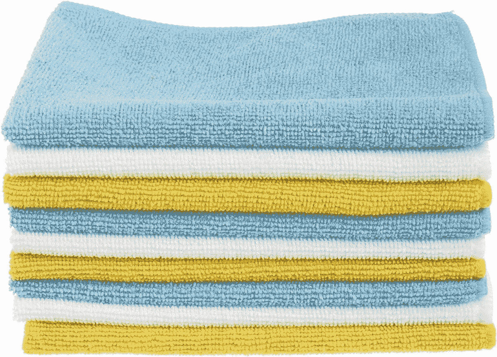

# 如何清洁您的笔记本电脑显示屏

> 原文：<https://www.xda-developers.com/how-to-clean-your-laptop-display/>

如果你和我们一样，真的讨厌在你的[全新电脑上看到污迹和痕迹，](https://www.xda-developers.com/best-laptops/)那么你可能想知道如何清洁你的笔记本电脑显示屏。就像[清理你的笔记本电脑键盘](https://www.xda-developers.com/how-to-clean-your-laptop-keyboard/)，这是一个相对容易的过程。你需要的只是一些简单的物品，一些时间和耐心。

但一如既往，在您继续之前，我们有一条消息要告诉您。请确保您的笔记本电脑已关闭并拔掉电源。这可以确保您在用液体擦拭系统时不会损坏系统。也就是说，请准备好跟随我们下面的向导一起深入了解吧。

## 你需要什么

**两块超细纤维抹布-** 这种抹布可以安全地用于电子产品，可以清除屏幕上的任何碎片和灰尘。**不要使用**普通纸巾、手巾或其他类型的布。这会划伤你的屏幕。

**屏幕清洁液** -在网上或商店找到的屏幕清洁液可以帮助去除屏幕上的污迹和其他痕迹。一定要标明对电子产品安全。**不要使用**漂白剂或肥皂，因为这样会因移除层压层而损坏屏幕。我们最喜欢的选择之一是 [Eveo 的屏幕清洁剂](https://www.amazon.com/Screen-Cleaner-Spray-Electronic-Microfiber/dp/B082XJJ8DS?tag=xda-7mc569p-20&ascsubtag=UUxdaUeUpU43389&asc_refurl=https%3A%2F%2Fwww.xda-developers.com%2Fhow-to-clean-your-laptop-display%2F&asc_campaign=Evergreen)，它装在一个大瓶子里，并额外提供一块抹布。

**水**——如果你找不到屏幕清洗液，那么水就可以了。你可以用水浸湿一块超细纤维布，擦拭屏幕，然后用第二块布擦干。

 <picture></picture> 

EVEO Screen cleaner

##### Eveo 屏幕清洁器

这看起来很平常，但在使用一段时间后，很难保持笔记本电脑的屏幕清洁。该套件包括喷雾和超细纤维布，可帮助您的笔记本电脑焕然一新。

 <picture></picture> 

Amazon Basics Microfiber Cleaning Cloth

##### 亚马逊基础超细纤维清洁布

这包超细纤维清洁布能够经受住时间的考验，帮助你擦拭家中所有的电子产品和其他物品

## 第一步:基本的 wipedown

要开始清洁你的笔记本电脑屏幕，先做一个基本的擦拭。不要使用任何屏幕清洁溶液。

1.  将超细纤维布放在手中，如果布太大，可以折叠起来
2.  将超细纤维布举到屏幕上您看到污迹或痕迹的地方
3.  以圆周运动的方式摩擦它，以去除灰尘或较大的污迹。不要跑得太快，因为它可能会划伤你的屏幕。

在基本的擦拭之后，你可以继续做一些更复杂的事情，使用屏幕清洁溶液。

## 第二步:用超细纤维布清洗屏幕

在下一步中，您可以使用屏幕清洁溶液或水。在这些情况下，您将比基本的擦拭更深入地清洁屏幕。请记住**千万不要用水或溶液直接**喷洒屏幕。如果你这样做，你会损坏屏幕，因为溶液和水会从层压下面渗透到电子设备中。

1.  将你的溶液喷在你的第一块超细纤维布上。不要完全浸泡它。你也可以用水轻轻弄湿布料。
2.  把布举到屏幕前
3.  开始用布轻轻地擦拭屏幕上有污迹或痕迹的区域。不要施加太大的压力，以免损坏屏幕。以圆周运动方式摩擦。
4.  让屏幕干燥，然后用第二块超细纤维布去除任何可能留下的残留物。

## 结论

如果你遵循我们的指南，你的笔记本电脑屏幕应该是干净的，像新的一样。如果所有这些都失败了，不要犹豫把你的笔记本电脑带到维修店进行更深入的清洁。请在下面给我们留言，让我们知道这个指南是否对你有帮助。别忘了我们对[最好的廉价笔记本电脑](https://www.xda-developers.com/best-cheap-laptops/)和[最好的 13 英寸笔记本电脑](https://www.xda-developers.com/best-13-inch-laptops/)的指南。