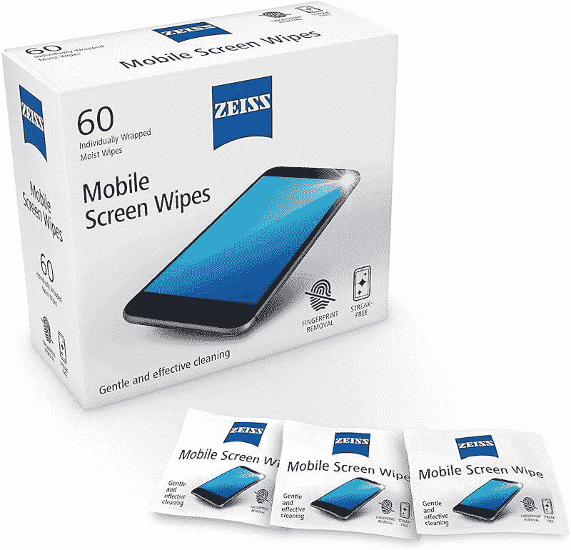
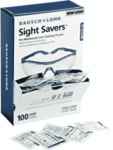
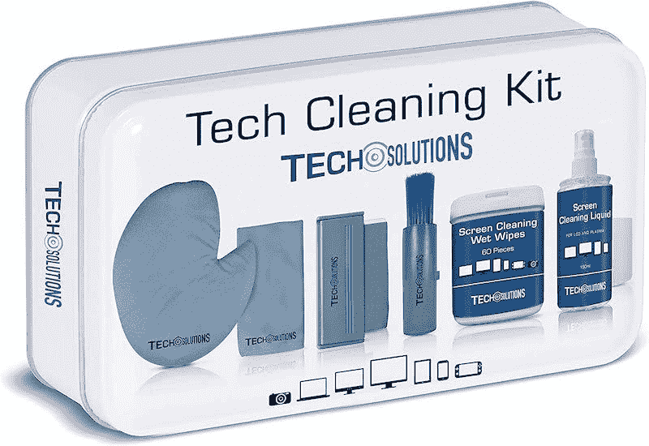
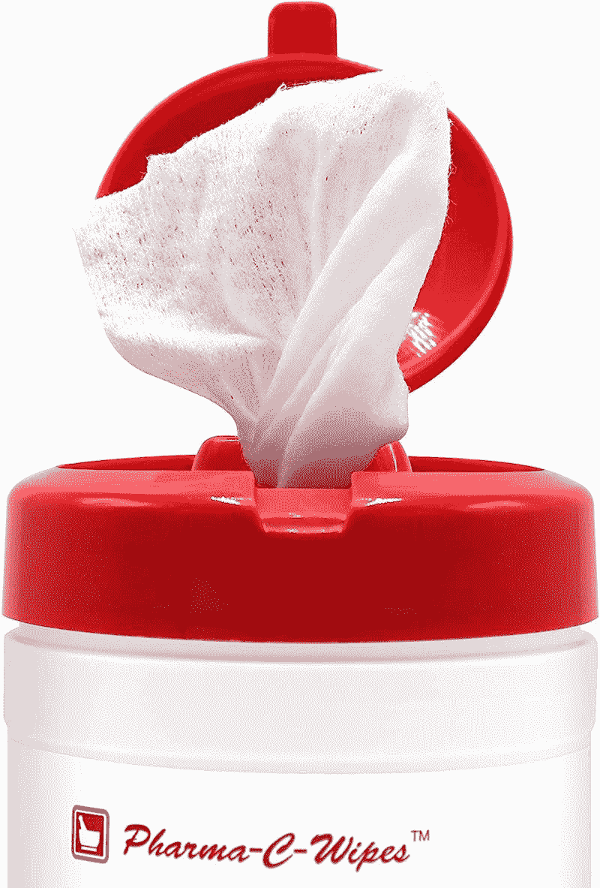
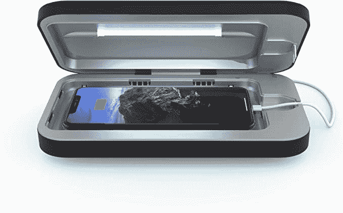
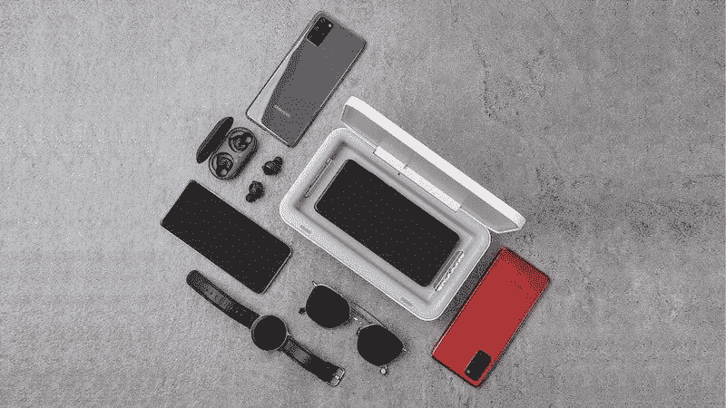
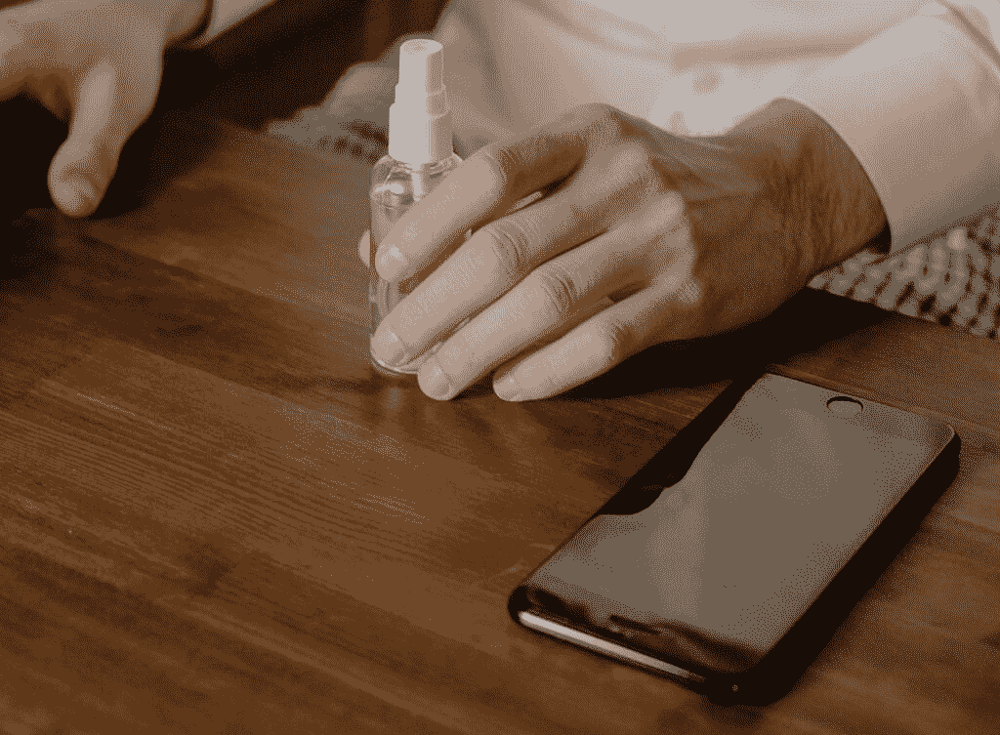

# 如何清洁你的手机屏幕

> 原文：<https://www.xda-developers.com/how-to-clean-your-phone-screen/>

你上次清理手机屏幕是什么时候？就像，好好打扫一下？除了让你的手机屏幕看起来模糊不清，指纹和日常生活的污垢也会把你的手机变成一个移动细菌农场。事实上，亚利桑那大学的一项研究发现，你的手机上可能比普通的马桶座圈上有更多的细菌。恶心到了吗？如果是的话，我们也希望如此，那么继续读下去，让你的手机屏幕得到应有的清洁。

## 清洁手机屏幕的四种方法

清洁手机屏幕的方法不止一种，这取决于你想要达到的目的。虽然有些方法会让你的屏幕看起来光亮如新，但它们可能无法杀死手机表面的细菌。

### 1.使用超细纤维布

如果你想去除油腻的指纹和灰尘，那么超细纤维布是你最好的选择。在[为你的手机](https://www.xda-developers.com/best-samsung-galaxy-s22-screen-protectors/)安装屏幕保护器之前，你可以用一块干的超细纤维布擦掉一般的污垢和碎片。但是为了更深入地清洁，去除油脂和污垢，你需要用一点蒸馏水或屏幕清洁产品湿润它。

虽然寻找蒸馏水似乎有点大材小用，但如果你想达到最好的效果，这是值得的。蒸馏水不含杂质，这意味着你不会留下任何痕迹或残留物。

记住，在手机屏幕上尽量少用液体:你不需要为了有效清洁而淹没手机；用它弄湿布就行了。如果你没有微纤维布料，那么棉质 t 恤或者柔软的棉布是最好的选择。

### 2.使用屏幕清洁抹布

专用屏幕清洁抹布只是微纤维布和蒸馏水的更方便的版本。它们通常装在一次性小袋中，非常湿润，可以去除屏幕上的灰尘，而不会给你的设备带来问题。

 <picture></picture> 

ZEISS Smartphone Wipes

##### 蔡司智能手机湿巾

用于数字设备显示器的电子屏幕清洁抹布。

 <picture></picture> 

Cleaning Wipes by Bausch & Lomb

##### 鲍什&隆布清洁湿巾

包含可用于眼镜和光学显示器的预湿擦拭巾。

 <picture></picture> 

Antibacterial Tech Cleaning Kit

##### 抗菌技术清洁套件

该工具包包括你需要的一切，以保持你的电子设备安全和清洁。

当使用屏幕清洁抹布时，首先掸掉手机屏幕上的灰尘，因为玻璃表面的任何小颗粒都可能导致划痕。

### 3.使用消毒屏幕抹布

虽然微纤维布、蒸馏水和商用屏幕清洁抹布可以清除手机屏幕上的污垢，但它们无法杀死细菌或病菌。如果你想给你的手机屏幕消毒，那么你需要寻找消毒屏幕抹布或消毒屏幕清洁剂。

 <picture></picture> 

Isopropyl Alcohol Wipes

##### 异丙醇湿巾

每张湿巾都含有适量的酒精，所以你不必担心会过量使用酒精。

需要注意的一点是，大多数消毒屏幕清洁剂都含有酒精。虽然少量使用稀释的酒精对你的屏幕是安全的，但是经常使用会破坏屏幕的疏油涂层。出于这个原因，你最好勤洗手，而不是依赖消毒屏幕湿巾来清洁手机屏幕。

### 4.购买一种紫外线手机消毒剂

最后，如果你致力于让你的手机尽可能卫生，你应该看看紫外线手机消毒剂。

 <picture></picture> 

Image Credit: [Amazon](https://www.amazon.com/PhoneSoap-Wireless-Wireless-Charger-Sanitizer/dp/B07NJ8GN6X?tag=xda-1138him-20&ascsubtag=UUxdaUeUpU41980&asc_refurl=https%3A%2F%2Fwww.xda-developers.com%2Fhow-to-clean-your-phone-screen%2F&asc_campaign=Evergreen)

紫外线消毒剂使用 UV-C 光来消灭细菌，并被证明可以杀死手机上 99%以上的细菌。如果你想要一部外观干净、无菌的手机，那么结合使用上述方法将使你的手机保持最佳状态。

 <picture></picture> 

Samsung UV Sanitizer

##### 三星紫外线手机消毒剂

三星的新型紫外线消毒剂可用于清洁您的手机、眼镜、耳塞等。它还可以同时为您的手机或任何 Qi 兼容设备无线充电。

## 如何自制手机屏幕清洁液

 <picture></picture> 

Image Credit: [Pexels](https://www.pexels.com/photo/person-in-white-dress-shirt-holding-white-plastic-bottle-4114704/)

虽然市场上不缺乏手机屏幕清洁剂，但如果你知道该怎么做，你可以自己制作。

制作简单的手机屏幕清洁剂就像制作蒸馏水和白醋的稀释溶液一样简单。如果你能找到的话，你也可以用醋代替 70%的异丙醇。

要在家里让自己的手机屏幕更干净，你需要做的就是将蒸馏水和醋以 50:50 的比例混合。把这个加到喷雾瓶里，你就可以开始了。记住稀释你的醋或异丙醇是至关重要的，否则，你可能会对你的手机屏幕造成更多的损害。

## 清洁手机时不要做什么

我们介绍了清洁手机的最佳方法；现在来看看清理手机屏幕时不要做的事情。

1.  不要使用窗户清洁剂或家用玻璃清洁剂。
2.  避免丙酮(我们敢说，汽油)等刺激性溶剂。
3.  不要用洗碗精。
4.  千万不要用漂白剂。
5.  避开磨料粉末。
6.  不要把你的手机浸在清洁液中——电子产品和水不能混合，除非你有一部 IP 等级为水的手机。
7.  不要太用力的按手机屏幕；轻轻一压就够了。
8.  基本上，小心对待你的手机屏幕。

## 杀死手机屏幕上的细菌

大多数人每天检查手机超过 50 次。再多的屏幕清洁也不能保证你的手机屏幕 100%没有细菌。如果你担心手机的清洁度，那么你最好的选择是更经常地洗手，购买一种紫外线手机消毒剂，并停止将手机带进浴室(我们看到你)。

如果你需要更多的帮助，我们还有另一个关于[如何清洁手机扬声器格栅](https://www.xda-developers.com/how-to-clean-phone-speaker-grille/)的有用指南。