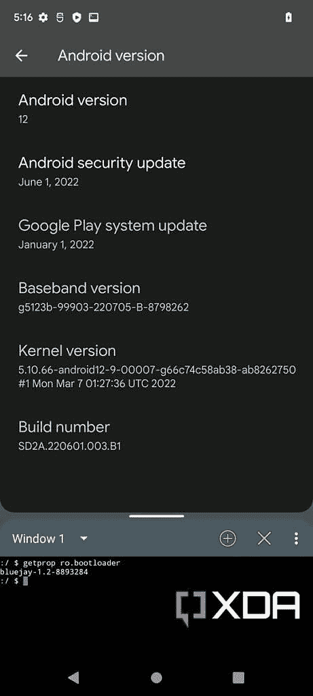

# 谷歌 Pixel 6 系列如何从 Android 13 降级到 Android 12

> 原文：<https://www.xda-developers.com/how-to-downgrade-android-13-to-12-google-pixel-6-series/>

[Android 13](https://www.xda-developers.com/android-13/) 现在已经出了一段时间了。作为一次重大的版本升级，人们很容易赶时髦——尤其是对谷歌 Pixel 用户来说。但是如果你刚更新到 Android 13 却不怎么喜欢呢？最大的问题是，你能把你的 Pixel 智能手机，包括最新的 Pixel 6 阵容，从 Android 13 降级到 12 吗？

与许多 Android OEMs 不同，谷歌为其智能手机维护了一个专用的固件下载门户。如果你有任何 Pixel 手机的非运营商(也称为“解锁”)版本，你应该能够解锁其引导加载程序和[手动刷新旧的 Android 12 软件](https://www.xda-developers.com/how-to-install-android-12/)以恢复原状。然而，谷歌张量驱动的 Pixel 6 系列设备的情况略有不同。

谷歌 Pixel 6、 [Pixel 6 Pro](https://www.xda-developers.com/google-pixel-6-pro-review/) 和 [Pixel 6a](https://www.xda-developers.com/google-pixel-6a-review/) 的稳定 Android 13 更新带来了新的引导程序更新。一旦升级，由于防回滚保护，你[不能刷新旧的引导程序](https://www.xda-developers.com/android-13-downgrade-protection-pixel-6-series/)。因此，降级到 Android 12 的常规过程在这些设备上不起作用。尽管如此，还是可以在升级后的 bootloader 上引导 Android 12。如果你想在 Pixel 6/6 Pro/6a 上将 Android 13 降级回 Android 12，我们可以提供帮助。

*   谷歌 Pixel 6 阵容通过稳定的 Android 13 OTA 获得了新的引导程序更新。
*   一旦升级，就不能刷新旧的引导程序。
*   然而，你仍然可以在新的引导程序上引导 Android 12。

## 谷歌 Pixel 6/6 Pro/6a 的 Android 13 的 bootloader 更新里面有什么？

Android 设备的引导程序是一个非常复杂的软件。它负责在每次从断电状态重新引导后启动引导链。bootloader 映像中有许多低级组件，它们与目标设备的 SoC 紧密集成。简而言之，在现代消费设备上修补引导程序是一项极其困难的工作。

如果你感兴趣的话，下面是你可以在谷歌 Pixel 6a 的引导程序映像中找到的内容:

即使你设法破译了代码，并在谷歌 Pixel 6，6 Pro 或 6a 的新引导加载程序更新中修补了防回滚保护例程，也没有已知的方法来闪存它而不阻塞你的手机。这是因为我们无法获得 OEM 签名的程序员和执行此类操作所需的密钥。

* * *

## 如何在谷歌 Pixel 6/6 Pro/6a 上从 Android 13 降级到 Android 12？

我们必须强调，你不应该这样做，除非你真的不喜欢 Android 13，或者它与一些特定的应用程序不兼容。Android 13 有一些令人敬畏的新功能——特别是与隐私和安全相关的功能——这使它在许多方面优于以前的 Android 版本。它也将是最新的安全补丁。

如果你知道这一切，还想还原回 Android 12，步骤相对简单。但首先，你需要备份你的应用程序、照片、视频等。，因为**降级会彻底擦你手机**。另外，确保你的电脑上安装了最新的 [ADB 和 Fastboot 二进制文件](https://www.xda-developers.com/install-adb-windows-macos-linux/)。

### 通过跳过引导加载程序刷新

1.  一旦你的备份都整理好了，你就需要检查谷歌 Pixel 6/6 Pro/6a 的引导程序版本。**为了避免硬砖场景，确保目标设备的两个插槽都有相同的 Android 13 引导程序版本**。如果你需要帮助，那么看看我们的教程[来确定谷歌 Pixel 6 系列设备的引导程序版本](https://www.xda-developers.com/google-pixel-6-series-android-13-anti-rollback-bootloader-version/)的防回滚保护。
2.  在您的 PC/Mac/Chromebook 上，[为目标设备下载与您选择的 Android 12 版本相对应的出厂映像](https://www.xda-developers.com/how-to-download-android-12/)。
3.  提取工厂映像 ZIP 文件的内容，并在提取的文件中找到引导加载程序映像。应该命名为“boot loader-[设备代号]-[平台代号]-[主版本]-[次版本].img。”
    *   对于 Pixel 6 和 6 Pro，平台代号是“slider”，而对于 Pixel 6a，则是“bluejay”。[](https://www.xda-developers.com/google-pixel-6-series-android-13-anti-rollback-bootloader-version/google-pixel-6-series-factory-firmware-bootloader-image/)

4.  **从解压后的文件夹**中删除引导程序镜像。
5.  修改闪烁脚本，如下所示:
    *   如果你在 Windows 上，那么用记事本(或者你喜欢的文本编辑器)打开名为“flash-all.bat”的文件，删除 bootloader flashing 相关部分，在系统映像 flash 段的“-w”和“update”参数之间添加“- force”(不带引号)，保存文件。
    *   Linux 和 macOS 用户，用自己喜欢的文本编辑器打开名为“flash-all.sh”的文件，删除 bootloader flashing 相关部分，在系统镜像 flash 段的“-w”和“update”参数之间加上“- force”(不带引号)，保存文件。

6.  既然我们已经修改了脚本，我们可以继续刷新作业。值得注意的是，您需要一个解锁的引导加载程序来通过快速引导进行闪存，因此如果还没有解锁，请执行引导加载程序解锁。
7.  将 Pixel 6/6 Pro/6a 重新启动到引导加载程序模式，并使用 USB 电缆连接到 PC/Mac/Chromebook。
8.  在电脑上打开一个终端窗口，导航到提取 Android 12 出厂映像的位置，运行 flashing 脚本。
    *   对于 Windows:

        ```
         .\flash-all.bat 
        ```

    *   对于 macOS 和 Linux:

        ```
         ./flash-all.sh 
        ```

9.  等待闪烁发生，设备重新启动，并等待 Android 12 启动。第一次启动可能需要很长时间，所以要有耐心。

 <picture></picture> 

Google Pixel 6a running Android 12 on Android 13 bootloader

请记住，这不是真正的降级，因为我们不能用旧的引导程序覆盖新的引导程序。不过，我们可以在升级后的 bootloader 之上在 Google Pixel 6/6 Pro/6a 上启动 Android 12，因为它不会对 Android 版本施加任何限制。简单来说，新的 bootloader 兼容 Android 13 和 Android 12，这使得即使在增加回滚索引计数后，也可以在这些设备上运行旧的 Android 12 版本。

### 通过使用官方开发者支持图像

对于开发者来说，谷歌为 Pixel 6 家族提供了修改后的 Android 12 系统映像，这些映像基于 Android 12 和 Android 12L 的公开和稳定版本。这些“[开发者支持镜像](https://www.xda-developers.com/google-android-12-developer-support-images-pixel-6-series/)”展示了升级版的引导程序，包括新的安全补丁和递增的防回滚计数器。

**[下载谷歌 Pixel 6 系列的 Android 12/12L 开发者支持图片](https://www.xda-developers.com/google-pxel-6-android-12-developer-support-images/)**

安装时，必须通过快速启动来刷新开发人员支持映像。要了解更多，[看看我们的指南](https://www.xda-developers.com/how-to-install-android-12/#method2)。

作为参考，开发人员支持映像随以下引导加载程序版本一起提供:

请记住，这种以开发人员为中心的构建不适合一般用途。他们不会像消费者一样收到 OTA 安全更新。此外，这些版本未经兼容性测试套件(CTS)批准，因此需要 CTS 批准的版本或使用 SafetyNet APIs 的开发人员可能会遇到问题。

* * *

## 停留在 Android 12 有什么坏处吗？

无论你选择哪种方法，最终结果本质上都是第六代谷歌 Pixel 的引导程序和固件的混合。目前它可能工作，但是除了开发者支持图像之外，这种合并没有官方支持，但是它们并不完全适合普通用户。Android 12 上不再有每月安全更新，这意味着无论如何你都必须升级到 Android 13 才能继续接收修复。

此外，引导加载程序包含许多用于各种硬件组件的低级固件映像。停留在 Android 12，你会导致几个引擎盖下的不兼容问题，这些问题可能会影响你的 Pixel 6，6 Pro 或 6a 的现实世界性能。这是一个概念验证，但是回到 Android 12 是弊大于利的。如果你选择从一个 Android 版本降级到另一个版本，那么你要自担风险。