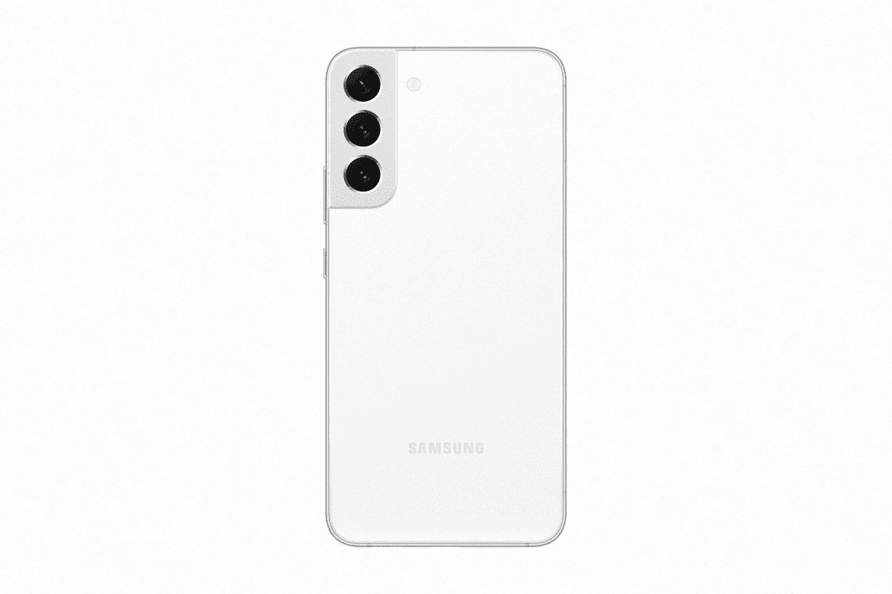
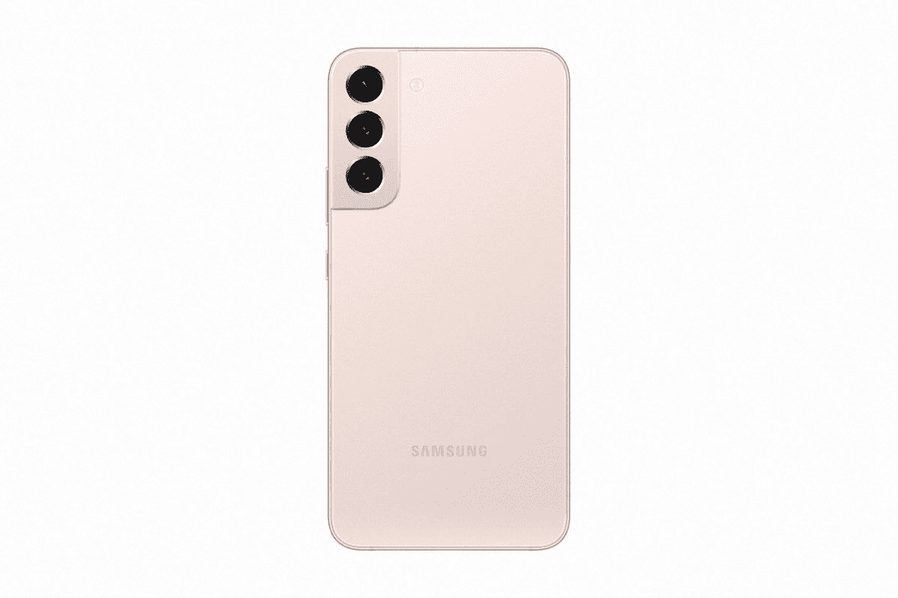

# 如何在三星 Galaxy S22 系列上启用通话录音

> 原文：<https://www.xda-developers.com/how-to-enable-call-recording-samsung-galaxy-s22/>

# 如何在三星 Galaxy S22 系列上启用通话录音

刚给自己弄了个新的三星 Galaxy S22 系列设备？以下是如何在上面启用自动和手动通话录音。

Android 用户不得不依赖第三方应用程序来记录最长时间的电话通话。但如今，几乎所有的 Android OEMs 厂商都在他们的设备上提供电话录音支持，包括三星。如果你最近购买了一台 [Galaxy S22 系列](https://www.xda-developers.com/samsung-galaxy-s22/)设备，但不确定如何在上面设置通话记录，那么你来对地方了。在这篇文章中，我将指导你在 Galaxy S22 系列手机上记录电话通话的过程。

在我们继续之前，需要注意的是，在某些地区，法律禁止对电话录音。请确保您遵守当地法规，并在记录电话之前获得对方的许可。另外值得一提的是，通话录音功能仅限于某些地区。因此，您可能看不到设备上的以下设置。如果是这样的话，你必须[使用第三方应用程序来记录你手机上的通话](https://www.xda-developers.com/how-to-record-calls-android/#8)。

**浏览本指南:**

## 如何在 Galaxy S22 系列设备上启用自动通话记录

在三星 Galaxy S22 系列设备上设置通话记录是一件相当简单的事情。只需按照以下步骤开始在您的新手机上录音:

*   从应用程序抽屉中打开手机应用程序
*   点击右上角的三点菜单按钮，打开下拉菜单。
*   点击设置打开手机应用程序设置。
*   在接下来的页面上，点击录音电话选项。
*   接下来，点击自动记录通话选项旁边的开关来启用该功能。
*   然后点击条款和条件弹出窗口上的确认按钮。
*   启用切换后，点击自动记录通话选项。
*   您现在应该看到三个选项-所有呼叫、未保存号码的呼叫和特定号码的呼叫。根据你的需求从这三个选项中选择一个，就大功告成了。

您的 Galaxy S22 系列设备现在应该根据您在上一步中选择的选项开始记录通话。要查看记录的通话，请按照上述步骤返回到电话应用程序设置中的记录通话选项。您应该会在此页面上看到一个新的录音电话选项。点击它查看所有记录的通话。

## 如何在 Galaxy S22 系列设备上手动记录通话

如果你出于某种原因不想设置自动通话记录，你会很高兴知道三星还为你提供了手动记录每个通话的选项。要手动记录通话，只需遵循以下步骤:

*   在 Galaxy S22 系列设备上拨打或接听电话。
*   点击通话屏幕右上角的三点菜单按钮。
*   点击溢出菜单中的录音通话选项，然后点击条款和条件弹出窗口中的确认。
*   您的手机现在应该开始记录当前通话。录音将在手机应用程序设置中的同一录音电话部分结束。

如果由于某种原因，该功能没有发挥预期的作用，你还可以使用谷歌手机应用程序记录通话。为此，请按照我们的[指南中提供的说明在 Android](https://www.xda-developers.com/how-to-record-calls-android/) 上记录电话。该指南还包括一加、OPPO、三星、Vivo 和小米等其他制造商的设备的详细说明，以及你可以用于相同目的的第三方应用程序列表。

 <picture></picture> 

Samsung Galaxy S22

vanilla Galaxy S22 是一款紧凑型旗舰产品，配备 6.1 英寸显示屏和 3700 毫安时电池，相机设置与 Plus 相同。

 <picture></picture> 

Samsung Galaxy S22 Plus

##### 三星 Galaxy S22 Plus

Galaxy S22 Plus 与 vanilla 型号基本相同，但它配备了更大的 6.6 英寸显示屏和更大的 4500 毫安时电池。

 <picture></picture> 

Samsung Galaxy S22  Ultra

Galaxy S22 Ultra 是完全不同的野兽，具有巨大的 6.8 英寸显示屏，5000 毫安时电池和内置的 S Pen。