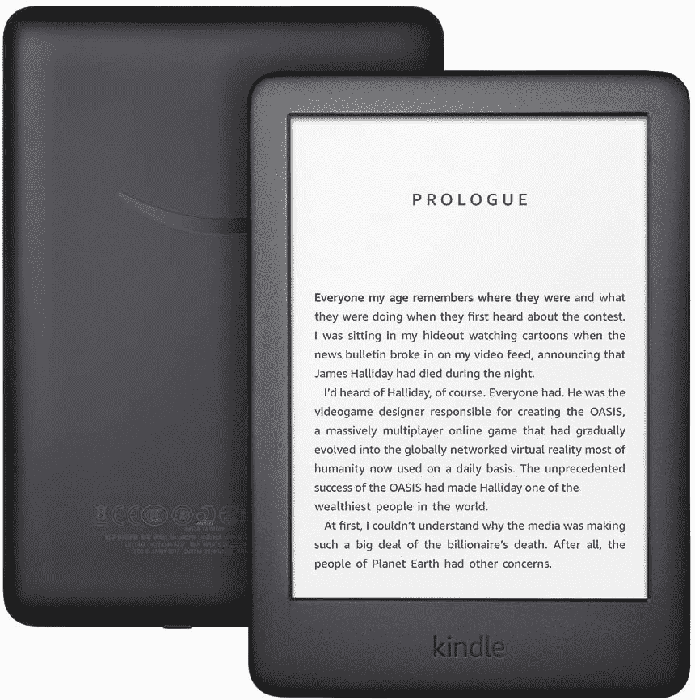

# 如何在亚马逊 Kindle 上打开黑暗模式

> 原文：<https://www.xda-developers.com/how-to-enable-dark-mode-amazon-kindle/>

# 如何在亚马逊 Kindle 上打开黑暗模式

如何在 Kindle Paperwhite 和 Kindle Oasis 上启用黑暗模式的分步指南。请继续阅读，了解更多信息。

从我们的智能手机和电脑到我们最喜爱的应用程序和网站，黑暗模式已经成为您数字生活中不可或缺的一部分。你的 [Kindle 电子阅读器](https://www.xda-developers.com/best-amazon-kindle-ereader/)也有，你可以在晚上用它来躲避眩目的白光。虽然 Kindle 的电子墨水显示屏比智能手机显示屏对眼睛更好看，但在完全黑暗的情况下用内置的前置灯阅读可能会刺激你的眼睛。

黑暗模式已经成为 Kindle 的一部分好几年了，但直到最近它才获得主流的流行，并被更多的用户所知。以前，它被称为反转模式，被深深隐藏在可访问性设置下。2020 年，亚马逊发布了新的软件更新，在快速设置菜单中增加了黑暗模式切换。以下是如何启用它以获得更好的夜间阅读体验。

## 只有部分 Kindle 型号支持黑暗模式

请注意，黑暗模式仅适用于以下 Kinde 电子阅读器:

*   Kindle Paperwhite 第 11 代
*   Kindle Paperwhite 第十代
*   Kindle Oasis 第十代(2019)
*   Kindle Oasis 第九代(2017)

## 如何在亚马逊 Kindle 上打开黑暗模式

启用黑暗模式会将 Kindle 的白色背景变成黑色。当您打开内置前灯时，这将减少从表面反射的光量。下面是怎么做的。

*   确保您的 Kindle 是最新的，并且安装了最新的软件。
*   要从主屏幕启用黑暗模式，请从顶部向下滑动或点击下拉箭头打开快速设置。

*   点击“黑暗模式”开关。

*   若要在阅读书籍时进入黑暗模式，请轻按顶部的任意位置以退出全屏模式。现在点击下拉箭头进入快速设置。

您也可以在*设置>辅助功能>反转黑白*中进入黑暗模式。

* * *

我个人很少在我的 Kindle Paperwhite 上使用黑暗模式。只有当你在完全黑暗的环境中阅读时，Kindle 发出的白光可能会让人感到有点烦躁，这才是真正有帮助的。在大多数情况下，你最好使用默认的白底黑字。但显然，对于视力有障碍的人来说，黑暗模式有很大的帮助。

 <picture></picture> 

Amazon Kindle 10th Gen

##### 亚马逊 Kindle(第十代)

Kindle 第 10 代采用 6 英寸电子墨水显示屏，带前置灯，电池续航时间长达四周，包装时尚。

 <picture></picture> 

Amazon Kindle Paperwhite 11th Gen

##### 亚马逊 Kindle Paperwhite(第 11 代)

Kindle Paperwhite 第 11 代配备了一个 6.8 英寸的电子墨水显示屏，带有可调的暖光灯和 USB-C 端口。