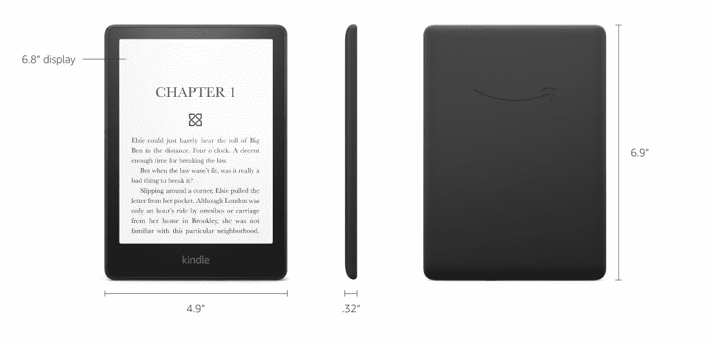

# 如何在你的 Kindle 上使用温暖的灯光来进行舒适的夜间阅读

> 原文：<https://www.xda-developers.com/how-to-enable-warm-light-amazon-kindle/>

所有最近发布的 Kindle 电子阅读器都带有内置的前置灯，你可以在晚上或黑暗中阅读时激活它。如果你喜欢在睡前阅读，白色前光发出的蓝光可能会扰乱你的睡眠或导致眼睛疲劳。

令人欣慰的是，一些 Kindle 型号配备了温暖的灯光，为显示器添加了一种漂亮的黄橙色，带来舒适的阅读体验。类似于你的手机的夜间模式，该功能减少了刺目的蓝光。下面是如何激活它。

## 哪些 Kindle 电子阅读器支持暖光？

遗憾的是，只有部分 Kindle 型号支持暖光。

除了上述两种型号，该功能目前在其他 Kindle 电子阅读器上不可用。由于除了前灯的白色 led 外，暖灯功能还需要一系列琥珀色 led，因此不能通过软件更新将其移植到旧型号。

## 如何激活 Kindle 上的暖光

如果你有一台 Kindle Paperwhite 11th Gen 或 Kindle Oasis (2019)，只需几个步骤就可以启用暖光功能。

*   要从主屏幕启用暖光，请点击下拉箭头。如果您正在阅读一本书，请轻按顶部的任意位置。
*   在快速动作开关下方，您会看到一个用于调节温度的滑块。
*   拖动“温暖度”滑块或点击加号或减号按钮来调整屏幕温度。
*   根据您设置的温度强度，屏幕会变成黄色或橙色。

您还可以为暖光设置自动或手动时间表。要启用它，请拉下快速动作面板，并点击温暖滑块旁边的**S**S**schedule**按钮。如果您想让暖光随着日落和日出逐渐变化，请选择**自动**。或者，使用手动模式创建暖光的自定义开始和结束时间。

* * *

夜间长时间暴露在蓝光下会降低褪黑激素的水平，褪黑激素是一种控制睡眠和清醒周期的化学物质。这可能会打乱你的睡眠时间表，让你更难入睡。如果你喜欢在睡前用 Kindle 阅读，可以使用暖光功能来减少强烈的蓝光。如果你的 Kindle 不支持该功能，你可以[使用黑暗模式来减少夜间的眼睛疲劳](https://www.xda-developers.com/how-to-enable-dark-mode-amazon-kindle/)。

 <picture></picture> 

Amazon Kindle Paperwhite 11th Gen

##### 亚马逊 Kindle Paperwhite(第 11 代)

Kindle Paperwhite 第 11 代采用了 6.8 英寸的 E Ink 显示屏，具有可调的前光和暖光。