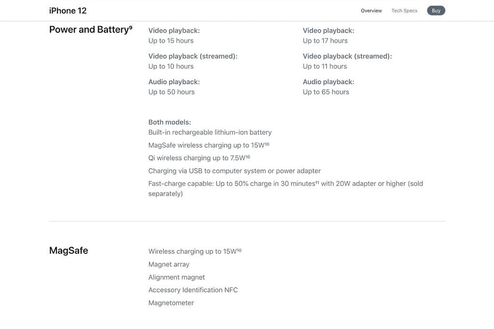
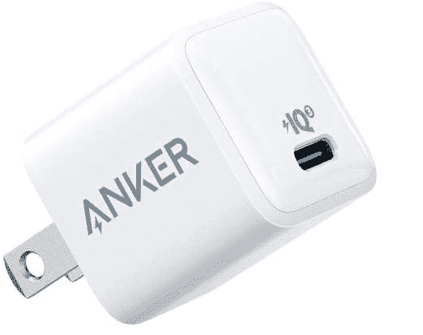

# 怎样才能给手机快充？如何检查我的手机是否支持？

> 原文：<https://www.xda-developers.com/how-to-fast-charge-phone/>

[快充](https://www.xda-developers.com/how-does-fast-charging-work/)不再局限于高级智能手机。智能手机制造商已经开始在预算中增加对快速充电的支持，以及中端手机。但是由于快速充电标准的分散以及整个快速充电过程的混乱，消费者经常想知道他们的手机是否可以快速充电或者他们如何快速充电。我们是来帮忙的。在本指南中，我们将解释如何判断您的手机是否支持快速充电，哪些快速充电器将与您的手机配合使用，以及如何验证您的手机是否确实充电更快。

## 如何检查智能手机是否支持快充

有几种方法可以检查您的手机是否支持快速充电。你可以在制造商的网站上查看你的手机的官方产品页面。通常，品牌会在电池规格中提到有关快速充电支持的细节。你会看到一个以瓦特为单位的数字，比如 15W、18W 和 45W，来显示手机充电的速度。制造商还会注意到他们是否在盒子里捆绑了快速充电器。

并不是所有的手机制造商，比如苹果，都在盒子里捆绑了快速充电器。其他人捆绑了快速充电器，但它可能不支持您的手机最快的充电速度。所以该公司网站上的手机规格页面可以揭示所有这些细节。

 <picture></picture> 

iPhone 12 product page on Apple website showing battery specifications

如果您无法访问手机制造商的网站，您也可以在产品包装或官方文档中查看有关快速充电支持的详细信息。品牌通常会在产品包装盒和包装盒内提供的文件中提及这方面的细节。

另一种检查快速充电支持的方法是查看捆绑的充电器本身；然而，这不是最好的方法。由于一些智能手机将快速充电器捆绑在盒子里，你可以阅读印在盒子上的细节，如快速充电标准的品牌或支持的瓦特数(安培数乘以电压)。但是，如果捆绑的充电器不是快速充电器或比支持的瓦特数慢，您将无法确认任何事情。

如果您仍然无法找到这些详细信息，您可以联系制造商本身获取信息。

## 如何为你的手机找到一个快速充电器

一旦你发现你的手机支持快速充电，但盒子里没有提供兼容的充电器。你可以购买手机制造商或第三方品牌生产的手机；然而，获得正确的快速充电器可能是棘手的，你需要一些细节，包括支持的最大充电瓦特数。

你还需要知道你的手机支持的快速充电标准——它可以是从高通快速充电 2/3/3+/4/4+/5 到 USB PD 的任何标准。几家手机制造商也有自己专有的快速充电标准，如 Vivo 超级闪充、Oppo VOOC/ SuperVOOC 和三星自适应充电。我们有一篇非常详细的文章解释了各种[快速充电技术和标准](https://www.xda-developers.com/how-does-fast-charging-work/)。

在你确定了快速充电标准和手机支持的最大瓦数后，你可以在市场上寻找一个兼容的壁式充电器。确保充电器与快速充电标准以及手机的快速充电功率兼容。

这里需要注意的是，一些快速充电标准也与其他标准兼容。像高通快充 4/4+/5 也兼容 USB-PD。因此，在这种情况下，你可以用手机使用其中任何一个。在大多数情况下，你最好使用手机制造商推荐的快速充电器。以下是对 USB PD 充电器的一些建议，这些充电器在这个细分市场中具有最广泛的兼容性。

 <picture></picture> 

Anker Nano 20W

##### Anker 511 20W 纳米充电器

这款 Anker USB-PD 充电器支持高达 20W 的快速充电，并配有一个 USB Type-C 端口。不过，充电器上不会有任何电缆。

 <picture></picture> 

Samsung 25W USB-C Charger

##### 三星 25W USB-C 充电器

三星官方的充电砖支持跨 Galaxy 设备的完整 25W 充电速度，它就像盒子里的充电器一样。

 <picture></picture> 

Spigen 40W ArcStation Pro

##### Spigen 40W ArcStation Pro 双 USB-C 充电器

Spigen ArcStation 具有两个 USB Type-C 输出，这两个输出都可以单独提供高达 30W 的功率。但是你需要有自己的电缆。

## 如何验证手机充电速度是否加快

有几种方法可以验证你的手机是否正在快速充电。一些手机比其他手机更容易，它们会在锁屏上显示“快速充电”或“快速充电”。这表明您的手机正在快速充电。

如果你的手机没有显示任何快速充电的视觉提示，你可以安装一个类似[安培](https://play.google.com/store/apps/details?id=com.gombosdev.ampere&hl=en_GB)的应用程序。它可以帮助你测量充电率。读取应用程序显示的值，简单地将电压乘以安培数，就可以得到充电瓦特数。为了获得正确的安培数，你必须将充电时和未连接充电器时显示的毫安数相加，然后除以 1，000。在上面的例子中，智能手机消耗 3.77 伏*(320+420)毫安/ 1，000) = 2.79 瓦。很明显，手机没有获得最快的充电速度。

请记住，当显示器打开时，手机也会限制其充电速率，充电速率也不是从 0-100%线性变化的，会向满分方向大幅下降-所以使用像 Ampere 这样的应用程序来比较充电器，而不仅仅是纯粹的数字。

[appbox googleplay ]

如果你不信任软件解决方案，你可以使用一种叫做功率表的东西来检查同样的事情。在[在线销售](https://www.amazon.com/PowerJive-Voltage-Multimeter-chargers-capacity/dp/B013FANC9W/?tag=xda-2ptg5tl-20&ascsubtag=UUxdaUeUpU2753&asc_refurl=https%3A%2F%2Fwww.xda-developers.com%2Fhow-to-fast-charge-phone%2F&asc_campaign=Evergreen)上有大量的 [USB 功率计](https://www.amazon.com/Plugable-Voltage-Amperage-MacBook-Spectre/dp/B01NAWYSVK/?tag=xda-2ptg5tl-20&ascsubtag=UUxdaUeUpU2753&asc_refurl=https%3A%2F%2Fwww.xda-developers.com%2Fhow-to-fast-charge-phone%2F&asc_campaign=Evergreen)，可以显示到达你手机的电压和电流。与安培应用程序类似，只需将电压乘以安培数，即可得到充电瓦特数。

* * *

希望我们能够回答您的一些快速充电问题。如果你有一部三星 Galaxy S21，我们已经为市场上的手机编辑了[最佳快速充电器](https://www.xda-developers.com/best-galaxy-s21-fast-chargers/)。您也可以查看我们的[最佳 Qi 无线充电器推荐](https://www.xda-developers.com/best-qi-wireless-charger/)。