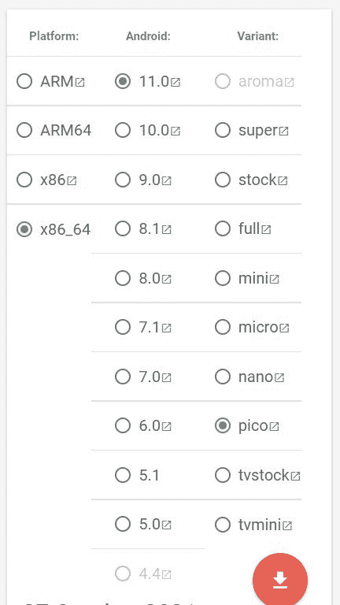

# 如何在 Android 的 Windows 子系统上安装谷歌 Play 商店

> 原文：<https://www.xda-developers.com/how-to-install-google-play-store-windows-subsystem-for-android/>

# 以下是如何在 Android 的 Windows 子系统上安装 Play Store 和其他谷歌应用程序

WSAGAScript 是一个全新的工具，可以让您轻松地为 Android 的 Windows 子系统安装谷歌 Play 商店。请继续阅读！

Android 的 Windows 子系统终于来了。更有趣的是，你现在就可以[非正式地尝试一下](https://www.xda-developers.com/how-to-run-android-apps-on-any-windows-11-pc/)——即使你没有注册 [Windows 11](https://www.xda-developers.com/windows-11/) 的测试频道。如果你对强制性的亚马逊应用商店整合不满意，你应该很高兴听到[应用程序侧装过程](https://www.xda-developers.com/how-to-sideload-android-apps-on-windows-11/)也不难。也有可能[安装第三方谷歌 Play 商店客户端](https://www.xda-developers.com/how-to-bypass-amazon-appstore-region-lock-windows-subsystem-for-android/)，但 Android 的 Windows 子系统中缺乏谷歌服务，这使得使用依赖于它们的应用程序有点困难。

**[动手操作 Windows 11 上的 Android 应用](https://www.xda-developers.com/hands-on-android-apps-windows-11/)**

与传统的 Android 设备不同，Android 的 Windows 子系统没有用户可访问的恢复环境。因此，最终用户不能简单地为 Android 子系统编译一个像 TWRP 这样的定制恢复，并立即安装那些流行的 GApps(Google Apps 的缩写)包之一。但是，如果您可以直接用必要的 Google apps 和库套件修补底层系统映像，让 Play Store 正常工作，会怎么样呢？XDA 的资深成员 ADeltaX 现在提出了一个名为 WSAGAScript 的解决方案。

## 如何在 Android 的 Windows 子系统上安装谷歌 Play 商店

### 步骤 1:为 Linux 安装 Windows 子系统

1.  从运行提示符或终端窗口执行`optionalfeatures`命令，打开 Windows 功能工具。你也可以点击开始菜单，搜索“打开或关闭 Windows 功能”来做同样的事情。
2.  在新窗口中，选中虚拟机平台和 Windows 子系统 for Linux 条目。
3.  单击“确定”，等待 Windows 下载所需的组件。
4.  重启你的电脑。
5.  使用[此链接](https://track.flexlinkspro.com/g.ashx?foid=1.24542&trid=1198401.711&foc=17&fot=9999&fos=1&fobs=58f4de1b-2f9f-4f3a-a7f5-72dd7dcf61f5&url=https%3A%2F%2Fwww.microsoft.com%2Fstore%2FproductId%2F9NBLGGH4MSV6)从微软商店的 WSL 下安装最新的 Ubuntu LTS 版本，并根据需要进行配置。

如果你已经在 WSL 上安装了 Ubuntu，你应该跳过这一步。

### 步骤 2:为 Android 准备 Windows 子系统以进行修补

1.  下载 Android 版 Windows 子系统的安装包。如果需要帮助可以参考本教程[第一步](https://www.xda-developers.com/how-to-run-android-apps-on-any-windows-11-pc/)。
2.  一旦有了 MSIXBUNDLE 文件，使用 [7-Zip](https://www.7-zip.org/) 解压特定于架构的安装程序。
    *   如果您有一台普通的 x86-64 PC，那么解压名为`WsaPackage_x.x.x.x_x64_Release-Nightly.msix`的文件。
    *   如果你在 ARM 设备上有一个[Windows](https://www.xda-developers.com/best-windows-on-arm/)，那么解压名为`WsaPackage_x.x.x.x_ARM64_Release-Nightly.msix`的文件。

3.  现在将与您的设备架构相关的 MSIX 文件提取到一个文件夹中，例如 D:\WSA。
4.  从文件夹中删除以下对象:`AppxBlockMap.xml`、`AppxSignature.p7x`、`[Content_Types].xml`和`AppxMetadata`文件夹。

### 步骤 3:用 GApps 修补 Android 的 Windows 子系统

1.  下载一个 GApps 包。开发者推荐 [OpenGApps](https://opengapps.org/) 的“Pico”变种。
    *   如果你有一台普通的 x86-64 PC，那么选择 x86_64 平台。
    *   如果你有 ARM 上的 Windows 设备，那么选择 ARM64 平台。<picture></picture>

        OpenGApps 包选择为 x86-64 Windows 子系统为 Android

2.  在 WSL 上启动 Ubuntu，安装`unzip`和`lzip`包。

    ```
     sudo apt-get update
    sudo apt-get install unzip lzip 
    ```

3.  由 ADeltaX:

    ```
     git clone https: 
    ```

    克隆 [WSAGAScript repo](https://github.com/ADeltaX/WSAGAScript)
4.  按照前述报告的[自述文件执行实际的打补丁过程。](https://github.com/ADeltaX/WSAGAScript/blob/main/README.md)
    *   记得根据您在上一步中提取 MSIX 文件的位置来调整命令中的路径。

### 步骤 4:为 Android 安装 GApps 修补的 Windows 子系统

在尝试这一步之前，请确保您已经卸载了官方的 Android Windows 子系统包。你可以在开始菜单中找到相应的快捷方式，右击它，最后选择“卸载”选项。请记住，亚马逊应用商店将自动卸载。

1.  打开设置应用程序，导航至隐私和安全= >面向开发者。然后打开开发者模式。
2.  使用内置的 PowerShell 配置文件以管理员身份启动 Windows 终端。
3.  将以下命令粘贴到终端窗口:

    ```
     Add-AppxPackage -Register <path-to-the-extracted-MSIX-folder>\AppxManifest.xml 
    ```

    例如，如果您最初将 MSIX 文件的内容提取到 D:\WSA，并随后修补它们，那么该命令应该是:

    ```
     Add-AppxPackage -Register D:\WSA\AppxManifest.xml 
    ```

4.  等待安装完成。然后打开开始菜单，你应该会看到一个新的谷歌 Play 商店图标，旁边是熟悉的 Android Windows 子系统。
5.  点击“登录”选项，并输入您的谷歌帐户信息的凭据。如果一切顺利，那么你应该看到谷歌 Play 商店的主页。

就是这样！您只需安装谷歌 Play 商店和一套必要的谷歌服务，就可以在 Android 的 Windows 子系统中运行许多流行的应用程序。现在你应该可以直接从 Play Store 在你的 Windows 11 PC 上安装 Android 应用了。让我们知道您计划使用谷歌 Play 商店在 Android 的 Windows 子系统上安装哪些应用程序！