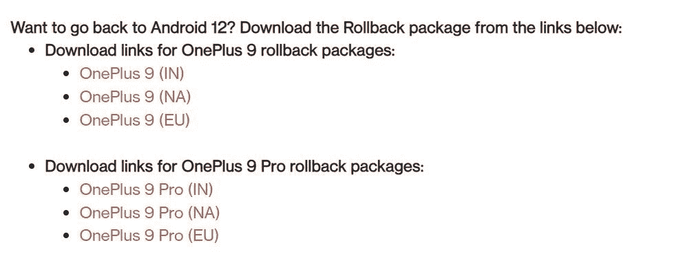

# 如何在你的一加手机上手动安装 OxygenOS OTA 更新

> 原文：<https://www.xda-developers.com/how-to-install-oxygenos-ota-updates-on-oneplus-phones/>

有时候，你需要在手机上手动安装一个系统软件更新。无论是因为新版本尚未在您所在的地区上线，还是在不同的更新渠道上引入了新功能，或者仅仅是因为您的设备已经有了[的根，不能使用常规的 OTA，都有足够的理由选择手动更新路线。幸运的是，在](https://www.xda-developers.com/root/)[一加手机](https://www.xda-developers.com/best-oneplus-phones/)上，手动安装 OxygenOS OTA 更新是一个非常简单的过程，我们将在这里指导你。

* * *

## OxygenOS 更新通道

一加智能手机通常有三种软件更新:封闭测试版、开放测试版和稳定版。OxygenOS 的封闭测试版面向有限数量的测试人员提供，而开放测试版则发布在公司的论坛上，供任何人安装。这两个版本都用于测试，以消除错误和其他问题，并引入新功能。最后，稳定的构建是在封闭和开放测试版运行之后所有特性和错误修复的顶点。

在过去的几年里，谷歌继续与原始设备制造商密切合作，试图尽快将主要版本更新发布到设备上。一加是经常与谷歌合作，让一些最新设备运行早期版本 Android 的智能手机制造商之一。这种预发布版本通常通过一个特殊的“开发者预览”程序提供，该程序独立于常规的 OxygenOS 更新渠道。

对于不同的更新流，手动 OTA 安装过程基本相同。但是，它可能会因一加智能手机的地区和运营商差异而略有不同。

* * *

## 我可以在一加手机的运营商版本上手动安装 OxygenOS 更新吗？

一加倾向于在运营商和一些全球设备变体上使用谷歌 OTA(通常被称为“GOTA”)框架，而不是 OxygenOS/ColorOS OTA 后端。虽然仍然可以在这种非运营商/未锁定的区域设备上下载更新，但运营商型号(例如，通过 T-Mobile 和威瑞森销售的手机)故意使最终用户难以安装任何 OTA 更新包。

请记住，您可能能够在运营商变体上交叉闪存未锁定的 OxygenOS 版本，并随后强制加载软件更新。然而，由于与调制解调器和几个其他低级固件分区的内部差异相关的不兼容问题，这是不可取的。

* * *

## 从哪里可以下载 OxygenOS OTA 更新？

如前所述，当涉及到开发者预览版和公开测试版时，一加通常会在其论坛上列出初始版本。如果由于兼容性原因，后续更新需要手动安装，那么该公司将从更新公告线程中提供 OTA 下载选项。尽管如此，这不是一个经验法则。

对于每个稳定的 OxygenOS 更新，您应该能够找到两种类型的 OTA 版本:完整版本和增量版本。完整的更新包被推荐用于侧装，因为它们可以升级手机，不管以前安装的是什么版本。当您是根用户时，它们也很有用，因为您可以从它们中提取股票引导映像，对其进行修补，然后刷新它以保持根用户访问。增量更新包比相应的完整 OTA 相对较小，但它只能在未接触的基础上应用。

与所有来自不同 Android OEMs 厂商的在线旅行社一样，一加手机的 OxygenOS 更新正在分阶段进行。推广的初始阶段将只覆盖少数用户，一旦该公司确认更新没有重大问题，它将推广到其余设备。

一加为软件更新维护了一个下载门户，该公司定期上传手机的完整更新图像。然而，它经常滞后于实际的更新阶段。该门户网站既不提供增量更新包，也不能在那里找到公开的测试版。这就是**氧气更新器**的用武之地。

Oxygen Updater 是一款[开源应用](https://github.com/oxygen-updater/oxygen-updater)，它利用众包和智能 OTA 查询的力量，跳过部署排队，在您方便的时候下载 OxygenOS 更新。该应用程序可以直接从一加/谷歌服务器下载官方更新包，甚至可以使用 MD5 校验和来验证下载的 ZIP 文件的完整性。

由于 Oxygen Updater 和 XDA 的维护者之间的密切合作，我们也尽可能在 OxygenOS 更新文章中列出完整和增量 OTA 包。因此，我们的读者可以直接在他们的 PC/Mac 上下载更新，然后传输到他们的手机上进行手动更新。

**注意:**由于一加端的配置错误，你可能会发现从公司服务器手动下载的 OxygenOS 更新包的文件扩展名为*。这种情况在移动浏览器上很普遍。您必须从文件名中删除“JAR”部分，并确保在侧面加载之前更新包的扩展名是“ZIP”。

* * *

## 如何手动加载 OxygenOS 更新

假设您不想交叉闪存不同的区域版本或不匹配的更新渠道版本，请按照下面概述的步骤执行手动更新。虽然可以在一加设备上切换固件区域或在更新流之间跳转，但只有在您确切知道自己在做什么的情况下才尝试这些操作。

### 对于 OxygenOS 11

以下是如何在运行基于 Android 11 的 OxygenOS 11 的一加手机上手动安装更新:

1.  确定手机的地区差异。不幸的是，仅仅根据内部型号或固件区域属性来决定是漫无目的的，因为卖家和用户都可以在一加设备上交叉闪存不同的区域固件。
    *   你可以使用氧气更新找出变种，因为它检查了内部数据库，这大大减少了错误选择的可能性。

2.  使用 Oxygen Updater 下载您想要安装在手机上的更新包。您还可以在我们的文章中找到直接链接，在 PC/Mac 上结合下载管理器应用程序更容易使用。
    *   如前所述，尽可能选择全拉链。应用增量更新需要增量修补，这只有在相应的基础版本完全没有被篡改时才有可能。

3.  将更新包移动到手机内部存储的根目录。
4.  导航到**设置**，选择**系统**，选择**系统更新**选项。
5.  点击右上角的齿轮图标，选择**本地升级**。
6.  您保存到根目录的文件应该显示在这里。选择启动本地升级的文件。
7.  选择**立即安装**在您的一加手机上手动安装 OxygenOS 更新。
8.  安装完成后，导航至**关于手机**页面以验证内部版本号。

如果你有任何一加智能手机的全球版本，默认情况下，本地升级选项可能不可见。在这种情况下，您需要[首先安装其 APK](https://www.apkmirror.com/apk/oneplus-ltd/oneplus-system-update/oneplus-system-update-1-0-0-210114225639-6769471-release/oneplus-system-update-1-0-0-210114225639-6769471-android-apk-download/) ，然后使用一个 activity launcher app ( [示例](https://play.google.com/store/apps/details?id=de.szalkowski.activitylauncher))来启动名为`com.oneplus.localupdate.ui.home.HomeActivity`的活动，以便能够启动本地升级向导。要了解更多，看一看[这个论坛的帖子](https://forum.xda-developers.com/posts/85581319)。

**注:**在少数设备上(如一加诺德 2)，OxygenOS 11 stock recovery 提供刷新更新 ZIP 文件的功能。然而，那些手机已经收到了 OxygenOS 12 更新，无论如何都不赞成这个功能。

* * *

### 对于 OxygenOS 12 和更新版本

如果你有一部运行基于 Android 12 的 OxygenOS 12 或更新版本的非运营商一加手机，并且想要手动下载更新，请执行以下操作:

1.  确定手机的地区差异。再次，使用氧气更新这样做，因为它检查内部数据库，这大大减少了错误选择的可能性。
2.  使用 Oxygen Updater 下载您想要安装在手机上的更新包。您还可以在我们的文章中找到直接链接，在 PC/Mac 上结合下载管理器应用程序更容易使用。
    *   如前所述，尽可能选择全拉链。应用增量更新需要增量修补，这只有在相应的基础版本完全没有被篡改时才有可能。

3.  将更新包移动到手机内部存储的根目录。
4.  为了解锁本地安装功能，您需要启用 Android 的内置开发者选项。为此，导航至**设置** > **关于设备** > **版本**并点击**版本号**部分 7 次。
5.  返回关于设备页面，点击**最新**，然后点击右上角的三个垂直圆点菜单，选择**本地安装**。
6.  您保存到根目录的文件应该显示在这里。选择启动本地升级的文件。
7.  选择**立即安装**在你的一加手机上手动安装 OxygenOS 更新。
8.  安装完成后，导航到**关于手机**页面验证内部版本号。

在某些情况下，您需要安装一个单独的应用程序来强制启用该功能。一加在其论坛上提供了这款独立“系统更新”应用的多种版本，但下面链接的这款应该能兼容其大多数设备。

**[下载 APK](https://oxygenos.oneplus.net/OPLocalUpdate_For_Android13.apk)**

在[安装完 APK](https://www.xda-developers.com/how-to-sideload-install-android-app-apk/) 之后，你需要做的就是从应用抽屉里打开系统更新应用。它会自动检测一个有效的更新包，如果它放在你的手机内部存储的根目录。接下来，点击文件名开始更新过程。

**注:**少数一加手机以分割 ZIP 存档的形式交付更新(内部称为“组件 OTA”)。目前，我们还不知道这种 OxygenOS OTA 的简化手动安装过程。当我们获得更多关于这个特定场景的信息时，我们会更新文章。

* * *

### 特例:降级

通常，您只能升级到更高的内部版本。出于安全原因，OxygenOS 的本地安装特性会阻止您下载旧版本。也就是说，一加确实提供了一种特殊的固件版本(通常称为“回滚包”)，用于降级当前安装的操作系统。

 <picture></picture> 

Rollback packages listed in a OnePlus forum thread

在重要的过渡期(例如从 OxygenOS 12 到 OxygenOS 13)，该公司提供了官方降级 ZIP 文件，可用于从 beta/developer preview 恢复到稳定渠道。虽然这些软件包的手动侧装过程与常规更新没有太大区别，**他们在安装阶段**强行清除目标设备。因此，在尝试降级之前，最好[备份你所有的数据](https://www.xda-developers.com/how-to-backup-android/)。

* * *

## 结论

这就是全部了。你应该升级到你需要的任何一个 OxygenOS 版本，而不需要等待一加给你的手机推送更新。此外，您现在也可以使用手动安装过程轻松回滚到 OxygenOS 的以前版本。

*感谢 XDA 资深会员 [Some_Random_Username](https://forum.xda-developers.com/m/some_random_username.8234677/) 的协助。*

* * *

**如果您对安装过程有任何疑问，请在下面的评论区告诉我们！**