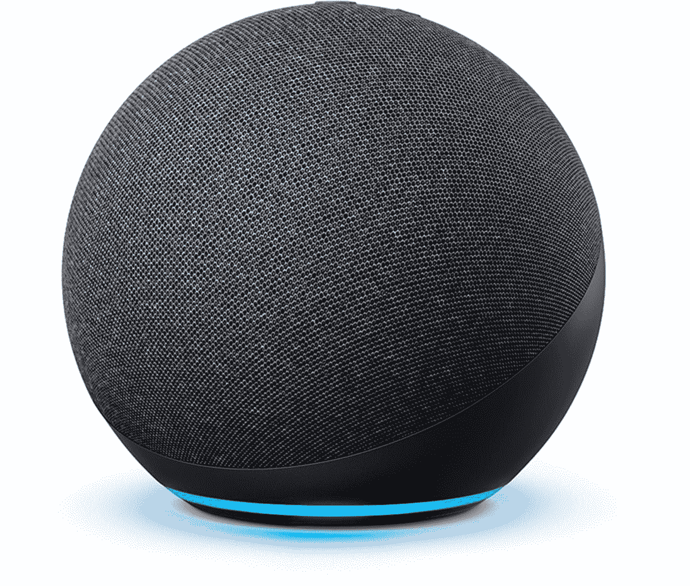

# 如何将 Zigbee 智能家居设备连接到 Amazon Echo

> 原文：<https://www.xda-developers.com/how-to-link-zigbee-devices-amazon-echo/>

当谈到用亚马逊 Echo 控制智能家居时，首先想到的是使用 Alexa。除了作为回声的声音，Alexa 平台还支持数量惊人的智能家居硬件。如果有联系的话，很有可能和 Alexa 有联系。

不过，使用 Alexa 并不是唯一的方法。在一些型号上，比如目前的[亚马逊 Echo(第四代)](https://www.xda-developers.com/amazon-echo-4th-gen-review/)，你有一个通过 Zigbee 的替代方案。这是一种无线协议，允许兼容的硬件直接链接到您的亚马逊 Echo，而无需 Wi-Fi 连接、配套应用程序或云。

并非所有的亚马逊 Echos 都内置了 Zigbee 集线器，但对于那些内置了 Zigbee 集线器的人来说，它可以让你自由地创建一个更加专注于本地的智能家居。但如果你愿意，你仍然可以从 Alexa 的程序、集成和语音控制中受益。以下是如何设置这一切。

## Zigbee 是什么？

[Zigbee](https://csa-iot.org/all-solutions/zigbee/) 基于 IEEE 的 802.15.4 个人局域网标准。简单来说，Zigbee 是 Wi-Fi 和其他连接标准(如蓝牙)的本地网络替代方案。它不依赖于点对点的连接。相反，它运行一个低功耗网状网络，这就是它对智能家居设备如此有用的原因。

其低功耗特性使其非常适合传感器等小型设备。事实上，这是一个共同的标准，也意味着不同制造商制造的硬件可以相互通信。例如，亚马逊制造的 Echo 可以与支持 Sonoff Zigbee 的温度传感器对话。

Zigbee 是一个相当老的标准，很可能会被未来的[事件](https://www.xda-developers.com/android-google-nest-matter/)所掩盖，但它仍然有用。使用 Zigbee 有助于减少智能家居中集线器和专用控制器的数量，并有助于降低家庭 Wi-Fi 网络的整体负载。

## 哪些亚马逊 Echos 内置了 Zigbee hub？

Zigbee hub 是一个你不会在每个不同版本的亚马逊 Echo 中找到的功能。这些是您过去和现在需要的模型:

*   亚马逊 Echo(第四代)
*   亚马逊 Echo Plus(第一代和第二代)
*   亚马逊 Echo Show 10(第三代)
*   亚马逊 Echo 工作室

Echo Plus 目前没有提供新的，但如果你已经有一个或找到一个二手的，它内置了 Zigbee 集线器。亚马逊 Echo(第四代)、Echo Studio 和 Echo Show 10(第三代)现已发售。

## 如何将 Zigbee 设备链接到 Amazon Echo

在你的家里有了合适的亚马逊 Echo，你就可以开始连接一些 Zigbee 智能家居设备了。好消息是这真的很简单。只需遵循以下步骤:

1.  确保你的 Echo 已经**打开**，并且你的智能手机上的 Alexa 应用程序已经登录到你的亚马逊账户。
2.  点击导航栏上的**设备**。
3.  点击右上角的 **+按钮**。
4.  选择**添加设备**。
5.  选择您正在添加的设备的**类型。本例中，我们连接了一个运动传感器。如果您找不到想要的设备类型，只需选取“其他”。**
6.  确保您的 Zigbee 硬件已**通电，**并且遵循了使其可被发现的任何步骤。
7.  在 Alexa 应用中点击**发现设备**。

新设备可能需要 45 秒才能被发现，因此让它靠近 Echo 是一个好主意，尤其是如果您家中没有现有的 Zigbee 网状网络。一旦找到装置，你就可以走了。你可以像任何连接 Alexa 的设备一样将它添加到房间、群组和日常活动中。

不过，有一点需要注意。虽然硬件将连接到 Echo 上的 Zigbee 集线器，但在某些情况下，您可能需要启用 Alexa 技能来保持这种状态。例如，我有一个 [Sonoff 温度传感器](https://www.amazon.com/Temperature-Humidity-Checking-Thermometer-Hygrometer/dp/B08BCJNDYQ/?tag=xda-5nrtf6p-20&ascsubtag=UUxdaUeUpU41354&asc_refurl=https%3A%2F%2Fwww.xda-developers.com%2Fhow-to-link-zigbee-devices-amazon-echo%2F&asc_campaign=Evergreen)，你可以和一个配套的应用程序和公司自己的 hub 一起使用，或者像我一样和 Echo 一起使用。初次连接后，设备会在大约半小时内变得无响应。启用该公司的 Alexa 技能似乎解决了这个问题，除此之外没有进一步的互动。

* * *

这就是全部了。如果你计划在家里安装一些小型传感器和低功耗设备，那么使用 Zigbee 而不是 Wi-Fi 连接有它的好处。有了兼容的 Amazon Echo，你不需要任何额外的集线器或控制器，就可以马上连接。这样，你就有了[最佳智能音箱](https://www.xda-developers.com/best-smart-speakers/)作为奖励。

 <picture></picture> 

Amazon Echo (4th Gen)

##### 亚马逊 Echo(第四代)

对于大多数人来说，亚马逊 Echo 是最好的全能智能扬声器，拥有漂亮的设计、出色的声音和 Alexa 生态系统的巨大力量。