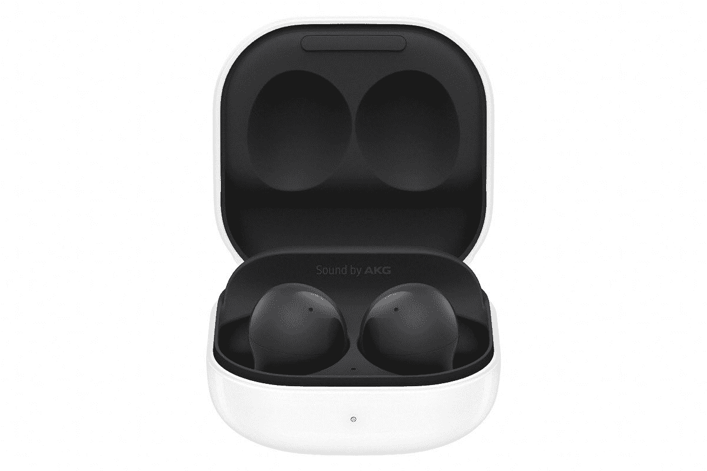
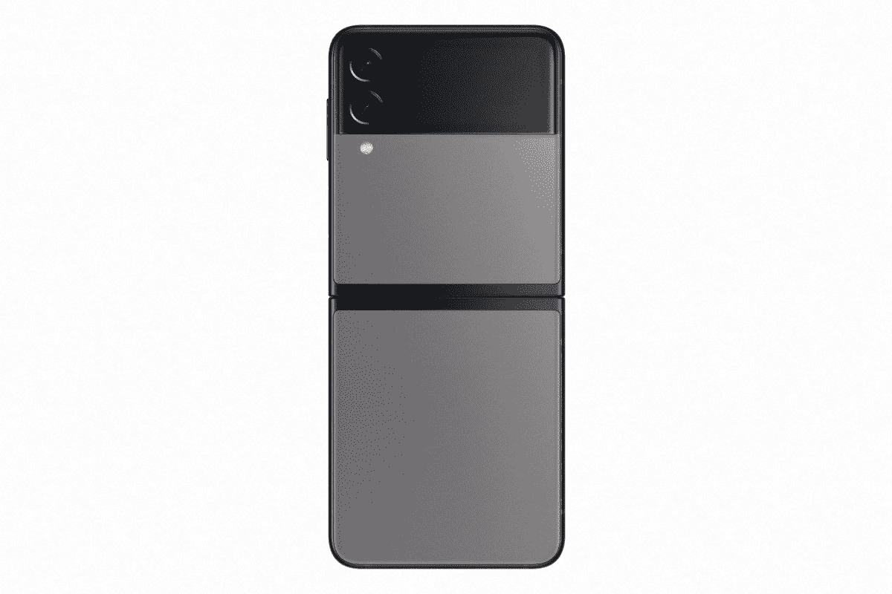

# 如何将三星 Galaxy Buds 2 与您的设备配对

> 原文：<https://www.xda-developers.com/how-to-pair-samsung-galaxy-buds-2/>

三星刚刚在 Unpacked 发布了新的 [Galaxy Buds 2](https://www.xda-developers.com/samsung-galaxy-buds-2/) ，这是这家科技巨头最新的真正无线耳塞。凭借动态双向扬声器和三级环境声音控制，这些是[最好的无线耳塞](https://www.xda-developers.com/best-wireless-earbuds/)之一。如果你最近拿起了 Galaxy Buds 2 和你的新 Galaxy Z Flip 3 或 Galaxy Z Fold 3，是时候将它们配对了。在本文中，我们将介绍如何将 Galaxy Buds 2 与您最喜爱的设备配对。

您的耳塞可以连接到蓝牙设备，以播放音乐或拨打电话。在手机或平板电脑上使用 Galaxy Wearable 应用程序时，您将获得最佳体验，因为您可以完全控制自己的音乐。有些功能不会出现在应用程序中，除非你已经至少连接过一次耳塞。

### 使用 Galaxy Wearable app 将您的 Galaxy Buds 2 与 Android 手机配对

使用 [Galaxy Wearable](https://play.google.com/store/apps/details?id=com.samsung.android.app.watchmanager) 应用程序将耳塞与手机或平板电脑配对几乎毫不费力。以下是步骤:

*   要连接新的一对，导航并打开 Galaxy Wearable 应用程序，然后点击*开始*。将耳塞放入充电盒中，合上盖子五到六秒钟，然后打开充电盒。
*   发现您的设备后，选择它，然后配对和设置将开始。
*   当弹出消息出现时，点击 *OK* 确认配对。
*   如果你想手动断开耳机与手机或平板电脑的连接，请打开 Galaxy Wearable 应用程序，点击*菜单*(三条水平线)，然后选择*断开连接*(图标可能看起来像链环)。如果出现提示，再次点击*断开*进行确认。

只有当这是您与 Galaxy Wearable app 配对的第一台设备时，这些连接步骤才有效。如果您想要配对附加设备，请打开 Galaxy Wearable，点击*菜单*(三条水平线)，然后点击*添加新设备*。将耳塞插入耳朵并按住两个触摸板几秒钟，以确保耳塞处于配对模式。接下来，从可用设备列表中选择它们。

如果您已经将耳塞与手机或平板电脑配对，只需打开充电盒重新连接即可。

### 使用蓝牙将 Galaxy Buds 2 与 iPhone、PC 或其他设备配对

有没有 iPhone、另一款 Android、电脑、手表或任何不支持 Galaxy Wearable app 的设备？不用担心，您可以像使用其他蓝牙耳机一样使用您的三星耳塞。只需遵循以下步骤:

*   将耳塞放入充电盒，然后合上盖子。等待五到六秒钟，然后打开外壳。
*   耳塞将自动进入蓝牙配对模式。
*   如果它们已经与另一个设备配对，请将它们插入耳朵并按住两个触摸板几秒钟，直到它们进入配对模式。
*   导航到设备的蓝牙设置，然后从可用设备列表中选择您的耳塞。

**注:**某些设备，尤其是未经蓝牙 SIG 测试或批准的设备，可能与耳塞不兼容。

### 将您的 Galaxy Buds 2 与三星智能手表配对

将您的 Samsung 耳塞连接到您的智能手表，无论您身在何处，您都可以在手表上管理通话和听音乐。要与手表配对，请遵循以下步骤:

*   在您的手表上，导航至*设置。*
*   滑动并点击*连接、*，然后点击*蓝牙。*
*   验证蓝牙开关是否已打开。如果您的耳塞尚未与另一个设备配对，只需打开外壳，将它们置于配对模式。如果它们已经与另一个设备配对，请将它们插入耳朵并按住两个触摸板几秒钟，直到它们进入配对模式。
*   轻触 *BT 音频*或 *BT 耳机*，然后选择所需的耳塞。
*   轻按耳塞旁边的*设置*图标，然后确保通话音频和媒体音频都已打开。

**注:**耳塞上的电话通话音频输出仅适用于 LTE 手表型号。如果通话音频和媒体音频开关关闭，您将听不到耳塞的任何输出，耳塞可能会与手表断开连接。

差不多就是这么多了。无论您选择使用哪种设备，与新的 Galaxy Buds 2 配对都非常简单。如果你打算在健身房使用你的 Buds 2，[考虑带上一个保护套](https://www.xda-developers.com/best-samsung-galaxy-buds-2-cases/)。如果你需要一部新的三星手机来搭配你的耳塞，请点击下面的链接查看 Galaxy Z Fold 3 和 Galaxy Z Flip 3。

 <picture></picture> 

Galaxy Buds 2

##### 三星 Galaxy 芽 2

Galaxy Buds 2 是三星真正无线耳塞的最新版本。凭借更轻的结构和更好的声音，这些是迄今为止最好的芽。非常适合搭配 Galaxy 智能手机使用。

 <picture></picture> 

Galaxy Z Flip 3

Galaxy Z Flip 3 是三星紧凑型折叠智能手机的最新版本。凭借更大的覆盖屏幕和更高的耐用性，这是迄今为止最好的翻盖手机。

 <picture></picture> 

Samsung Galaxy Z Fold 3

##### 三星 Galaxy Z Fold 3

Galaxy Z Fold 3 是三星旗舰产品 foldable 的最新版本。凭借 S-pen 支持和改进的耐用性，这是迄今为止最好的折叠。