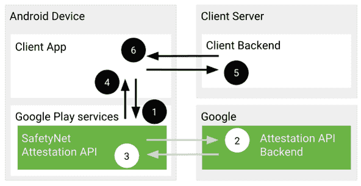

# 如何在 Android 上 ROM 或安装自定义 ROM 后通过 SafetyNet

> 原文：<https://www.xda-developers.com/how-to-pass-safetynet-android/>

绕过安全网一直是谷歌和社区之间的猫鼠游戏。社区喜欢修改他们手机上的软件，这个过程通常包括启动加载程序解锁作为第一步。但这反过来会导致 SafetyNet 瘫痪，这可能会导致几个流行的应用程序在手机上停止工作，其中一些应用程序的运行依赖于防篡改环境，这是可以理解的。

SafetyNet 是为应用开发者准备的，但他们可以选择使用或不使用它。然而，对于一个普通的最终用户来说，你要么放弃 Android 的改装潜力并通过 SafetyNet 兼容性测试，要么继续被应用发行商排斥。如果你想知道如何通过 SafetyNet，即使在你的设备上找到或安装了一个定制的 ROM，这个指南应该可以帮助你。

* * *

## 什么是安全网？

Android 在运行时不会给最终用户任何对底层子系统的特权控制。如果操作 Android 设备的人能够获得与 Linux 上类似的管理权限(即“超级用户”)，他们就可以从根本上改变或替换 Android 系统的应用程序和设置。从应用程序开发人员的角度来看，这意味着他们运行应用程序的设备可能会受到威胁。应该有某种滥用检测系统来检查设备的软件和硬件环境，并向应用程序开发人员保证一切正常。这就是安全网的用武之地。

虽然修改是 Android 生态系统不可或缺的一部分，但有时你需要在操作系统中实现高度的严格性，以满足安全策略的约束。SafetyNet 就是 Google Play 服务中的一组滥用检测 API。通过调用[安全网证明 API](https://www.xda-developers.com/safetynet-hardware-attestation-hide-root-magisk/) ，第三方应用可以检查设备的软件环境是否被以任何方式篡改。该 API 检查各种事情，如引导加载程序解锁状态、超级用户二进制文件的迹象等，以比较目标 Android 设备的当前状态，并根据服务器端已知的“安全”值验证环境的完整性。

 <picture></picture> 

SafetyNet Attestation API protocol

值得注意的是，谷歌已经宣布计划[逐步淘汰安全网](https://www.xda-developers.com/safetynet-api-replaced-by-play-integrity-api/)。到 2024 年，它将被 [Play Integrity API](https://www.xda-developers.com/play-integrity-api-checker-android-app/) 所取代。

* * *

## 安全网跳闸及其后果

许多偏离 Android 设备库存配置的事件最终会导致安全网跳闸。即使你只是解锁手机的引导加载程序，而不动出厂安装的操作系统，你仍然可能得到“CTS 配置文件不匹配”(其中 CTS 代表 [**C** 兼容性 **T** est **S** uite](https://source.android.com/compatibility/cts) )错误，导致安全网检查失败。如果你 [root 你的 Android 设备](https://www.xda-developers.com/root/)或者用[定制 ROM](https://www.xda-developers.com/how-to-install-custom-rom-android/) 替换库存固件，你几乎会以安全网失败状态结束。因此，您无法在设备上使用采用 SafetyNet 验证的应用和游戏。对于银行和其他金融应用程序来说尤其如此，如 [Google Pay](https://www.xda-developers.com/google-pay-tests-safetynet-status-protecting-online-purchases-pin/) ，因为它们严格依赖安全网认证结果，为了安全起见，不会允许用户在看似被篡改的环境中操作应用程序。

就游戏而言，开发者使用 SafetyNet 来评估设备的完整性，以便他们可以防止流氓玩家作弊或修改游戏中的变量以获得不公平的优势。最后但并非最不重要的一点，你也可能遇到这样的例子，出版商只是[在没有实际理由的情况下滥用谷歌的篡改检测机制](https://twitter.com/topjohnwu/status/1277683005843111936)，这就是为什么高级用户想要规避检测例程。

简而言之，修改社区将不得不在访问根/自定义 ROMs 内核/等之间做出选择。或者他们喜欢的应用和游戏。这可能听起来像是 Android 售后市场开发的终结，但还是有希望的。

* * *

## 如何在 Android 设备上通过安全网认证

由于 Google 定期更新 SafetyNet 认证 API 的主干，因此没有真正通用的方法来绕过检查。由于限制取决于许多因素，您可以通过欺骗传统设备上最重要的参数，在修改的环境中通过 SafetyNet，但同样的技巧可能在新手机上根本不起作用。售后市场开发社区已经提出了许多通过安全网检查的技术，但是请记住，由于反滥用 API 不断变化的性质，不可能实现**通用实现。这是一场猫捉老鼠的游戏——有一天你会领先，另一天你会落后。**

随着逐渐转向[硬件证明](https://www.xda-developers.com/safetynet-hardware-attestation-feature-here-to-stay/)策略，谷歌正在依靠手机的可信执行环境(TEE)或专用硬件安全模块(HSM)的安全性进行篡改检测。在设备的隔离安全环境中找到一个关键的安全漏洞，并利用它来欺骗 SafetyNet 的客户端响应可能不是一个可行的方法，但存在其他方法[来越过障碍](https://www.xda-developers.com/bypass-safetynet-hardware-attestation-unlocked-bootloader-magisk-module/)。

以下是一些众所周知的通过安全网的方法:

### 1.恢复原始固件并重新锁定引导加载程序

这可能是通过 SafetyNet 的最简单的方法，但它有自己的优点和缺点。你需要做的就是为你的 Android 设备找到正确的固件，刷新它，最后重新锁定引导程序。当然，你会失去 Android 修改的大部分功能，但当你需要在一个有严格安全政策的管理环境中使用你的设备或者你试图出售你的设备时，它实际上是有意义的。

### 2.使用 Magisk

如果你有一部传统的安卓智能手机， [Magisk](https://www.xda-developers.com/how-to-install-magisk/) 是你轻松通过安全网的最佳选择。尽管 Magisk 当前的稳定版本从 v24 开始不再支持 MagiskHide，但您仍然可以坚持使用 v23.x 版本，并利用 MagiskHide 对应用程序隐藏根状态。此外，您可以安装 [Magisk 模块](https://www.xda-developers.com/best-magisk-modules/)，如 [MagiskHide Props Config](https://forum.xda-developers.com/t/3789228/) 来更改设备指纹，以便通过 SafetyNet。

谈到对 MagiskHide 的反对，Magisk 的新“DenyList”功能是一个有趣的发展，它允许用户指定一个进程列表，Magisk 在该列表中拒绝进一步的修改，并恢复它所做的所有更改。通过适当的配置，它还可以用于在某些情况下传递安全网。

**[Magisk XDA 论坛](https://forum.xda-developers.com/f/magisk.5903/)**

### 3.使用通用安全网补丁

绕过谷歌的硬件支持的安全网证明技术有点困难，但并非完全不可能。由 XDA 资深成员 [kdrag0n](https://forum.xda-developers.com/m/kdrag0n.7291478/) 提出的[通用安全网修复](https://www.xda-developers.com/universal-safetynet-fix-update-android-12-many-oem-skins/)项目巧妙地通过将基本认证强加于硬件支持的检查上来完成这一壮举。

值得注意的是，在通过基本证明部分时，Universal SafetyNet Fix 依赖于 Magisk。开发者只为最新版本支持 Zygisk，这意味着你需要 Magisk 24 或更新版本才能使用它。也就是说，你也可以在下面链接的回购中找到 Riru 兼容的遗留版本。

**通用安全网修复: [GitHub 回购](https://github.com/kdrag0n/safetynet-fix/)| |[XDA 讨论线程](https://forum.xda-developers.com/t/4217823/)**

### 4.沙米科

还有 sha miko——一个在 Zygisk(zygote 过程中的 Magisk)之上编写的半成品模块。它从 Magisk 的 denylist 中读取要隐藏的应用程序列表，以隐藏 Magisk 根、Zygisk 本身和 Zygisk 模块，从而绕过 SafetyNet。但是，Shamiko 只有在禁用 DenyList 功能后才能工作。

您可以从 LSPosed 的 GitHub 资源库下载 Shamiko 的预发布版本。

**[下载 Shamilko](https://github.com/LSPosed/LSPosed.github.io/releases)**

### 5.ih8sn

如果你不想依靠 Magisk 来通过 SafetyNet 认证，你可以尝试一个名为 **ih8sn** 的实验性插件。应用后，它可以伪造过多的属性值，以规避 MagiskHide Props 配置模块等安全网络检查，但首先不依赖 Magisk。

ih8sn 工具由几个 LineageOS 开发者维护，但是 LineageOS 项目还没有正式认可它。这不是一个现成的闪存解决方案，因此您需要在闪存之前[自行配置](https://forum.xda-developers.com/t/4450323/)。要了解更多信息，请点击下面的链接查看它的代码库。

**[ih8sn GitHub 回购](https://github.com/luk1337/ih8sn)**

* * *

## 确认

在应用上述安全网传递方法之一后，您可能希望验证结果。Magisk 应用程序带有一个选项，可以直接从主菜单启动安全网检查程序，这非常方便。你也可以选择一个名为 [YASNAC](https://github.com/RikkaW/YASNAC) (简称**Y**et**A**nother**S**afetyNet**A**ttestation**C**hecker)的开源应用程序来检查状态和(可选)检查 JSON 响应。

* * *

这就是你在手机上通过 SafetyNet 的方法。只要有一点点时间和耐心，就有可能恢复 Android 真正的修改潜力，而不必担心安全网认证失败。我们将使用更多的安全网传递方法更新本指南，请稍后再来查看！