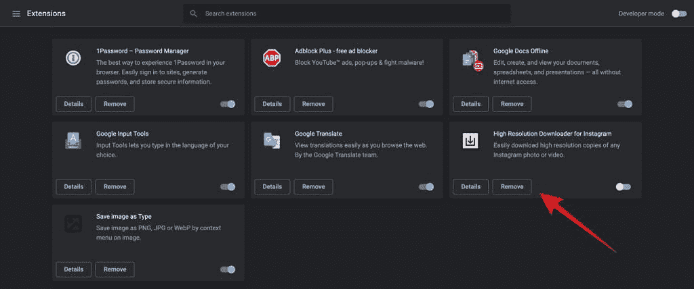

# 如何移除 Chrome 扩展

> 原文：<https://www.xda-developers.com/how-to-remove-chrome-extension/>

# 如何移除或禁用 Chrome 扩展

如果你想移除一个 Chrome 扩展，这里有一个简单的指南，告诉你如何在 Windows、Mac、Linux 或 Chrome 操作系统上移除。

包括谷歌 Chrome 在内的大多数现代浏览器都支持[扩展](https://www.xda-developers.com/best-chrome-extensions/)，这些扩展为浏览器增加了额外的功能，或者提供了对服务的快速访问。然而，安装太多的扩展会使浏览器膨胀，运行缓慢。众所周知，Chrome 占用了大量的系统资源，所以你不会希望这些扩展进一步增加系统的负担。在本指南中，我们将告诉你如何轻松删除你不需要的 Chrome 扩展。

从 Chrome 上卸载扩展有两种方法。无论你是在 Windows、macOS 上使用 Chrome，还是在 Chromebook 上使用 Linux，以下步骤和方法都是一样的。

## 方法 1:使用扩展管理器删除 Chrome 扩展

移除 Chrome 扩展最简单的方法是使用扩展管理器。您可以通过几个简单的步骤来实现它。

1.  打开**铬。**
2.  点击**三点图标**打开菜单。
3.  导航到**更多工具**并点击**扩展**。这将打开扩展管理器。
    *   也可以在地址栏输入 **chrome://extensions/** 直接打开。

4.  Chrome 现在会显示所有已经安装的扩展和应用。
5.  点击您想要卸载的扩展下的**移除**。
6.  Chrome 会要求确认，再次点击**移除**，扩展就会被删除。
7.  如果您不想删除扩展，您也可以使用切换来禁用它。禁用还会阻止扩展耗尽系统资源。

Chrome 工具栏上带有图标的扩展可以直接从那里删除。因为你不需要通过设置菜单，所以移除它们更容易。

1.  识别想要移除的扩展图标，然后**右键点击该图标**。
2.  Chrome 将显示一组选项，包括**从 Chrome 中移除**。选择它。
3.  Chrome 现在会要求确认。点击**移除，**扩展将被卸载。

您不能从工具栏禁用扩展。但是您可以直接跳转到扩展管理器并从那里禁用它。

## 如何禁用同步 Chrome 扩展

需要注意的是，如果您已经启用了与 Google 帐户的扩展同步，从一个系统中删除扩展将会从所有系统中删除它。为了避免这种情况，请确保在卸载 Chrome 扩展之前禁用同步。

1.  点击三个圆点图标旁边的**个人资料图片**。
2.  这将打开一个小菜单，Chrome 将显示你的谷歌账户的**同步在**上。
3.  点击它，你将进入**同步和谷歌服务**设置。
    *   您还可以通过导航三点图标进入**同步和谷歌服务设置**。

4.  在这里，点击**管理你同步的内容**，Chrome 将显示与你的谷歌账户同步的所有内容。
5.  通过启用单选按钮选择**自定义同步**。
6.  使用开关关闭扩展的同步。现在，如果你删除一个系统中的 Chrome 扩展，它不会从其他系统中消失。

* * *

这就是如何移除 Chrome 扩展的方法。如果你正在寻找一些令人惊叹的 Chrome 主题，我们已经选择了[最佳 Chrome 主题](https://www.xda-developers.com/best-google-chrome-themes/)你现在就可以下载。