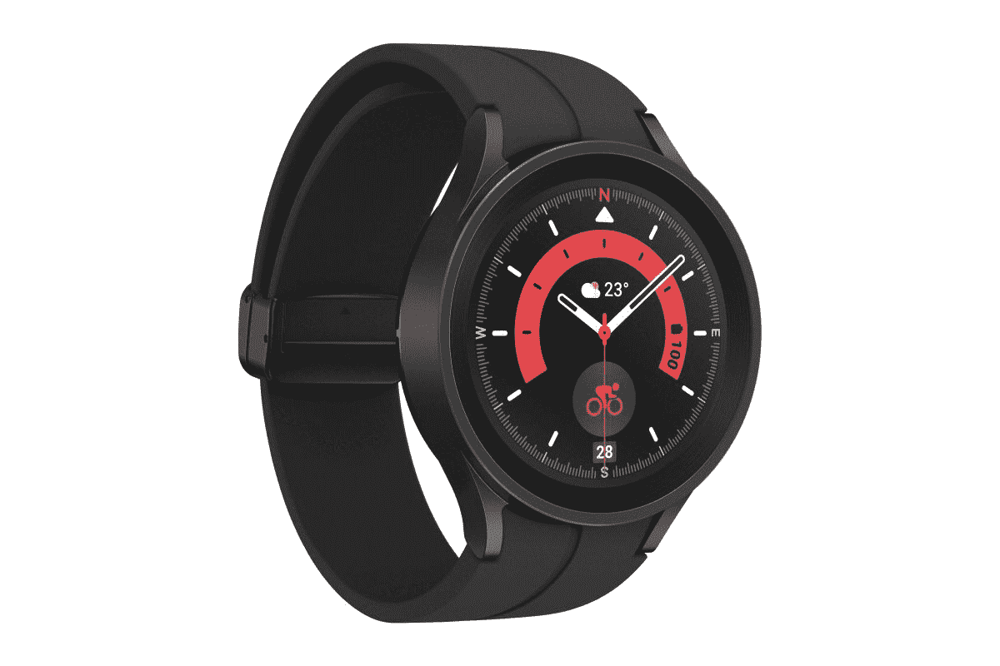

# 如何对三星 Galaxy Watch 5 系列进行出厂重置

> 原文：<https://www.xda-developers.com/how-to-reset-samsung-galaxy-watch-5/>

# 如何对三星 Galaxy Watch 5 系列进行出厂重置

通过几个简单的步骤重置您的 Galaxy Watch 5 或 Galaxy Watch 5 Pro。以下是如何在不丢失数据的情况下做到这一点。

如果你突然遇到无法确定具体应用或设置的问题，安装了有问题的测试版，想把你的手表送给朋友，或者只是想要一个新的开始，你可能需要重置你的 [Galaxy Watch 5](https://www.xda-developers.com/samsung-galaxy-watch-5-review/) 。无论是哪种情况，只需几个简单的步骤就可以轻松重置你的 Galaxy Watch 5 或 [Galaxy Watch 5 Pro](https://www.xda-developers.com/samsung-galaxy-watch-5-pro-launch/) 。以下是如何在不丢失数据的情况下执行恢复出厂设置。

你可以通过两种方式重置你的 Galaxy Watch 5。第一种方法涉及手机上的 Galaxy 可穿戴应用程序。或者，您可以直接从 Galaxy Watch 5 执行重置。重置会抹掉所有个人数据、应用程序和设置，并将手表恢复到默认设置。您还应该考虑在重置手表之前备份数据，以便稍后可以轻松恢复应用程序、设置闹钟和手表面孔。

## 如何从手机重置您的 Galaxy Watch 5

*   在智能手机上，打开 Galaxy Wearable 应用程序。

*   确保手表通过蓝牙连接到您的手机。
*   轻触**手表设置**。

*   在下一个屏幕上，向下滚动并点击**重置。**

*   在继续之前，您可以通过点击“备份数据”来创建云备份。这将备份您的警报、预加载应用程序的应用程序顺序、快速面板、三星健康数据、设置和磁贴。

*   完成后，返回重置屏幕，点击蓝色大按钮。

 <picture></picture> 

Samsung Galaxy Watch 5 Pro

Galaxy Watch 5 Pro 配备了比 Galaxy Watch 5 大 50%的电池和钛外壳。

 <picture></picture> 

Samsung Galaxy Watch 5

Galaxy Watch 5 运行 Wear OS 3.5，并提供广泛的健康和保健工具。

## 如何从手表重置您的 Galaxy Watch 5

*   在你的 Galaxy Watch 5 上，从底部向上滑动以打开应用菜单。
*   点击**设置**图标。

*   向下滚动并点击**常规。**

*   向下滚动并点击**复位**。

*   如果你还没有备份，你可以在这里备份。

*   点击重置，开始恢复出厂设置。

*   就是这样。在重置过程中，不要按任何按钮或解读手表。一旦该过程完成，您的 Galaxy Watch 5 将重新启动。

* * *

你使用 Galaxy Watch 5 的体验如何？请在下面的评论中告诉我们！