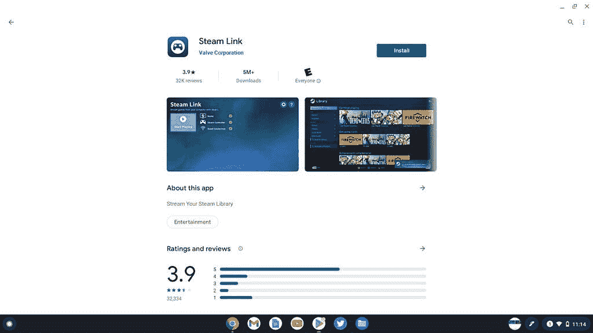
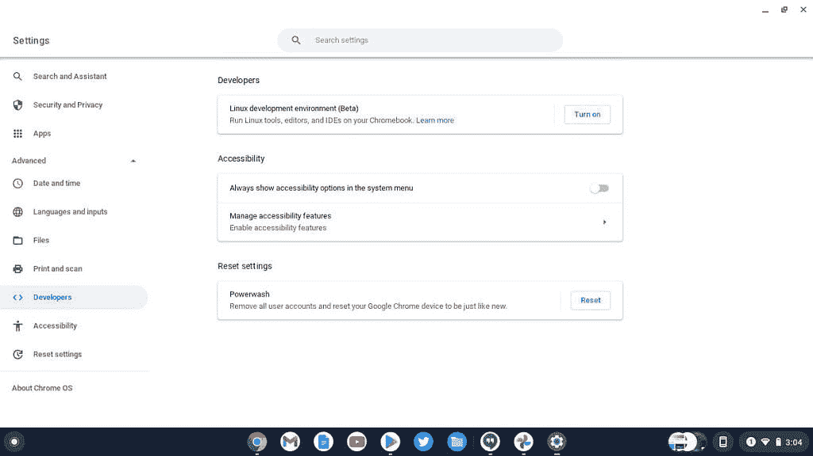

# 2022 年如何在你的 Chromebook 上运行 Steam 游戏

> 原文：<https://www.xda-developers.com/how-to-run-steam-chromebook/>

Steam 是 Windows、Mac 和 Linux 操作系统上最受欢迎的游戏平台之一。如果你最近[购买了新的 Chromebook](https://www.xda-developers.com/best-chromebooks/) ，你可能会觉得有点被排除在游戏党之外，但事实证明，实际上有几种方法可以在 ChromeOS 上运行 Steam。其中一些选项可能有点复杂，但如果你想要一个伟大的游戏体验，这是值得的。

事实上，谷歌和 Steam 合作，使得通过 Dev 频道在 ChromeOS 上运行 Steam 成为可能。在本教程中，我们将运行你需要的一切来让 Steam 在你的 Chromebook 上运行。

## 你的 Chromebook 能运行 Steam 吗？

如果你想用 Chromebook 玩游戏，你首先需要检查它的规格是否符合任务要求。理想情况下，你应该有一个用于 Steam 游戏的酷睿 i5 或 i7 处理器和至少 8GB 的内存。

请注意，基于 ARM 的 Chromebooks 不支持使用本教程中大多数方法的 Steam。如果不从另一台电脑上下载，很难在基于 ARM 的设备上运行 Steam。在尝试本文中的任何方法之前，请阅读[我们列出的 Chromebooks 所需的理想规格](https://www.xda-developers.com/chromebook-cpu-ram-storage/)，以了解您需要什么。

接下来，你应该验证你的 [Chromebook 可以运行 Android](https://www.xda-developers.com/android-apps-chrome-os/) 和 Linux 应用程序，因为在 Chromebook 上运行 Steam 的最简单方法需要 Linux 或 Android 应用程序的支持。如果你有一台现代的 Chromebook，这应该不是问题。

## 通过 Steam Link 在 Chromebook 上运行 Steam(最简单的方法)

在 Chromebook 上运行 Steam 的最快方法是使用 Steam Link Android 应用程序，该应用程序可以将 Steam 游戏流式传输到任何移动设备，这意味着你的 Chromebook 如果支持 Android 应用程序。这种方法要求你在 Chromebook 所在的网络上有一台运行 Steam 的 PC。

这是一种限制性的方法，因为您不能在旅途中体验游戏。然而，如果你只是想在沙发上用轻薄的 Chromebook 玩一些休闲游戏，这可能会奏效。要在 Chromebook 上使用 Steam Link，请遵循以下快速步骤。

1.  打开**谷歌 Play 商店**并安装蒸汽链。
2.  将你的 Chromebook 连接到与你的另一台电脑相同的网络，并使用相同的 Steam 帐户。
3.  打开 **Steam Link 应用程序**并登录您的 Steam 帐户。
4.  配对一个 **Steam 兼容的控制器**(或者在一些游戏中使用键盘)。
5.  连接到您的本地电脑。
6.  你可以将游戏传输到 ChromeOS。

这种方法还需要你拥有另一台电脑，这并不是每个 Chromebook 用户都能做到的。不过，如果你有所需的硬件，它需要不到两分钟来设置。此外，这是唯一适用于基于 ARM 的 Chromebooks 的简单方法。

## 在谷歌批准的 Chromebooks 上正式运行 Steam

谷歌和 Steam 最近合作，使 Steam 在几款官方 Chromebook 型号的测试版 ChromeOS 上运行正式成为可能。该功能在 ChromeOS Dev 频道中是实时的，这意味着你必须将你的设备切换到不稳定版本的操作系统。此外，ChromeOS 上的 Steam 仅适用于我们在下面列出的一小部分 Chromebooks:

*   宏基 Chromebook 514 (CB514-1W)
*   宏基 Chromebook 515 (CB515-1W)
*   宏碁 Chromebook Spin 713 (CP713-3W)
*   华硕 Chromebook Flip CX5 (CX5500)
*   华硕 Chromebook CX9 (CX9400)
*   惠普 Pro c640 G2 Chromebook
*   联想 5i-14 Chromebook

这些都是更高端的 Chromebooks，大多数需要英特尔第 11 代系列的英特尔酷睿 i5 或英特尔酷睿 i5 CPUs 和 8GB 内存。如果你有一台配备英特尔酷睿 i3 CPU 和 4GB 内存的 Chromebook，ChromeOS 上的 Steam 将无法正常工作。

如果你的设备在这个列表中，你可以按照下面的说明将你的 Chromebook 切换到 Dev 频道。请记住，切换到 Dev 频道将会删除您的 Chromebook，因此请首先备份您的数据！

1.  在 Chromebook 的右下角，选择时间，然后选择**设置**。
2.  在侧边栏的左下角，选择**关于 ChromeOS** 。
3.  选择**附加详细信息。**
4.  在**频道旁边，**选择**改变频道**。
5.  选择 **Dev 通道。**
6.  你的 Chromebook 会下载一个更新并要求重启

一旦你完成了这些步骤，你可以进入终端，用这些步骤改变一些标志。

1.  导航到 **chrome://flags。**
2.  将#borealis-enabled 设置为 **Enabled** 。
3.  重启后，用 **Ctrl + Alt + T.** 打开 crosh 终端
4.  “insert _ coin volteer-jolkth 573 fblga”标牌
5.  点击**进入**。
6.  按照安装流程安装蒸汽。

完成这些步骤后，你应该可以在 Chromebook 上运行 Steam 了，只是要记住，会有很多与兼容性或性能相关的错误。谷歌仍在收集 ChromeOS 上 Steam 的反馈。更多信息可以在谷歌的网页上找到。

## 通过 Linux 应用在 Chromebook 上运行 Steam

对于那些家里没有额外的 PC 来进行流媒体播放，或者没有我们上面提到的 Chromebook 型号的人，你仍然可以通过查看你的 [ChromeOS 设置](https://www.xda-developers.com/chrome-os-settings-guide/)来使用 Linux 应用程序支持运行 Steam。这种方法只适用于非 ARM 的 chrome book，但仍然适用于大多数流行的英特尔 chrome book。

首先，你需要在 Chromebook 上启用 Linux 应用。为此，请遵循以下快速步骤。请注意，如果你选择安装 Steam 的 Linux 版本，它可能并不总是在你的设备上工作。

1.  打开 **ChromeOS 设置**(点击桌面右下角的时间区域，然后点击齿轮状的设置图标)。
2.  点击**高级**标签，选择**开发者**。
3.  打开菜单中的 **Linux** 选项。
4.  按照屏幕上的提示在 Chromebook 上安装 Linux。
    *   在设置过程中，您将为 Linux 环境选择一个用户名，它可以是任何东西。您还需要决定将多少可用存储空间用于 Linux，这可以在以后修改。安装需要几分钟，所以在这一步需要一点耐心。

5.  当安装结束时，您会看到一个终端窗口。现在，您终于可以下载并安装一些 Linux 应用程序了。

现在，您可以在 ChromeOS 设备上获得 Steam 了。对于基于 ARM 或非 ARM 的设备，请确保使用下面的适当指令集。

### 为非 ARM Chromebooks 安装 Steam 的步骤

由于 Valve 和谷歌之间的 Borealis 项目，有一种简单的方法可以在英特尔 Chromebooks 上安装 Steam。要开始，你需要启用一个重要的 [Chrome 标志](https://www.xda-developers.com/chrome-flags-settings/)。Chrome 中的指针锁定标志可以让你将光标锁定在显示屏的边缘，这样你就可以在 Chromebook 上玩游戏时正确导航。要启用此标志，请将下面的 URL 复制并粘贴到您的 Chrome 浏览器中，点击 enter，然后启用此标志。

**chrome://flags/# exo-pointer-lock**

现在我们准备安装蒸汽。使用这个安装脚本将安装 Steam 以及所有其他必要的库，以便它在 Chromebook 上正常运行。要下载并运行安装程序，请打开 Linux 终端。你可以在你的 ChromeOS 应用程序启动器中找到它，名称为**终端**

粘贴下面的命令。这是通过突出显示整个代码、右键单击并单击 copy 来完成的。要将其粘贴到终端中，右键单击(在触摸板上用两个手指单击)终端内部的任何位置，它将粘贴代码(传统的复制和粘贴快捷方式在终端中无法正常工作)。

**/usr/bin/curl-L https://chromium . Google source . com/chromium OS/platform/dev-util/+/master/contrib/gfx/crostini-steam-setup . sh？format = TEXT " |/usr/bin/base64-d>/tmp/crostini-steam-setup . sh；/bin/chmod a+x/tmp/crostini-steam-setup . sh；/usr/bin/sudo/tmp/crostini-steam-setup . sh**

等待该过程完成，您应该会在启动程序中找到 Steam 图标。在启动应用程序之前，您可能需要在终端中运行命令 **steam** 来更新软件包。

你现在可以开始游戏了。如果你有一个基于 ARM 的 Chromebook，你可能可以使用 x86 模拟器运行 Steam，但整体体验会相当差。大多数 Steam 游戏都是为 x86 架构打造的，所以这是一个你无法回避的问题。

## 如果你的 Chromebook 不支持 Linux 应用怎么办？

如果你的 Chromebook 不支持 Linux 应用程序，首先检查 ChromeOS 更新是否可以启用访问。如果这不起作用，在 Chromebook 上双启动完整版本的 Linux 可能是一个更好的选择。

然而，一个警告:这种方法不适合胆小的人，也不一定有效。它是为有处理命令行和安装操作系统经验的人准备的。如果你不精通技术，我们不建议你使用这种方法。我们也不能对你的 Chromebook 的损坏负责，因为你将同时运行 ChromeOS 和 Linux。

接受这些风险允许你在你的机器上运行一个完整的 Linux 操作系统，除了 ChromeOS。您还可以在操作系统之间快速切换。这种方法的缺点是需要你[在 Chromebook](https://www.xda-developers.com/how-to-turn-on-chrome-os-developer-mode/) 上启用开发者模式。启用开发人员模式将完全擦除您的设备，因此请确保备份所有重要信息。

启用开发者模式后，按照以下步骤在 Chromebook 上安装 Ubuntu:

1.  **[在这里下载面包丁](https://goo.gl/fd3zc)** 。
2.  打开一个 shell ( **Ctrl+Alt+T，**键入 shell，然后按 enter 键)
3.  通过运行**sudo install-Dt/usr/local/bin-m 755 ~/Downloads/crouton**将安装程序复制到可执行位置
4.  既然它是可执行的，运行安装程序本身: **sudo crouton -t xfce**
5.  耐心等待，回答提示。
6.  搞定了。您可以通过运行**sudo enter-ch root start Xfce 4**直接跳转到您的 Xfce 会话，或者作为一种特殊的快捷方式， **sudo startxfce4**
7.  使用 **Ctrl+Alt+Shift+Back** 和 **Ctrl+Alt+Shift+Forward** 在 Chromium 操作系统和您正在运行的图形浏览器之间循环。
8.  通过注销 Xfce 退出 chroot。

一旦这一过程结束，你将在 Chromebook 上同时安装 ChromeOS 和 Ubuntu。这里有一些关于这次经历的笔记。

*   按下 **Ctrl + Alt + Shift + Back** 和 **Ctrl + Alt + Shift + Forward** 可以在操作系统之间切换。
*   如果你默认退出 Ubuntu，你会被扔回到 ChromeOS。你可以通过在 shell 中输入命令 **sudo startunity** 来返回 Ubuntu。
*   现在你有一个准备好的 Linux 操作系统，你可以很容易地安装 Steam。打开终端，输入 **sudo 来安装 steam** 在你的 Chromebook 上安装 steam。

* * *

正如你所看到的，有几种方法可以在 Chromebook 上运行 Steam。对于大多数人来说，我们建议 ChromeOS 上的 SteamLink Android 应用程序。如果你没有运行 SteamLink 的 PC，那么你可以尝试在使用 Linux 的 ChromeOS 上安装 Steam，或者购买一款支持 Steam 的 Beta 版 Chromebook 官方机型。如果所有这些都失败了，还有一个办法可以在你的 Chromebook 上安装 Ubuntu。请在评论中告诉我们哪种方法适合你。