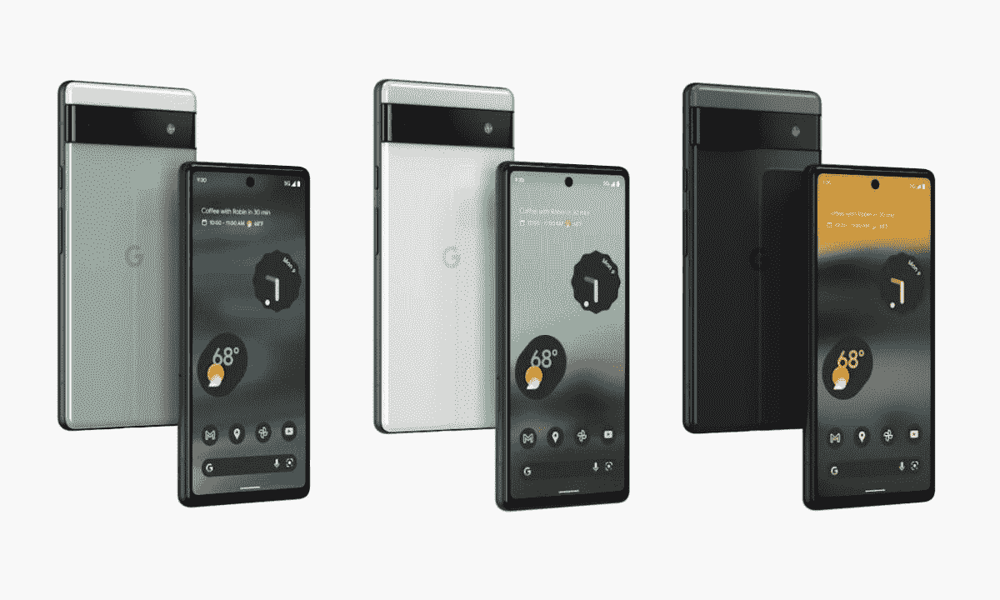

# 如何设置 Google Pixel 6a 并开始使用该设备

> 原文：<https://www.xda-developers.com/how-to-set-up-google-pixel-6a/>

因此，在阅读了我们的[谷歌 Pixel 6a 评论](https://www.xda-developers.com/google-pixel-6a-review/)并找到这款手机的[最佳交易](https://www.xda-developers.com/best-google-pixel-6a-deals/)后，你决定购买它。恭喜你获得了市场上更好的中端 Android 智能手机之一。现在剩下的就是[买一个箱子](https://www.xda-developers.com/best-google-pixel-6a-cases/)，哦，还要把它装好。如果这是你第一次使用谷歌 Pixel 智能手机，甚至是安卓设备，设置它可能会令人生畏。但是，我们会保护你的。让我们来看看 Google Pixel 6a 的设置过程。

你需要做的第一件事是打开你的设备。电源按钮位于手机右侧，音量摇杆上方。按住电源按钮几秒钟，直到显示屏打开，您会看到带有 Google 徽标的亮白色屏幕。

一旦你通过了启动屏幕，你会看到一个“欢迎使用你的像素”屏幕。该屏幕将为您提供选择手机语言的选项，以及您是否希望启用辅助选项。辅助选项将允许您更改视觉设置，还可以用您的声音设置电话。您也可以通过点击右下角的“开始”来设置手机的触控功能。

如果您的手机中没有插入 SIM 卡，将会要求您连接到移动网络。购买蜂窝服务时，您的无线运营商通常会提供 SIM 卡。你可能要把这个从你的旧手机里拿出来，放到谷歌 Pixel 6a 里。如果你不熟悉，可以[跟随我们的向导](https://www.xda-developers.com/how-to-insert-sim-android/)。您只需找到 SIM 卡插槽，并使用 SIM 卡弹出工具、回形针或类似工具将其弹出。如果您没有实体 SIM 卡，那么您可以与您的无线运营商合作，下载一个 eSIM。

如果您没有数据连接，手机会要求您连接 Wi-Fi 连接进行设置。一旦您建立了连接，手机将开始让您的手机准备就绪。这可能需要几分钟，请耐心等待。完成该过程后，系统会提示您复制应用程序和数据，或者跳过该过程。如果你不想从你的旧手机中转移任何数据，你可以跳过这一步。

如果您选择传输您的信息，您可以从 iPhone 或其他 Android 手机传输您的数据。出于本教程的目的，我们将跳过传输信息，因此请按“不要复制”完成后，系统会提示您登录您的 Google 帐户或创建一个 Google 帐户。如果您不确定，也可以跳过此选项。出于本教程的考虑，我们将跳过创建和登录过程。

从这里开始，你将被要求设置你可能使用的谷歌服务。您将拥有位置设置、Wi-Fi 扫描设置、发送诊断数据等选项。通读每个选项并仔细选择。一旦你对自己的选择感到满意，你就可以选择“接受”在此之后，您必须同意一些额外的法律条款才能继续。

此时，你可以选择为你的锁屏设置一个安全码。默认情况下，你会选择一个四位数的个人识别码，按下“屏幕锁定选项”，你也可以选择输入一个模式，个人识别码，或密码。您可以跳过这一步，但如果您选择输入保密码，系统会要求您重新输入保密码进行验证。

如果您输入了安全码，接下来会提示您注册指纹以轻松解锁您的设备。您可以点击**我同意**来选择接受，或者点击**不，谢谢**来跳过这个过程。接下来，你会得到一个选项来安装额外的谷歌应用程序，如果你选择这样做，按**确定，**如果不是，取消勾选**所有下列应用程序**框。

最后一步，你会看到如何使用手机的说明。如果你想要手势导航的教程，选择**试试**，否则**跳过。**就这样，您终于完成了设置过程。向上滑动，你会看到谷歌 Pixel 6a 的默认主屏幕。

 <picture></picture> 

Google Pixel 6a