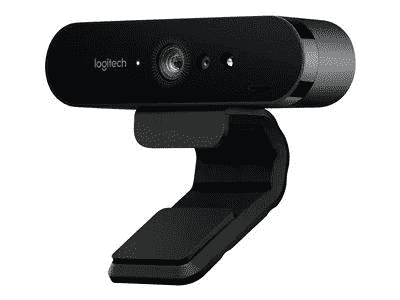
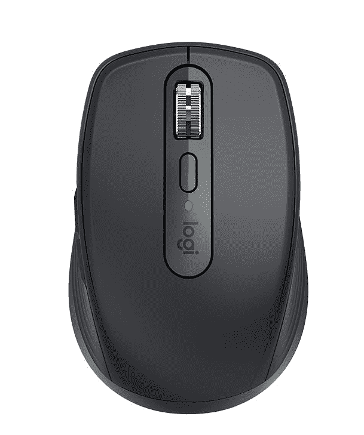
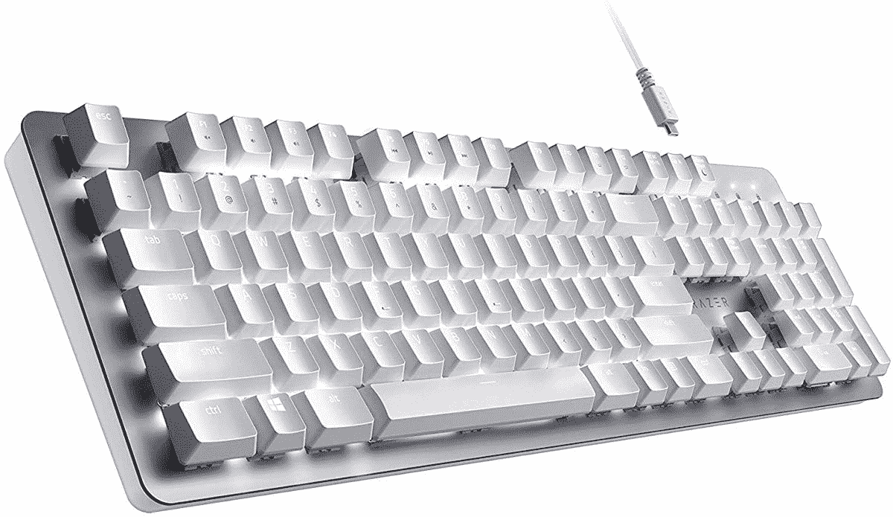
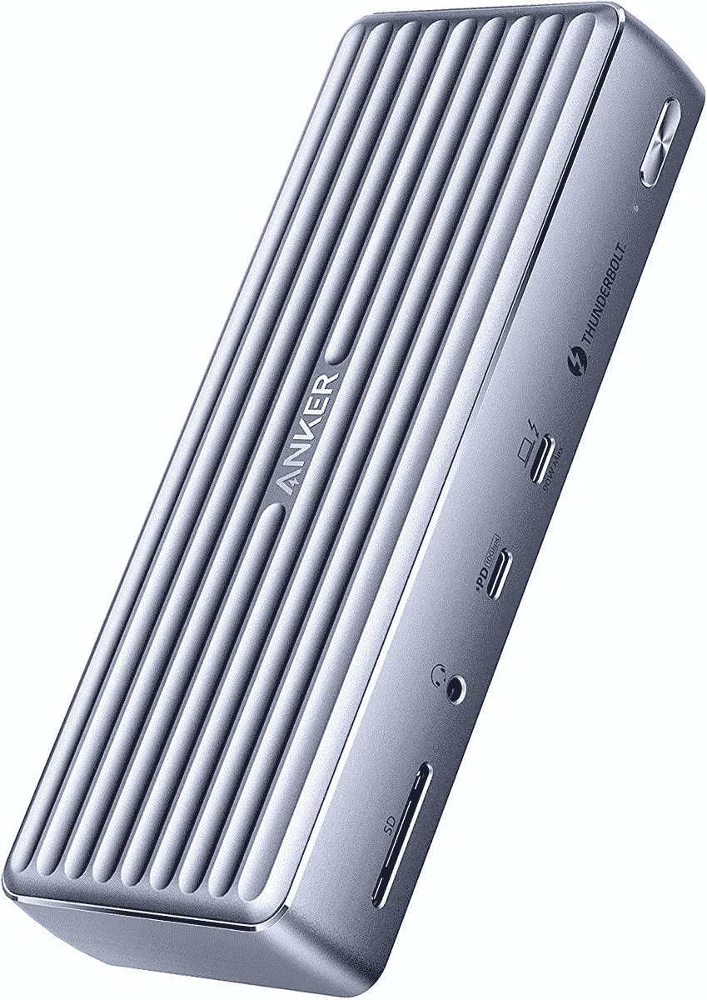

# 如何设置 HP EliteBook 840 Aero 以便在家工作

> 原文：<https://www.xda-developers.com/how-to-set-up-hp-elitebook-840-aero-work-from-home/>

公平地说，我们许多人现在生活在在家工作的时代。由于我们被迫隔离和加强社交距离，在拥挤的办公室工作已经变得不那么必要了。虽然我们中的一些人可能会喜欢额外的隐私或不必经常开车，但在家工作也带来了一些挑战。您需要的第一件东西是[用于工作的出色笔记本电脑](https://www.xda-developers.com/best-business-laptops/)，无论您是在家工作还是外出，HP EliteBook 840 Aero 都符合这一要求。

尽管如此，建立一个家庭办公室可能是困难的，尤其是如果你不确定你需要什么。您可能需要一些外围设备来帮助您更高效、更舒适地工作。虽然每个人的需求不同，但我们还是收集了一些你可能想要的东西。这些可以包括第二台(或第三台)显示器、扩展坞等等。

**浏览本文:**

## HP EliteBook 840 Aero 的第二个屏幕

如果您计划在家中使用任何笔记本电脑工作，即使是 HP EliteBook 840 Aero，您也需要一个外部显示器。这并不是说这款笔记本电脑的屏幕不好，但是第二块屏幕带来的额外空间非常有价值。与其他人相比，我个人对双屏生活方式有点晚，但即使是我也不能否认它有多棒。有时不得不把你的笔记本电脑屏幕分成两个(或更多)窗口感觉不太好。我喜欢有一个完整的显示屏来显示我正在看的东西，有了两个屏幕，多任务处理就变得容易多了。

你可以购买很多显示器，它们都会在一定程度上改善你的体验。我总是喜欢推荐三星 S65UA，因为它提供了功能和价格的完美结合。这是一个超宽的 21:9 显示器，而且是 34 英寸的。这给了你很大的工作空间，宽高比缓解了我在分屏使用应用程序时遇到的问题。它也是一个 WQHD 分辨率面板，额外的像素密度使一切更加清晰，并允许 UI 元素缩小，为更多内容释放空间。它也是一个曲面显示器，所以它给你更好的观看体验，以及 100Hz 的刷新率，AMD FreeSync，支持 HDR 10，并支持通过 USB Type-C 端口供电。

如果你在明亮的灯光下，300 尼特的亮度不会令人惊讶，但它仍然是一个很好的和相对实惠的方式来扩大你的工作空间。如果你想要更高端的东西，你可以随时查看我们的[最佳显示器](https://www.xda-developers.com/best-monitors/)列表。

 <picture></picture> 

Samsung S65UA

##### 三星 S65UA Ultra WQHD 显示器

要扩展您的桌面设置，像这样的超宽显示器是一个很好的解决方案。凭借 21:9 WQHD 曲线显示屏、100Hz 刷新率和丰富的连接选项，这款显示器非常适合工作。

## 更好的网络摄像头

即使在在家工作的时代，惠普也决定使用内置在 HP EliteBook 840 Aero 中的 720p 网络摄像头。公平地说，这款相机确实支持 Windows Hello——这很好——但如果你正在开工作会议，你可能希望看起来比这款网络摄像头更好一些。很少有网络摄像头看起来像罗技布里奥一样好。

布里奥是首批配备 4K 传感器的主流网络摄像头之一，这还不是它的全部优势。它还支持 HDR，以及罗技的 RightLight 3 技术，以帮助您在不同的照明场景中更加明显。您也可以在不同的缩放级别之间进行选择，以更大或更小地适应框架。但这款网络摄像头最棒的一点是，它包括一个红外摄像头，支持 Windows Hello。当然，HP EliteBook 840 Aero 已经有了 Windows Hello，但是如果您正在多显示器设置中工作，您可能只想将您的网络摄像头放在其他显示器的上方。

罗技布里奥提供的所有东西都不便宜，但如果你想要最好的质量，它是值得的。我们也有你今天可以买到的[最佳网络摄像头](https://www.xda-developers.com/best-webcams/)的综述，包括一些更实惠的选项供选择。

 <picture></picture> 

Logitech Brio 4K Webcam

##### 罗技布里奥 4K 专业网络摄像头

在会议中保持最佳状态会极大地影响会议的进行，没有比罗技布里奥更好的了。凭借 4K 传感器、HDR 支持和许多其他功能，这是最好的网络摄像头之一。

## 用于接听电话的耳机

在开会和打电话时，你的外表只是故事的一部分。你还必须听起来不错，这可能更重要。HP EliteBook 840 Aero 有一个双阵列内置麦克风，但这会拾取您周围的更多噪音，而且它更容易产生回声，离您很远。有一个好的耳机对声音来说很重要，但它也必须看起来和感觉起来都很好。

这似乎是一个奇怪的选择，但 Xbox 无线耳机确实是你能获得的最佳体验之一，尤其是考虑到它的价格。首先，尽管在 Xbox 品牌下，它有一个非常现代和柔和的设计。如果你将它与大多数其他游戏耳机相比，它的外观完全不同。它还包含一些方便的功能，如旋转耳罩上的转盘来动态调节音量。凭借语音隔离、不说话时自动静音、环绕声支持和舒适的设计等功能，这是一款非常棒的耳机。它也不需要任何加密狗，所以你可以轻松地连接到你的手机听音乐或你的 Xbox 主机玩一些游戏。很百搭。

Xbox 无线耳机经常缺货，所以你可能要关注一下亚马逊和 T2 百思买。如果 99.99 美元的价格有点太贵，微软也正在制作这款耳机的[有线版本](https://shop-links.co/1750176521893639011?u1=cd3432e0-50e0-4d1d-9adf-efcdd2b58d2d)，去掉了一些功能，设计更加微妙。

 <picture></picture> 

Xbox Wireless Headset

##### 微软 Xbox 无线耳机

Xbox 无线耳机是一款游戏耳机，可轻松用于会议，为您提供 PC 上的最佳体验之一。它在耳罩上有方便的音量控制，柔和舒适的设计，语音隔离和自动静音等等。这个很难出错。

## 老鼠

笔记本电脑的触控板已经不是控制鼠标的最佳方式，但当你有一台像 EliteBook 840 Aero 这样的小型笔记本电脑时，它就不太理想了。触控板非常便于携带，但是如果你要创建一个完美的桌面设置，你需要一个合适的鼠标。更舒适，效率更高，没有理由不升级。

罗技是最知名的外设制造商之一，该公司的鼠标一直是最好的。这与罗技 MX Anywhere 3 没有什么不同，它采用了顶级的紧凑设计和可靠的功能。首先，这款鼠标看起来非常干净和优雅，钢制滚轮等元素也有助于实现这一点。滚轮会自动在棘轮模式和“超快”滚动模式之间切换——前者可以让你在慢速滚动时感觉到它的咔哒声，后者则不需要单独点击。它还使用罗技的暗场传感器，这意味着你甚至可以在玻璃上使用这款鼠标。这还不是全部，因为鼠标包括应用程序特定的配置文件，为您提供不同应用程序中的特定快捷方式，而且它可以与所有主要的桌面操作系统配合使用。

这款鼠标设计紧凑，非常适合较小的手和空间较小的桌子。如果你想要更符合人体工程学和更多功能的东西，罗技还制作了另一款高评价鼠标 [MX Master 3](https://www.amazon.com/dp/B07S395RWD?tag=xda-ctn4trc-20&ascsubtag=UUxdaUeUpU4784&asc_refurl=https%3A%2F%2Fwww.xda-developers.com%2Fhow-to-set-up-hp-elitebook-840-aero-work-from-home%2F&asc_campaign=Short-Term) 。

 <picture></picture> 

Logitech MX Anywhere 3

##### 罗技 MX Anywhere 3

罗技 MX Anywhere 3 是一款出色的紧凑型鼠标，具有出色的设计和功能。它拥有该公司的 MagSpeed 滚轮和暗场传感器，因此它甚至可以在玻璃等超光滑表面上工作。

## 键盘

对于许多人来说，这可能是一个不太需要的附加功能，但这并不意味着它没有保证。笔记本电脑键盘很好，惠普的键盘是最好的，但它的舒适性很难与全台式机键盘相比。如果您正在使用 HP EliteBook 840 Aero 在家工作，那么绝对值得考虑专用键盘。尤其是如果是机械的，很多人更喜欢。

我们已经收集了过去最好的机械键盘，但如果你想要一些专业和干净的东西，Razer Pro 型无线机械键盘是一个很好的选择。Razer 通常更专注于游戏硬件，但 Pro 类型更专注于生产力，并且在这方面做得很好。它采用了 Razer 的橙色机械开关，提供了一种没有更多无声驱动的触觉，因此在工作时不会造成干扰。这是一个全尺寸键盘，配有数字键盘和全尺寸箭头键。键盘还通过 Razer Synapse 提供宏和可编程键。

这是一个彻头彻尾的高级感觉键盘，具有带软触摸涂层的白色键帽和可调节的白色背光。顶盖由金属制成，也增加了一些重量。这是一款双模无线键盘，同时支持蓝牙和 2.4GHz 无线，您可以在多达四个连接的设备之间轻松切换。它有一个可通过 USB Type-C 充电的电池，你可以在充电的时候使用它。

 <picture></picture> 

Razer Pro Type Wireless Mechanical Keyboard

##### Razer Pro 型

Razer Pro Type 是一款简洁、外观精美的机械键盘，放在任何办公室都很棒。它使用 Razer 的橙色机械开关来获得无声的触感，白色背光使按键在黑暗中可见。

## 霹雳码头

 <picture></picture> 

Anker 777 Thunderbolt 4 Dock

对于许多笔记本电脑来说，这将是我们的第一个建议，但 HP EliteBook 840 Aero 实际上有很多端口，因此您可以创建一个在家工作的设置。不过，如果你想释放笔记本电脑上的端口，或者你只是有很多外围设备，一个 [Thunderbolt dock](https://www.xda-developers.com/best-thunderbolt-docks/) 可以成为你整个设置的支柱。通过一个连接，您可以添加几十个端口，包括显示器输出、USB 和以太网。有些坞站甚至可以给你的笔记本电脑充电。

今天你可以买到的最好的 Thunderbolt 坞站之一是 Anker Apex 12 合 1 Thunderbolt 4 坞站，顾名思义，它总共有 12 个端口。在前面，Thunderbolt 4 上游端口连接到您的笔记本电脑，可以提供高达 90W 的充电功率，足以为 EliteBook 840 Aero 供电。还有另一个用于外设或给手机充电的 Type-C 端口、一个耳机插孔和一个全尺寸 SD 读卡器。在背面，您可以获得两个 HDMI 端口，一个能够为另一个显示器供电的下游 Thunderbolt 4 端口(因此您可以获得多达三个外部显示器)，千兆以太网和四个 USB Type-A 端口(两个 USB 3.2 Gen 2，两个 USB 2.0)。

这是很多港口，毫无疑问，这是一个非常有能力的霹雳码头。然而，它很贵，如果你想省钱，你可以从亚马逊基础选择[这种型号。](https://www.amazon.com/AmazonBasics-Thunderbolt-Docking-Station-Attached/dp/B086H3FMPZ?tag=xda-ctn4trc-20&ascsubtag=UUxdaUeUpU4784&asc_refurl=https%3A%2F%2Fwww.xda-developers.com%2Fhow-to-set-up-hp-elitebook-840-aero-work-from-home%2F&asc_campaign=Short-Term)

 <picture></picture> 

Anker Apex 12-in-1 Thunderbolt 4 Dock

##### Anker 777 雷电坞站

Anker Apex 12 合 1 Thunderbolt dock 为您的笔记本电脑增加了大量端口，它还可以帮助简化您的设置。您可以使用一根电缆连接所有外围设备，因此当您想将笔记本电脑带到某个地方时，只需拔掉一根电缆。

* * *

有了这些东西，您就拥有了基于 HP EliteBook 840 Aero 的出色在家办公设置所需的一切。不是每个人都需要所有这些设备，这没关系。这已经是一台很棒的笔记本电脑，这些选项旨在增强您觉得可以更好的体验的特定部分。在所有这些因素中，我个人认为第二块屏幕是你最想要的——它对工作效率有很大的帮助，尤其是像这样的大尺寸高分辨率显示屏。

如果你还没有，你可以使用下面的链接购买 HP EliteBook 840 Aero。这是一款高度可配置的笔记本电脑，就像商务设备一样。你可以通过高达英特尔酷睿 i7-1185G7，64GB 内存，2TB 存储，甚至添加隐私屏幕或 5G 支持等功能来获得它。它也非常轻，起始重量仅为 2.5 磅。否则，你可以看看你现在可以购买的其他[惠普笔记本电脑](https://www.xda-developers.com/best-hp-laptops/)。

 <picture></picture> 

HP EliteBook 840 Aero G8

##### 惠普 EliteBook 840 Aero G8

HP EliteBook 840 Aero 是一款轻便的翻盖式笔记本电脑，为企业用户提供了大量配置选项。除了高端规格，Thunderbolt 4 支持意味着您可以通过外设极大地扩展其功能。