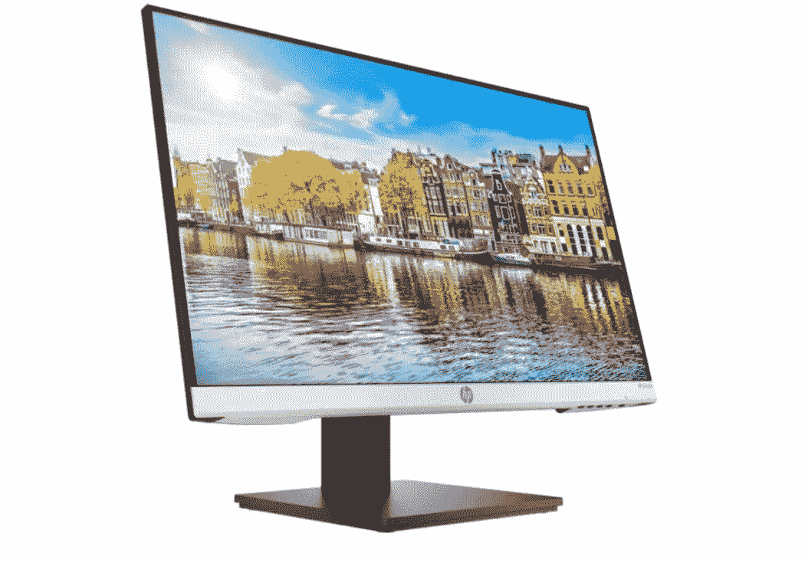
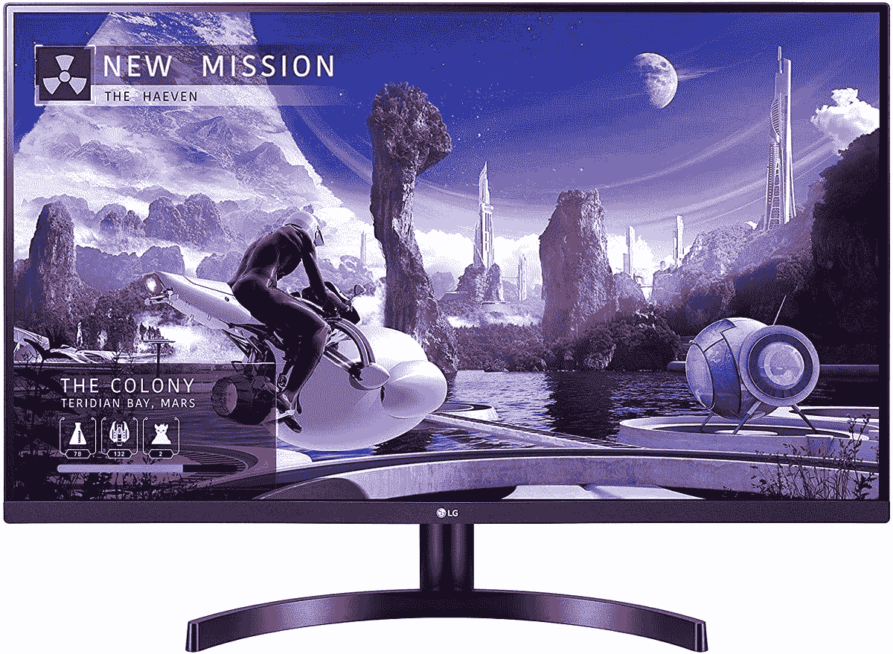
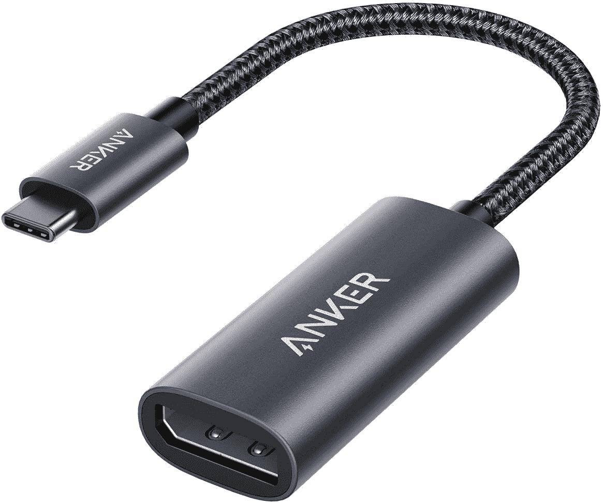
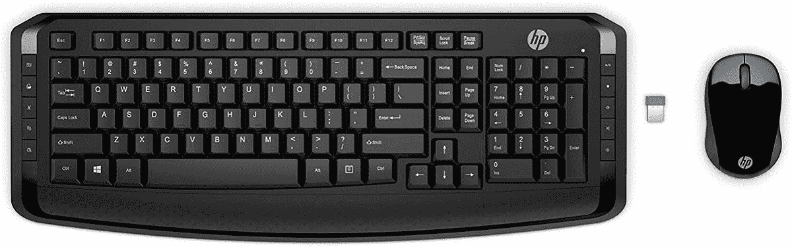
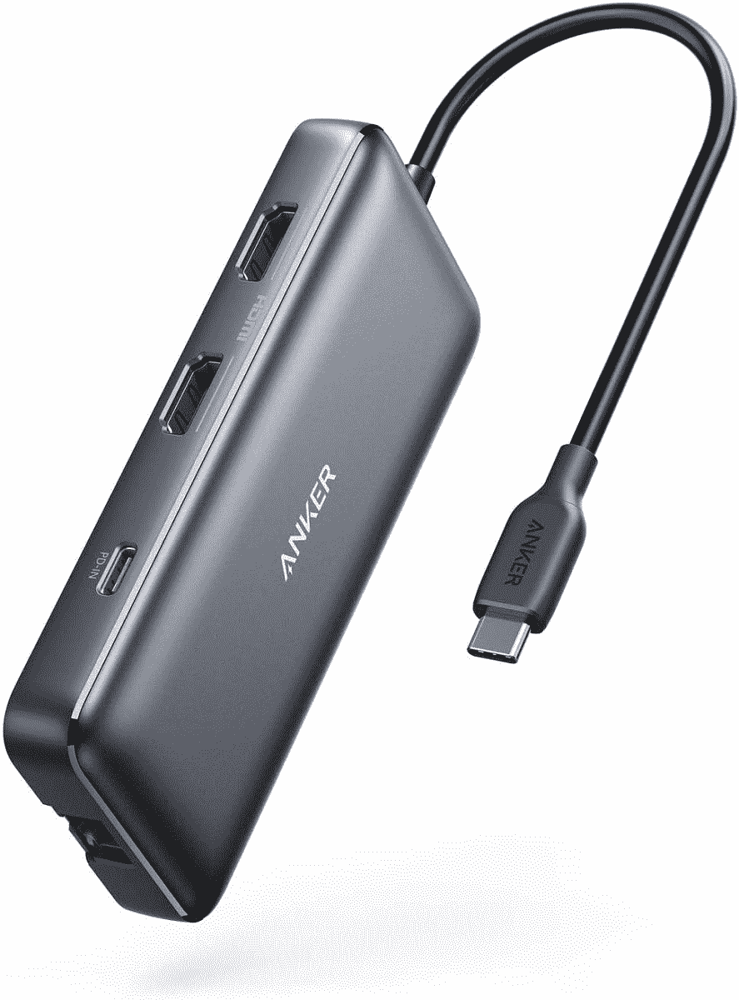
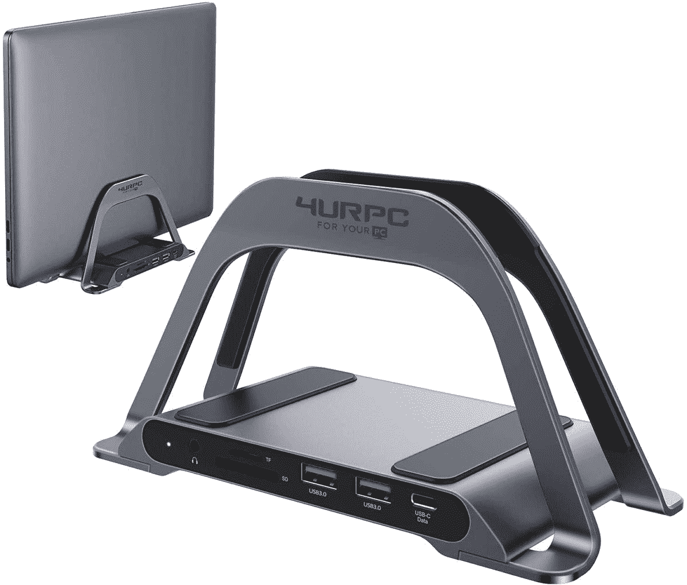
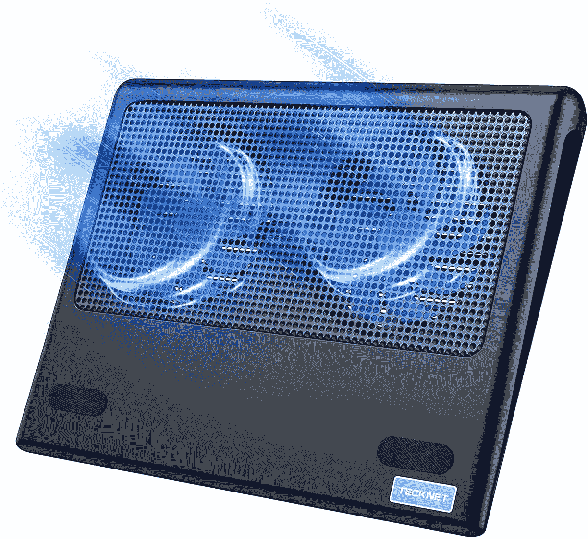

# 如何设置 HP Pavilion Aero 13 以便在家办公

> 原文：<https://www.xda-developers.com/how-to-set-up-hp-pavilion-aero-work-from-home/>

惠普制造了一些最好的笔记本电脑，今年早些时候，它为其 Pavilion 系列增加了一名新成员，T2 Aero 13，这是一款由 AMD 的锐龙 5000U 处理器驱动的轻型 13 英寸笔记本电脑。它的重量不到一公斤，虽然它不是超级顶级的，但它具有现代超薄超极本的吸引力。它由镁合金制成，以保持其重量，同时，不在外观上妥协，感觉像该公司的 Envy 系列笔记本电脑一样好。

Pavilion Aero 13 有锐龙 5 5600U 和锐龙 7 5800U 两种型号可供选择，这也是我们推荐的型号，目前[正在测试](https://www.xda-developers.com/hp-pavilion-aero-13-first-impressions/)。说到这里，看看我们列出的一些[最好的基于 AMD 锐龙的笔记本电脑](https://www.xda-developers.com/best-amd-ryzen-laptops/)。虽然这些是 AMD 最新的低功耗移动 CPU，但它们仍然非常强大。例如，5800U 是一款 8 核 16 线程处理器，最高速度可达 4.4GHz，并配有集成的 AMD 镭龙显卡。该笔记本电脑可配置高达 16GB 的 DDR4 内存和 1 TB 的 PCIe NVMe M.2 固态硬盘。

至于显示器，13.3 英寸 IPS 面板有 WUXGA (1920 x 1200)或 WQXGA (2560 x 1600)两种，亮度为 400 尼特。笔记本电脑上的 I/O 选项包括两个使用下拉铰链的全尺寸 USB Type-A 端口、一个支持电源传输和 DisplayPort 1.4 的 USB Type-C 端口、HDMI 2.0、交流电源智能引脚和一个 3.5 毫米组合音频插孔。其他值得注意的功能包括 Wi-Fi 6、蓝牙 5.2、43Wh 锂离子聚合物电池和指纹读取器。

## 惠普 Pavilion Aero 13:规格

|  | 

惠普展馆 Aero 13

 |
| --- | --- |
| **CPU** | 

*   AMD 锐龙 5 5600U(最高 4.2 GHz，16 MB 三级高速缓存，6 个内核，12 个线程)
*   AMD 锐龙 7 5800U(最高 4.4 GHz，16 MB 三级高速缓存，8 个内核，16 个线程)

 |
| **图形** |  |
| **正文** | 

*   11.72×8.23×0.67 英寸
*   2.2 磅(0.9 千克)

 |
| **显示** | 

*   13.3 英寸对角线，WUXGA (1920 x 1200)，IPS，微边缘，防眩光，400 尼特
*   13.3 英寸对角线，WQXGA (2560 x 1600)，IPS，微边缘，防眩光，400 尼特

 |
| **端口** | 

*   USB Type-C 10Gbps，带供电、DisplayPort 1.4、惠普睡眠和充电
*   2 个 USB 类 5Gbps
*   HDMI 2.0
*   交流智能引脚
*   3.5 毫米组合音频

 |
| **存储** | 

*   高达 1TB M.2 PCIe NVMe 固态硬盘

 |
| **公羊** |  |
| **电池** | 

*   3 芯 43 瓦时锂离子聚合物电池
*   45W 智能交流电源适配器

 |
| **音频** | 

*   音频由 B &O;双扬声器；惠普音频增强
*   集成双阵列数字麦克风

 |
| **摄像机** |  |
| **连通性** | 

*   Realtek Wi-Fi 6 (1x2)
*   蓝牙 5.2 组合

 |
| **颜色** | 

*   天然银
*   暖金
*   陶瓷白
*   淡玫瑰金

 |
| **价格** |  |

如果您计划购买惠普新的中端超便携笔记本电脑，特别是针对在家工作的设置，那么我们将满足您的需求。这里有一些关于设置 HP Pavilion Aero 13 以便在家工作的建议，包括外接显示器、键盘、鼠标等插件。

## 外部监视器

Pavilion Aero 13 配备了 13.3 英寸的显示屏，相当紧凑。因此，外接显示器绝对可以帮助您提高工作效率。笔记本电脑有一个专用的 HDMI 2.0 端口来连接显示器，或者您可以使用 USB Type-C 端口，因为它支持 DisplayPort 1.4。除非你的桌面空间非常有限，否则 24 英寸的显示器应该是你的最小目标尺寸。惠普自己的 24mh 显示器是一个推荐选项，它配有 23.8 英寸 IPS 面板，分辨率为 1920 x 1080，刷新率为 75Hz。它还配有内置扬声器、倾斜度和高度调节以及超薄的三面挡板。

如果您喜欢更大的显示器，我们推荐 27 英寸或 32 英寸的显示器，分辨率为 QHD 1440p。LG 提供 27 英寸 27QN600-B 和 32 英寸 32QN650-B，这两款显示器都是出色的显示器，提供出色的面板，提供清晰的视觉效果、亮度和 HDR 支持。

要将显示器连接到 HP Pavilion Aero 13，您只需将显示器附带的 HDMI 电缆连接到笔记本电脑。如前所述，你也可以使用 DisplayPort 电缆，尽管你需要一个 USB Type-C to DisplayPort 适配器或基座。

 <picture></picture> 

HP 24mh

##### 惠普 24MH FHD 显示器

一款物有所值的 24 英寸 1080p IPS 显示器，具有 75Hz 的刷新率，内置扬声器，支持 HDMI 和 DisplayPort。

 <picture></picture> 

LG 27QN600 27-inch QHD monitor

##### LG 27QN600-B

LG 27QN600 是一款强烈推荐的 27 英寸 QHD 1440p 显示器，采用 IPS 面板，支持 HDR、AMD FreeSync 和黑色稳定器模式。

 <picture></picture> 

Anker USB-C to DisplayPort Adapter

##### 将 USB-C 连接到显示端口适配器

Anker 的 USB-C 到 DisplayPort 适配器可以让您将笔记本电脑连接到 DisplayPort 显示器，支持高达 4K@60Hz 的分辨率。

 <picture></picture> 

Amazon Basics CL3 HDMI cable

##### 亚马逊基础 CL3 HDMI 线缆

如果你的显示器没有配备 HDMI 电缆，你可以使用 Amazon Basics 的 HDMI 电缆，它配备了 CL3 额定高速 HDMI 电缆，支持 60Hz 的 4K。

## 键盘和鼠标

现在你已经把笔记本电脑连接到你的显示器上了，是时候换一个好的键盘和鼠标了。这些外设将有助于提高您的工作效率，因为它们可以让您摆脱笔记本电脑上拥挤的按键和触摸板。如果您正在寻找一个基本的键盘和鼠标组合，惠普提供了一个经济实惠的无线选项，附带一个接收器解决方案。只需将接收器插入 USB 端口，打开键盘和鼠标，一切就绪。此外，为了获得更强大、更个性化的体验，你还可以选择机械键盘和更坚固的鼠标。

 <picture></picture> 

HP Wireless Keyboard and Mouse 300

##### 惠普无线键盘和鼠标 300

一款经济实惠的键盘和鼠标组合，配有一个灵巧的全尺寸键盘，以及附加的功能键和多媒体键。

 <picture></picture> 

Keychron Mechanical Gaming Keyboard

##### 奇克隆·K4

Keychron K4 是一款全尺寸 96%布局的键盘，提供有线和无线连接选项，可选择红色、蓝色或棕色 Gateron 按键开关。它还支持多设备，内置 4000 毫安时电池。

 <picture></picture> 

HP Spectre Rechargeable Mouse

##### 惠普 Spectre 充电鼠标 700

惠普的 premium Spectre 700 无线鼠标配有可充电电池，一次充电可持续使用长达 11 周。它还可以配对多达三个蓝牙和一个 USB 设备，并由于激光传感器而提供高达 1，200 dpi 的速度。

 <picture></picture> 

Logitech MX Master 3 for Mac

##### 罗技 MX Master 3

罗技 MX Master 3 是一款优质的生产力鼠标，提供高质量的设计、可编程按钮、双滚轮、多设备支持、USB-C 充电等功能。

## 港区

Pavilion Aero 13 配有一个 USB Type-C 10Gbps 端口，这意味着您可以通过投资一个良好的 USB-C 坞站来扩展 I/O 选项。它可以帮助您连接多台显示器和基于 USB 的设备，如外围设备和存储设备、用于有线连接的以太网等。有许多选项可供选择，有不同的尺寸和各种端口选项。这里有一些为您的 Pavilion Aero 13 提供的最佳选择 USB-C 坞站。这些可以很容易地连接使用一个 USB-C 连接。

 <picture></picture> 

Tobenone USB-C Docking Station

##### Tobenone USB-C 扩展坞

该坞站提供超过 15 种连接选项，支持双显示器，多个 USB-A 和 USB-C 端口，以及 SD 和 microSD 卡插槽、以太网等。

 <picture></picture> 

Anker PowerExpand 8-in-1 USB-C Adapter

##### Anker PowerExpand 8 合 1 USB-C 集线器

小巧的 USB-C 坞站，适合外出或旅行时使用。它配备了所有的必需品，包括 USB-C、USB-A、HDMI、SD 卡插槽和以太网。

 <picture></picture> 

4URPC USB-C Laptop Docking Station

##### 4URPC USB-C 笔记本电脑扩展坞

除了提供广泛的端口外，该坞站还允许您垂直存放笔记本电脑，从而在桌面上腾出更多空间。

## 网络摄像头

Pavilion Aero 13 配备了一个 720p 高清摄像头，对于大多数视频通话来说应该是不错的。然而，如果你想要更好的图像质量，你需要投资一个好的外部网络摄像头。一个好的 1080p 相机应该可以胜任，但如果你想要最清晰的图像，市场上有一些 4K 网络摄像头。今天，大多数网络摄像头都带有即插即用功能，这意味着您只需插入 USB 电缆，笔记本电脑就会自动识别并初始化设备。注意您可能需要更改并选择正确的视频源，以便为单个应用程序启用网络摄像头。这里有一些摄像头选项，你可以看看。

 <picture></picture> 

Logitech Streamcam

##### 罗技 StreamCam

Logitech StreamCam 是一款紧凑型 1080p 摄像头，适合视频通话和直播。它具有 USB-C 连接、智能自动对焦和曝光、人工智能面部跟踪、内置电子图像稳定等功能。

 <picture></picture> 

Logitech C920S Pro HD Webcam

##### 罗技 C920x 高清专业网络摄像头

罗技的 C920S 被评为最佳 1080p 网络摄像头，在视频通话中提供出色的图像质量，并配备了自己的物理隐私快门。

 <picture></picture> 

Dell UltraSharp 4K webcam

##### 戴尔 UltraSharp 4K 网络摄像头

戴尔最新的 4K 网络摄像头配有索尼 STARVIS CMOS 传感器，提供最清晰的图像质量，以及 HDR、人工智能自动取景、隐私快门等功能。

## 声音的

笔记本电脑的扬声器通常很小，尤其是在你工作一整天后想看电影或听音乐的时候。你可以在笔记本电脑上安装一些好的立体声扬声器，或者买一副耳机，尤其是当你要应付很多会议的时候。Pavilion Aero 13 配有耳机和麦克风插孔组合和蓝牙，因此您可以选择有线或无线音频解决方案。这里有一些很好的选择。

 <picture></picture> 

SteelSeries Arctis 1

##### 钢系列北极 1

SteelSeries 是一个可靠的品牌，这款耳机提供舒适的填充空气编织耳垫和可调节的钢筋头带。它还具有一个可拆卸的麦克风，并提供与各种设备的兼容性。

 <picture></picture> 

Corsair Void RGB Elite Wireless headset

##### 海盗船 Void RGB 精英无线耳机

Corsair Void RGB Elite 无线耳机配有 7.1 环绕声、50 毫米驱动器和 2.4GHz 无线连接，通过专用接收器实现无延迟体验。

 <picture></picture> 

Creative T15 Wireless Bluetooth

##### 创意 T15 无线蓝牙

创新的 T15 无线 2.0 扬声器可以通过蓝牙连接到您的笔记本电脑，并配有专用高音扬声器以实现高频响应，以及定制的驱动器以实现独特的中音音频播放。每个扬声器还集成了一个大型端口管，将声波从卫星的内室传输到声场，为您提供高输出低音。

## 冷却垫

最后但同样重要的是，我们建议您在家中使用 Pavilion Aero 13 时，将它支撑在冷却垫上。这样，它可以获得新鲜空气来冷却内部，特别是在处理繁重的任务时，并且您有一个专用空间，可以整齐地组织您的所有连接，保持您的桌子整洁有序。

 <picture></picture> 

Tecknet Laptop Cooling Pad

##### TECKNET 笔记本电脑散热垫

外观时尚的散热垫，配有双 110 毫米风扇和金属网，可为您的笔记本电脑提供最佳气流。它还带有额外的 USB 端口，可用于连接更多的 USB 设备。

 <picture></picture> 

Havit HV-F2056

##### Havit HV-F2056 笔记本电脑散热垫

一个全网状冷却垫，带有三个冷却风扇、蓝色 LED 和用于充电和连接的额外 USB 端口。它的底部还有可折叠的支脚，可以调节高度。

这些建议可以帮助您使用 HP Pavilion Aero 13 创建完美的在家办公设置。如果我们遗漏了什么，或者您希望我们添加更多选项，请在评论中告诉我们。另外，看看 2021 年买的[最便宜的惠普笔记本电脑。](https://www.xda-developers.com/best-cheap-hp-laptops/)

 <picture></picture> 

HP Pavilion Aero

##### 惠普展馆 Aero 13

惠普 Pavilion Aero 13 采用了轻量级设计，并由 AMD 锐龙 5000U 系列处理器提供支持。