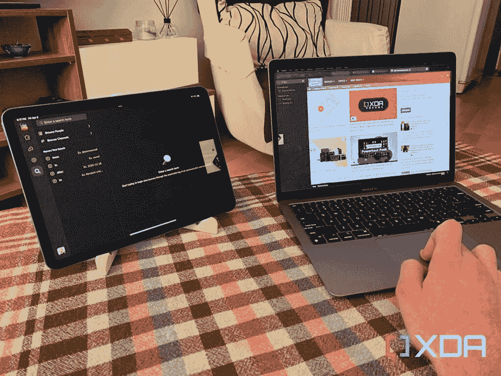

# 如何设置 MacBook Pro 13 (2022)以便在家工作

> 原文：<https://www.xda-developers.com/how-to-set-up-macbook-pro-13-2022-work-from-home/>

我们已经到了相当一部分人转而在家工作的地步。员工和雇主都意识到这种形式可以为公司省钱，提高生产力。苹果 [Mac 系列](https://www.xda-developers.com/best-macs/)提供了大量型号来满足大多数预算和需求。那些想要权力和可饮用性的人可以抓住一个 [MacBook Pro (2021)](https://www.xda-developers.com/macbook-pro-2021/) 。如果你觉得太贵，你可以[买一个翻新的单元](https://www.xda-developers.com/best-places-buy-refurb-macbook-pro/)，价格更实惠。或者，你可以满足于 MacBook Pro 13 (2022)。它将 M2 芯片封装在一个经典的机箱中，具有触摸条、无凹槽和有限的端口选项。如果你决定购买这台 MacBook Pro，你一定想知道如何设置它以便在家工作。我们在下面详细介绍了您需要遵循的基本步骤。

## 为在家工作设置 MacBook Pro 13 (2022)

### 在 MacBook Pro 上安装基本的工作应用程序

首先，你需要安装某些应用程序来启动你的工作流程。根据你工作的公司，你可能需要在 MacBook Pro 上安装某些生产力应用程序。其中可能包括 Slack、微软 Office、谷歌 Chrome、Asana、Zoom 等。你可能还想看看苹果芯片的最佳应用。这些应用专门针对不断扩展的 M 系列芯片进行了优化。因此，它们将在你的 M2 MacBook Pro (2022)上工作得最好。

### 设置聚焦模式

焦点模式允许你将某些应用程序和人列入黑名单/白名单，以避免在执行某项任务时被打断。你可以创建一个专注工作的模式，让生产力应用和同事通知你，并静音其余的。这样你就可以*集中精力*提高工作效率，减少分心。如果您不确定如何[设置对焦模式](https://www.xda-developers.com/focus-ios-15-macos-monterey/)，请查看我们链接的指南。

### 通过 docks 充分利用您的 MacBook Pro

MacBook Pro 13 (2022)只有两个 Thunderbolt 4 端口和一个耳机插孔。这意味着你需要依靠码头来充分利用 M2 芯片。许多人将有线配件作为工作流程的一部分。考虑到端口种类的缺乏，没有坞站的 MacBook Pro 对于工作来说太有限了。充电时，您只能连接一个 USB Type-C 配件。dock 扩展了这一点，让您可以进一步利用其处理能力。

### 使用通用控制或边车

 <picture></picture> 

Dragging a photo from Mac to iPad

如果您有兼容的 iPad，那么您可以将它用作 MacBook Pro 的无线外部显示器。这将使工作中的多任务处理变得毫不费力。只需将两个设备并排放置，就能看到奇迹发生。或者，你可以[使用通用控制](https://www.xda-developers.com/how-to-use-universal-control/)——它允许你通过 MacBook 的触控板和键盘来控制你的 iPad。您甚至可以在两台设备之间无缝地拖放内容。它确实让在 MacBook Pro 上工作变得更加容易。

### 将您的 iPhone 变成 MacBook Pro 的网络摄像头

如果你运行的是 macOS Ventura 和 iOS 16，那么你可以用 iPhone 作为 MacBook Pro 的网络摄像头。这台 Mac 有一个内置的 720p 摄像头，这不是最好的。通过使用 iPhone 的后置摄像头系统，你可以为 MacBook Pro 配备更先进的无线摄像头。[使用连续摄像机](https://www.xda-developers.com/how-to-use-continuity-camera-macos/)比你想象的要简单。它还支持 MacBook Pro 默认不具备的特效。这些包括特殊的灯光效果等等。

* * *

MacBook Pro 13 (2022)是在家工作的绝佳选择。你会得到一个专用的冷却系统(MacBook Air 上没有),这有助于避免过热，从而避免性能节流。更不用说它装有最新的苹果 M2 芯片——功能强大且节能。那些在工作时依赖 Touch Bar 的人听到苹果在这款机型上重新引入它会很兴奋。考虑到 2021 年更大、更高端的 MacBook Pro 型号放弃了它，我们预计该公司将在 13 英寸型号上效仿。

 <picture></picture> 

Apple MacBook Pro M2

##### 苹果 MacBook Air (2022)

2022 年的 MacBook Pro 13 英寸提供了经典的设计，重新引入了 Touch Bar，并封装了 M2 芯片。

*你还会采取哪些步骤来设置你的 MacBook Pro 以便在家工作？请在下面的评论区告诉我们。*