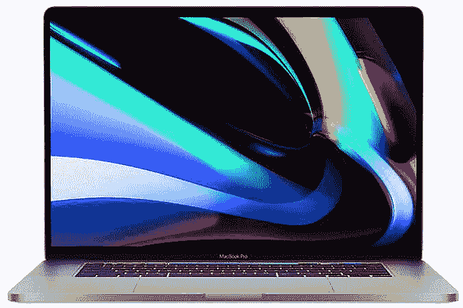

# 如何设置 MacBook Pro 13 (2022)

> 原文：<https://www.xda-developers.com/how-to-set-up-macbook-pro-13-2022/>

# 如何设置 MacBook Pro 13 (2022)

如何设置我的 MacBook Pro 13 (2022)？不要担心，我们为您准备了全面的指南，非常适合第一次使用。

更新的 MacBook Pro 13 (2022) 由[苹果公司的新 M2 芯片](https://www.xda-developers.com/apple-m2-launch/)驱动，但采用了 2016 年首次亮相的设计。与[苹果 Mac 产品线中的其他产品相比，MacBook Pro 13 提供了出色的性能和电池续航时间。](https://www.xda-developers.com/best-macs/)如果这是您第一次安装 Apple Mac 产品，请不要担心，我们会随时为您提供帮助。

## MacBook Pro 13 的设置和开机(2022)

*   首先，把你的笔记本电脑从盒子里拿出来，确保你有所有应该包括的东西:MacBook Pro 13 (2022)，67W USB-C 电源适配器和 USB-C 充电线(2 米)。

*   取出电源适配器，将 USB-C 电缆插入适配器上的母 USB-C 端口，然后将公端连接到 MacBook Pro 的 USB-C 端口。它应该看起来类似于上面的图像。不幸的是，USB 端口或电缆没有充电或状态指示灯，所以你只能相信它已经插上了。打开电脑后，您将能够检查充电状态。

*   打开 MacBook Pro 13 (2022)的盖子，找到右上角的电源按钮。这个按钮不仅可以在按下时打开电源，还可以用作触控 ID 按钮。
*   你准备好了，就按这个按钮。MacBook Pro 应该会发出“bong”的声音，表示电脑正在开机。

## 在 MacBook Pro 13 上设置操作系统和用户帐户(2022)

*   按下电源按钮几秒钟后，你应该会看到 macOS 的第一个屏幕——多语言闪屏，用多种语言显示“hello”。
*   然后，设置助理会向您问好，引导您完成每个步骤。
*   选择您的语言、地区以及您可能要使用的任何辅助功能选项。
*   使用 Wi-Fi 或替代选项连接到互联网，您也可以选择不连接。
*   为您的数据和隐私选项选择各种偏好。
*   “迁移助理”可以从较旧的 MAC 或 Windows PCs 传输数据。
*   如果您使用的是其他 Apple 产品，您可以选择输入您的 Apple ID。这将同步您的 Apple 设备。如果这是你的第一个 Apple 产品或者你没有 Apple ID，你可以创建一个。强烈建议您这样做，以便利用您可能需要下载的任何更新或应用程序。
*   同意条款和条件后，您可以设置您的姓名、帐户名称和帐户密码。

*   完成后，你将被要求设置触控 ID。触控 ID 将使用您的指纹来确保计算机安全，并且可以在大多数领域取代您的计算机密码。
*   如果您选择设置触控 ID，您可以将手指放在右上角的电源按钮上。它会多次要求你这样做——足够的次数，你的指纹被正确识别。(同样，这是一个可选步骤，您可以跳过——但强烈建议您这样做。)

*   完成上述步骤后，您将获得对 [macOS 的访问权限。](https://www.xda-developers.com/macos-ventura/)

MacBook Pro 13 (2022)现已发售，售价 1299 美元起。如果价格有点贵，你可以随时查看一些质量[翻新选项](https://www.xda-developers.com/best-places-buy-refurb-macbook-pro/)。那些寻找更大更强大的东西的人可能想看看 [MacBook Pro 14 和 MacBook Pro 16](https://www.xda-developers.com/macbook-pro-2021/) 。你可以在下面查看 MacBook Pro 13、MacBook Pro 14 和 MacBook Pro 16 的购买选项。

 <picture></picture> 

MacBook Pro 14-inch (2021)

##### 苹果 MacBook Pro 13 英寸(2022)

搭载苹果 M2 处理器的最新 MacBook Pro 13 英寸。

 <picture></picture> 

MacBook Pro 14-inch (2021)

##### 苹果 MacBook Pro 14 (2021)

配备苹果 M1 Pro 和 M1 Max 处理器的 14 英寸 MacBook Pro。

 <picture></picture> 

MacBook Pro 16-inch (Refurbished)

##### 苹果 MacBook Pro 16 英寸(2021)

配备苹果 M1 Pro 处理器的 16 英寸 MacBook Pro。