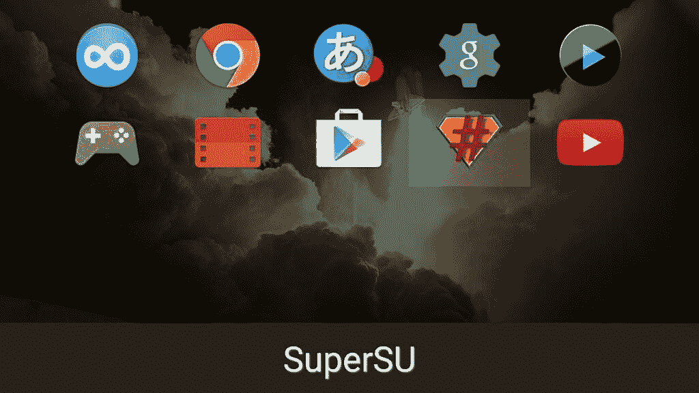
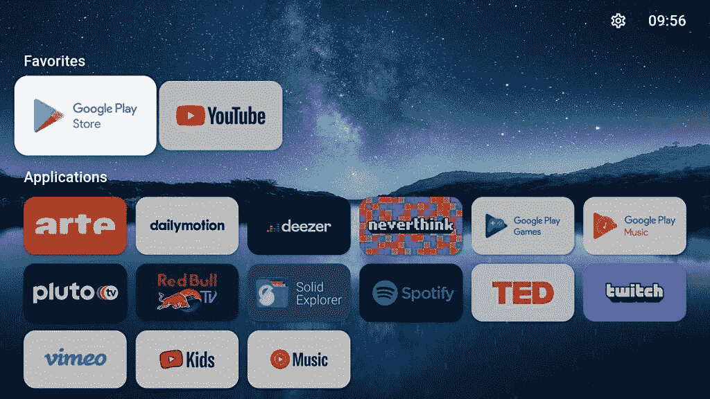

# 如何在安卓电视上侧装应用程序:APK 安装和亚行侧装方法解释

> 原文：<https://www.xda-developers.com/how-to-sideload-apps-android-tv/>

Android TV 可能并不完美，但它是市场上较好的智能电视平台之一。它让你可以访问许多应用程序和游戏，其中大部分都可以从谷歌 Play 商店下载。但有些安卓电视应用无法通过 Google Play 使用。幸运的是，就像[你可以把应用程序下载到安卓智能手机和平板电脑上](https://www.xda-developers.com/how-to-sideload-install-android-app-apk/)，你也可以把应用程序下载到安卓电视设备上。Android TV 上的侧装不像手机或平板电脑那样简单，但也不是很有挑战性。

如果你不确定如何在 Android TV 上下载应用程序，这篇文章将解释两种最好的方法。

重要提示:您应该只安装从可信来源下载的 apk 或应用程序捆绑包。

## 使用向电视发送文件从侧面加载应用程序

虽然你可以使用网络浏览器，如 [JioPages](https://play.google.com/store/apps/details?id=com.jio.web.androidtv) ，直接将 APK 文件下载到你的安卓电视上，但这很麻烦，除非你有键盘和鼠标连接到电视上。因此，最好将 APK 文件下载到你的安卓手机或电脑上，然后传输到你的安卓电视上。

最简单的方法之一就是使用[发送文件到电视(SFTTV)应用](https://play.google.com/store/apps/details?id=com.yablio.sendfilestotv)。它在 Google Play 商店上可用于安卓手机和安卓电视。

*   安装“将文件发送到电视”应用程序后，在手机和电视上打开它。
*   完成初始设置，包括授予应用程序访问设备存储的权限。
*   然后你只需要在你的 Android 设备上点击*发送*。
*   该应用程序将要求您选择一个文件发送到您的电视。选择文件，点击列表中的 Android 电视。应用程序文件现在将无缝传输到您的 Android 电视。
*   “将文件发送到电视”应用程序会将传输的文件保存在电视的“下载”文件夹中。您现在可以在“将文件发送到电视”应用程序中打开 APK 进行安装。
*   由于这是你第一次使用“将文件发送到电视”应用安装 APK，你必须允许该应用安装来自未知来源的应用。按照屏幕上的指示给予许可。或者，您可以导航到**设置>设备首选项>安全性&限制>未知来源**并启用将文件发送到电视切换。如果你有一个旧版本的 Android 电视，可能会有一个单一的选项，允许安装未知来源的应用程序。
*   获得许可后，再次点击 APK 文件进行安装。根据应用程序的大小，可能需要几秒钟的时间才能完成应用程序的安装。

如果你试图安装一个应用程序包，你需要在电视上使用类似于 [APKMirror 安装程序](https://play.google.com/store/apps/details?id=com.apkmirror.helper.prod)的应用程序来安装它。APKMirror 安装程序允许您安装。apkm，。xapk 还有。apks 应用程序捆绑文件。

虽然将文件发送到电视是一种快速简便的方式来发送 APK 文件以安装在您的 Android 电视上，但您也可以使用像 [X-plore 文件管理器](https://play.google.com/store/apps/details?id=com.lonelycatgames.Xplore)这样的应用程序，它带有内置的 Wi-Fi 文件共享功能，可以将文件从您的 Android 手机共享到您的 Android 电视。然而，该过程的其余部分保持不变。

你也可以使用云存储服务，如 Google Drive、Dropbox 或 OneDrive，从你的 PC 或智能手机上传 APK 文件，然后使用支持云存储服务的文件管理器下载它们。

* * *

## 使用 ADB 在 Android 电视上下载应用程序

如果你习惯命令行，ADB 是在你的 Android 电视上下载应用程序的最简单的方法之一。只要你在 PC 或 Mac 上安装了 ADB，你就不需要额外的软件来将应用程序下载到你的 Android 电视上。

*   如果你还没有在你的 PC 或 Mac 上安装 ADB，现在就跟随我们的讲解者[如何安装 ADB](https://www.xda-developers.com/install-adb-windows-macos-linux/) 去做吧。
*   在你的安卓电视上点击*设置*来启用 *USB 调试*。
*   为此，你必须首先激活*开发者选项*。你可以点击*内部版本号*七次或更多次，直到你看到*你现在是一个开发者*的提示。

*   导航到**设置>设备首选项>开发者选项**并启用 *USB 调试*。

*   你现在已经设置好侧装应用程序了。我们将使用 ADB 无线，因此您不需要 USB 电缆来连接您的 Android 电视。只要你的安卓电视和电脑在同一个无线网络上，你就可以使用了。

*   现在你必须找到你的安卓电视的 IP 地址。要做到这一点，前往**设置>网络&互联网**并点击活动的 Wi-Fi 连接(或以太网，如果你正在使用)，你会看到一个 IP 地址。请记下此 IP，因为我们将使用它在您的电视上无线运行 ADB。
*   在 PC 或 Mac 上打开命令行，运行“ADB connect”(不带引号)，然后输入您在电视上记下的 IP 地址。例如:*亚行 connect 192.168.1.1:5555* 。
*   如果这是你第一次连接，你的安卓电视会要求你允许从电脑上进行 USB 调试。您可以从这台计算机中选择*始终允许*以方便将来的操作。
*   授权后，当你运行“ADB 设备”命令时，你的 Android 电视将开始显示。

*   现在，使用“ADB install”命令，后跟 APK 文件名。您可能需要包含完整路径，这取决于 APK 文件的保存位置。例:*亚行安装 com.github.android.apk*
*   如果您尝试安装应用程序捆绑包，请使用归档实用程序从 PC 或 Mac 上的捆绑包中提取 apk。该包可以包括基本 APK 和用于不同应用程序二进制接口(ABI)、语言和屏幕 dpi 的各种资源 apk。然后，您必须根据 ABI 和 DPI 数据，从提取的 apk 中为您的电视选择正确的 apk。如果你没有选择正确的 apk，你会得到一个错误，正如你在下面的截图中看到的。确保将提取的 APK 文件放在平台工具或 ADB 文件夹中，以便于访问。如果需要，您也可以重命名它们。或者，如果您设置了 ADB 路径/别名，您也可以在包含提取的 apk 的文件夹中直接运行 ADB。

*   然后使用“adb install-multiple”命令，后跟 APK 文件名。例:*ADB install-multiple base . apk split _ config . armea bi _ v7a . apk split _ config . tvdpi . apk*

根据文件大小，该命令将需要几秒钟时间，并将应用程序安装到您的 Android 电视上。

* * *

## 安卓电视应用抽屉里没有显示侧装应用？

 <picture></picture> 

Sideload Launcher

有时候，在你的电视上侧装了一个 Android 应用程序后，你会注意到它的图标没有出现在应用程序抽屉里。这是因为 Android TV 要求应用程序具有向后倾斜图标，以便与电视的向后倾斜启动器配合使用，如果你安装了为手机和平板电脑制作的应用程序，它就不会有向后倾斜图标。所以你可以使用一个像[侧载发射器](https://play.google.com/store/apps/details?id=eu.chainfire.tv.sideloadlauncher)这样的应用程序来查看侧载的应用程序。或者，导航到设置，应用程序，你可以选择任何应用程序，并从那里启动它。

 <picture></picture> 

FLauncher

除了侧装发射器，你还可以试试[发射器](https://play.google.com/store/apps/details?id=me.efesser.flauncher)。这是一个开源的启动器，可以直接从 Android 电视上的 Google Play 商店下载。然而，由于这是一项正在进行的工作，您可能会注意到偶尔的错误。

在功能方面，FLauncher 有可定制的类别，订购应用程序的能力，壁纸支持等等。此外，在启动器中没有干净体验的广告。

另一种看起来很有前途但也在开发中的侧装发射器是开发商尼尔斯·范维尔森的电视发射器。不幸的是，它还不能下载，但是你可以在 Github 上监控[的进度。](https://github.com/nielsvanvelzen/tv-launcher)

* * *

这是在 Android 电视上下载应用程序的两种最简单的方法。然而，如果你安装的应用程序主要是为手机或平板电脑设计的，你可能无法在电视上获得最佳体验。此外，一些应用程序可能根本无法工作，或者你最终会遇到方向问题。