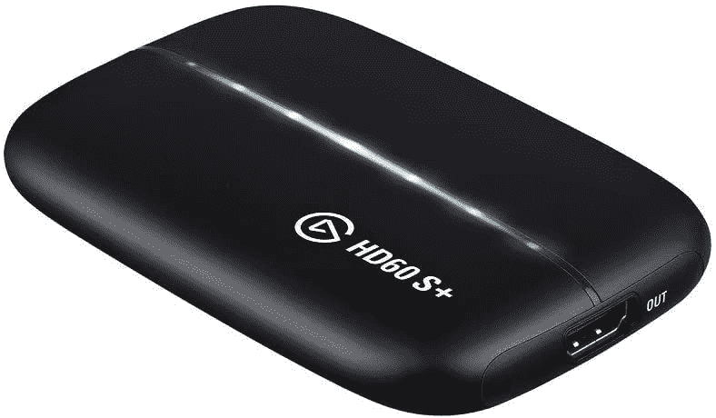

# 如何从您的 Windows PC 上流式播放 Twitch

> 原文：<https://www.xda-developers.com/how-to-stream-on-twitch/>

直播是互联网上最受欢迎的娱乐形式之一，它已经发展成为一个相当大的市场。由于它如此受欢迎，我们中的许多人(包括我自己)都感受到了进入流媒体的诱惑，即使我们不打算专业地做这件事。开始可能感觉是一项艰巨的任务，但它并不像听起来那么糟糕。如果你正在努力，我们将向你展示如何使用 Windows PC 在 Twitch 上进行流媒体播放。

还有其他直播平台，但 Twitch 是目前最受欢迎的，所以这是我们关注的重点。一般来说，相同的原则将适用于您想要使用的任何平台，尽管当然会有一些差异。让我们开始吧。

## 你需要什么

在您开始学习更技术性的内容之前，您可能需要先检查一些先决条件和建议。以下是你可能需要的一些东西:

*   Twitch 账户
*   第二台显示器(可选)
*   捕捉卡(用于主机游戏)
*   功能强大的个人电脑

首先，你需要创建一个 Twitch 账户，如果你还没有的话。只需进入 [Twitch 主页](https://www.twitch.tv)，点击右上角的注册，输入你的详细信息。公平的警告:Twitch 对你选择的密码非常挑剔。你需要把它变得又长又复杂才能被接受。

虽然这并不是*绝对*必须的，但你会希望你的系统至少有两个显示器。更先进的流媒体工具可能会有更多，但两个屏幕几乎是最起码的，所以你可以在一个屏幕上显示你的流管理界面，而在另一个屏幕上显示你正在播放或做的任何事情。当然，如果你只是聊天，而不是分享你的屏幕，这是不必要的。如果你需要第二块屏幕，我们有一份你现在就能买到的[最佳显示器](https://www.xda-developers.com/best-monitors/)的综述，或者看看我们下面列出的三星 Odyssey G7。

根据你要做的事情，捕捉卡可能也会派上用场。如果您想要流式传输主机游戏，以便可以将您的主机连接到 PC，这是非常重要的，因此如果这不是您的用例，这不是一个问题。我们有一个 Xbox 系列 X|S 的[最佳采集卡](https://www.xda-developers.com/best-capture-cards-xbox-series-x-s/)列表，尽管它们也应该适用于其他游戏机。我个人拥有 Razer Ripsaw HD，但 Elgato HD 60 s+通常被认为更方便用户，所以我们建议这样做。

*   ##### 三星奥德赛 G7

    三星奥德赛 G7 是你能买到的最好的游戏显示器之一，具有四核高清分辨率和 240Hz 刷新率。

*   <picture></picture>

    埃尔加托 HD60 S+

    ##### 埃尔加托 HD60 S+

    埃尔加托 HD60 S+可以捕获高达 1080p 分辨率和 60 fps 的视频，还可以通过 4K 60fps 游戏传输到您的显示器，让您可以以原始状态享受您的游戏

最后，你需要一台相当强大的电脑。流媒体直播是一项要求颇高的工作，如果你打算流媒体播放你的电脑游戏，你绝对需要一台功能强大的电脑。这里的一个好主意是查看我们的[最佳内容创作者笔记本电脑列表](https://www.xda-developers.com/best-creator-laptops/)，因为它们通常最适合这类事情。然而，如果你正在流式传输一个主机游戏并使用一个捕捉卡，你不需要为基本的流式传输设置做任何疯狂的事情。

说完这些，让我们来看看如何从你的 Windows 电脑上开始向 Twitch 传输流媒体。

## 如何将 Twitch Studio 设置为从您的电脑进行流式传输

对于本指南，我们将使用官方的 Twitch Studio 应用程序进行流式传输，因为它是官方的 Twitch 应用程序，并且它与这项服务配合得最好。这应该是最简单的方法，但还有许多其他流媒体应用程序，如 OBS Studio、Streamlabs OBS 等，你可以使用其中的任何一种。

1.  要下载 Twitch Studio，只需[进入此页面](https://www.twitch.tv/broadcast/studio)并点击**下载 Twitch Studio** 按钮。
2.  运行安装程序，点击**安装按钮**。
3.  安装完成后，Twitch Studio 将启动，并提示您登录您的帐户。如果您已经在 web 浏览器上登录，将会自动检测到您的帐户。
4.  设置过程将要求您选择一个用于流式传输的麦克风，因此您可以选择您喜欢的任何设置，或者保留默认设置(如果您认为合适的话)。然后你会看到三个不同的视频场景。
5.  在设置过程中，将根据您的电脑性能和互联网速度进行测试，以确定您应该能够以何种质量进行流化。Twitch 建议我们在这种情况下以 720p 的分辨率和每秒 60 帧的速度传输。但是，如果您认为应该以不同的分辨率为目标，您可以手动调整流设置。
6.  一旦你点击完成设置过程，你将到达你的流媒体工作室界面。这里发生了很多事情，所以这里有一些你需要注意的事情:
    *   **场景** -在界面左侧你会看到一个包含三个场景的列表。这些是不同的视图，您可以选择在流式播放时向观众展示。例如，默认的游戏场景会在左下角的一个小窗口中显示一个大背景和你的网络摄像头。您可以自定义现有场景的外观或添加新的场景，并且在流期间，您可以在它们之间动态切换。
    *   **流预览** -在屏幕中央，你会看到一个当前场景下你的流的大预览。这是你的观众将会看到的。
    *   **活动提要** -这向你显示任何与你的 Twitch 追随者或订户相关的活动。
    *   **我的聊天** -这向你展示了你的实时聊天流，所以你可以看到你的观众在实时说什么。
    *   **流设置** -在底部，你会看到一个小栏，上面有一系列按钮和指示器。这允许您关闭网络摄像头、查看音量、将麦克风和扬声器静音等等。最重要的是，你有按钮来开始流媒体，编辑你的场景，或者静音你的麦克风或输出音频。
    *   **流信息** -如果你以前流过，你还会在右上角看到你当前流的信息。

这是对所有事情的一个相当简短的解释，从技术上来说，你已经准备好开始流式传输了，但还有一些事情我们应该谈谈。

## 如何更改您在流中显示的内容(编辑场景)

正如我们上面提到的，默认情况下，游戏场景会向你展示一个静态的背景，这不是你想要的游戏场景。这是因为 Twitch Studio 被设置为从游戏中捕捉游戏性，如果没有游戏运行，该源将为空，您将看到您的背景。要了解更多信息，请在游戏场景激活时点击底部的**编辑场景**按钮。

在此视图中，您将看到所有视频层或源，它们是此场景的一部分。默认情况下，你会看到你的网络摄像头，聊天，提醒，以及所谓的游戏捕捉。这种来源的工作方式是，如果你有一个全屏游戏在你的电脑上运行；它由 Twitch Studio 自动检测并在流上显示。这就是为什么当你第一次启动它时，它看起来是静态的，但你可以在你的第二个屏幕上启动一个游戏，看看这是否有效。

但是如果你不想在你的电脑上运行游戏，或者如果你正在运行的游戏没有被 Twitch 检测到，你可以添加一个新的视频层。

### 添加视频层

点击**添加图层**按钮，你会看到这个提示，询问你想添加哪种图层。如果你想显示在你的电脑上运行的游戏或应用程序，你需要在这里选择**屏幕共享**，这就是我们在这里要做的。

添加屏幕共享源后，您可以更改想要进行的屏幕共享类型。在窗口的右侧，您会在**屏幕共享源**下看到它被设置为共享全屏应用程序。点击**更改**按钮，然后选择您想要流式传输的特定应用程序窗口(该应用程序需要正在运行才能在此处显示)，或者您可以选择流式传输您的一个显示器。在这里，你会想要选择你的游戏运行的显示器，它应该不同于你有 Twitch Studio 的显示器。如果您连接了捕获卡，它也会显示在这里，您也可以选择它。如果一开始不工作，请确保您的控制台已打开并连接，然后单击**刷新设备**进行修复。

如果您使用了捕获卡，但在添加后发现它不可见。如果是这种情况，选择您的采集卡所在的层，并在右上角的**大小和位置**下更改分辨率。你可以删除一个号码，然后重新输入，视频就会正常显示。

之后，您可能会注意到您的网络摄像头不再可见。视频层的顺序很重要，因为屏幕共享高于所有其他来源，它将是唯一可见的东西。在左侧菜单中，将新的屏幕共享层拖动到网络摄像头和任何您希望在流中可见的内容下方，您将立即看到它的反射效果。

请注意，您也可以编辑现有的游戏捕获层，以将源更改为另一个屏幕或捕获卡。点击窗口右侧的**编辑**按钮，然后**更改**为该层选择一个新源。

完成这些后，你可以保存你的场景并返回主窗口。

### 更改您的音频源和音量

你可能想做的另一件事是改变你的音频流的音量和来源。在 Twitch Studio 的主视图中，底部有一个带有流设置的栏，包括一些音频级别。这里还有混音器按钮，从左边数第二个按钮。点击它，你会看到你的麦克风，以及其他音频源连接到你的电脑的音量。

默认情况下，您的所有信号源都将被设定为相同的音量，但您可以根据需要将它们静音或调整音量。如果您想要新的音频源，例如来自特定应用程序或输入设备的声音，您也可以单击**添加音频**。这也让您可以在需要时将某些效果应用到音频源。

当您添加音频源时，它会被添加到主流界面上的混音器中，因此您可以更轻松地更改音量。

## 如何在 Twitch Studio 上开始一个流

现在您已经准备好了所有的源，您可以开始流式传输了。点击窗口底部的**开始流**，系统会提示您选择流设置。您可以在开始之前更改主要视频源和场景，还可以更改您的流信息和“直播”通知。

您需要为您的流输入一个标题并选择一个类别。如果你正在玩一个游戏，类别应该是你正在玩的游戏的名字，这样人们就可以更容易地找到你。某些类别还会自动向您的流中添加标签。最后，你可以改变你输入的语言，这样你就可以瞄准正确的受众。

最后，您可以在上线时更改发送给您的关注者的通知。一旦这些都完成了，点击**上线**你的流就开始了。这将是显而易见的到你的抽搐个人资料。

* * *

这就是开始使用流媒体所需了解的全部内容。我们没有深入到所有可用的设置，但这给了你一个坚实的想法，你需要知道的一切来管理你的资源和场景。正如我们所说的，您可以使用许多其他流媒体工具，尽管 UI 会有很大变化，但基本概念都适用，如添加和编辑源、更改音量等。Twitch Studio 是初学者的理想选择，但其他工具也有更高级的选项。