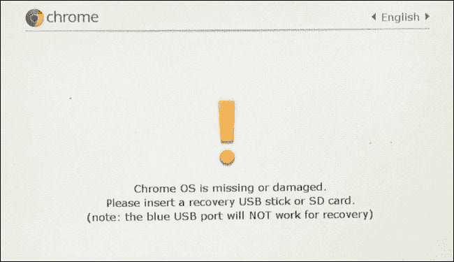
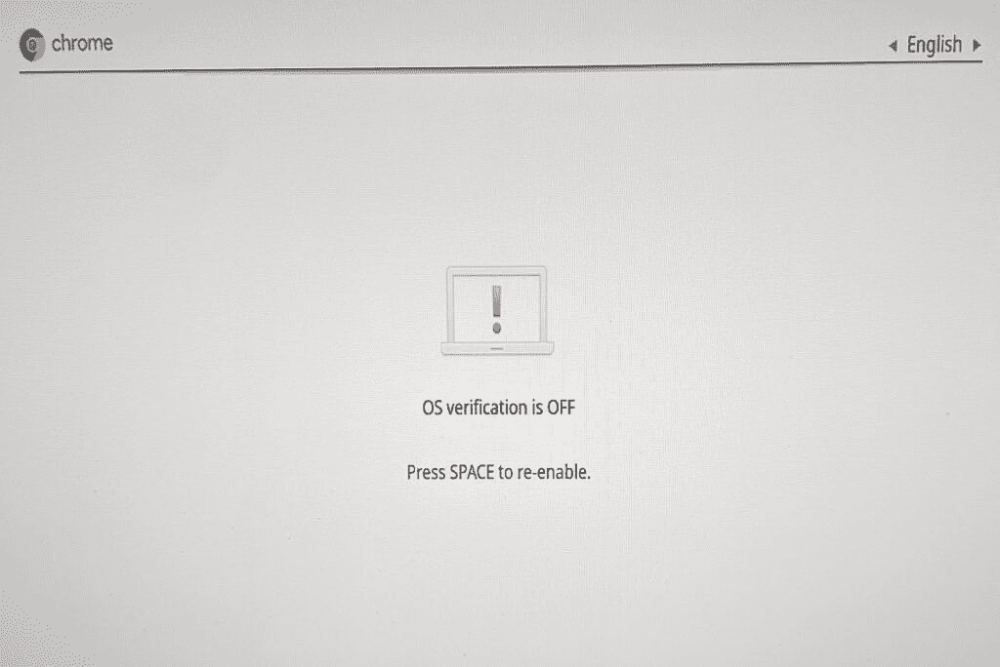

# 如何在 Chromebook 上打开 ChromeOS 开发者模式

> 原文：<https://www.xda-developers.com/how-to-turn-on-chrome-os-developer-mode/>

Chromebooks 是非常强大的设备。尽管许多用户选择 Chromebook 是因为简单的基于浏览器的体验，但你还可以做得更多。有许多方法可以释放 ChromeOS 的全部功能，例如加入测试或开发频道或启用 Chrome 标志。你也可以通过启用开发者模式来改善你的 ChromeOS 体验。

对于那些熟悉 Android 手机的人来说，开发者模式类似于在移动设备上启用 root 访问。它允许你启用标准 [ChromeOS 设置](https://www.xda-developers.com/chrome-os-settings-guide/)中没有的功能。例如，你可以使用开发者模式在 Chromebook 上安装全新的操作系统。也许开发者模式最受欢迎的用途是侧装 Android 应用程序。在像 [APK 镜报](https://www.apkmirror.com/)这样的网站上有许多 APK 不能用于谷歌 Play 商店的 ChromeOS 设备。

在我们开始之前，请记住开发人员模式是为开发人员设计的。您可以使用此附加访问权限以多种方式修改您的设备。使用开发人员模式也有一些缺点，我们将在本文的最后讨论。

## 如何在 ChromeOS 中启用开发者模式

您需要知道的第一件事是，打开开发人员模式会清除您的登录信息和任何本地存储的数据。所以在你做任何事情之前，**备份所有你想保留的数据**。如果你全职使用 ChromeOS，你可以将所有东西备份到你喜欢的云存储服务中。

现在你已经做到了，下面是如何进入开发者模式:

1.  打开你的 Chromebook。
2.  同时按住 **Esc 键**、**刷新键**和**电源按钮**。
3.  显示“ChromeOS 丢失或损坏。请插入 u 盘”会弹出来。现在，同时按住 **Ctrl** 和 **D** 键。
4.  按**进入**(出现提示时)。
5.  等待设备重新启动，并完成 Chromebook 的设置过程。
6.  您将看到一个屏幕，显示操作系统验证已关闭。现在你每次开机都会看到这个屏幕。
7.  按下 **Ctrl** 和 **D** 成功重启。

现在你已经在 Chromebook 上设置好了开发者模式。有了这种新功能，你可以选择安装不同的 [Linux 发行版](https://www.xda-developers.com/linux-apps-chrome-os/)，侧装尽可能多的 Android APKs，并用你的 Chromebook 进行大量新的冒险。如果你真的想做一些基于 Chrome 的开发，你也可以用它来访问开发者外壳。

## 开发者模式的缺点和风险

正如所有的修补和修改一样，在 ChromeOS 中启用开发者模式有一些缺点和潜在的风险。以下是一直保持开发人员模式的一些潜在问题:

*   **安全问题:** ChromeOS 是一个相当安全的操作系统，具有沙盒结构。然而，当您运行开发人员模式时，所有这些都将不复存在。你将无法获得 Chromebook 通常提供的所有保护。如果你是一个超级用户，并正确使用设备，这不是一个大问题，但对于普通用户来说，这可能有风险。
*   **保修问题:**由于开发者模式没有得到大多数原始设备制造商或谷歌的官方认可或支持，您可以通过启用它来取消 Chromebook 的保修。功能更强大的 Chromebooks 通常不会出现这种情况(OEM 厂商认为开发者在实践中可能会使用这种情况)，但低端机型可能会出现这种情况。
*   **数据擦除:**每次在 ChromeOS 中启用(或禁用)开发者模式时，都必须彻底擦除数据。可以想象，如果您只是想在开发人员模式中来回切换，这可能会很不方便。
*   **警告屏幕:**当使用开发者模式时，你总是会在启动你的设备时得到一个警告屏幕。这减缓了大多数 ChromeOS 设备相当令人印象深刻的启动速度，这首先是对一些人的主要吸引力。

## 如何关闭开发者模式

那么如果你启用了开发者模式，并且不喜欢它呢？好消息是禁用开发者模式也很简单。坏消息是，您需要再次擦除数据。**确保再次备份数据**。接下来，按照以下步骤操作:

1.  打开 Chromebook，或者重启它(如果它已经打开)。
2.  当显示“操作系统验证关闭”的屏幕时，按下**空格键。**
3.  这将执行工厂数据重置，并将笔记本电脑清除干净。
4.  再次执行 **Chromebook 设置过程**。

如您所见，启用和禁用开发人员模式非常简单。如果您想测试开发人员模式，请确保您完全了解固有的安全风险，并备份您所有的个人数据。开发者模式可以为你的 Chromebook 或 Chromebox 增加一层令人兴奋的额外功能——只要确保你小心使用它。