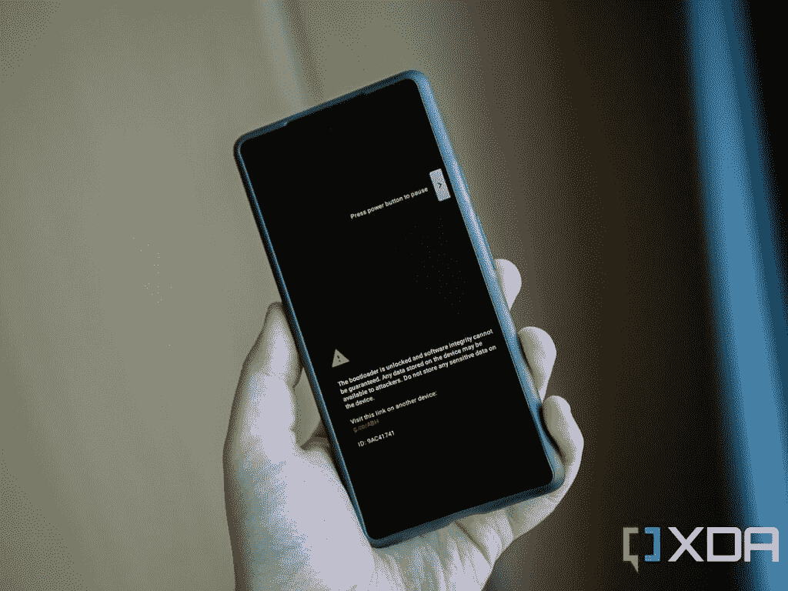

# 如何解锁 bootloader 并用 Magisk root 谷歌 Pixel 6a

> 原文：<https://www.xda-developers.com/how-to-unlock-bootloader-root-magisk-google-pixel-6a/>

距离谷歌发布中端产品 Pixel 6a T1 已经过去了几周时间，相比之前的 Pixel-A 系列手机，它进行了几项显著的升级。除了 Android 13 测试版的可用性，Pixel 6a 的工厂图像和内核源代码也已经公布，这正是改装爱好者开始摆弄设备的正确成分。

我们开始看到越来越多的人开始使用谷歌 Pixel 6a，所以对于那些在[寻找帮助的人来说，这里有一个简单的分步指南。本指南将带您了解如何解锁 Pixel 6a 的引导程序，并使用 Magisk 获得手机的 root 访问权限。TWRP，最受欢迎的自定义恢复，将需要一些时间来移植到最新的像素，因此目前的根方法比你可能习惯的要复杂一些。](https://www.xda-developers.com/root/)

**谷歌 Pixel 6a XDA 论坛 **

*   你可以用 Magisk 修补 Google Pixel 6a 的启动映像，让它成为 root 用户。
*   要刷新打了补丁的引导映像，您必须解锁 Pixel 6a 的引导加载程序。
*   解锁引导加载程序将擦除你的像素 6a。

**浏览本文:**

* * *

* * *

## 如何 root 谷歌 Pixel 6a

在我们开始研究如何确定你的像素 6a 的根之前，你需要做一些事情。首先，你需要备份手机上的所有数据。这是因为**root 需要擦除手机上的所有数据，这不仅包括已安装的应用程序，还包括保存到内部存储的所有文件。**

您还需要确保您的 PC 上有大约 5GB 的可用存储空间，因为您需要为您的手机下载出厂映像。完成后，您可以删除这些文件来释放空间。尽管如此，保存最新的工厂映像是一个好主意，以防您在 root 后的冒险中遇到任何问题，需要恢复库存。

值得注意的是，这些步骤**可能不适用于谷歌 Pixel 6a** 的美国运营商型号。例如，威瑞森喜欢完全阻止引导加载程序解锁，这样就不可能对你的手机进行 root。不过，有时人们会找到非官方的变通办法，如果找到了，我们会让你知道。

### 步骤 1–获取 Pixel 6a 的库存引导映像

在我们可以根，我们需要得到我们的手股票启动图像匹配目前的软件建设的手机正在运行。我们将用 Magisk 修补这个启动映像。

要获得启动映像，您需要从 Pixel 6a 工厂映像中提取它，该文件包含进行完全恢复所需的所有手机映像。为了确保你下载了正确的出厂映像，你需要检查你的手机当前运行的是哪个软件版本。要对此进行检查，请前往**设置** > **关于手机**。在底部，寻找**建造编号**部分。在工厂映像下载页面上找到匹配的内部版本号，并下载该文件。

**[为谷歌 Pixel 手机下载 Android 12](https://www.xda-developers.com/how-to-download-android-12/)| |[为谷歌 Pixel 手机下载 Android 13](https://www.xda-developers.com/how-to-download-android-13/)**

接下来，提取工厂图像 ZIP 文件。找到图像-blue Jay-[版本]。zip 文件(是的，在 ZIP 中有一个 ZIP)并从中提取 boot.img 文件。这是股票启动图像，你需要把它转移到你的手机的存储。

### 步骤 2–使用 Magisk 修补普通引导映像

有了手机上的启动镜像文件，接下来你需要下载并安装最新的 Magisk 应用程序。事实上，你可以在 Pixel 6a 以外的其他 Android 设备上安装它，但你也需要在辅助设备上安装 Magisk 应用程序。

**[下载 Magisk](https://github.com/topjohnwu/Magisk/releases/latest)**

在 Magisk 应用程序中，您需要点击最顶层卡上的**安装**按钮。选择**选择**方法**下的一个文件**，选择股票引导镜像。这将打开 Android 文件选择器。继续前进，找到你从你的电脑传输的 boot.img 并选择它。Magisk 应用程序会将图像修补到手机的下载文件夹中。您必须传输这个修补的文件(应该命名为“magisk _ patched _[random _ strings])。img ")回到您的 PC，因为接下来，我们将解锁引导加载程序，这将清除所有数据，就像我们之前警告的那样。

值得注意的是，如果你浏览 Pixel 6a 的 XDA 论坛，你可能会幸运地找到一个预先打好补丁的启动映像。这可能会省去您执行步骤 1 和 2 的麻烦，但请确保您下载的任何 Magisk 修补的启动映像都与您的软件构建版本相匹配，否则您将在刷新后面临几个异常。这也是为什么我们一直建议自己抢官方固件，自己打股票开机镜像补丁。

### 步骤 3–启用 OEM 解锁并解锁引导加载程序

为了在 Pixel 6a 上刷新第三方软件，我们必须解锁 bootloader。为此，进入**设置** > **关于手机** > **内部版本号**并点击该条目 7 次以启用**开发者选项**。启用后，返回主设置页面并点击**系统**，然后转到**开发者选项**。从那里，切换 **OEM 解锁**选项。请记住，您需要输入密码/模式/PIN 来验证某些操作。

启用 OEM 解锁后，关闭手机。按住音量键和电源键来打开你的手机并进入引导菜单。假设您已经安装了最新的 [ADB 和 Fastboot 二进制文件](https://www.xda-developers.com/install-adb-windows-macos-linux/)，您也可以使用下面的命令直接从 Android 重启到 bootloader 模式。

```
 adb reboot bootloader 
```

请确保您的手机连接到 PC/Mac/Chromebook。接下来，在终端窗口中，键入:

```
 fastboot flashing unlock 
```

您将看到一个屏幕，告诉您即将启动引导加载程序解锁过程。使用音量按钮导航，使用电源按钮接受。**同样，这将清除您手机上的所有数据，因此请确保您在继续操作之前备份了数据**。

 <picture></picture> 

You'll see the warning every time you boot your phone after unlocking the bootloader

### 步骤 4–刷新 Magisk 修补的启动映像

在你的 Pixel 6a 的 bootloader 解锁，你的引导镜像打好补丁之后，你离 root 就一步之遥了。

一旦引导加载程序解锁过程完成，手机将在几分钟后启动。在此阶段跳过设置向导并关闭手机。您现在想要通过再次按住音量和电源按钮来引导回引导加载程序。到达后，将手机连接到 PC/Mac/Chromebook 并执行以下命令:

```
 fastboot flash boot path/to/magisk_patched.img 
```

一旦你按下回车键，补丁启动图像将被刷新到你的手机。接下来，使用`fastboot reboot`重启，Magisk 应用应该会出现在你的主屏幕和/或应用抽屉中。如果没有(例如，您只能看到一个存根图标)，只需手动安装 Magisk APK。这是所有需要根你的像素 6a。

请记住，每次更新手机时，您都必须重复步骤 1、2 和 4，因为每次更新时启动映像都会发生变化。

* * *

## 下一步是什么？

如果你正在寻找与你的新根 Pixel 6a 有关的事情，看看我们的最佳根应用精选列表[。一旦您的设备启动并运行 Magisk，您还可以试用一些](https://www.xda-developers.com/best-android-root-apps/)[最佳 Magisk 模块](https://www.xda-developers.com/best-magisk-modules/)来无缝应用复杂的 mod，而无需接触底层系统。

 <picture></picture> 

Google Pixel 6a

谷歌 Pixel 6a 是一款配备谷歌张量和高端摄像头的中档智能手机。