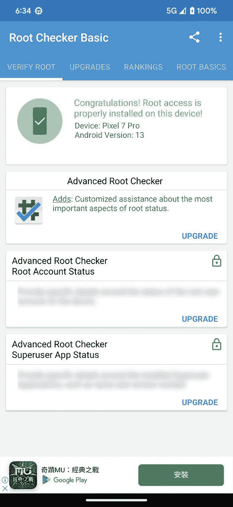

# 如何用 Magisk 谷歌 Pixel 7 或 Pixel 7 Pro

> 原文：<https://www.xda-developers.com/how-to-unlock-bootloader-root-magisk-google-pixel-7-pro/>

有些人无法想象在没有 [root 权限](https://www.xda-developers.com/root/)的情况下使用 Android。虽然谷歌 Pixel 智能手机是最容易解锁引导程序、root 和安装售后软件的设备之一，但令人惊讶的是，典型的引导映像补丁技术不再适用于最新的 Pixel 7 系列。

如果你购买了 [Pixel 7](https://www.xda-developers.com/google-pixel-7-review/) 或 [Pixel 7 Pro](https://www.xda-developers.com/google-pixel-7-pro-camera-review/) 并想学习如何去 root 它，我们将在本教程中告诉你如何去做。你需要把你的电脑放在手边，并且熟悉亚洲开发银行。

**[谷歌 Pixel 7 XDA 论坛](https://forum.xda-developers.com/f/google-pixel-7.12607/) || [谷歌 Pixel 7 Pro XDA 论坛](https://forum.xda-developers.com/f/google-pixel-7-pro.12609/)**

*   你需要一个解锁的引导程序来启动谷歌 Pixel 7 或 7 Pro。
*   解锁引导加载程序将擦除您的 Pixel 7/7 Pro。
*   您必须用 Magisk 修补 init_boot 映像，而不是启动映像，以便进行根访问。

**浏览本文:**

* * *

## 如何 root 谷歌 Pixel 7 和 7 Pro

在我们开始研究如何确定 Pixel 7 的根之前，记得[做一个设备外备份](https://www.xda-developers.com/how-to-backup-android/)。那是因为寻根过程**需要擦除手机上的所有数据，包括内部存储的文件**。

### 步骤 1–获取 Pixel 7/7 Pro 的库存 init_boot 映像

对于像 Pixel 7 系列这样使用 Android 13 的设备，一般的内存磁盘会从启动映像中删除，并放在一个名为“init_boot”的单独位置。boot.img 只保存[通用内核映像](https://source.android.com/docs/core/architecture/bootloader/partitions/generic-boot) (GKI)。

因此，为 root 访问修补 boot.img 对这些设备不起作用。相反，我们需要得到与 init_boot 分区相对应的映像，它与手机当前运行的软件版本相匹配。

幸运的是，我们不需要任何专门的工具来从目标设备中抓取 init_boot 映像。它可以很容易地从谷歌公布的 Pixel 7/7 Pro 的工厂图像中提取出来。

为了确保你下载了正确的出厂映像，你需要检查你的手机当前运行的是哪个软件版本。要检查这一点，进入**设置** > **关于手机**。在底部，寻找**内部版本号**部分。在工厂映像下载页面上找到匹配的内部版本号，并下载该文件。

**[为谷歌 Pixel 手机下载 Android 13](https://www.xda-developers.com/how-to-download-android-13/)**

接下来，解压缩工厂图像 ZIP 文件。找到图像-[设备代码]-[版本]。zip 文件(是的，在 ZIP 中有一个 ZIP)并从中提取 init_boot.img 文件。这是您需要传输到手机内部存储器进行修补的文件。

### 步骤 2–使用 Magisk 修补股票 init_boot 映像

现在我们已经有了 init_boot 映像，我们可以很容易地用 Magisk 修补它。事实上，你可以在 Pixel 7 以外的其他 Android 设备上安装它，但你也需要在辅助设备上安装 Magisk 应用程序。

虽然 Magisk 的当前稳定版本可以修补 Pixel 7 的 init_boot 映像，但您可能希望选择 Magisk 的出血边缘金丝雀版本进行更多修复。

**下载 Magisk: [稳定](https://github.com/topjohnwu/Magisk/releases/latest) || [金丝雀](https://raw.githubusercontent.com/topjohnwu/magisk-files/canary/app-release.apk)**

安装 Magisk APK 后，打开应用程序，找到最顶层卡上的**安装**按钮。选择**选择并修补**方法**下的一个文件**，选择 stock init_boot 镜像。这将打开 Android 文件选择器。继续，找到您从 PC 上传输的 init_boot.img 并选择它。Magisk 应用程序会将图像修补到手机的下载文件夹中。您必须传输这个修补的文件(应该命名为“magisk _ patched _[random _ strings])。img ")回到您的 PC，因为接下来，我们将解锁引导加载程序，这将清除所有数据，就像我们之前警告的那样。

值得注意的是，如果你浏览 Pixel 7 或 7 Pro 的 XDA 论坛，你可能会幸运地找到一个预打补丁的 init_boot 映像。既然如此，我们总是建议你自己获取官方固件并修补股票引导映像，以避免由于映像版本不匹配而导致的不可预见的故障。

### 步骤 3–启用 OEM 解锁并解锁引导加载程序

为了在 Pixel 7 上刷新第三方软件，我们必须解锁 bootloader。为此，转到**设置** > **关于手机** > **内部版本号**并点击该条目 7 次以启用**开发者选项**。启用后，返回主设置页面，点击**系统**，然后进入**开发者选项**。从那里，切换 **OEM 解锁**选项。请记住，您需要输入密码/模式/PIN 来验证某些操作。

值得注意的是，一些美国运营商如威瑞森根本不允许解锁引导程序，这使得你的手机无法 root。不过，有时人们会找到非官方的变通办法，如果找到了，我们会让你知道。

启用 OEM 解锁后，关闭手机。按住音量键和电源键来打开你的手机并进入引导菜单。假设你已经安装了最新的 [ADB 和 Fastboot 二进制文件](https://www.xda-developers.com/install-adb-windows-macos-linux/)，你也可以使用下面的命令直接从 Android 重启到 bootloader 模式。

```
 adb reboot bootloader 
```

请确保您的手机连接到 PC/Mac/Chromebook。接下来，在终端窗口中，键入:

```
 fastboot flashing unlock 
```

您将看到一个屏幕，告诉您即将启动引导加载程序解锁过程。使用音量按钮导航，使用电源按钮接受。**同样，这将清除你手机上的所有数据，所以在继续**之前，请确保你已经备份了数据。

### 步骤 4–刷新 Magisk 修补的 init_boot 映像

在你的 Pixel 7(或者 7 Pro)的 bootloader 解锁，init_boot 镜像打补丁之后，你离 root 就一步之遥了。

一旦引导加载程序解锁过程完成，手机将在几分钟后启动。在此阶段跳过设置向导并关闭手机。您现在想要通过再次按住音量和电源按钮来引导回引导加载程序。到达后，将手机连接到 PC/Mac/Chromebook 并执行以下命令:

```
 fastboot flash init_boot path/to/magisk_patched.img 
```

一旦你按下回车键，打了补丁的 init_boot 镜像就会被刷新到你的手机上。接下来，使用`fastboot reboot`重启，Magisk 应用应该会出现在你的主屏幕和/或应用抽屉中。如果没有(例如，您只能看到一个存根图标)，只需手动安装 Magisk APK。你现在扎根了！

 <picture></picture> 

Screenshot courtesy: XDA Member [edcsxz](https://forum.xda-developers.com/m/edcsxz.8391058/)

请记住，您必须在每次更新手机时重复步骤 1、2 和 4，因为 init_boot 映像会随着每次更新而改变。要了解更多，看看我们的教程[如何在你的谷歌 Pixel 手机上安装 OTA 更新和保持 root](https://www.xda-developers.com/how-to-install-ota-updates-keep-root-google-pixel-phone/)。

* * *

## 生根后怎么办？

一旦你的 Pixel 7 扎根，你就可以对设备进行一些有趣的修改，如 [Magisk 模块](https://www.xda-developers.com/best-magisk-modules/)和 [Xposed 模块](https://www.xda-developers.com/best-xposed-modules/)。当然，在谷歌设备上没有 root 用户也可以做很多事情，但拥有 root 用户访问权限仍然是一个额外的好处，尤其是如果你认为[最佳 root 应用](https://www.xda-developers.com/best-android-root-apps/)。

 <picture></picture> 

Google Pixel 7

普通的谷歌 Pixel 7 与高端的 Pro 型号非常相似，但便宜 300 美元，性价比更高。

 <picture></picture> 

Google Pixel 7 Pro

##### 谷歌 Pixel 7 Pro

高端的 Pixel 7 Pro 有更好的显示屏更高的分辨率和刷新率，更大的电池，背面还有一个额外的长焦镜头。