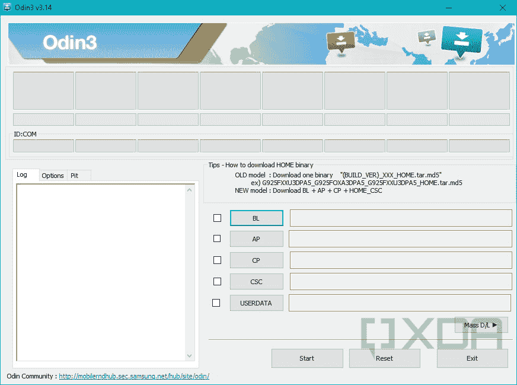
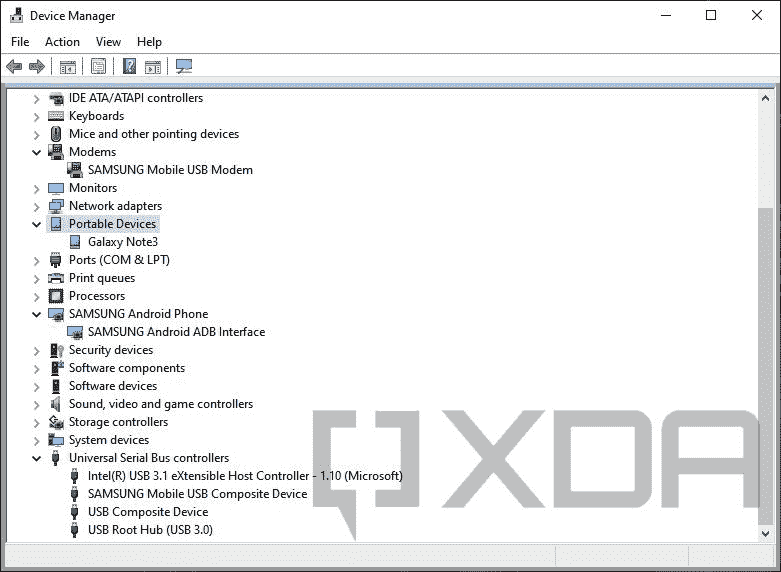
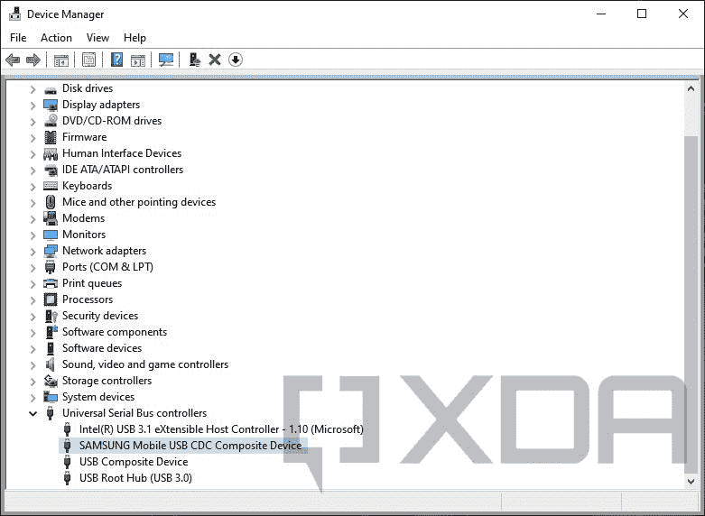

# 如何更新您的三星 Galaxy 智能手机并安装官方固件

> 原文：<https://www.xda-developers.com/how-to-update-samsung-galaxy-smartphone/>

三星 Galaxy 智能手机是市场上[最好的安卓智能手机](https://www.xda-developers.com/best-samsung-phones/)之一。在软件更新方面，韩国 OEM 厂商也做得相当不错，通过定期更新让普通消费者获得最新的安全补丁。然而，在三星 Galaxy 设备上不容易得到的一件事是你可以闪存的固件，你可以闪存来降级、升级或恢复你的手机。

在本教程中，我们将向您展示如何为您的 Samsung Galaxy 智能手机手动找到合适的更新包，将其下载到您的 PC 上，最后用更新的固件刷新目标设备。

**目录:**

## 三星固件的类型

与大多数 Android 设备不同，三星 Galaxy 智能手机和平板电脑没有真正的固件闪存快速启动接口。韩国 OEM 开发了他们自己的固件更新工具“Odin ”,以北欧神话中的众神之王命名。Odin 与一个名为“Loke”的特殊软件组件进行通信，该组件似乎是以北欧神话中的另一个重要人物命名的(通常翻译为“Loki”)。Loke 在三星设备上以下载模式运行，并提供执行刷新操作所需的功能。

 <picture></picture> 

Interface of the Odin flashing tool

Odin 固件文件就像 Google Pixel 系列的工厂图像，只是被压缩到一个单独的归档中，并通过 GUI 工具而不是 fastboot 等命令行工具易于使用。

三星的 FUS(固件更新服务器)也提供增量以及完整的 OTA zip 文件，这意味着使用库存恢复环境安装。

## 如何下载三星固件

在我们开始手动下载之前，您应该检查更新是否已经通过无线方式发送到您的设备。OTA 更新非常容易下载和安装。当 OTA 更新可用时，您通常会收到通知。如果没有，以下是如何在您的三星 Galaxy 设备上检查更新的方法:

*   转到设置。
*   向下滚动并点击*软件更新*。
*   点击*下载并安装*。
*   如果有可用的更新，请按照步骤进行安装。如果没有，它会说你的手机是最新的。

如果您的手机报告其软件是最新的，但您知道您的型号有更新，我们可以利用手动下载方法。

### 下载可恢复闪存包

在三星 Galaxy 设备上捕获 OTA 包是一项有点棘手的工作，因为您需要事先设置一个包嗅探工具来提取下载 URL。

*   在您的手机或 PC 上配置数据包嗅探工具。
*   从手机内置的更新程序开始下载更新，但不要暂停。
*   回到嗅探工具，启动它，找到以*fota-secure-dn.ospserver.net*开头的 URL。
*   下载。bin 文件，并将扩展名重命名为. zip。

### 下载 Odin-flash 包

三星维护着许多特定于地区和特定于运营商的更新渠道。因此，在下载 Odin 固件之前，您必须确定确切的[消费者软件定制代码](https://docs.samsungknox.com/dev/knox-e-fota/device-info.htm)，也就是您设备的 CSC 值。请记住，改变现有设备的 CSC 或交叉刷新不同的固件是可能的，但解释这种修改超出了本教程的范围。

*   从 [APK 镜报](https://www.apkmirror.com/apk/vndnguyen/phone-info-%E2%98%85samsung%E2%98%85/)下载手机信息三星应用。该应用的开发者移除了谷歌 Play 商店的免费版本，但是你仍然可以从下面的链接下载付费版本。这是为了找出你当前有效的 CSC 值是多少。如果您已经知道它是什么，请跳到第 3 步。

*   打开手机信息三星，并前往 CSC 代码标签。它应该显示一个选项，上面写着*活动 CSC 代码*。记下这 3 个字符的代码，因为您将在后面的步骤中用到它。

*   您还可以使用三星专用的 [Android 密码](https://www.xda-developers.com/android-secret-codes/) — `*#1234#` —来确定 CSC 代码。启动 stock recovery 后也可以看到活动的 CSC 代码。

*   下载[三星固件下载器](https://www.xda-developers.com/download-samsung-software-updates-samsung-firmware-downloader/)。这个神奇的工具是由我们自己的 [Zachary Wander](https://www.xda-developers.com/author/zacharywander/) 创建的，它可以下载所有三星 Galaxy 固件文件。
*   打开下载器，在显示*型号*的地方输入您的型号。这就要从 *SM-* 说起了。你需要确保包括 SM-否则它不会下载你的文件。接下来，在 region 部分下，输入之前的三个字符的 CSC 值。然后点击*检查更新*。这将为您的设备找到最新的固件。

*   如果没有显示更新，这可能是因为您使用的运营商没有使用三星的服务器进行更新，因此没有存储任何三星固件下载器可以下载的内容。如果是这种情况，请尝试在特定于设备的分论坛上搜索您选择的固件。一般会上传到那里。
*   点击*下载*并选择文件位置。这将开始下载和解密。这可能需要一段时间，取决于您的网络速度和 CPU 速度。三星固件下载器会告诉你，当解密已经完成，文件准备好用于闪存。

## 如何安装三星固件

根据固件类型，安装过程可能需要一台 PC。例如，Odin 需要 Windows，所以在试图更新任何三星手机的固件时要记住这一点。

### 通过恢复进行侧加载:使用 Android 调试桥(ADB)

### 通过恢复进行侧装:使用 SD 卡

*   重命名下载的。将包 bin 到 update.zip，并将其复制到 SD 卡的根目录。
*   现在[重启到恢复模式](https://www.xda-developers.com/how-to-boot-to-recovery/#samsung)，导航到选项*应用来自外部存储器的更新*，按下电源按钮选择它。
*   现在以类似的方式选择名为 *update.zip* 的文件。
*   更新将开始。因为这个过程需要一些时间，所以把它留到完成。
*   手机会自动重启并加载更新的固件。

### 通过奥丁闪烁

警告: Odin 实际上不是为普通用户设计的，但由于它是三星的官方工具，你的手机将允许它加载必要的文件来刷新固件，而无需解锁引导加载程序。但是，如果使用不当，仍然会损坏您的设备。小心行事。

抓住正确版本的奥丁是第一步。由于这个工具从来就不是给消费者使用的，三星没有把它放在公共下载门户上。幸运的是，XDA 的高级成员 realbbb 维护着一个 Odin 工具的验证副本库。他还提供了 Odin 的修补版本(被称为“3B 修补”)，能够在交叉闪烁时绕过许多停止条件。

**[下载奥丁(未修改的和 3B 打了补丁的)——XDA 线程](https://forum.xda-developers.com/t/3762572/)**

*   从前面提到的线程中抓取最新的 Odin 包，并将文件解压到你能记住的地方。
*   确保您安装了最新的[三星 Android 驱动程序](https://www.xda-developers.com/download-android-usb-drivers/#download)包。

 <picture></picture> 

USB interfaces exposed by a Galaxy smartphone after installing the Samsung Android driver

*   关闭您的手机并启动到下载模式:
    *   旧的三星 Galaxy 设备:按下电源+ Home +音量下降约 5 秒。
    *   新的三星 Galaxy 设备:按下 Power + Bixby + Volume down 或 Bixby + Volume down 约 5 秒。
    *   当设备启动并连接到 PC 时，您也可以使用以下 ADB 命令:

        ```
         adb reboot bootloader 
        ```

    *   一些当代 Galaxy 设备具有占位符快速启动接口。如果您的手机在使用上述 ADB 命令后进入快速启动模式，那么您必须执行硬重启以返回 Android，并选择以下命令进入下载模式:

        ```
         adb reboot download 
        ```

*   您应该会看到一个屏幕，中间有一个大的下载图标和一个关于二进制闪烁的确认对话框。按下相应的按钮继续实际下载模式。如果您安装了正确的驱动程序，您应该会在设备管理器窗口中看到一个新设备弹出。

 <picture></picture> 

The download mode interface of a Samsung Galaxy device under Windows

*   以管理员身份运行 exe，在 PC 上打开 Odin。在 ID:COM 部分，你应该会看到一个蓝绿色的盒子，上面写着*已添加！*。这是您以下载模式连接的设备。

*   Odin 的主要部分有 BL，AP，CP，CSC 和 USERDATA 的按钮。这些表示相应的固件文件:
    *   BL:引导装载程序
    *   AP:安卓系统分区集合
    *   CP:核心处理器，即调制解调器固件
    *   CSC:消费者软件定制
    *   用户数据:运营商预装的应用和服务
*   您可能不需要所有这五个文件。这取决于你在闪什么。
    *   旧三星 Galaxy 设备:选择单个 *.tar.md5* 文件作为 AP。

*   *   新的三星 Galaxy 设备:为每个插槽选择合适的二进制文件。

*   请注意，将 HOME_CSC 二进制文件刷新为 CSC 不会擦除您的数据。然而，如果你想重新开始(例如，你已经安装了一个自定义恢复像 TWRP 和自定义 ROM 像 LineageOS，你想回到股票固件)，然后选择 CSC 二进制文件在 CSC 标签。它将彻底清除/data 分区和设备的内部存储。

*   如果一切看起来都正确(并且你已经检查了三遍)，点击*开始*按钮。一个进度条将会显示在 Odin 和手机上。

*   这个过程需要一段时间，手机可能会重启几次。在这个过程完成之前不要拔掉它。当这个过程完成后，你会看到一个“通过！”ID:COM 部分上方的状态。

*   享受手机上更新的固件！

## 确认

一旦手机启动到主屏幕，从应用程序抽屉或快速设置菜单中的齿轮图标打开*设置*。然后，滚动到设置的底部，选择*关于手机*并选择*软件信息*。接下来，找到*构建号*条目并定位其值。应该和你之前下载的 Odin 固件包一样。

* * *

就是这样。正如你所看到的，手动更新三星 Galaxy 智能手机的固件并不困难，但这也不是一个完全简单的方法。希望这篇教程能让你更容易理解和遵循这个过程。