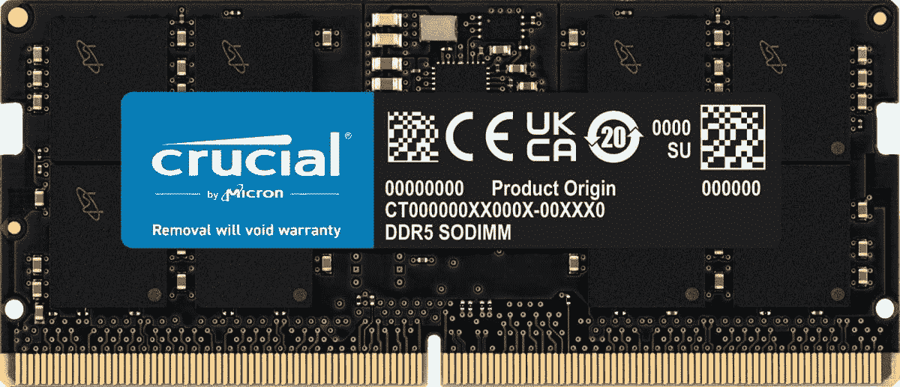
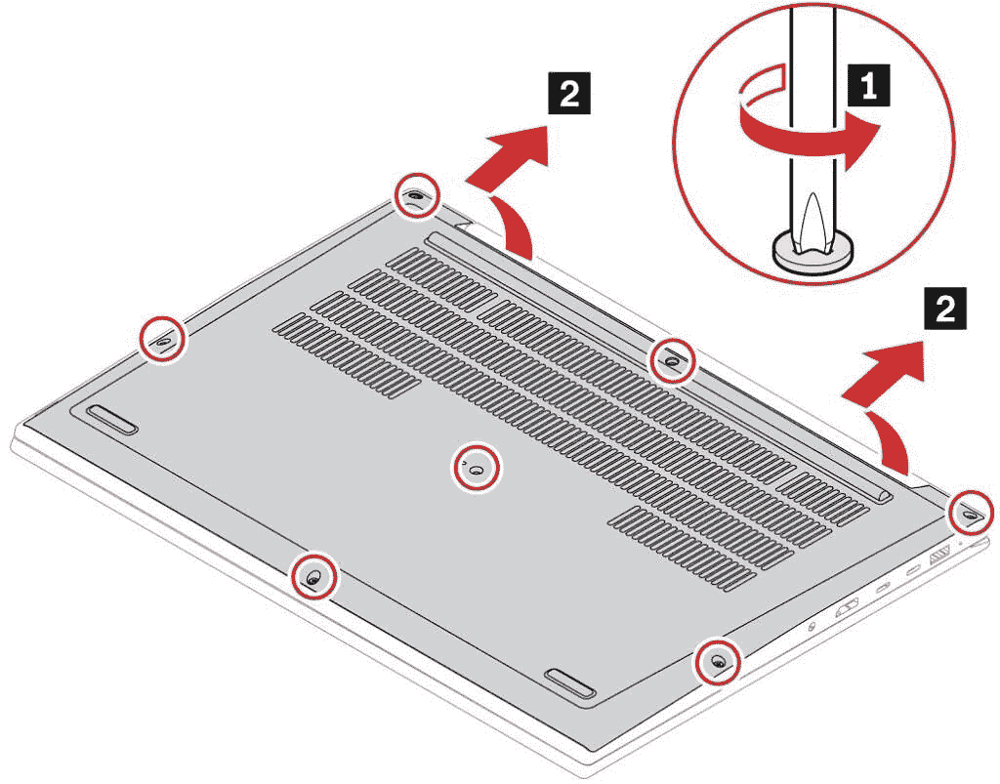
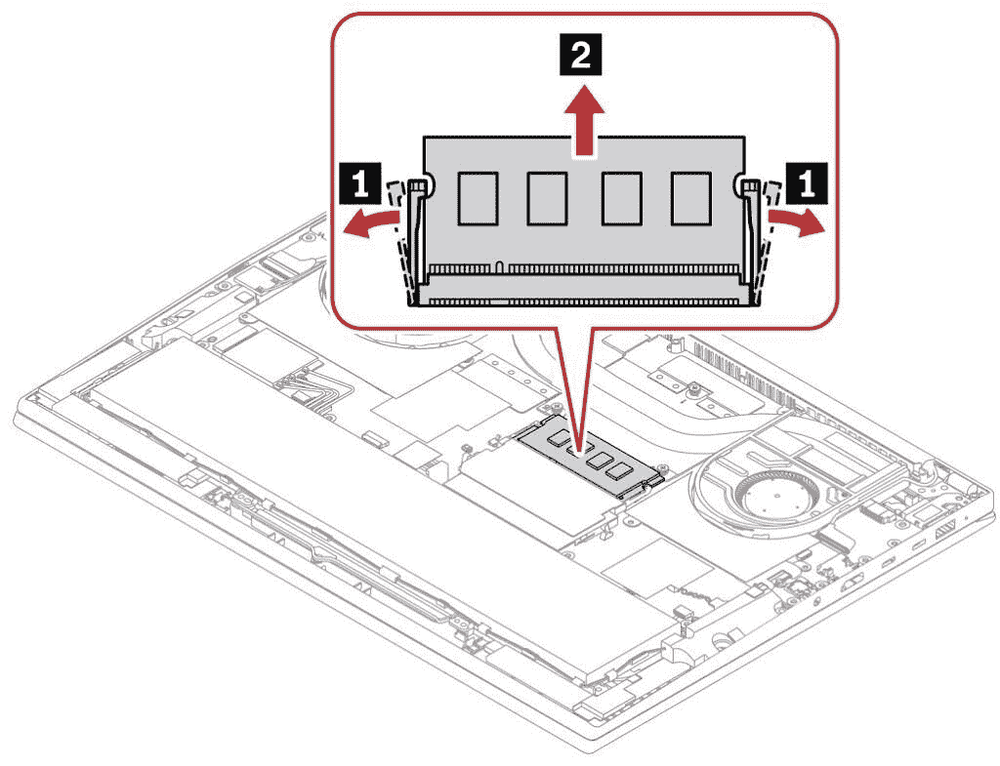

# 如何升级联想 ThinkPad X1 Extreme Gen 5 的内存

> 原文：<https://www.xda-developers.com/how-to-upgrade-memory-lenovo-thinkpad-x1-extreme-gen-5/>

[ThinkPad X1 Extreme](https://www.xda-developers.com/lenovo-thinkpad-x1-extreme-gen-5/) 是[联想 ThinkPad 家族](https://www.xda-developers.com/best-thinkpads/)中最强大的笔记本电脑之一，与最新型号没有什么不同。开箱即用，您可以配置高达英特尔酷睿 i9-12900H CPU、Nvidia GeForce RTX 3080 Ti 显卡、64GB 内存和 4TB 存储(如果您选择较弱的 GPU，则为 8TB)。幸运的是，还有一定程度的可升级性，所以如果你愿意，你可以购买较低的配置，以后再升级。在本文中，我们将了解如何升级联想 ThinkPad X1 Extreme Gen 5 的内存。

有几个原因可能会让你以后升级内存。首先，联想配置器上的 RAM 升级非常昂贵，尤其是如果你想超过 16GB。如果你愿意做一些工作，你可以通过购买较低的配置并在事后自己升级来节省一些钱。你可能现在还不需要大量的内存，但是几年后，它可能会派上用场。不管你的动机是什么，我们都是来帮忙的。

## 你需要什么

如果你要升级联想 ThinkPad X1 Extreme Gen 5 的内存，你需要一些工具。这里有一个简短的列表:

*   十字螺丝刀
*   撬动工具(可能是可选的)
*   防静电腕带
*   SODIMM RAM 模块

获得十字螺丝刀和撬动工具的一个好方法是使用 [iFixit 基本电子工具包](https://www.amazon.com/iFixit-Essential-Electronics-Toolkit-Smartphone/dp/B0964G2Y7S?tag=xda-6p9ij3e-20&ascsubtag=UUxdaUeUpU43898&asc_refurl=https%3A%2F%2Fwww.xda-developers.com%2Fhow-to-upgrade-memory-lenovo-thinkpad-x1-extreme-gen-5%2F&asc_campaign=Evergreen)。如果你经常使用电子产品，这里有一些你可能需要的工具，包括我们刚刚提到的两个。还建议使用[防静电腕带](https://www.amazon.com/Wristband-Bracelet-Grounding-Alligator-Extendable/dp/B08CXQN86W?tag=xda-6p9ij3e-20&ascsubtag=UUxdaUeUpU43898&asc_refurl=https%3A%2F%2Fwww.xda-developers.com%2Fhow-to-upgrade-memory-lenovo-thinkpad-x1-extreme-gen-5%2F&asc_campaign=Evergreen)来避免您在电脑上工作时的静电放电，因为它们会造成损坏。否则，您可以通过触摸未上漆的金属表面来接地。

当然，你需要一个内存模块来安装到你的联想 ThinkPad X1 Extreme 上。RAM 模块在速度方面匹配很重要，所以如果你只打算升级一个模块，请确保寻找 4800MHz 的 DDR5 RAM。一个很好的选择是来自 Crucial 的这个，它根据您的需求有不同的容量:

 <picture></picture> 

Crucial DDR5-4800MHz RAM

##### 至关重要的 DDR5-4800MHz RAM

一块主频为 4800MHz 的 DDR5 内存，是 ThinkPad X1 Extreme 所含内存的完美匹配，它有不同的容量。

## 准备升级

在开始升级过程之前，您还需要确保您可以安全地完成升级。首先，您可能希望在开始之前备份您的重要数据。在此过程中，您没有理由丢失任何数据，但是安全总比后悔好。

您还需要禁用笔记本电脑内部的内置电池。这使得在您操作电脑时，不会有任何剩余电流流过电脑，从而防止潜在放电造成的损坏。以下是如何做到这一点:

*   进入控制面板，将视图从**类别**更改为**大图标**或**小图标**。列表是按字母顺序排序的，你需要找到一个叫做**电源选项**的链接。
*   在这里，点击左侧菜单中的**选择电源按钮的功能**。
*   点击页面顶部附近的**更改当前不可用的设置**(您需要在电脑上拥有管理员帐户)。然后，取消勾选显示**打开快速启动(推荐)**的复选框，并点击**保存更改**。
*   重新启动电脑，当出现联想标志时，按 F1 键进入 ThinkPad 设置菜单。
*   导航至**配置** **>电源**。在该子菜单中，选择**禁用内置电池**。
*   确认你的选择，然后电脑将关闭电源。

一旦你完成了 RAM 升级，你会想要逆转这一点，你可以按照同样的步骤来做。现在，让电脑冷却几分钟，然后再开始工作。

## 升级联想 ThinkPad X1 Extreme Gen 5 的内存

现在一切都准备好了，我们可以开始升级 RAM 了。你需要做的是:

*   将笔记本电脑的底盖朝上放置，使用十字螺丝刀拧下固定它的七个螺钉。
*   从转轴周围开始提起基座盖-撬动工具可能会有所帮助。然后，完全拆下基座盖。<picture></picture>

    形象功劳:联想

*   内存模块靠近笔记本电脑的中央，稍微偏左。它们被黑色的盖子盖住，你可以简单地提起来。
*   如果您有一个空的插槽，您可以在下一步中简单地插入新的 RAM 模块。要卸下已安装的内存模块，请小心拉动金属支架的两侧以释放模块，然后只需将拉杆滑出插槽。<picture></picture>

    形象功劳:联想

*   要插入新模块，请以一定角度将其滑入插槽，直到触点完全隐藏。模块上的内存芯片和标签应该朝上。
*   向下按内存模块，直到听到支架将其锁定到位的咔嗒声。这不应该需要过度的力量。
*   如果您要安装两个新模块，只需在另一个插槽上重复该过程。
*   安装内存后，重新装上基座盖，然后拧紧七颗螺丝将其固定到位。小心不要拧得过紧，否则会损坏电脑。

就是这样！一旦完成，只需插入你的笔记本电脑并打开它，看看是否一切正常。你可以在启动时回到 ThinkPad 菜单，重新激活电池，然后在 Windows 中启用快速启动。

* * *

如果你还没有，但你有兴趣，你可以使用下面的链接购买联想 ThinkPad X1 Extreme。联想提供了大量的配置选项，因为你可以自己升级 RAM 和存储，所以你可以通过选择较低的配置来节省一些钱。

如果这款笔记本电脑听起来不像你的东西，你可以随时查看[最佳联想笔记本电脑](https://www.xda-developers.com/best-lenovo-laptops/)来寻找一些不同的东西。或者，你也可以查看[最佳笔记本电脑](https://www.xda-developers.com/best-laptops/)，看看其他品牌还有什么。

 <picture></picture> 

Lenovo ThinkPad X1 Extreme Gen 5

##### 联想 ThinkPad X1 Extreme Gen 5

联想 ThinkPad X1 Extreme Gen 5 是一款功能强大的商用笔记本电脑，采用英特尔 H 系列处理器和英伟达 RTX 显卡，可以处理要求最苛刻的工作负载。它还配备了内存和存储升级空间。