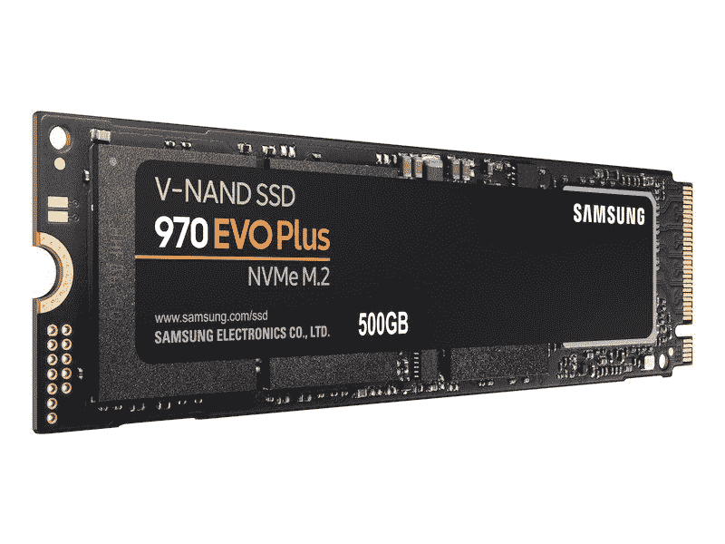
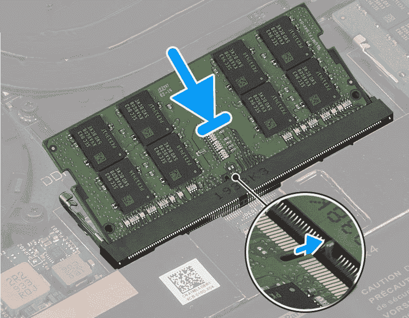
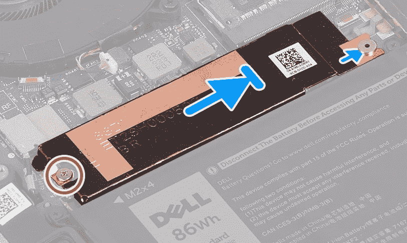

# 如何升级 Dell XPS 15 的内存和存储

> 原文：<https://www.xda-developers.com/how-to-upgrade-ram-storage-dell-xps-15/>

戴尔 XPS 15 是一款[非凡的笔记本电脑](https://www.xda-developers.com/best-laptops/)，原因有很多。它配备了令人印象深刻的规格，如第 11 代英特尔酷睿处理器和高达 NVIDIA GeForce 3050 Ti，此外它还具有高度可配置性。您可以获得高达 64GB 内存和 4TB 存储空间的 Dell XPS 15，这可能超出了您的需求。但这正是问题所在——你可能并不马上需要所有的存储空间或内存。那么，如果您想在以后升级 Dell XPS 15 的内存或存储设备，该怎么办呢？

这是这款笔记本电脑的另一个优点。您可以轻松地获得这些组件并自行升级。这意味着你现在可以得到“仅仅”16GB 内存和 512GB 固态硬盘的笔记本电脑，以后再升级。它还可以为您节省一些钱，因为购买这些预先配置的升级通常比自己做更昂贵。如果您想升级 XPS 15 的存储和内存，以下是您需要做的事情。

## 准备在您的笔记本电脑中工作

如果你要在你的笔记本电脑或者任何电子设备中工作，你需要采取一些预防措施。首先，确保从插座上拔下计算机，拔下所有外围设备，并完全关闭计算机。此外，确保您已经通过触摸未涂漆的金属表面来释放静电，并确保您没有在会引起静电的织物或宠物附近工作。

就工具而言，您需要一把 Torx T5 螺丝刀来拧下底盖上的螺钉，一把十字螺丝刀来拧下笔记本电脑内部的螺钉。你还需要一个定位钻或不导电的撬动工具来打开笔记本电脑的底座。

最后，你需要你想升级到的硬件。对于 RAM，您将需要与笔记本电脑中已有的内容相匹配的记忆棒，戴尔 XPS 15 拥有 3200MHz 内存。一种可能的选择是这种来自 Crucial 的 RAM，它有多种尺寸可供选择:

 <picture></picture> 

Crucial RAM

##### 关键的 SODIMM DDR4 RAM

适用于戴尔 XPS 15 的 SODIMM DDR4 内存。它也有其他功能。

至于固态硬盘，三星制造了一些最受欢迎的固态硬盘，所以如果你想要最佳性能，我们建议 970 EVO Plus。这是 PCIe 第三代固态硬盘，因为 XPS 15 不支持 PCIe 第四代固态硬盘。尽管如此，它承诺高达 3500 MB/s 的读取速度和 3200 MB/s 的写入速度，因此已经足够好了。

 <picture></picture> 

Samsung 970 EVO Plus SSD (PCIe Gen 3)

##### 三星 970 EVO Plus 固态硬盘

三星 970 EVO Plus 是一款快速的 PCIe 第三代固态硬盘，有望达到 3500 MB/s 的速度，容量高达 2TB。

## 打开戴尔 XPS 15

一旦你准备好了，你要做的第一件事就是打开笔记本电脑并断开电池以防损坏。按照我们的步骤，让笔记本电脑的转轴背对着你。你需要做的是:

*   使用 Torx T5 螺丝刀拧下笔记本电脑底座上的八颗螺钉，并将它们放在一边。
*   使用扳手或撬动工具将笔记本电脑的盖子从底座上拆下来。从较低的角落开始，从那里向两个方向走。
*   一旦基座盖关闭，您将需要断开电池与主板的连接。电池连接器位于电池本身的右上角。要断开它，请向上拉连接器，而不是电缆。
*   按住笔记本电脑顶部的电源按钮 15 秒钟，以释放电脑中剩余的电量。这将防止您工作时放电。

## 升级 Dell XPS 15 中的内存

打开笔记本电脑，拔下电池，拔掉所有插头，您终于可以升级您的 Dell XPS 15 的 RAM 和存储了。我们将从帮助您升级内存开始。你需要做的是:

*   找到主板上的内存棒。它们会正好在中间，冷却风扇的下角之间。如果您只使用了一个插槽，并且要添加一个新插槽，请跳到步骤 4。要移除 RAM 棒，请继续阅读。
*   用指尖轻轻拉开要卸下的 RAM 模块两侧的金属支架。该模块将弹出。
*   小心地将内存模块滑出插槽。
*   取出新的 RAM 模块，将其连接器上的凹槽与主板上内存插槽上的卡舌对齐。

 <picture></picture> 

Image credit: Dell

*   将 RAM 模块以一定角度滑入插槽，直到完全盖住连接器。
*   向下推 RAM 模块，直到它卡入到位(您会看到金属支架再次将其固定到位)。

如果您要升级两个，可以对另一个 RAM 插槽重复此过程。始终确保您的内存模块以相同的速度运行。

## 升级 Dell XPS 15 上的存储

接下来，让我们升级戴尔 XPS 15 的存储。这款笔记本电脑配有两个 M.2 2280 插槽用于存储，根据您购买的配置，这些插槽可能已经安装，也可能没有安装。下面介绍如何升级到新的固态硬盘。

*   找到主板上的 SSD 插槽。它们位于电池的正上方和 RAM 模块的下方，由散热支架覆盖。SSD 1 在左边，SSD 2 在右边。
*   使用十字螺丝刀拧下固定散热支架和 SSD 的螺钉。
*   将散热支架从定位柱下方滑出，然后将其拆下。然后滑出 SSD(如果有安装的话)。
*   取出要安装的 SSD，将连接器针脚上的凹槽与主板上 SSD 插槽上的卡舌对齐。
*   以一个小角度将 SSD 滑入插槽，确保它与您之前卸下的螺钉孔对齐。

 <picture></picture> 

Image credit: Dell

*   将散热支架滑到 SSD 上，并将其与定位柱和螺孔对齐。
*   使用螺钉将 SSD 和散热支架再次固定到位。注意不要拧得过紧，否则会损坏电脑。
*   如果要升级另一个 SSD 插槽，请重复该过程。

完成后，您现在可以将电池电缆重新连接到主板，并使用 Torx T5 螺丝刀拧紧螺钉，将基座盖放回原位。同样，不要过紧，因为这可能会导致主板上的额外张力导致损坏。

* * *

关于升级 Dell XPS 15 的内存和存储，您只需知道这些。拥有这样的用户可升级组件可以帮助计算机使用更长时间，因为如果您当前的组件不符合您的需求，您不必购买新的组件。它还可以帮助您节省资金，这样您就不必马上购买最昂贵的配置。

如果你还没有，你可以购买下面的戴尔 XPS 15。即使没有顶级配置，这也是一款出色的笔记本电脑，具有强大的规格和 3.5K 有机发光二极管显示屏，使其成为可以用于视频编辑的[最佳笔记本电脑之一](https://www.xda-developers.com/best-laptop-for-video-editing/)。如果您想查看其他选项，请查看我们的[最佳戴尔笔记本电脑](https://www.xda-developers.com/best-dell-laptops/)列表。

 <picture></picture> 

Dell XPS 15 (9520)

##### 戴尔 XPS 15

Dell XPS 15 是一款功能强大的笔记本电脑，采用高端规格，如第 11 代 45W 英特尔处理器和 NVIDIA RTX 显卡。它还配备了令人惊叹的 3.5K 有机发光二极管显示屏，以及用户可升级的 RAM 和存储。