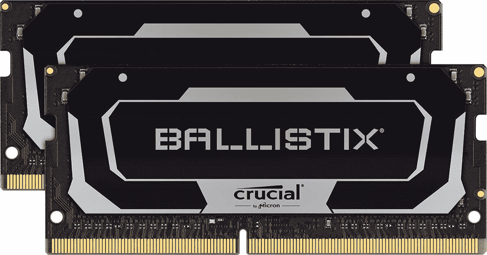

# 如何升级联想 ThinkPad X1 Extreme 上的 RAM 和 SSD

> 原文：<https://www.xda-developers.com/how-to-upgrade-ram-storage-lenovo-thinkpad-x1-extreme/>

联想 ThinkPad X1 Extreme Gen 4 可能是目前你能买到的最强大的商用笔记本电脑。联想采用了 [ThinkPad 笔记本电脑](https://www.xda-developers.com/best-thinkpads/)的商务风格设计和功能，并在其中加入了令人讨厌的规格。它配备了高达第 11 代英特尔酷睿 i9 博锐处理器和 NVIDIA GeForce RTX 3080 显卡，这对于厚度不到 18 毫米的 16 英寸笔记本电脑来说非常棒。不仅如此，你还可以配置高达 64GB 的内存和 4TB 的固态硬盘存储。但是那些为 ThinkPad X1 Extreme 升级的 SSD 和 RAM 开箱后可能会非常昂贵，所以如果你想以后自己升级它们怎么办？

谢天谢地，你可以，在本指南中，我们将向你展示如何做到这一点。联想 ThinkPad X1 Extreme Gen 4 有两个内存插槽和最多两个 SSD 插槽。你是得到一个还是两个 SSD 插槽取决于你选择的显卡。第二个 SSD 插槽只有在你选择 NVIDIA GeForce RTX 3050 Ti 或更低的时候才可用，因为其他独立 GPU 需要更多的冷却。无论如何，我们都将帮助您升级联想 ThinkPad X1 Extreme 的内存和固态硬盘。

## 准备在您的笔记本电脑中工作

和往常一样，如果你打算弄乱笔记本电脑(或其他电子产品)的内部，你需要采取一些预防措施。首先，联想建议禁用内置电池，这可以通过 BIOS 来实现。首先，打开控制面板，选择*系统&安全*，在 Windows 中禁用快速启动。从那里，点击*选择电源按钮*(在*电源选项*下)，然后*更改当前不可用的设置*。然后，禁用快速启动。

完成后，您可以重新启动计算机，并在看到徽标屏幕时快速按下键盘上的 F1。这将打开 BIOS 设置。进入*配置*，然后*通电*并选择*禁用内置电池*。确认，计算机将关闭。然后从笔记本电脑上拔下充电器和任何外围设备，以避免任何电荷通过设备。

开始前，你也要通过触摸未上漆的金属表面来接地，偶尔在工作时也要避免静电放电。确保不要在织物上工作，也不要靠近宠物，因为它们会产生更多的静电。

就工具而言，你需要一把十字螺丝刀来打开笔记本电脑，并拆卸和安装 SSD。你可能需要一个定位钻或者一个不导电的撬动工具来打开笔记本电脑的底座。

最后，您需要零件来进行升级。对于 RAM，建议使用与笔记本电脑相同速度的记忆棒，如果可以，使用同一品牌的两个模块。你可以在下面得到一对重要的 Ballistix RAM 棒，容量高达 64GB——ThinkPad X1 支持的最大容量。如果你只需要一根棍子，还有另一个单独出售的重要型号。

 <picture></picture> 

Crucial Ballistix 3200MHz RAM

##### 关键的 Ballistix 3200MHz RAM

这对重要的 Ballistix RAM 棒为 ThinkPad X1 Extreme 提供了一个很好的升级选择，容量高达 64GB。

至于 SSD，有两点需要考虑。联想 ThinkPad X1 Extreme 同时具有 PCIe 第四代和第三代插槽(或者只有第四代，如果它只有一个)。为了从第四代插槽中获得最大的速度，你可以购买更贵的 PCIe 第四代固态硬盘，但如果你把它安装在第三代插槽上，你不会得到任何好处。使用 PCIe 第三代固态硬盘可以节省一些钱，它在任一插槽上都可以工作。如果你想要一个 PCIe 第三代固态硬盘，三星 970 EVO Plus 是一个可靠的选择，而 980 PRO 是一个不错的选择。

 <picture></picture> 

Samsung 970 EVO Plus SSD (PCIe Gen 3)

##### 三星 970 EVO Plus 固态硬盘

三星 970 EVO Plus 是一款快速的 PCIe 第三代固态硬盘，有望达到 3500 MB/s 的速度，容量高达 2TB。

 <picture></picture> 

Samsung 980 Pro 2TB

##### 三星 980 Pro

三星 980 PRO 是一款速度惊人的固态硬盘，由于支持 PCIe 4.0，读取速度高达 7000 MB/s。

## 升级联想 ThinkPad X1 Extreme 的内存

做好所有准备后，我们就可以升级 ThinkPad X1 Extreme 的 RAM 和 SSD 了。我们从 RAM 开始，为了说明清楚起见，我们假设您正在使用笔记本电脑的转轴，转轴背对着您。

*   合上盖子，将笔记本电脑翻转过来，拧下固定基座盖的八颗螺钉。
*   从手指上提起基座盖并将其取下。一个 spudger 或撬工具可能有助于这一点。
*   SODIMM (RAM)插槽靠近主板的中间，在电池和冷却管之间。

*   提起盖住要升级的插槽的盖板。要移除已安装的 RAM 杆，请小心拉开杆侧面的金属支架，直到其弹出。然后滑出推杆。
*   要安装新的 RAM 棒，请将 RAM 棒触针上的槽口与 SODIMM 插槽上的凸耳对齐。以一个小角度将推杆滑入插槽。
*   向下推撞杆，直到它卡入到位，由金属支架固定。
*   如果您有两个记忆棒，请对另一个记忆棒重复此过程。

现在，您的笔记本电脑中应该有一些额外的 RAM，并且通过自己升级而不是预先购买更高的 RAM，您已经节省了不少。

## 升级 ThinkPad X1 Extreme 的存储

要升级存储，根据您要升级的 SSD，步骤略有不同。如果您的型号有两个 SSD 插槽，一个将在右边的 RAM 插槽旁边，另一个将在笔记本电脑的另一侧，由金属屏蔽覆盖。这第二个实际上被认为是第一个 SSD 插槽，它具有 PCIe Gen 4 速度。

在更换 SSD 之前，请确保您已经备份了数据，或将整个驱动器复制到新的驱动器中。您的固态硬盘将包含操作系统，您需要使用计算机。要升级笔记本电脑左侧的 SSD 插槽，请执行以下步骤:

*   卸下固定金属屏蔽的两个螺钉。抬起金属护罩，放在一边。
*   卸下 SSD 棒末端的螺丝，将其压住。棍子会微微弹出。
*   小心提起 SSD 并将其滑出插槽。
*   拿起新的 SSD，将触针上的槽口与 SSD 插槽上的卡舌对齐。将固态硬盘滑入。
*   拧紧螺钉，将 SSD 固定到位。注意不要过紧，以免损坏 SSD 或主板。
*   再次将金属护罩放在 SSD 上，并将螺孔与主板上的螺孔对齐。拧紧螺钉，但不要过紧，以防损坏。

如果想升级笔记本电脑右侧的 SSD，流程稍微简单一点。没有金属屏蔽，所以你可以忽略相关的步骤。否则，流程相同。

* * *

这就是关于升级您的联想 ThinkPad X1 Extreme 的 RAM 和存储的所有信息。所有升级完成后，请确保重新启用内置电池，这样当您拔掉电源插头时，就可以实际使用笔记本电脑了。如果你不知道自己在做什么，这种自制升级可能有点冒险，但如果你仔细遵循这些步骤，你会没事的。走这条路可以节省很多钱，而不是马上从联想购买最大的配置。

如果你想购买联想 ThinkPad X1 Extreme，你可以在下面这样做。这款笔记本电脑有大量的配置选项，包括高端英特尔处理器、NVIDIA 显卡、RAM 和存储，如果你不想以后升级的话。您还可以获得这款支持 HDR 的超高清+显示屏笔记本电脑，它非常适合执行[视频编辑](https://www.xda-developers.com/best-laptop-for-video-editing/)等任务。

 <picture></picture> 

Lenovo ThinkPad X1 Extreme

##### 联想 ThinkPad X1 至尊第四代

凭借高达英特尔酷睿 i9 博锐 CPU、GeForce RTX 3080 显卡和大量配置选项，联想 Thinkpad X1 Extreme Gen 4 是您在任何地方都能找到的最强大的商用笔记本电脑之一。