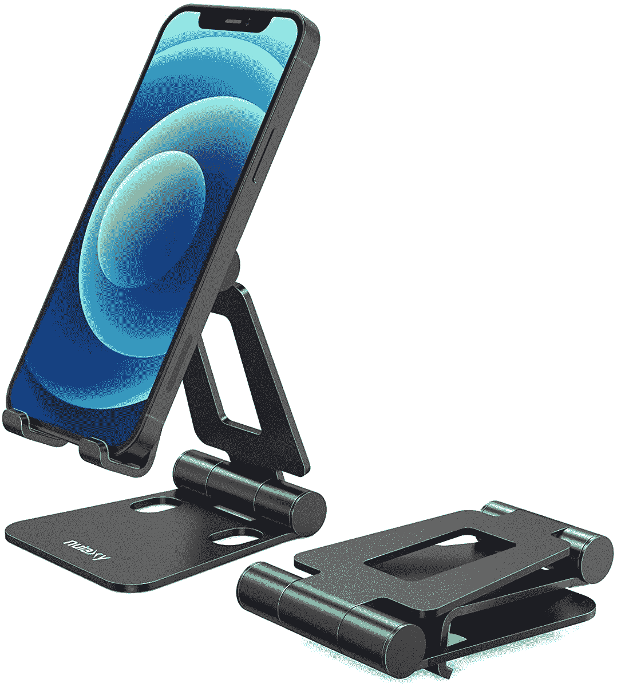
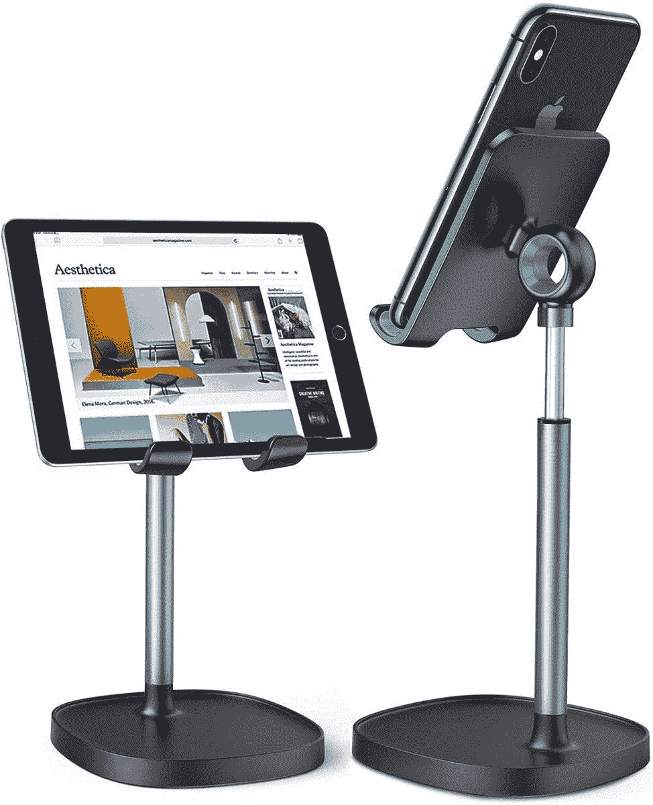

# 如何将您的 Android 手机用作 PC 的网络摄像头来进行视频通话

> 原文：<https://www.xda-developers.com/how-to-use-android-phone-as-webcam-for-pc/>

随着全球疫情迫使我们许多人在家工作和学习，视频会议应用程序已经成为当前的需求。如果你曾经尝试过用笔记本电脑参加会议，你可能会意识到笔记本电脑内置的网络摄像头是一个多么可笑的笑话。在大多数情况下，购买专用网络摄像头将显著提高您的视频质量。但好消息是，你不需要为网络摄像头花钱；你已经有了一个很好的选择，那就是你的安卓智能手机。

我们的手机已经配备了一些令人印象深刻的摄像头硬件，让它们在电脑上进行视频通话也是有意义的。除非你是一个流媒体用户或者每天必须参加多个视频会议的人，否则投资一个专用的高质量网络摄像头对于不频繁的会议来说没有太大意义。我们的智能手机可以制作一个相当不错的无线网络摄像头，保证比 VGA 笔记本电脑的网络摄像头好很多。

## 使用 DroidCam 将 Android 手机重新用作电脑的网络摄像头

你可以使用现有的手机，或者改变抽屉里积满灰尘的旧手机的用途。两个作品。当谈到把你的手机变成一个成熟的网络摄像头时，有几个工具声称比他们的竞争对手做得更好。如果你有时间和耐心，尽一切办法去看看，找到最适合你的。但是为了节省您的时间和精力，我简单地尝试了几个选项，发现 DroidCam 是所有选项中最好的。它有一个非常简单的入职体验，并在其免费版本中提供所有的必需品。在本教程中，我将带您了解如何使用 DroidCam 创建您自己的便携式网络摄像头，以便在下次视频会议中使用。

*   从下面的链接下载[机器人摄像头](https://play.google.com/store/apps/details?id=com.dev47apps.droidcam)到你的安卓手机上:

*   接下来，你需要在你的笔记本电脑/台式机上下载 DroidCam 的[桌面客户端。](https://www.dev47apps.com/)
*   打开手机上的 DroidCam，授予视频和音频权限。确保您的手机和 PC 连接到同一个 WiFi 网络。

*   在你的电脑上安装 DroidCam 应用程序。同意许可协议，选择安装位置，点击**安装**。
*   现在运行 PC 客户端。你会看到一个小的弹出框，有三个选项来连接你的 Android 手机。默认情况下会选择 Wi-Fi 连接，这就是我们现在要做的。

*   您需要在下面的字段中输入 IP 地址和端口。返回移动应用程序，查找 WiFI IP 和端口值。在 PC 客户端的设备 IP 和 DroidCam 端口字段中分别输入这些值。

*   确保视频和音频框都被选中，然后点击开始按钮。如果一切设置正确，您将在 DroidCam 桌面客户端看到视频源的预览。
*   默认情况下，该应用程序将使用您的后置摄像头，但如果您愿意，也可以使用前置摄像头。您可以通过点击手机应用程序中三点菜单旁边的摄像头图标来更换摄像头。
*   下一步是配置您的视频会议应用程序，以使用 DroidCam 提要。启动您选择的视频会议应用程序并开始会议。默认情况下，该应用程序将使用内置网络摄像头。要改变这种情况，请打开设置，将视频更改为“DroidCam 信号源 2”或“DroidCam 信号源 3”(如果信号源 2 没有输出)。

*   对于音频，您可以使用手机的麦克风，也可以依靠电脑的麦克风。要更改智能手机的麦克风输入，请转到会议应用程序中的音频设置，并在麦克风选项下选择“DroidCam 虚拟音频”。
*   现在剩下的唯一事情就是为你的智能手机找到合适的位置。你可以使用一个简单的手机支架或者那些别致的手机支架，T2 可以根据你的喜好调整角度和高度。对我来说，我的铝制手机支架完成了任务。如果你有一个迷你三脚架，你也可以把你的手机放在上面。

 <picture></picture> 

Nulaxy A4 Phone Stand

##### Nulaxy A4 手机支架

这个基本支架可以调节，完全折叠，可以放置你的手机、平板电脑、iPad Mini 和 Kindle。

 <picture></picture> 

LISEN stand

##### 李森看台

这款手机支架有防滑底座和铝合金杆。它非常灵活，可以根据自己的喜好调节角度和高度。

 <picture></picture> 

Amazon Basics 50 mini tripod

##### 亚马逊基础款 65W GaN 充电器

亚马逊基础手机三脚架非常容易部署，有助于进行免提视频通话。

DroidCam 的免费版本只允许 SD 质量的视频流。更高的视频质量(1080p)和额外的功能，如平滑的 FPS、视频镜像、调整能力、自动对焦、亮度和对比度等，可以通过购买该应用程序的付费版本 DroidCam X 来解锁。根据你的需要，它很可能证明是值得投资的。

这就是你如何使用你的 Android 手机作为你的电脑和笔记本电脑的摄像头。我们希望你用安卓手机得到比你的笔记本电脑相机更好的效果！