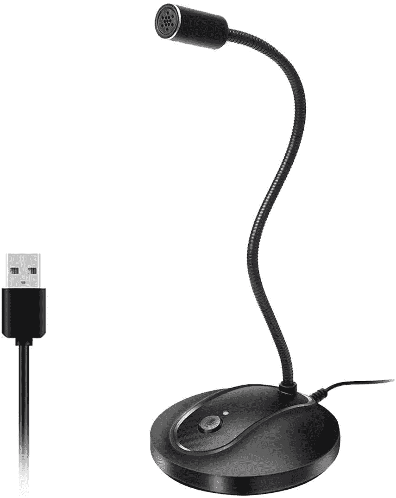
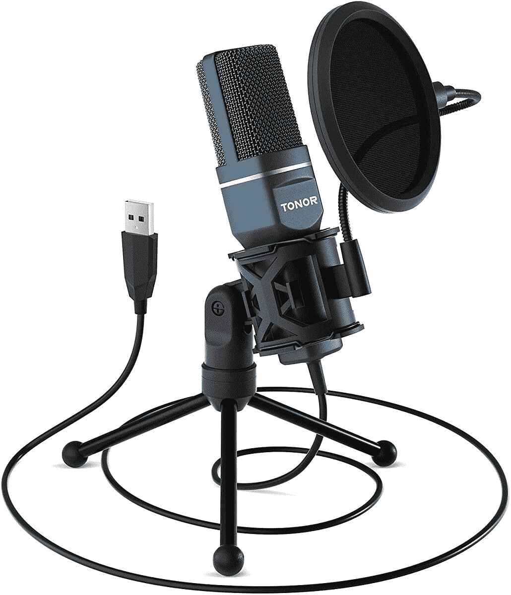

# 如何在 Apple Mac 上设置和使用语音听写

> 原文：<https://www.xda-developers.com/how-to-use-mac-voice-dictation/>

如果你想快速浏览你的电子邮件和报告，并在这个过程中给你的老板留下深刻印象，那么 Mac 语音听写是一个不错的选择。该功能内置于您的 Mac 中，只需前往首选项并将其打开即可激活。但令人惊讶的是，我遇到的许多人甚至没有意识到语音听写的存在。

我们中的许多人都非常习惯与 Siri 交谈，因此也可以使用 Mac 语音听写来听写电子邮件回复和备忘录。但是如何激活和设置它呢？这就是我们今天要看的。

## 激活 Mac 语音听写

和 Mac 上的所有东西一样，这一切都始于偏好设置。所以去左上角的**苹果 Logo** 菜单，选择**系统** **首选项**。系统首选项框现在会出现。选择**键盘**。

当键盘部分出现时，转到**听写**选项卡。

第一步显然是打开听写。因此将按钮切换到上的**。这立即引发了苹果公司的隐私警告，苹果公司将接收你对你的 Mac 所说的所有信息，用于文本转换。所以仔细想想你在口述什么。日常的电子邮件和普通的备忘录是可以的，但是对于真正敏感的公司信息或其他类型的特权内容，你可能要三思而行。**

当您确定要使用听写时，点击**启用听写**。

## 选择你的母语

下一步是选择你的语言。如果你下拉语言菜单，你会看到什么语言包已经安装。如果您想要的语言尚未安装，请点击**添加语言**。

现在将出现可用语言包列表。如你所见，英语有多种版本(尽管没有苏格兰版本，这让我觉得可耻)。还有世界上所有的主要语言。只需勾选您想要安装的(取消勾选您想要卸载的)，然后点击 **OK** 开始安装。

现在再次检查语言菜单下拉菜单，您将看到您的语言包已经安装。

## 选择您的键盘快捷键

正如听写选项卡所说，您可以通过进入编辑菜单并选择**开始听写**来访问该功能。但是每个人都知道真正酷的孩子都使用键盘快捷键。因此，设置过程的倒数第二部分包括选择您的键盘快捷键来开始语音听写。

如果你下拉快捷菜单，你会看到一些快捷方式被推荐给你。如果其中一个上诉，就选它。否则，点击**自定义**，输入您想要的快捷方式。假设一个应用程序还没有抓取那个快捷方式，你将被允许它。

## 最后但同样重要的是，选择你的音频源

正如您在盒子左侧看到的，音频源默认为内置麦克风。这在大多数情况下都有效，但是您可能需要使用外部麦克风来确保更好的听写准确性。

我个人推荐的是奇妙的蓝色雪人，你可以从亚马逊上以非常合理的价格买到它。像其他几个 [Mac 配件](https://pocketnow.com/best-mac-accessories)一样，也有其他即插即用选项。将它插入笔记本电脑后，只需下拉音频源菜单，并从列表中选择麦克风。

*   <picture></picture>

    Jou nivo 鹅颈话筒

    ##### Jou nivo 鹅颈话筒

    这款即插即用的话筒是目前比较便宜和可靠的选择之一，非常适合休闲和轻便的使用。

*   <picture></picture>

    带 pop 滤镜的 Tonor 麦克风

    ##### 带 Pop 滤镜的 Tonor 麦克风

    这款麦克风自带防震架、三脚架和 Pop 滤镜，具有即插即用功能。

## 让我们做一些听写！

因此，通过触发键盘快捷键，听写麦克风将出现在您的屏幕上。把你的光标放在屏幕上你想要的地方(比如一封电子邮件草稿),然后开始说话！看着你的文字神奇地出现在屏幕上！

如果你觉得这很有帮助，你也应该看看如何在 Mac 上分割你的屏幕，以及为什么你应该这样做。