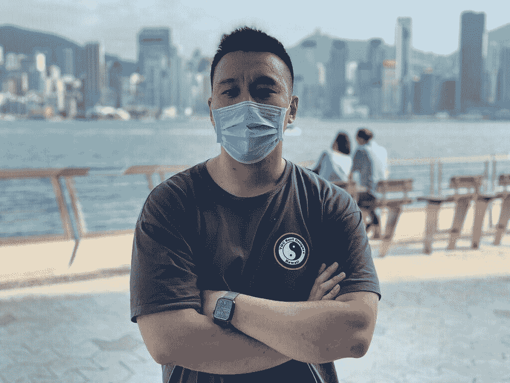
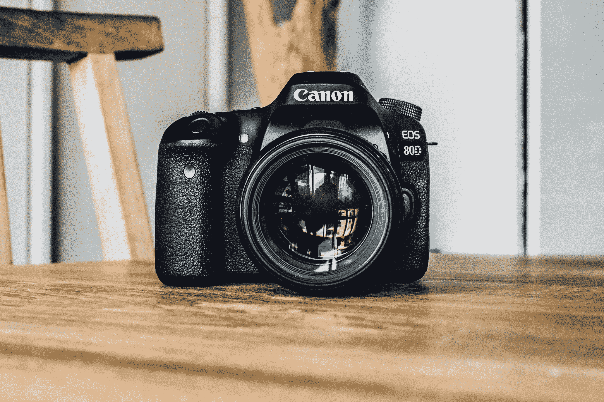
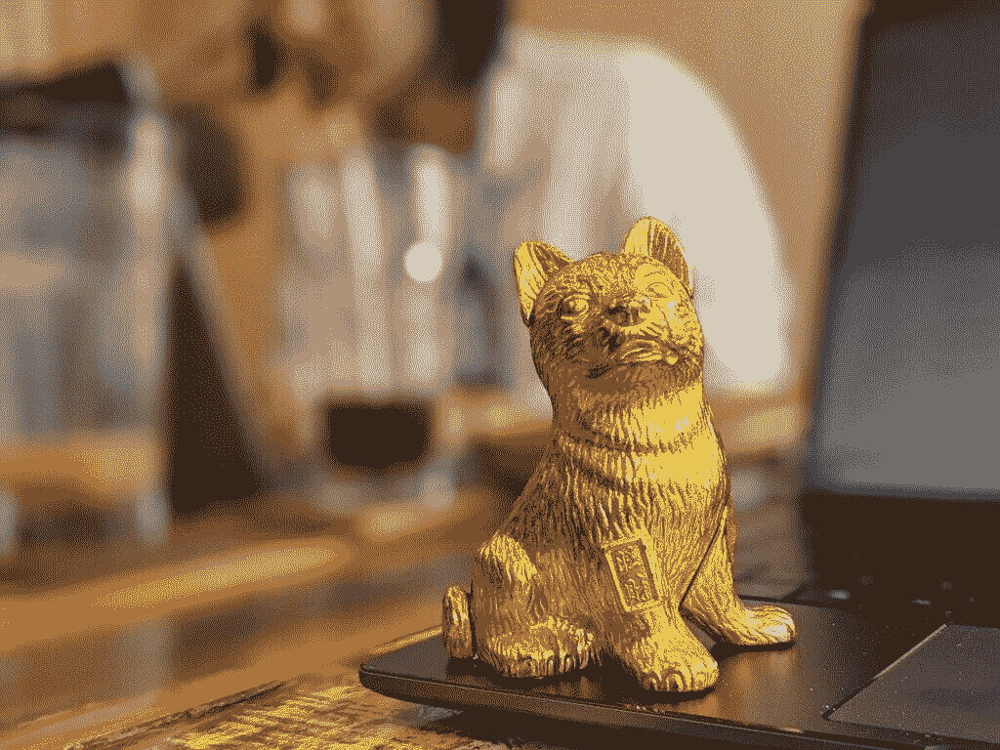

# 如何在 Android 或 iPhone 上启用和使用纵向模式

> 原文：<https://www.xda-developers.com/how-to-use-portrait-mode/>

双摄像头早在 2011 年就已经出现在 Android 上，2014 年的 HTC One M8 等设备普及了使用第二个摄像头获取深度信息的想法。但真正巩固双后置摄像头概念的是苹果，它在 2016 年推出了 iPhone 7 和 iPhone 7 Plus。接下来可能是每一个智能手机 OEM 厂商都加入了这一潮流，推出了带双摄像头的手机。无论次级传感器做了什么，它几乎成为品牌的强制性选择，以跟上潮流。

回到苹果，他们用的副摄像头是变焦摄影的长焦镜头。然而，他们使用它的第二个目的是为该行业的另一个普遍趋势定下基调:肖像模式。苹果巧妙地利用 iPhone 7 Plus 上的两个镜头进行语义分割，简单来说，这意味着他们用它来区分图像中的背景和前景。这样做是为了仔细模糊背景，创造一个浅景深的假象，也就是散景效果。

 <picture></picture> 

Portrait Shot

快进到 2022 年，几乎每一部智能手机，从[的预算](https://www.xda-developers.com/best-cheap-android-phones/)到[的最佳拍照手机](https://www.xda-developers.com/best-smartphone-cameras/)，都在拍照应用中加入了肖像模式。在本指南中，我们将向您展示如何在您的手机上启用肖像模式并拍摄出色的照片。

## 什么是人像模式？

首先，肖像是主要集中在一个人的面部或上半身的图片。因此，肖像模式是一种定制的相机模式，旨在拍摄人类主体的照片。但你也可以在智能手机上点击普通模式下的人体照片，对吗？那为什么会有特定的模式呢？

 <picture></picture> 

Image by Hanson Lu on Unsplash

为了回答这个问题，让我们考虑一下使用专业 DSLR 或无反光镜相机点击的肖像图像。你会注意到，当人的脸清晰且聚焦时，背景却模糊不清。这给了图像一个很好的外观，因为全部的焦点都在主体上，背景不会分散注意力。这叫做*散景*。

 <picture></picture> 

Source: [Google](https://research.googleblog.com/2017/10/portrait-mode-on-pixel-2-and-pixel-2-xl.html)

这种效果是由于专业相机比智能手机大得多，因此具有更大的传感器和可变光圈。光圈是照相机上光线通过的开口。光圈越大，图像越亮，如果光圈窄，进入传感器的光就越少，所以图像就不太亮。更宽的光圈也意味着背景中更突出的模糊效果。这被称为*景深*。这种模糊是在专用相机上点击人像时自然实现的，因为传感器尺寸大，光圈宽。

另一方面，智能手机具有孔径相对较宽的微型传感器，这使得很难实现这种程度的散景，除非你离拍摄对象非常近(尽管这种情况正在改变，因为一些高端的[智能手机拥有带更大传感器的大相机](https://www.xda-developers.com/best-smartphone-cameras/))。如果你点击的是小物体，将手机放在离物体非常近的地方会产生这种自然的模糊。然而，当点击一个人的肖像时，你显然不能靠得太近，这意味着背景和前景都将保持在焦点上。这并不理想。

 <picture></picture> 

Pixel 5 Portrait Mode

因此，智能手机品牌包括一个专用的人像模式，在辅助相机传感器或软件 magic 的帮助下，区分背景和主体，并对背景应用模糊效果，复制专业相机的外观。虽然它最初是为人类拍摄的，但现在几款手机上的人像模式也可以用来拍摄物体。肖像模式有多种实现方式，我们将在下面讨论。

* * *

## 肖像模式的不同实现

如前所述，苹果使用 iPhone 上的辅助摄像头来实现人像模式，许多品牌一直沿用这一实现方式。然而，谷歌凭借 Pixel 2 实现了比只有一个摄像头的苹果更好的人像模式。他们使用计算算法来检测和区分背景和主题。

苹果自己也在只有一个摄像头的 iPhone XR 上实现了这种功能。事实上，大多数原始设备制造商都为前置摄像头实现了基于软件的人像模式。即使使用多摄像机实现，也有多种方式可以实现肖像模式。

### 使用长焦相机的人像模式

这是苹果在 iPhone 7 Plus 上实现的，在最新的 iPhone 12 Pro Max 上仍然存在。由于肖像通常只包括脸部，苹果公司使用 iPhone 上的长焦相机来放大和复制 50 毫米或 65 毫米焦距的人像镜头，相当于你在相机上使用的镜头。

通过这样做，手机使用其他相机来确定其他参数，如背景和前景之间的差异。您也可以选择使用主广角相机进行人像拍摄。

### 使用深度传感器的人像模式

深度传感器成为原始设备制造商在智能手机上推广双摄像头的便捷方式。与超宽或长焦等实际功能相机相比，深度传感器要便宜得多，因此品牌开始在甚至超便宜的手机上安装深度传感器，只是为了将它们作为*双摄像头手机*进行营销。

这一趋势至今仍与智能手机上包含 2MP 深度传感器的品牌相关。虽然它们确实有助于人像模式，但它们更多时候只是一个噱头，因为即使没有额外的镜头，通过软件也可以实现相同的结果(甚至更好)。

### 使用软件的肖像模式

近年来，人工智能和计算摄影已经达到了令人难以置信的高度，因此，仅使用软件的人像模式是可能的，并且也创造了奇迹。例如， [iPhone SE 3 (2022)](https://www.xda-developers.com/apple-iphone-se-3-review/) 在背面有一个摄像头传感器，但它仍然可以拍出非常棒的人像照片。

事实上，大多数品牌使用软件算法来点击人像自拍，这应该告诉你，辅助相机并不是必须点击良好的人像模式图像。当然，辅助相机可能有助于在光线较暗的情况下获得更好的深度贴图，但这不是必需的。

## 如何在手机上启用肖像模式

如前所述，近几年推出的几乎每一款手机都内置了纵向模式。我们将告诉您如何启用它，并使用肖像模式点击背景模糊的图像。如果你的智能手机没有内置在股票相机应用程序中的人像模式，不要担心。我们还会建议你用其他方法来达到肖像模式的效果。

### 像素手机/谷歌相机

1.  启动手机上的相机应用程序。
2.  向右滑动或点击屏幕底部的**肖像**选项。
3.  现在，您可以在纵向模式下单击图像。如果你想自拍，可以按快门左边的按钮切换到前置摄像头。

### 三星电子

1.  启动手机上的相机应用程序。
2.  向左滑动直到你停留在**更多**标签上。
3.  接下来，选择**人像**选项。如果你愿意，你可以切换到自拍相机。

### 一加

1.  启动手机上的相机应用程序。
2.  向左滑动以切换到*肖像模式*或点击屏幕底部的*肖像*选项。
3.  选择您想要放大视图还是宽视图。如果你想自拍，可以按快门左边的按钮切换到前置摄像头。

### Oppo/Realme

1.  启动手机上的相机应用程序。
2.  向左滑动切换到*肖像*或点击屏幕底部的*肖像*选项。
3.  你现在可以点击肖像照。如果你想自拍，按快门右边的按钮切换到前置摄像头。

### Vivo/iQOO

1.  启动手机上的相机应用程序。
2.  向右滑动切换到*肖像模式*或点击屏幕底部的*肖像*选项。
3.  选择您想要用于人像拍摄的镜头。如果你想自拍，按快门右边的按钮切换到前置摄像头。

### 小米/红米/Poco

1.  启动手机上的相机应用程序。
2.  轻按屏幕底部的*肖像*选项，或者直接向右滑动。
3.  你现在可以点击肖像照。如果你想自拍，按快门右边的按钮切换到前置摄像头。

### iPhone/iPad

1.  启动手机上的相机应用程序。
2.  向右滑动切换到*肖像*或轻触屏幕底部的*肖像*选项。
3.  选择您想要用于人像拍摄的镜头。如果你想自拍，按快门右边的按钮切换到前置摄像头。

### 任何其他安卓智能手机

1.  启动手机上的相机应用程序。
2.  四处滑动寻找*肖像*选项，或者看看底部的栏，看看是否能找到。
3.  如果没有，前往*更多*部分或点击任何三点菜单，看看你是否找到纵向模式选项。
4.  在一些手机上，人像模式被称为其他名称，如*实时对焦*、*散景模式*、*镜头模糊*等。所以你也可以寻找这些选项。

一些智能手机在人像模式下有各种选项，如改变模糊强度或一些人像照明效果的能力。你可以通过这些不同的效果，试试看你喜欢哪一种。

## 支持肖像模式的第三方应用

如果你的智能手机在相机应用程序中没有内置的肖像模式，有一些方法可以在你的智能手机上启用它。这可以通过支持肖像模式的第三方相机应用程序来实现，也可以通过允许你编辑照片以呈现肖像模式的应用程序来实现。

### 安装谷歌摄像头端口

谷歌相机应用程序使用谷歌的计算摄影算法来点击人像模式拍摄，这是业内最好的照片之一。你所要做的就是为你的手机抓取[谷歌相机端口，安装它，并按照我们上面提到的指示在谷歌相机上使用肖像模式。](https://www.xda-developers.com/google-camera-port-hub/)

该应用程序既可以制作普通图像，也可以制作肖像图像，所以你可以在点击后选择保留哪一个图像。你可以通过查看图像的 [EXIF 数据](https://www.xda-developers.com/how-to-view-remove-exif-data-android-ios/)来区分这两者。

### 使用 PicsArt 这样的图片编辑器

PicsArt 是安卓最好的照片编辑器之一，提供了很多功能，包括模糊图像背景的功能。这是你可以做到的。

1.  打开 PicsArt 并选择**编辑照片**选项。
2.  选择您想要编辑的照片。
3.  转到**效果**面板，然后选择*模糊*。
4.  现在，再次选择**模糊**选项，点击屏幕顶部的*橡皮擦*图标。
5.  根据图像选择**人物**或**面部**，然后选择**反转**。该应用程序会自动模糊背景。
6.  保存图像，你就可以走了。

* * *

肖像模式使用起来相当简单，你不仅可以在人和宠物身上使用，也可以在物体上使用。如果使用得当，它可以给你看起来很专业的照片，背景也很模糊。请记住，当前景中有一个清晰的主题和相对均匀的背景时，人像模式最有效。