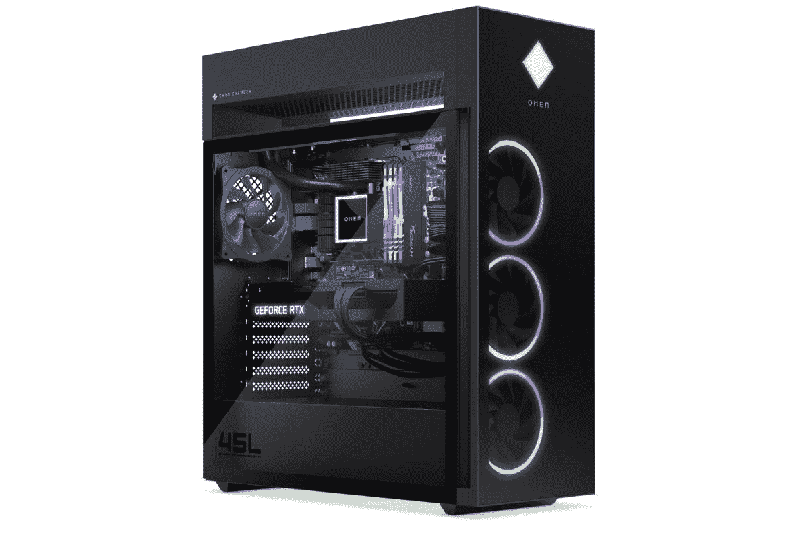

# 惠普在 CES 2022 上发布全新 OMEN 和 Victus 游戏台式机

> 原文：<https://www.xda-developers.com/hp-announces-omen-victus-ces-2022/>

惠普今天宣布了一些新的游戏台式机，作为其 CES 2022 阵容的一部分。除了几款 OMEN 台式机，该公司还推出了其首款由惠普品牌命名的 [Victus 台式机。所有这些新的台式电脑都由英特尔新的 Alder Lake 处理器驱动，并提供大量值得注意的功能。这些新台式机还配有一台显示器，因此很明显，这里有许多来自惠普公司的新产品。让我们开始吧。](https://www.xda-developers.com/hp-announces-omen-laptops-victus-brand-gaming/)

## 惠普 OMEN 45L 台式机

 <picture></picture> 

Omen by HP 45L gaming desktop

HP OML Dekstop 作为高端机器进入产品组合。正如您所料，这款特殊的台式机配备了目前市场上最强大的一些内部组件。它由第 12 代英特尔酷睿 i9-12900K CPU 和高达 24GB GDDR6X 内存的 Nvidia GeForce RTX 3090 或 AMD 镭龙 RX6700 XT 显卡提供支持。你还可以获得一些其他强大的内部功能，如 HyperX 64GB DDR4-3733 内存，1TB PCIe NVMe 固态硬盘，800 W 80 Plus 黄金认证的 ATX 电源等。然而，omn {\\ F2 l }的亮点是所有内部零件都装入了。

惠普正在使用一个定制的 45L ATX 电脑机箱，其中包括一个名为 OMEN CRYO CHAMBER 的专利冷却系统。这个特殊的低温舱基本上位于主塔内部的顶部。在主室和这个专门放置 AIO 冷却器的地方之间有足够的空间。两者之间还有一个开口，散热器从这里吸入新鲜空气，而不是使用由 CPU、GPU 和其他组件主动加热的主内部空气。您可以在顶部安装高达 360 毫米的散热器进行冷却。OMS iningl 还配备了多达七个支持 ARGB 照明的 120 毫米散热风扇

正如你所看到的，这个箱子还配有一块钢化玻璃侧板，让你可以看到建筑的所有内部结构。它有大量的扩展槽、驱动器托架，前面板上还有大量端口可供选择。底盘内还有大量空间来建造高性能钻机。惠普表示，它将很快开始单独销售 45L ATX 电脑机箱，面向那些有兴趣在宽敞的机箱内建造自己的钻机的人。

## 惠普 OMEN 25L 台式机

HP OML 台式机是另一款配备英特尔第 12 代酷睿 i7-12700K CPU 和最高 RTX 3080 GPU 的塔式产品。25L 也是一个 ATX 塔，但它缺少更大模型中的低温舱。这种特殊的塔式机不如 45L 台式机强大，但也有很多令人喜欢的地方，包括它的免工具设计。为了冷却，HP OML 台式机配备了一个小型 AIO 液体冷却器，以及几个连接到机箱的 120 毫米风扇，用于进气和排气。惠普公司已经证实，它将开始销售单独的欧姆辛尼尔 ATX 个人电脑外壳，也为那些有兴趣使用它进行定制建设。

## 惠普 15L 台式电脑

惠普的 Victus 是该公司的主流游戏品牌。虽然 OMEN 品牌继续推动高端组件的发展，但惠普 Victus 品牌提供了更多实惠的选择。你可以查看惠普 Victus 16 评论，了解 Victus 的预算能力。Victus 15L 台式机是该系列的首款台式机，采用紧凑型设计。Victus 15L 台式机有两种颜色可供选择，并配有合适的游戏规格。您可以使用新的英特尔第 12 代 CPU 或 AMD 5000 系列芯片来配置这款台式机。显卡选项也是如此，你可以选择 RTX 3060 Ti 或 AMD 镭龙 RX 6600 XT。惠普进一步强调了 Victus by HP 15L 台式机如何利用可持续设计，包括消费后回收塑料、水性涂料等。然而，与其他两种台式塔式机不同，您不能单独购买这种特殊的机箱进行 DIY 构建。

## 惠普 OMEN 27u 4K 游戏显示器

最后，惠普还推出了一款 4K 游戏显示器来搭配新款台式电脑。这款顶级游戏显示器预计将于春季上市。它采用 IPS 4K 面板，符合 VESA DisplayHDR 400 标准，覆盖高达 95%的 DCI-P3 空间。它还提供高达 450 尼特的亮度和真正的 8 位颜色，以实现高颜色精度。这是一个 27 英寸的面板，通过 DisplayPort 1.4 连接到 PC 时，支持高达 144Hz 的刷新率。您还可以通过 HDMI 2.1 连接 PlayStation 5 和 Xbox Series X 等游戏机，以获得 4K 120Hz 的游戏输出。

OMu monitor 的外部机身和显示器本身一样好。背面的 OMEN 钻石形 ARGB 照明赋予它非常独特的外观。也可以在后面同步灯光，使用 OMEN Light Studio 自定义灯光。

## OMEN 16 和 OMEN 17 游戏笔记本电脑

在我们等待成熟的基于奥尔德湖的便携式游戏机的同时，惠普已经决定用新的内部部件更新其现有的 OMEN 游戏笔记本电脑系列。该公司宣布，随着最新的 GeForce RTX 30 系列笔记本电脑 GPU 的加入，OMEN 16 和 OMEN 17 游戏笔记本电脑都得到了重大升级。此外，这些笔记本电脑也正在更新，以适应新的第 12 代英特尔酷睿处理器。一旦上市，你就可以根据自己的喜好配置每一款。

## 定价和可用性

惠普尚未透露其今天宣布的所有新产品的定价和可用性信息。然而，我们有一些清晰的东西来说明我们什么时候可以期待他们中的大多数。

| 

产品

 | 

价格

 | 

有效性

 |
| --- | --- | --- |
| **惠普 OML 台式机** | $1899.99 | 1 月 5 日 |
| **惠普 25L 游戏桌面电脑** | 待安排 | 春天 |
| **惠普 15L 游戏台式机** | 待安排 | 春天 |
| **惠普 27u 4K 游戏显示器的预兆** | $699.99 | 春天 |
| **OMEN by HP 16 游戏笔记本电脑(刷新)** | 待安排 | 2022 年 3 月 |
| **OMEN by HP 17 游戏笔记本电脑(刷新)** | 待安排 | 2022 年 3 月 |

惠普还推出了所谓的惠普终极游戏覆盖计划。据说它可以保护客户免受意外损坏，以及游戏电脑、配件等的机械和电气故障。每月 19.99 美元，它提供高达 4000 美元的保险，每次索赔限额为 2000 美元，没有可扣除或隐藏的费用。