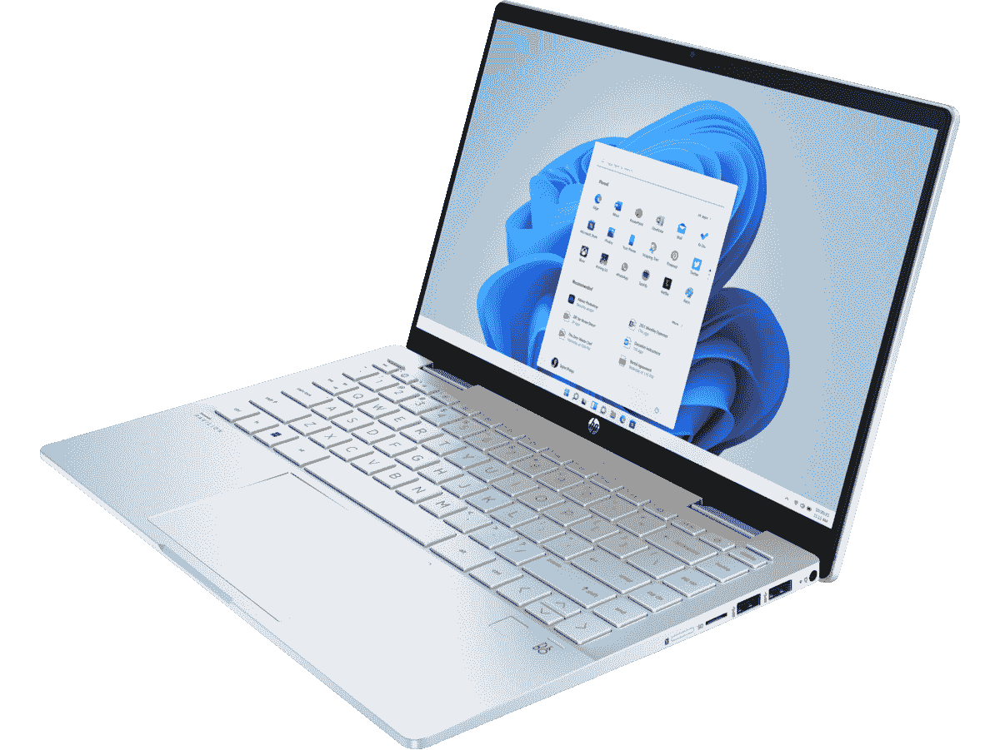

# 惠普返校优惠活动让您购买第 12 代英特尔 Omen 游戏电脑只需花费 450 美元

> 原文：<https://www.xda-developers.com/hp-back-to-school-deals-450-off-omen-gaming-pc/>

随着返校季的临近，公司开始提供优惠来帮助学生为即将到来的学年做准备。惠普也加入了这一行列，推出了一系列笔记本电脑、台式机和外围设备的交易，其中包括一些非常吸引人的返校季交易。

其中一个亮点肯定是 Omen 45L 游戏桌面，这是一款非常强大的 PC，价格便宜得多。该型号由英特尔酷睿 i7-12700H 提供支持，这是一款顶级桌面 GPU，具有 12 个内核、20 个线程，速度提升至 5GHz，外加 25MB 高速缓存。除此之外，您还可以获得 Nvidia GeForce RTX 3070 显卡、16GB 内存和 512GB 固态硬盘，以及 1TB 硬盘存储。它不是最新和最伟大的硬件，但这是一台功能强大的 PC，可以毫无问题地运行任何现代游戏，并且您可以在以后自己升级它。这种配置的建议零售价为 2，199.99 美元，但现在它降到了 1，699.99 美元，这对这款机器来说是一个非常好的价格。

*   <picture></picture>

    惠普 Pavilion x360 14 美元(优惠 100 美元)

    ##### 惠普 Pavilion x360 14

    惠普 Pavilion x360 14 包装了最新的英特尔处理器和一些学校使用的可靠规格，包括 16GB 的 RAM 和 256GB 的固态硬盘用于存储。另外，这是一辆敞篷车，所以它可以有多种用途。降到了 679.99 美元。

*   <picture></picture>

    HP Envy 34 一体机(250 美元起)

    ##### HP Envy 34 一体机

    HP Envy 34 是一款功能强大的一体机，具有强大的台式机处理器和显卡，加上超宽屏幕，非常适合完成工作。通常起价为 1999.99 美元，但现在降到了 1749.99 美元。

如果你不太喜欢游戏，那么惠普 Pavilion x360 14 也在返校季打折 100 美元。这是一个较小的折扣，但这是 Pavilion x360 的最新版本，这意味着它配备了第 12 代英特尔酷睿 i5-1235U，具有 10 个内核和 12 个线程，此外还有 16GB 内存和 256GB 固态硬盘。你还会得到一个全高清显示屏，由于这是一个可转换的，它还支持触摸和笔输入。通常，这将花费你 779.99 美元，但现在它下降到 679.99 美元，对于这个价格，这是一个伟大的学校笔记本电脑。

当然，一些家庭有多个孩子，不能为每个孩子都买一台笔记本电脑，所以共享的家庭电脑有时是最好的解决方案。如果你想要这样的东西，HP Envy 34 一体机是最好的选择之一。它由最高 8 核 16 线程的英特尔酷睿 i9-11900 驱动，另外它还具有最高 Nvidia GeForce RTX 3080 的专用显卡。如果你有多余的钱，你还可以获得高达 4TB 的存储空间和 128GB 的内存。惠普针对返校的每种配置都削减了 250 美元，因此现在起价仅为 1749.99 美元，但还可以更高。

如果这些交易不适合你，还有一些更好的选择，它们也不仅仅是电脑。还包括一些显示器和打印机。请查看以下内容:

**笔记本电脑:**

*   [Omen 16 笔记本电脑 16z-c000 (AMD 锐龙 5 5600H，Nvidia GeForce GTX 1650，8GB 内存，512GB 固态硬盘)——可定制，起价 859.99 美元](https://shop-links.co/1780440747587155532?u1=31700e72-1e10-4eb0-8b93-b92075af8b2c)(通常为 1099.99 美元)
*   [惠普 Envy x360 15(英特尔酷睿 i7-1195G7，12GB 内存，512GB 固态硬盘)-899.99 美元](https://shop-links.co/1780440747532031267?u1=027da006-80d7-49a5-be29-2d19264db7ea)(通常为 1159.99 美元)
*   [惠普 Pavilion x360 14t-dy000(英特尔酷睿 i3-1125G4，8GB 内存，256GB 固态硬盘)——469.99 美元](https://shop-links.co/1780440747958932772?u1=a7bb3c54-25d2-4385-a0d5-d299a2cdbf06)(通常为 629.99 美元)
*   [惠普 Pavilion 15(英特尔酷睿 i7-1195G7，16GB 内存，512GB 固态硬盘)——649.99 美元](https://shop-links.co/1780440748192853003?u1=66e3e0ba-decb-4ebe-b803-d2ce5c3bbe8b)(通常为 979.99 美元)
*   [惠普 ProBook 440 G9(英特尔酷睿 i7-1255U，16GB 内存，512GB 固态硬盘)——839.99 美元](https://shop-links.co/1780440749614703714?u1=51297b8f-4330-46ce-b72b-004530c2a397)(通常为 1403.48 美元)
*   [惠普 250 G8(英特尔酷睿 i5-1135G7，16GB 内存，256GB 固态硬盘)-729.99 美元](https://shop-links.co/1780440749515422973?u1=02fb630e-5063-41a1-a8b8-49ce49ef123a)(通常为 849 美元)
*   [惠普 ZBook Studio G8(英特尔酷睿 i7-11800H，英伟达 T1200，16GB 内存，512GB 固态硬盘)——2119 美元](https://shop-links.co/1780440749579759480?u1=08541151-7b98-4c1d-8f0b-07bfef2a911c)(通常为 4238 美元)
*   [惠普笔记本电脑 15(英特尔酷睿 i5-1135G7，8GB 内存，256GB 固态硬盘)-449.99 美元](https://shop-links.co/1780440750741217554?u1=a0e5d984-8425-4295-b043-d1447ba34b33)(通常为 599.99 美元)
*   [惠普 Chromebook x360 14(英特尔酷睿 i3-1125G4，8GB 内存，128GB 固态硬盘)-529.99 美元](https://shop-links.co/1780440750754629436?u1=a96ad01a-8b13-4cda-b117-d995bc6c183f)(通常为 659.99 美元)
*   [惠普 Chromebook 14b (AMD 速龙 3050C，4GB 内存，64GB MMC)——389.99 美元](https://shop-links.co/1780440751366635093?u1=92895de9-8c2f-4b54-b657-7c6fd1687c5d)(通常为 469.99 美元)

**台式机和一体机**

*   [Omen 45L 游戏台式机(AMD 锐龙 7 5800X，Nvidia GeForce RTX 3070，16GB 内存，512GB 固态硬盘，1TB 硬盘)-1，549.99 美元](https://shop-links.co/1780437709885599549?u1=8f2e103e-8f63-4a95-ad2e-89be0e12cd90)(通常为 2，299.99 美元)
*   [Victus 15L 游戏台式机(AMD 锐龙 7 5700G，AMD 镭龙 RX 6600XT，16GB 内存，512GB 固态硬盘，1TB 硬盘)-999.99 美元](https://shop-links.co/1780440751890914936?u1=bf872672-9e3f-4c7f-a53c-4560392c37f6)(通常为 1349.99 美元)
*   [Victus 15L 游戏台式机(AMD 锐龙 5 5600G，Nvidia GeForce GTX 1660 Super，8GB 内存，256GB 固态硬盘)799.99 美元起](https://shop-links.co/1780440752408224960?u1=420b8f4c-3b7a-4379-bb06-bec719461449)(通常为 919.99 美元)
*   [惠普 Pro Mini 400 G9(英特尔酷睿 i5-12500T，8GB 内存，1TB 硬盘)-729.99 美元](https://shop-links.co/1780440753342766597?u1=c5f83feb-ee2e-4c98-983a-05e215b8a167)(通常为 1440 美元)
*   [惠普 ProOne 600 21.5 英寸(英特尔酷睿 i5-10500，8GB 内存，256GB 固态硬盘)-852.75 美元](https://shop-links.co/1780440753860128079?u1=c5cb9769-5f58-406a-8df8-1f363a7c6aa6)(通常为 1895 美元)
*   [惠普 Pavilion AiO 24 (AMD 锐龙 3 5300U、8GB 内存、256GB 固态硬盘)——起价 699.99 美元](https://shop-links.co/1780440754869902360?u1=a0d7d5f7-b077-4580-b752-57fbed68a371)(通常为 799.99 美元)

**监视器**

**外设和配件:**

如果你对惠普的这些交易不感兴趣，[联想也在进行一些可能对你更有吸引力的返校交易](https://www.xda-developers.com/lenovo-back-to-school-deals-25-off-lenovo-yoga-6/)。不管怎样，如果你想在新学年开始前获得一些新装备，这里有一些很好的机会。