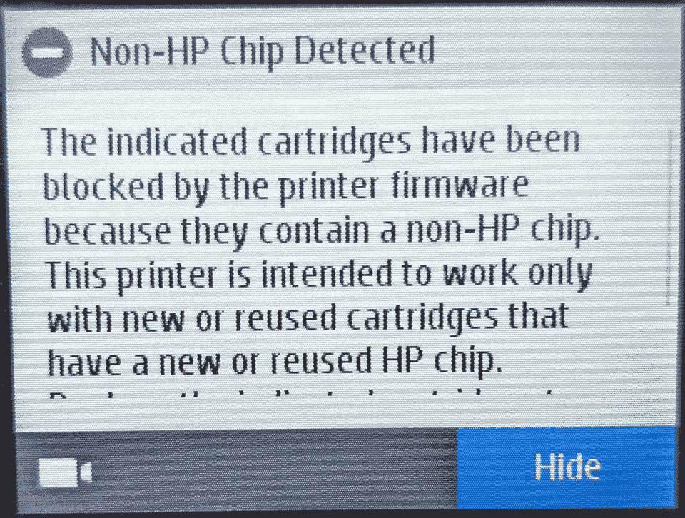

# 惠普通过新的固件更新阻止第三方墨水

> 原文：<https://www.xda-developers.com/hp-blocks-third-party-ink/>

没过多久，在一位惠普客户插话说新的固件更新锁定了第三方墨水后，数千人出现并作出了回应。惠普的动态安全功能在过去给客户带来过问题，但这次它又回来了，有效地杜绝了用户在其打印机中使用未经授权的第三方墨水。

虽然这个问题最初是在 Reddit 上报道的，但 T2 的 Ars Technica 对这个问题进行了深入研究，并联系惠普进行了评论。该公司对这一情况并不讳言，向新闻媒体发表声明解释了这一情况。

> 配备动态安全功能的打印机只能使用带有新的或重复使用的惠普芯片或电子电路的墨盒。打印机使用动态安全措施来阻止使用非惠普芯片或改良或非惠普电子电路的墨盒。重复使用惠普芯片或电子电路的重复使用、再制造和重新灌装的墨盒不受动态安全的影响。

而打印机通常会显示使用了非正品或未经授权的墨盒的警告。在最新的固件更新后，这些相同的打印机将不再接受第三方墨水，断然拒绝它们，并声明现在阻止使用这样的产品。您可以在下图中看到确切的消息。

 <picture></picture> 

image via [u/grhhull](https://www.reddit.com/user/grhhull/)

在这一点上，没有办法解决这个问题，所以如果您已经用最新的固件更新了您的较新的惠普打印机，您的打印机有可能不再接受来自第三方的墨水。不幸的是，没有办法确定哪些打印机收到了更新。也许一些用户会感到安慰，因为他们知道 2016 年 12 月之前生产的惠普打印机应该能够避免这些问题。

如果你有一台打印机当然很好，但是如果你想买一台新的打印机，那就完全是另一回事了。当然，在这种情况下，从没有将其打印机锁定到第三方墨水的公司购买打印机可能是一个更好的主意。

* * *

**来源** : [Reddit](https://www.reddit.com/r/assholedesign/comments/11l4kne/hp_have_updated_their_printers_to_outright_ban/)

**Via**:[Ars Technica](https://arstechnica.com/gadgets/2023/03/customers-fume-as-hp-blocks-third-party-ink-from-more-of-its-printers/)