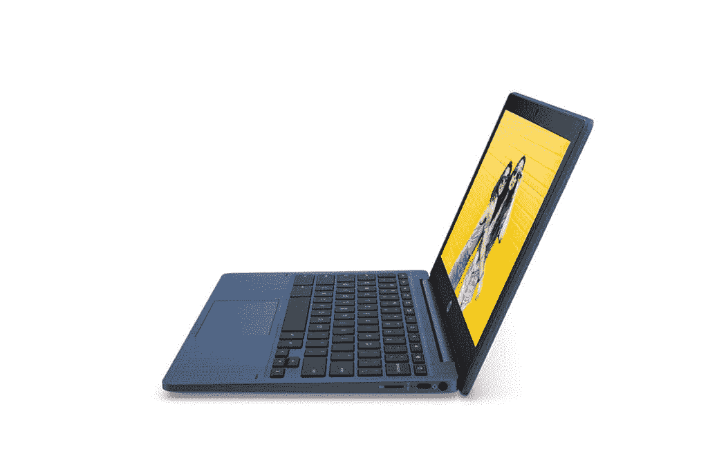

# 惠普 Chromebook 11a 在印度发布，聚焦学生需求

> 原文：<https://www.xda-developers.com/hp-chromebook-11a-india-launch/>

惠普今天在印度推出了一款新的经济型 Chromebook，名为 HP Chromebook 11a。新的 HP Chromebook 11a 由联发科的 MT8183 八核处理器提供支持，专为学生打造，无论是在家里还是在教室，他们都可以保持连接。随着疫情冠状病毒继续影响学校和其他教育机构，惠普希望通过提供数字化学习解决方案来提供帮助。

## 惠普 Chromebook 11a:规格

| 

规格

 | 

惠普 Chromebook 11a

 |
| --- | --- |
| **尺寸&重量** | 

*   285x192.8x16.8 毫米
*   1.05 千克

 |
| **显示** | 

*   11.6 英寸高清(1366 x 768) IPS 触摸屏
*   220 尼特亮度

 |
| **处理器** | 联发科 MT8183 八核处理器 |
| **GPU** | 马里武装部队-72 国集团 |
| **内存&存储** | 

*   4GB 内存
*   64GB 存储空间(MicroSD 卡插槽)

 |
| **电池&充电器** | 37 瓦时(声称 16 小时) |
| **输入/输出** | 

*   USB 类型-A
*   USB 类型-C
*   3.5 毫米耳机/麦克风组合插孔

 |
| **连通性** |  |
| **操作系统** | Chrome OS |
| **其他功能** | 100GB Google Drive 存储空间 |

新款 Chromebook 11a 采用小型封装，配有 11.6 英寸高清(1，366x768 像素)IPS 触摸屏显示器和从盖子延伸到键盘的鲜艳靛蓝色配色方案。它的重量只有 1.05 千克，据说便于携带，是早期学习者的理想选择，尤其是 2 至 7 年级的学生。如前所述，这款笔记本电脑采用联发科 MT8183 八核处理器，4GB 内存，64GB 存储，100GB 云存储，配有 Google One。该笔记本电脑还支持可扩展存储，因此您可以使用 microSD 卡添加高达 256GB 的额外存储空间。

## 

惠普声称，37 瓦时的电池应该可以持续长达 16 小时，而连接选项包括蓝牙 5.0、Wi-Fi 5、USB Type-A 端口、USB Type-C 端口和 3.5 毫米音频插孔。其他功能包括惠普的 True Vision 高清网络摄像头，内置谷歌助手支持，以及一年期谷歌一号订阅。

惠普印度市场个人系统高级总监维克拉姆·贝迪先生表示，*“随着印度教育形势的快速发展，我们必须为学生和教育工作者提供适合远程和混合学习环境的工具和技术。我们很高兴推出 HP Chromebook 11a，这是联发科 MT8183 八核处理器提供的强大功能和移动性的理想组合，将提升他们的学习体验，并以全新的方式提高工作效率”。*

### 定价和可用性

惠普 Chromebook 11a 在印度的定价为₹21,999(约 300 美元)，并将通过 Flipkart 独家销售。如果你正在寻找一款 Chromebook，请务必浏览我们的 2021 年最佳 chrome book 清单。