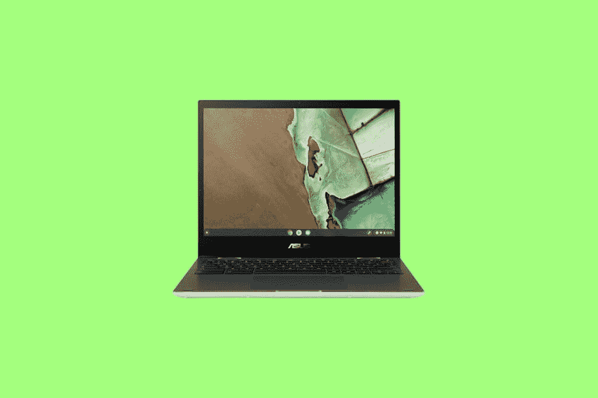
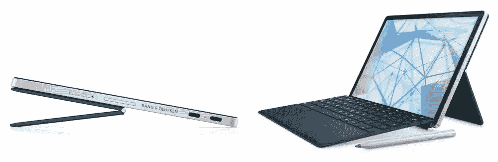
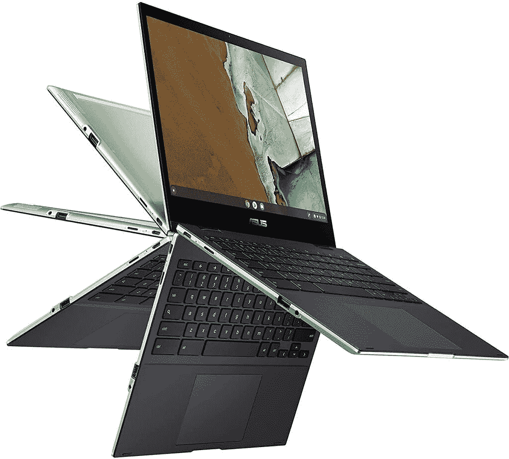
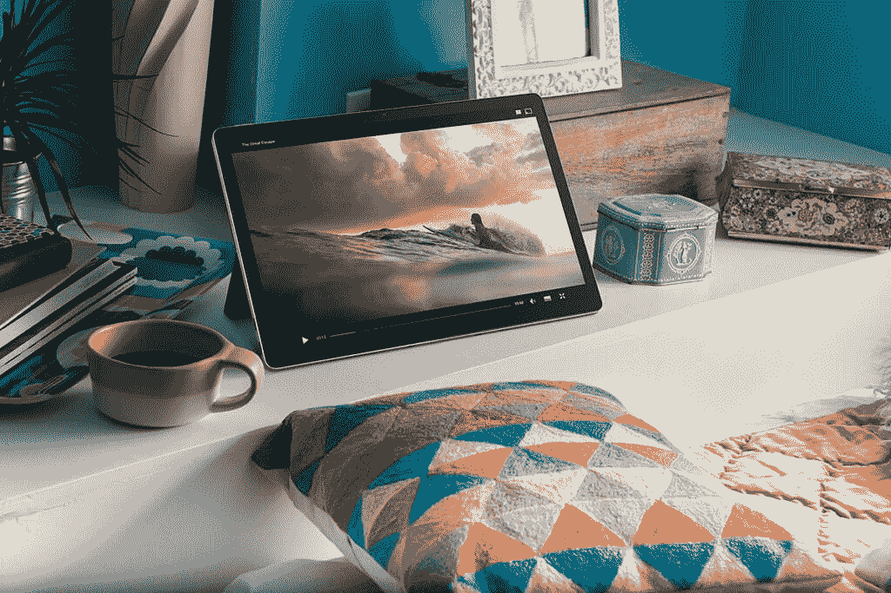

# 惠普 Chromebook x2 11 vs 华硕 Flip CM3:该买哪个？

> 原文：<https://www.xda-developers.com/hp-chromebook-x2-11-vs-asus-flip-cm3/>

惠普最近推出了新的 Chromebook x2 11，本月晚些时候可以在百思买和惠普自己的网站上购买。Chromebook x2 11 是我们在相当长一段时间内看到的第一款[新款 Chrome OS 平板电脑](https://www.xda-developers.com/best-chrome-os-tablets/)。它看起来是一个引人注目的产品，但考虑所有可用的选项总是一个好主意。另一方面，华硕 Flip CM3 提供了巨大的价值，是一款非常可靠的设备。在这次比较中，我们将了解这些平板电脑的不同之处，以及您今天应该购买哪一款。

| 规格 | 惠普 Chromebook x2 11 | 华硕 Flip CM3 |
| --- | --- | --- |
| **尺寸&重量** | 

*   9.94 英寸 x 6.96 英寸 x 0.3 英寸
*   2.57 磅

 | 

*   10.60 英寸 x 8.49 英寸 x 0.66 英寸
*   2.51 磅

 |
| **显示** | 

*   11 英寸 2160 x 1440(全高清)
*   IPS LED
*   触摸屏

 | 

*   12.0 英寸液晶显示器，220 尼特
*   1366 x 912 3:2 镜面显示屏，或 1920x1080 核心 M5 型号
*   触摸屏

 |
| **处理器** | 

*   高通骁龙 7c 计算平台
*   8 核
*   高通 Adreno 618 GPU

 | 

*   联发科 Kompanio 500(8183) 2.0 GHz 或英特尔酷睿 M5 处理器
*   Arm Mali-G72 MP3 或英特尔高清显卡

 |
| **内存&存储** | 

*   8GB 内存
*   64GB eMMc 存储

 | 

*   板载 4GB LPDDR4X
*   32 或 64GB eMMc 存储

 |
| **电池&充电** |  | 

*   32 小时，2S1P
*   双电池
*   锂离子电池

 |
| **安全** | 

*   H1 安全微控制器
*   指纹扫描仪

 |  |
| **前置摄像头** |  |  |
| **面向世界的摄像头** | 

*   惠普宽视野 800 万像素摄像头

 |  |
| **端口** | 

*   2 个超高速 USB 类型-C 5Gbps
*   3.5 毫米耳机插孔
*   microSD 读卡器

 | 

*   1 个 USB 2.0 类型 A
*   1 个 USB 2.0 Type-C
*   3.5 毫米耳机插孔
*   microSD 读卡器

 |
| **音频** | 

*   Bang & Olufsen 双扬声器音频
*   内置麦克风

 | 

*   内置扬声器
*   阵列麦克风

 |
| **连通性** | 

*   Atheros 802.11a/b/g/n/ac (2x2)无线网络
*   蓝牙 5.0

 | 

*   WiFi 802.11 a/b/g/n/ac
*   蓝牙 4.2

 |
| **软件** | Chrome OS | Chrome OS |
| **其他特征** | 

*   可拆卸键盘
*   USI 笔支架
*   起价 599 美元

 | 

*   Chiclet 键盘
*   华硕 USI 笔单独出售
*   可改变的
*   起价 329 美元

 |

## 惠普 Chromebook x2 11 与华硕 Flip CM3:设计和显示

从设计和制造开始，这些平板电脑在许多方面都有所不同。首先是

[HP Chromebook x2 11](https://www.xda-developers.com/best-hp-chromebooks/)

是真正的可拆卸，而华硕 Flip CM3 是可转换设计。这一点需要注意，尤其是在平板电脑模式下使用时，键盘会增加 CM3 的体积。如果在测量惠普 Chromebook x2 11 时包括可拆卸键盘，这两款平板电脑的重量相似。当然，CM3 在平板模式下会厚得多，因为它不可拆卸。

这里要提到的一点是，我们不知道惠普是否将 Chromebook x2 11 的键盘包括在他们的重量计算中。这意味着该设备作为平板电脑的真实重量可能与规格表中显示的略有不同。这是我们在自己评测惠普 Chromebook x2 11 时会测试和更新的内容。好消息是惠普在 HP Chromebook x2 11 的基础价格中包含了可拆卸键盘。惠普 Chromebook x2 11 由铝合金制成。华硕 Chromebook Flip CM3 是银色铝合金盖子和匹配的塑料底盘的混合。尽管有塑料机身，实际上 CM3 看起来和感觉比它的价格标签会建议更多的溢价。这两款平板电脑也都支持笔输入。惠普 Chromebook x2 11 和华硕 Flip CM3 都支持 USI 笔标准。惠普实际上包括了 Chromebook x2 11 的 USI 笔，它可以通过磁力附着在平板电脑上。用于 CM3 的 USI 笔是单独出售的——你可以从华硕购买官方的一支或者在亚马逊上选择第三方选项。

值得注意的一个关键区别是华硕 Flip CM3 缺乏生物识别安全性。这在 329 美元的价位上有些意料之中，但仍然有点令人失望。值得庆幸的是，惠普 Chromebook x2 11 配备了指纹扫描仪。令人耳目一新的是，许多高端 Chromebooks 都取消了生物识别安全选项，从而改善了用户体验。至于显示器，惠普 Chromebook x2 11 显然是这里的赢家。凭借更高分辨率的 FHD+面板和更高的亮度，华硕 CM3 在这一类别中简直是无与伦比。令人失望的是，CM3 只能提供 220 尼特的最大亮度。这使得它很难在户外环境中可靠地使用。

## 惠普 Chromebook x2 11 vs 华硕 Flip CM3:键盘和笔支持

如前所述，键盘附在华硕 Flip CM3 上，因此它当然包含在设备的价格中。惠普 Chromebook x2 11 包括可拆卸键盘和磁性附着 USI 笔。有了 Flip CM3，你就要多花 40-60 美元才能在设备上使用 USI 笔。这意味着如果你无论如何都需要笔支架，这两款平板电脑之间的价格差异实际上要小一些。

谈到键盘质量，惠普 Chromebook x2 11 仍有许多未知之处。华硕 Flip CM3 键盘的最初评价很好，因此即使在这款更便宜的设备上，你也将获得优质的打字体验。尽管如此，值得注意的是，CM3 上的键盘有点小而且拥挤——如果你的手很大，那可能不理想。Chromebook x2 11 键盘布局看起来不错，但在我们测试出来之前，我们不能肯定它有多好。

## 惠普 Chromebook x2 11 与华硕 Flip CM3:性能和电池

如果你正在寻找纸面上的性能赢家，那就是惠普 Chromebook x2 11。虽然我们还不太了解真实世界的性能，但在基准测试中，惠普平板电脑中的新处理器将轻松超过 CM3 中的联发科处理器。

华硕 Flip CM3 内置联发科 Kompanio 500 动力相当不足。你可以应付基本的网页浏览和低效率，但任何严肃的多任务处理都是相当困难的。如果你想玩任何类型的游戏或运行强大的 Linux 应用程序，CM3 不是适合你的 Chrome 平板电脑。惠普 Chromebook x2 11 似乎有可能在理论上和实践中获得整体性能的冠军，这是我们可以并将在我们的评测中测试的。理论上，这两款设备从各自的原始设备制造商那里获得了相似的电池额定值。Flip CM3 评论表明，华硕平板电脑在现实世界中的使用时间约为 7-8 小时，如果只是浏览网页，则超过 12 小时。这是很常见的，我们通常会期望惠普 Chromebook x2 11 的电池寿命类似。不过，Chromebook x2 11 内部的骁龙 7c 处理器可能会延长电池寿命。如果惠普对平板电脑进行优化，以利用 7c 的功能，我们可以看到电池寿命显著提高。

## 惠普 Chromebook x2 11 与华硕 Flip CM3:相机和音频

在过去的 18 个月中，视频通话因持续的疫情而变得突出。大多数 Chromebooks 仍然有普通的 720p 网络摄像头，根本没有后置摄像头。

相机质量是惠普 Chromebook x2 11 的一个突出特点。惠普在正面和背面都配备了 FHD+分辨率的摄像头，一个 500 万像素的前置摄像头和 800 万像素的宽视野后置摄像头。在变焦、微软团队和谷歌相遇的时代，这些相机是一件大事。不幸的是，华硕 Flip CM3 采用了前面提到的更普通的 720p 摄像头。对于一款更便宜的设备来说，这有点出乎意料，但如果你经常进行视频通话，惠普 Chromebook x2 11 显然是赢家。HP Chromebook x2 11 配有 Bang 和 Olufsen 调谐的双扬声器，因此这款平板电脑在音频方面的表现应该令人钦佩。华硕 Flip CM3 上的扬声器相对令人失望，音量低，低音几乎不存在。对于许多成本较低的 Chromebooks 来说，这是一个大问题。

## 结论

虽然这两款设备各有利弊，但在 2021 年，惠普 Chromebook x2 11 拥有华硕 Flip CM3 缺少的太多功能。您不仅可以获得更新的英特尔处理器，还可以获得附带的可拆卸键盘、USI 笔和更长的 Chrome OS 支持时间线。惠普 Chromebook x2 11 有望成为

[best Chromebooks of 2021](https://www.xda-developers.com/best-chromebooks/)

。尽管惠普 Chromebook x2 11 售价很高，但所提供的价值非常令人印象深刻。请记住，翻盖 CM3 不包括 USI 笔，因此，如果您需要笔支持，则需要额外的费用。只需大约 200 美元的差价，您就可以从 HP Chromebook x2 11 获得一个具有真正平板电脑功能的更高级的软件包。

### 惠普 Chromebook x2 11

惠普 Chromebook x2 11 结合了 Chrome OS 的强大功能和传统平板电脑的便携性。借助可选的 4G LTE 功能，您可以在任何地方工作。这是全新的顶级 Chrome OS 平板电脑体验。

**Affiliate Links**

Store

[View at Store](https://shop-links.co/1750090781992462055?u1=1630a6a2-688a-46f3-958d-70d5f9507f2f)

Store

[View at Store](https://shop-links.co/1750090782856106551?u1=6ac519a3-78d7-4bc6-b262-3388d10111c9)

### 华硕 Chromebook Flip CM3

Chromebook 的电池续航时间令人惊叹。但使用 Flip CM3，一次充电可以使用多达 16 小时。如果你不介意一个联发科处理器的话，这就是日夜耐用的 Chromebook。

**Affiliate Links**

Amazon

[View at Amazon](https://www.amazon.com/ASUS-Chromebook-Touchscreen-Processor-CM3200FVA-DS42T/dp/B094JZVHZY/?tag=xda-1p8ld52-20&ascsubtag=UUxdaUeUpU4626&asc_refurl=https%3A%2F%2Fwww.xda-developers.com%2Fhp-chromebook-x2-11-vs-asus-flip-cm3%2F&asc_campaign=Short-Term)