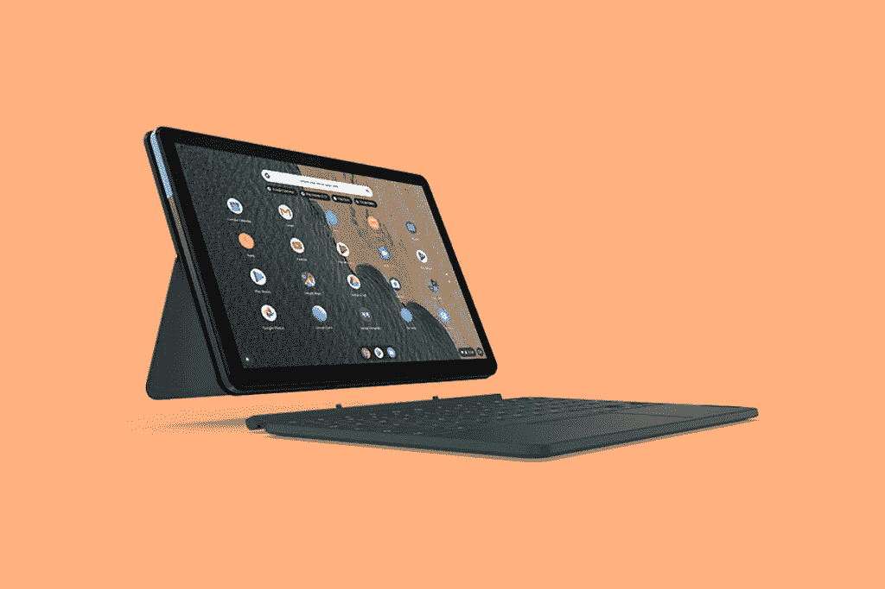
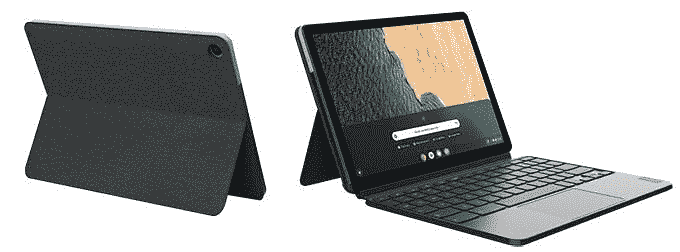

# 惠普 Chromebook x2 11 vs 联想 Chrome book Duet:Chrome OS 平板电脑之战

> 原文：<https://www.xda-developers.com/hp-chromebook-x2-11-vs-lenovo-chromebook-duet/>

惠普最近推出了新的 Chromebook x2 11，本月晚些时候可以在百思买和惠普自己的网站上购买。Chromebook x2 11 是我们在相当长一段时间内看到的第一款[新款 Chrome OS 平板电脑](https://www.xda-developers.com/best-chrome-os-tablets/)。它看起来是一个引人注目的产品，但考虑所有可用的选项总是一个好主意。另一方面，联想 Chromebook Duet 更加实惠。在这次比较中，我们将了解这些 Chrome OS 平板电脑有何不同，以及您今天应该购买哪一款。

| 规格 | 惠普 Chromebook x2 11 | 联想 Chromebook Duet |
| --- | --- | --- |
| **尺寸&重量** | 

*   9.94 英寸 x 6.96 英寸 x 0.3 英寸
*   2.57 磅

 | 

*   9.44 英寸 x 6.29 英寸 x 0.29 英寸(仅限平板电脑)
*   0.99 磅(仅限平板电脑)

 |
| **显示** | 

*   11 英寸 2160 x 1440(全高清)
*   IPS LED
*   触摸屏

 | 

*   10.1 英寸 FHD (1920 x 1200) IPS
*   400 尼特
*   触摸屏

 |
| **处理器** | 

*   高通骁龙 7c 计算平台
*   8 核
*   高通 Adreno 618 GPU

 | 

*   联发科 Helio P60T 处理器(2.00 GHz，8 核，8 线程)
*   集成 ARM G72 MP3 800GHz

 |
| **内存&存储** | 

*   8GB 内存
*   64GB eMMc 存储

 | 

*   板载 4GB LPDDR4X
*   高达 128GB eMMc

 |
| **电池&充电** |  | 

*   长达 10 小时
*   基于较低的亮度设置进行估计

 |
| **安全** | 

*   H1 安全微控制器
*   指纹扫描仪

 |  |
| **前置摄像头** |  | 

*   200 万像素固定焦距，带 LED 指示灯

 |
| **面向世界的摄像头** | 

*   惠普宽视野 800 万像素摄像头

 |  |
| **端口** | 

*   2 个超高速 USB 类型-C 5Gbps
*   3.5 毫米耳机插孔
*   microSD 读卡器

 | 

*   1 个 USB-C(第二代)
*   5 点弹簧针

 |
| **音频** | 

*   Bang & Olufsen 双扬声器音频
*   内置麦克风

 | 

*   2 个杜比 Audi0 扬声器
*   智能放大器

 |
| **连通性** | 

*   Atheros 802.11a/b/g/n/ac (2x2)无线网络
*   蓝牙 5.0

 | 

*   802.11 a/b/g/n/ac、MIMO、2x2、2.4GHz/5GHz 双频带
*   蓝牙 4.2

 |
| **软件** | Chrome OS | Chrome OS |
| **其他特征** | 

*   可拆卸键盘
*   USI 笔支架
*   起价 599 美元

 | 

*   可拆卸键盘
*   部分型号中包含笔
*   起价 219 美元

 |

## 惠普 Chromebook x2 11 与联想 Chromebook Duet:设计和显示

从设计和制造开始，这些平板电脑在许多方面都很相似。首先是

[HP Chromebook x2 11](https://www.xda-developers.com/best-hp-chromebooks/)

和联想 Chromebook Duet 都是真正的可拆卸设备。这一点值得注意，尤其是当在平板电脑模式下使用时，键盘会增加变形本的体积。如果在测量惠普 Chromebook x2 11 时不包括可拆卸键盘，这两款平板电脑的重量差不多。当两个键盘外壳都连接上时，二重奏会轻一点。

这里要提到的一点是，我们不知道惠普是否将 Chromebook x2 11 的键盘包括在他们的重量计算中。这意味着该设备作为平板电脑的真实重量可能与规格表中显示的略有不同。这是我们在自己评测惠普 Chromebook x2 11 时会测试和更新的内容。好消息是惠普在 HP Chromebook x2 11 的基础价格中包含了可拆卸键盘。惠普 Chromebook x2 11 由铝合金制成。另一方面，联想 Chromebook Duets 有一个吸引人的外观，尽管主要是塑料材质。在键盘外壳上滑动，您可以在随身携带二重奏时获得抓握的织物纹理。毫无疑问，惠普 Chromebook x2 11 是更高端的设备，但联想 Duet 看起来足够好。这两款平板电脑也都支持笔输入。惠普 Chromebook x2 11 和联想 Chromebook Duet 都支持 USI 笔标准。惠普实际上包括了 Chromebook x2 11 的 USI 笔，它可以通过磁力附着在平板电脑上。用于二重唱的 USI 笔包含在某些型号中，否则你可以单独购买或作为第三方选项从亚马逊购买。

值得注意的一个关键区别是二重唱缺乏生物特征安全性。这在 329 美元的价位上有些意料之中，但仍然有点令人失望。值得庆幸的是，惠普 Chromebook x2 11 配备了指纹扫描仪。令人耳目一新的是，许多高端 Chromebooks 都取消了生物识别安全选项，从而改善了用户体验。至于显示器，惠普 Chromebook x2 11 显然是这里的赢家。Chromebook x2 11 采用了分辨率更高的 FHD+面板，看起来更加清晰，尽管这两款平板电脑都提供了足够的亮度。说到底，联想 Chromebook Duet 在这一类别中根本无法匹敌。

## 惠普 Chromebook x2 11 vs 联想 Chromebook Duet:键盘和笔支持

对于联想 Chromebook Duet，可拆卸键盘包含在所有型号的价格中。惠普 Chromebook x2 11 包括可拆卸键盘和磁性附着 USI 笔。有了二重奏，某些型号包括 USI 笔，而其他没有。这意味着，如果你无论如何都需要笔支架，这两款平板电脑之间的价格差异实际上可以小一点。

谈到键盘质量，惠普 Chromebook x2 11 仍有许多未知之处。对联想 Chromebook Duet 键盘的最初评论褒贬不一。许多评论者发现键盘有点小而且拥挤——如果你的手很大，那可能就不理想了。Chromebook x2 11 键盘布局看起来不错，但在我们测试出来之前，我们不能肯定它有多好。

## 惠普 Chromebook x2 11 vs 联想 Chromebook Duet:性能和电池

如果你正在寻找纸面上的性能赢家，那就是惠普 Chromebook x2 11。虽然我们还不太了解真实世界的性能，但在基准测试中，惠普平板电脑中较新的骁龙 7c 将轻松超过 CM3 中的联发科处理器。

联想 Chromebook Duet 内部搭载联发科 Helio P60T 动力相当不足。你可以应付基本的网页浏览和轻度的生产力，但任何严重的多任务处理将非常困难。如果你想玩任何类型的游戏或运行强大的 Linux 应用程序，Duet 并不适合你。惠普 Chromebook x2 11 似乎有可能在理论上和实践中获得整体性能的冠军，这是我们可以并将在我们的评测中测试的。理论上，这两款设备从各自的原始设备制造商那里获得了相似的电池额定值。Duet 评论显示，联想平板电脑在现实世界中的使用时间约为 10 小时，如果只是浏览网页，则超过 12 小时。这是很常见的，我们通常会期望惠普 Chromebook x2 11 的电池寿命类似。不过，Chromebook x2 11 内部的骁龙 7c 处理器可能会延长电池寿命。如果惠普对平板电脑进行优化，以利用 7c 的功能，我们可以看到电池寿命显著提高。

## 惠普 Chromebook x2 11 vs 联想 Chromebook Duet:相机和音频

在过去的 18 个月中，视频通话因持续的疫情而变得突出。大多数 Chromebooks 仍然有普通的 720p 网络摄像头，根本没有后置摄像头。

相机质量是惠普 Chromebook x2 11 和联想 Chromebook Duet 的一个突出特点。惠普和联想在正面和背面都配备了 FHD 或 FHD+分辨率的摄像头。惠普 Chromebook x2 11 配备了一个 500 万像素的前置摄像头和 800 万像素的宽视野后置摄像头。至于 Duet，它配有一个 800 万像素的后置摄像头和一个 200 万像素的前置摄像头，用于视频通话。在变焦、微软团队和谷歌相遇的时代，这些相机是一件大事。幸运的是，这两款 Chrome OS 平板电脑在视频通话方面都能胜任。HP Chromebook x2 11 配有 Bang 和 Olufsen 调谐的双扬声器，因此这款平板电脑在音频方面的表现应该令人钦佩。联想 Chromebook Duet 的扬声器也令人印象深刻，同样采用了双设置。联想在二重唱上以如此低的价格在音频方面取得的成就令人印象深刻。

## 结论

这真的很难判断。虽然惠普 Chromebook x2 11 拥有高级版本，并配备了一些高端功能，但联想 Chromebook Duet 的价格低于 250 美元，非常超值。如果你打算玩很多安卓游戏或者需要长时间打字，那么选择惠普 Chromebook x2 11 可能是个不错的主意。如果你只是想消费媒体和处理偶尔的生产力任务，Duet 是一个很好的选择，价格低得多。无论如何，联想 Chromebook 无疑是 2020 年最好的 chrome book 之一。惠普 Chromebook x2 11 有望成为

[best Chromebooks of 2021](https://www.xda-developers.com/best-chromebooks/)

.

### 惠普 Chromebook x2 11

惠普 Chromebook x2 11 结合了 Chrome OS 的强大功能和传统平板电脑的便携性。借助可选的 4G LTE 功能，您可以在任何地方工作。这是全新的顶级 Chrome OS 平板电脑体验。

**Affiliate Links**

Store

[View at Store](https://shop-links.co/1750090781992462055?u1=1630a6a2-688a-46f3-958d-70d5f9507f2f)

Store

[View at Store](https://shop-links.co/1750090782856106551?u1=6ac519a3-78d7-4bc6-b262-3388d10111c9)

### 联想 Chromebook Duet

联想 Chromebook Duet 是目前你能买到的最好的可拆卸 Chromebook 之一，而且，你不需要倾家荡产去买一台。

**Affiliate Links**

Amazon

[View at Amazon](https://www.amazon.com/dp/B0856QVM2F/?tag=xda-534odj5-20&ascsubtag=UUxdaUeUpU4756&asc_refurl=https%3A%2F%2Fwww.xda-developers.com%2Fhp-chromebook-x2-11-vs-lenovo-chromebook-duet%2F&asc_campaign=Short-Term)