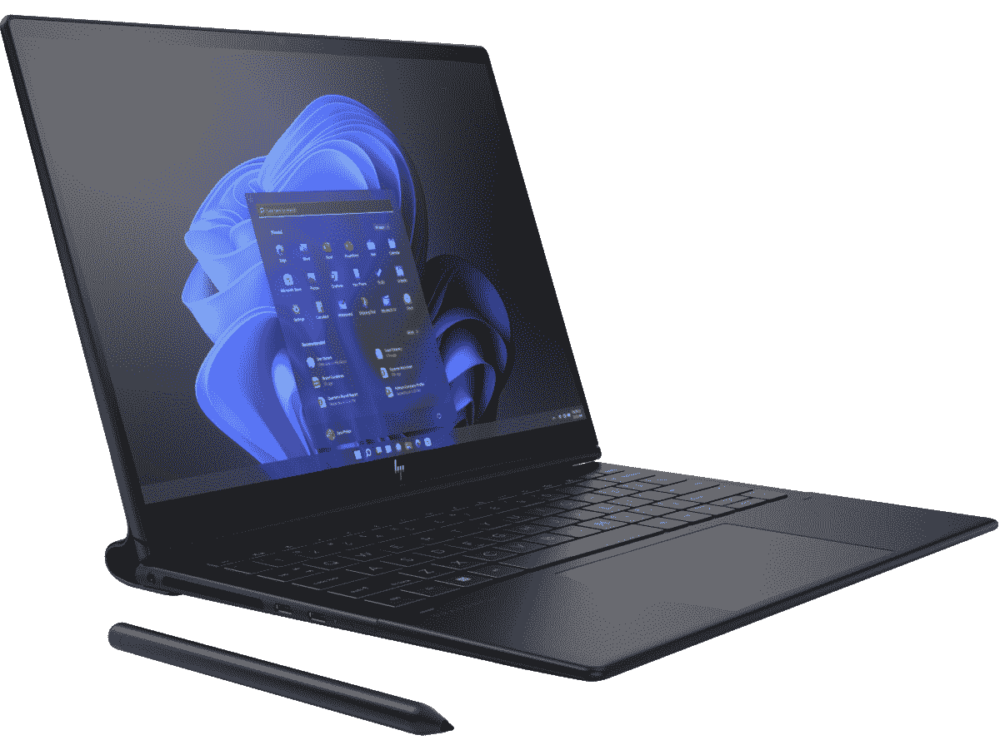

# 惠普蜻蜓 Folio G3 与戴尔 XPS 13 二合一设备:您应该购买哪个？

> 原文：<https://www.xda-developers.com/hp-dragonfly-folio-g3-vs-dell-xps-13-2in1/>

*   <picture></picture>

    惠普 Elite 蜻蜓对开本 G3

    ##### 惠普蜻蜓对开本 G3

    惠普蜻蜓对开本 G3 带来了罕见的向前拉动式设计，通过附带的活动笔带来了出色的平板电脑和绘图体验。它具有额外的安全性和高级功能，性能非常好，显示屏非常出色。如果你想要一台商务笔记本电脑，并且有足够的钱，这可能是最好的选择。

*   ##### 戴尔 XPS 13 二合一设备

    戴尔 XPS 13 二合一设备代表了可拆卸设计的回归，配备了 13 英寸高分辨率触摸屏、第 12 代英特尔酷睿 CPU 以及对开键盘和触摸板风格。它没有蜻蜓 Folio G3 那么多高端安全功能，但价格也低得多。

惠普和戴尔都有一些高端可转换笔记本电脑，包括[蜻蜓 Folio G3](https://www.xda-developers.com/hp-dragonfly-folio/) 和 [XPS 13 二合一(9315)](https://www.xda-developers.com/dell-xps-13-2-in-1-2022/) 。戴尔 XPS 采用 2 合 1 设计，允许键盘和触摸板完全脱离显示屏部分，让您可以将它作为真正的平板电脑使用。惠普的蜻蜓 Folio 也被认为是一款敞篷车，尽管它有一个相当罕见的向前拉的设计，并没有真正遵循传统的 PC 设计。无可否认，这两款都是不错的笔记本电脑，但你只想要一款。让我们来看看它们是如何比较的，以帮助你做出正确的决定。

## 惠普蜻蜓 Folio G3 与戴尔 XPS 13 二合一设备:定价和可用性

惠普大概是目前你唯一能可靠找到新款蜻蜓 Folio G3 的地方，价格约为 2379 美元起。这种配置为您带来了[第 12 代英特尔](https://www.xda-developers.com/intel-12th-gen-p-u-series-chips/)酷睿 i7 处理器(CPU)、16GB 内存、512GB 固态硬盘(SSD)和 1920x1280 分辨率的 13.5 英寸触摸屏。价格只会从那里上涨，而且有足够的机会根据你的喜好配置更多或更少的硬件。如果你全力以赴，价格会远远超过 3000 美元，这意味着这款笔记本电脑真的不适合那些没钱花的人。

戴尔的 XPS 13 二合一(9315)也最可靠地在其官网上找到，价格为 999 美元左右。这是一个更容易接受的价格，使戴尔在竞争中处于领先地位。这一入门价格包括第 12 代英特尔酷睿 i5-1230U CPU、8GB 内存、512GB 固态硬盘和 13 英寸 3K 触摸屏。然而，这个价格不包括为平板电脑增加触摸板和键盘的 XPS Folio。添加一个 XPS Folio 大约需要 100 美元，添加 XPS 触控笔也需要 100 美元的额外费用。整个套餐仍然只有 1199 美元，只是蜻蜓 Folio G3 价格的一小部分。

XPS 13 2 合 1 最高可配酷睿 i7-1250U CPU、16GB 内存和 1TB 固态硬盘；包括 XPS Folio 和触控笔在内，价格为 1649 美元。

## 惠普蜻蜓 Folio G3 与戴尔 XPS 13 二合一设备:规格

让我们来看看每台笔记本电脑的具体规格。

|  | 

惠普蜻蜓对开 G3

 | 

戴尔 XPS 13 二合一设备(9315)

 |
| --- | --- | --- |
| 

操作系统（Operating System）

 | 

*   Windows 11 专业版
*   Windows 10 专业版
*   FreeDOS

 | 

*   Windows 11 专业版
*   Windows 11 主页

 |
| 

中央处理器

 | 

*   第 12 代英特尔
*   酷睿 i5-1235U
*   酷睿 i5-1245U 博锐处理器
*   酷睿 i7-1255U
*   酷睿 i7-1265U 博锐处理器

 | 

*   第 12 代英特尔
*   酷睿 i5-1230U
*   酷睿 i7-1250U

 |
| 

制图法

 | 

*   英特尔 Iris Xe(集成)

 | 

*   英特尔 Iris Xe(集成)

 |
| 

显示

 | 

*   13.5 英寸触摸屏，3:2 宽高比
*   1920x1280 (FHD+)，400 尼特，低蓝光，有光泽
*   1920x1280 (FHD+)，400 尼特，低蓝光，防眩光
*   1920x1280 (FHD+)，1000 尼特，低蓝光，SureView 隐私，光泽
*   3000x2000 (3K2K)，有机发光二极管，400 尼特，低蓝光，有光泽

 | 

*   13 英寸触摸屏，3:2 宽高比
*   2880x1920 (3K)，500 尼特，100% sRGB，60Hz，防反光，DisplayHDR 400，低蓝光，杜比视觉

 |
| 

储存；储备

 | 

*   256GB、512GB M.2 PCIe 4.0 NVMe 自加密固态硬盘
*   256GB、512GB、1TB M.2 PCIe 4.0 NVMe 固态硬盘
*   一个 M.2 插槽，可升级

 | 

*   512GB，1TB M.2 PCIe 4.0 NVMe 固态硬盘
*   不可升级

 |
| 

随机存取存储

 | 

*   16GB，32GB LPDDR5-6400MHz
*   双通道，焊接

 | 

*   8GB、16GB LPDDR4x-4267MHz
*   双通道，焊接

 |
| 

电池

 |  |  |
| 

港口

 | 

*   两个 Thunderbolt 4、3.5 毫米音频、Nano SIM 卡(可选)

 | 

*   两个 Thunderbolt 4，SIM 卡插槽(可选)

 |
| 

声音的

 | 

*   四 B&O 扬声器
*   分立放大器

 | 

*   双 2W 扬声器
*   Waves MaxxAudio Pro 智能放大器

 |
| 

照相机

 | 

*   前置 800 万像素 100 度 FOV
*   相机快门(软件)
*   人体存在检测

 | 

*   前置 FHD (30FPS) RGB
*   前置 480p (60FPS)红外
*   后置 4K (30FPS) RGB

 |
| 

Windows Hello

 |  | 

*   指纹读取器
*   红外照相机

 |
| 

无线的

 | 

*   Wi-Fi 6E
*   蓝牙 5.3
*   5G/4G LTE(可选)

 | 

*   Wi-Fi 6E
*   蓝牙 5.2
*   5G/4G LTE(可选)

 |
| 

颜色

 |  |  |
| 

规模

 | 

*   11.67 x 9.22 x 0.7 英寸(296.4 毫米 x 234mm 毫米 x 17.8mm 毫米)

 | 

*   11.5 x 7.9 x 0.29 英寸(292.5 毫米 x 201.2mm 毫米 x 7.9 毫米)

 |
| 

重量

 |  | 

*   平板电脑从 1.6 磅(736 克)起
*   对开:1.23 磅(560 克)起

 |
| 

赛马或赛狗开始时生效的投注赔率

 |  |  |

## 设计和功能

蜻蜓 Folio G3 在技术上是一款可转换的笔记本电脑，可以改变形式以增加多功能性，但它与市场上的许多其他笔记本电脑不同。与 Surface Laptop Studio 非常相似，惠普的笔记本电脑有一个可以向前拉的显示屏，可以放在键盘和触摸板之间。它可以再次向前拉，以获得更深的角度，模拟用于绘画的石板，如果你想把它用作平板电脑，它几乎可以变平。作为一款平板电脑，由于折叠机制(以及键盘和触摸板不会分离的事实)，它比 XPS 13 二合一设备厚得多，因此那些寻求真正平板电脑体验的人可能会希望坚持使用 XPS PC。

蜻蜓得名于一种人造皮革包裹，覆盖了整个盖子和铰链部分。铰链周围是一个镁帽，可以保护机械装置，并增加移动时的抓握力。这是一台商用笔记本电脑，看起来的确如此。这种包装给笔记本电脑带来了更专业的氛围，并为铝制机身增加了一些保护。就外观和风格而言，这是最好的惠普笔记本电脑之一。

戴尔的 XPS 13 二合一设备遵循了由 [Surface Pro 9](https://www.xda-developers.com/surface-pro-9-5g-review/) 等产品流行的设计，配有可拆卸键盘和独立平板电脑。没有 XPS Folio(戴尔称之为键盘和触摸板部分)，您可以像使用任何其他平板电脑一样使用 XPS 13。它很薄，很轻，3:2 的长宽比非常理想。与 Surface Pro 9 不同，它没有内置支架；这是与 XPS Folio 捆绑在一起的。在他的 [XPS 13 二合一(9315)评测](https://www.xda-developers.com/dell-xps-13-2-in-1-2022-review/)中，主编 Rich Woods 指出，“从设计角度来看，当谈到 Windows 平板电脑时，我不认为你能击败[XPS 13 二合一]。”

XPS 13 2 合 1 在端口方面相当纤薄。它只有两个 Thunderbolt 4，没有 3.5 毫米音频插孔或 SD 读卡器。如果你找到一个 5G LTE 型号，你会得到一个 SIM 插槽，但仅此而已。蜻蜓 Folio G3 的两个 Thunderbolt 4 端口也好不到哪里去，但至少它为没有蓝牙耳机的人保留了一个 3.5 毫米的音频插孔。请记住，如果需要，您可以轻松添加一个 [great Thunderbolt dock](https://www.xda-developers.com/best-thunderbolt-docks/) 来扩展连接。支持 5G LTE 的型号也有一个 SIM 卡插槽。这两款笔记本电脑都有 Wi-Fi 6E 和现代蓝牙功能，无论它们内部是否有额外的无线数据硬件。

我最近经常使用蜻蜓 Folio G3，我非常喜欢它的键盘和触摸板设置。按键有足够的行程，键帽很大，一切都间隔得很好。白色背光很好地抵消了黑键。触摸板很大，但在打字时不会碍事，点击的坚定程度与这个价位的笔记本电脑相当。我可以毫无问题地快速打字。虽然蜻蜓 Folio G3 带来了熟悉的打字和指点体验，但 XPS 13 2 合 1 可连接硬件可能需要一些时间来适应。

XPS Folio 的支架不稳定，不容易放在膝盖上使用，键盘是平的，而不是像 Surface Pro 那样呈一定角度。主编 Rich Woods 因为按键太紧而很难准确打字，他预计戴尔将在下一代产品中做出一些重大改变。好消息是，你不必购买 XPS Folio 蓝牙键盘将完成这项工作，尽管您将错过戴尔打算提供的全套服务。底线？如果你打字很多，蜻蜓 Folio G3 将是更好的选择。

## 音频和摄像头

蜻蜓 Folio G3 相机

惠普设计了蜻蜓 Folio G3，无论您如何使用，它都不会产生低沉的音频。它将四个 B&O 扬声器与一个分立放大器打包在一起，以提高音量；两个扬声器位于键盘和显示器之间，而另外两个位于笔记本电脑的前边缘。当您改变使用笔记本电脑的方式时，音频会被智能地调节，使声音尽可能好地指向您。扬声器响亮清晰，在较高的音量水平下没有噼啪声或失真，带来出色的听觉体验。

XPS 13 2 合 1 的双 2W 扬声器与 MaxxAudio Pro 智能放大器相结合，提高了音质。扬声器安装在机箱的两侧，当您将电脑作为平板电脑使用时，扬声器的声音可能会变得低沉。对于平板电脑来说，声音很大，但没有什么特别的地方可以放在 Folio G3 之前。请记住，XPS 13 二合一设备缺少 3.5 毫米音频插孔，因此如果您对音频质量不满意，您将不得不购买一些[无线耳塞](https://www.xda-developers.com/best-wireless-earbuds/)。

XPS 13 2 合 1 的摄像头质量则是另一回事。这一系列相机是 XPS 笔记本电脑中最好的，任何喜欢将平板电脑用作兼职相机的人都将从中受益。面向用户的摄像头分离了红外和 RGB 模块，提供了比混合设置更好的画面。它具有 1080 p(500 万像素)的分辨率，用于清晰的视频会议，而平板电脑背面面向世界的摄像头达到了 4K(100 万像素)的分辨率，用于清晰的静止图像和视频。谈到摄影潜力，这是[最好的戴尔笔记本电脑](https://www.xda-developers.com/best-dell-laptops/)之一。

惠普的笔记本电脑只配备了一个 800 万像素的前置摄像头，具有 100 度的视野，可以清晰地进行会议。人体存在检测功能可以在你接近或离开时让你登录和退出笔记本电脑，这是为了额外的隐私，还有一个基于软件的相机快门，可以在你不需要时关闭馈送。这是专业人士的更好选择，他们想要一些额外的安全功能，并不介意失去面向世界的相机。

## 显示和上墨

惠普蜻蜓 Folio G3 有四种不同的显示器可供选择，根据功能和价格，您应该能够找到您需要的。所有显示器都有 3:2 的宽高比、触摸功能和墨水支持。最实惠的 Folio G3 显示屏分辨率为 1920x1280 (FHD+)，表面光滑，亮度为 400 尼特；如果你不介意多付一点钱，你也可以得到一个防眩光的表面。

惠普的 Sure View 显示器也可用于 Folio G3，在公共场所工作时增加了大量隐私。按下一个按钮，屏幕就大大缩小了视野，只有你能看到。Sure View 显示器具有相同的 FHD+分辨率和光滑表面，但其亮度提高到了 1000 尼特。最后，蜻蜓 Folio G3 最优质的显示器具有 3000x2000 分辨率、OLED 面板、400 尼特亮度和光滑表面。它为那些离不开深黑色和浅白色的人提供了最好的颜色。

戴尔只为其 XPS 13 二合一设备(9315)提供了一个 13 英寸触摸屏。它具有 3:2 的纵横比、2880x1920 的分辨率、500 尼特的亮度、60Hz 的刷新率、抗反射涂层、杜比视觉和 DisplayHDR 400。虽然你没有多种选择，但这里的单一显示器非常适合工作和看电视或电影。额外支付 100 美元将 XPS 触控笔添加到组合中，将为您带来 4，096 级压力灵敏度和倾斜支持的优质墨迹书写体验。它通过磁性附着在平板电脑的顶部边缘，可以自动充电。

蜻蜓 Folio G3 配备了一个活动笔，具有 4，096 级压力灵敏度，倾斜支持和多个可定制的按钮。它通过磁性附着在 Folio G3 的侧面，虽然它有一个小柱子，可以延伸以更好地保持它的位置。

## 性能、电池和安全性

这两款笔记本电脑都配备了英特尔的第 12 代酷睿 U 系列 CPU，尽管型号之间存在一些差异。XPS 13 2 合 1 的无风扇设计使用酷睿 i5-1230U 或酷睿 i7-1250U 芯片，TDP 较低，为 9W。相反，惠普蜻蜓 Folio G3 配备了 15W 酷睿 i5-1235U 和酷睿 i7-1255U，以及它们面向商业领域的博锐变体。

你可以为 Folio G3 配备高达 32GB 的 LPDDR5-6400MHz RAM 和高达 1TB 的 M.2 PCIe 4.0 NVMe 固态硬盘，从而提供一些令人印象深刻的性能。您甚至可以配备自加密固态硬盘(高达 512GB)，以获得额外的安全性。XPS 13 二合一使用较慢的 LPDDR4x-4267MHz RAM，总共高达 16GB 其 M.2 PCIe 4.0 NVMe 固态硬盘的容量高达 1TB。请记住，XPS 13 二合一设备在 RAM 和 SSD 方面并没有真正提供任何升级机会。您需要从工厂获得适量的内存和存储。如果你买了蜻蜓 Folio G3，要知道虽然 RAM 是焊接的，但你可以在购买后升级 SSD。

电池寿命最终取决于您选择的处理器和显示器类型。在我们对 Core i5 芯片的测试中，XPS 13 二合一设备的 49.5 瓦时电池续航时间约为五个小时，可以在浏览器和其他办公应用程序中正常工作。惠普蜻蜓 Folio G3 的 53Wh 电池在原始容量上略有优势，但 15W 的 CPU 将使用更多的功率。尽管如此，惠普笔记本电脑似乎可以在 2 合 1 时间内超越 XPS 13，至少在 FHD+显示屏方面。毫无疑问，跳到有机发光二极管会比总时间少几个小时。

至于安全性，蜻蜓 Folio G3 轻松胜出。它附带了一年的惠普 Wolf Pro Security 订阅，具有防病毒和威胁隔离功能，有一个红外摄像头，嵌入式 TPM 2.0 芯片，以及一系列额外的惠普安全性，可以保护从 BIOS 到存储的一切。XPS 13 二合一设备配有 TPM 2.0 芯片、指纹识别器和红外摄像头，有助于保护您的数据。

## 惠普蜻蜓 Folio G3 与戴尔 XPS 13 二合一设备:选择适合您的笔记本电脑

这两款笔记本电脑之间巨大的价格差异意味着你的选择将主要取决于你的预算。如果你是一个专业人士，想要一个安全，优质的设备，你不介意支付数千美元，惠普蜻蜓 Folio G3 是不可否认的冠军。外形使其易于使用。无论您是在打字、观看还是书写，键盘和触摸板都非常舒适，能够提高工作效率，性能也非常出色。

如果您是一名普通用户，只是想要一台可以通过可连接的 XPS Folio 变成笔记本的高端平板电脑，XPS 13 2 合 1 显然是最佳选择。它的价格要便宜得多，显示屏绝对华丽，而且它还包含许多提升其价值的高端功能。如果这两款电脑都不是你想要的，一定要看看我们收集的目前最好的笔记本电脑。

##### 惠普蜻蜓对开 G3

惠普蜻蜓 Folio G3 将成为任何想要稀有外形、高端设计和稳定性能的人的绝佳商业伙伴。

##### 戴尔 XPS 13 二合一设备

对于不想花太多钱的普通 PC 用户来说，戴尔的 XPS 13 二合一设备是更好的选择。它没有那么多的安全功能，但它仍然是一款高端的 2 合 1 设备，专注于平板电脑的使用。