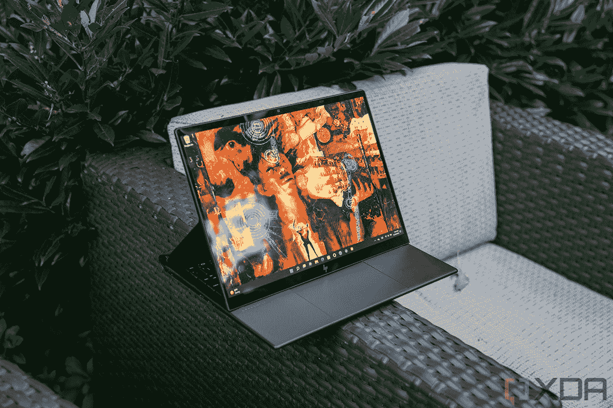

# 惠普蜻蜓 Folio G3 vs Elite Folio:哪一款适合您？

> 原文：<https://www.xda-developers.com/hp-dragonfly-folio-g3-vs-elite-folio/>

你可以购买许多新奇的惠普 Windows 设备用于商业用途，但没有一个能打败[惠普蜻蜓对开 G3](https://www.xda-developers.com/hands-on-hp-elite-dragonfly-folio/) 或[惠普精英对开](https://www.xda-developers.com/hp-elite-folio-review/)。这些 Windows 2 合 1 设备的外部采用了类似皮革的材料，并采用了一种有趣的方式将屏幕向下放到键盘上进行查看。

当然，惠普 Elite Folio 是两者中较老的，惠普蜻蜓 Folio G3 是较新的设备，这带来了自然的比较，以了解这两款[商务设备](https://www.xda-developers.com/best-business-laptops/)在两代之间发生了什么变化。

新的惠普蜻蜓 Folio G3 采用英特尔处理器，是有机发光二极管屏幕的更好选择，以及新的笔。相比之下，惠普 Elite Folio 的核心是基于 Arm 的高通 SoC 和更长的电池寿命。不过，这两种方法的目标受众是相同的，所以如果你感兴趣，请阅读我们的指南，以确定哪种方法适合你。

**浏览本文:**

## 规范

|  | 

惠普蜻蜓对开 G3

 | 

惠普精英版

 |
| --- | --- | --- |
| **操作系统** | 

*   Windows 11 专业版
*   Windows 11 主页
*   Windows 11 专业教育版
*   Windows 11 企业版
*   Windows 10 Pro 降级
*   FreeDOS

 | 

*   Windows 11 专业版
*   企业版 Windows 11 专业版
*   Windows 11 主页
*   Windows 10 Pro 降级

 |
| **CPU** | 

*   英特尔酷睿 i5 或英特尔酷睿 i7 U 系列(可选博锐)

 | 

*   高通骁龙 8cx 第二代

 |
| **图形** |  | 

*   高通 Adreno 690 图形

 |
| **显示** | 

*   13.5 英寸 3K2K 有机发光二极管，3000 x 2000 分辨率，触控，400 尼特
*   13.5 英寸 WUXGA+ IPS，1920 x 1080 分辨率，触控，400 尼特
*   13.5 英寸 WUXGA+ IPS，1920 x 1080 分辨率，触摸，BrightView，HP Sure View Reflect，1，000 尼特

 | 

*   13.5 英寸对角线，WUXGA+ (1920 x 1280)，触摸，IPS，BrightView，康宁大猩猩玻璃 5，400 尼特，低功耗，72% NTSC
*   13.5 英寸 IPS WUXGA+ (1920 x 1280) BrightView 触摸屏，康宁大猩猩玻璃 5，红外网络摄像头，ALS，1000 尼特，Sure View Reflect

 |
| **存储** | 

*   256 GB 或高达 2TB 的 PCIe NVMe M.2 固态硬盘
*   256 GB 或高达 512 GB 的 PCIe NVMe M.2 固态硬盘固态硬盘 TLC
*   高达 512 GB 的 PCIe NVMe 超值 M.2 固态硬盘

 | 

*   128 GB PCIe NVMe 薄层固态硬盘
*   256 GB PCIe NVMe TLC 固态硬盘
*   512 GB PCIe NVMe 薄层固态硬盘

 |
| **公羊** |  |  |
| **电池** | 

*   53 瓦时电池额定寿命为 13 小时 30 分钟，有机发光二极管面板的寿命为 7 小时

 | 

*   46 瓦时“长寿命”电池在我们的测试中，电池寿命为 10 小时

 |
| **端口** | 

*   2 个 USB-C 雷电 4
*   1 个耳机/麦克风插孔
*   纳米 SIM

 | 

*   2 超高速 USB Type-C 5Gbps 信号速率(USB 供电，DisplayPort 1.4)
*   1 个耳机/麦克风组合
*   1 个 Nano-SIM

 |
| **音频** | 

*   带分立放大器的四 B&O 扬声器

 | 

*   Bang & Olufsen，四声道立体声扬声器，双阵列麦克风

 |
| **网络摄像头** | 

*   800 万像素 Windows Hello，100 度视野

 | 

*   720p 高清 Windows Hello 隐私摄像机

 |
| **生物识别** |  |  |
| **连通性** | 

*   Wi-Fi 6E
*   蓝牙 5.2
*   可选 4G LTE 或 5G

 | 

*   高通 Atheros 802.11 a/b/g/n/AC(2×2)Wi-Fi 和蓝牙 5 组合
*   高通骁龙 X20 LTE 第 16 类
*   4G、LTE 或 5G

 |
| **颜色** | 

*   黑色人造革表面和镁饰面

 | 

*   黑色和镁色全素皮革上衣

 |
| **尺寸** | 

*   11.67 x 9.22 x 0.7 英寸

 | 

*   11.75 × 9.03 × 0.63 英寸

 |
| **重量** |  |  |
| **价格** |  |  |

## 性能:惠普精英蜻蜓 Folio G3 性能更佳

当看这两个对开本之间的演奏时，我们有一个大音符。旧的惠普 Elite Folio 采用基于 ARM 的高通处理器。较新的惠普 Elite 蜻蜓 Folio G3 采用传统的英特尔第 12 代处理器。这给了它在性能和日常使用方面的原始优势。

最初的惠普 Folio 因为 Arm 上的 Windows 和里面的高通 SoC 吃了不少苦头。如果您购买了它，由于驱动程序问题，您可能无法将它连接到打印机或您拥有的其他设备。微软[甚至为此有一个警告页面](https://support.microsoft.com/en-us/windows/windows-arm-based-pcs-faq-477f51df-2e3b-f68f-31b0-06f5e4f8ebb5)。你也不能在上面玩游戏，因为大多数 Steam 游戏都没有针对 Arm 上的 Windows 进行优化。您的一些应用程序也可能无法运行。

当然，这是一台商务电脑，由于 Arm 上 Windows 的 32 位和 64 位应用程序仿真(自最初的 Folio 发布以来，微软一直在努力)，商务应用程序(甚至谷歌 Chrome)应该可以正常运行。)但是，性能可能不如在 Intel 系统或较新的 Folio 上那么好。

这是因为应用程序开发人员要为这台机器优化他们的应用程序，如果这些应用程序没有为 Arm 优化，它们将在仿真下运行，并给高通 SoC 带来性能上的打击。像 Adobe Photoshop、Microsoft Edge、Microsoft Teams 和 Microsoft Office 这样的常见应用程序都经过了优化，所以如果你像我一样非常专注于微软世界，就会有这样的应用程序。

有了新的惠普精英蜻蜓 Folio G3，一切都不同了。您可以选择第 12 代英特尔酷睿 i5 或英特尔酷睿 i7 处理器。这些 CPU 对于那些希望提高 Windows PC 性能的人来说非常重要。英特尔 CPU 采用混合架构，具有性能内核和效率内核。较新的芯片也来自英特尔的 U 系列产品，这是为轻薄设备设计的。由于英特尔的 Iris Xe 显卡，您应该可以轻松运行任何您想要的应用程序，甚至可以在这台机器上玩轻度游戏。

> 这些 CPU 对于那些希望提高 Windows PC 性能的人来说非常重要

不过，我们确实想指出一件事。在 Elite Folio 中看到的高通 SoC 可以带来更好的电池寿命。因此，如果你想要一台电池续航时间长的 Windows PC 来度过一天，那么原装的 Folio 可能更好。最初的 Folio 在我们的测试中获得了 10 小时的电池寿命。惠普估计，惠普 Elite 蜻蜓 Folio G3 的非有机发光二极管型号的寿命约为 13 小时 30 分钟，有机发光二极管面板的寿命为 7 小时。不过，里程数可能会有所不同，尤其是如果你买的是有机发光二极管型号，它的显示屏很耗电。

## 显示和声音:惠普精英蜻蜓 Folio G3 更具活力

与 Elite Folio 相比，惠普在惠普 Elite 蜻蜓 Folio G3 显示屏方面取得了巨大进步。这个巨大的变化就是 OLED 面板。这两款显示器都非常适合业务优先的任务，但我们认为惠普 Elite 蜻蜓 Folio G3 比最初的 Elite Folio 做得更好。

最初的 Elite Folio 使用传统的 IPS 面板，调整到 3:2 的宽高比。这些都很适合室内工作，也适合在办公室工作，因为你可以为你的网页和其他项目获得更多的垂直空间。13.5 英寸对角线的 WUXGA+ (1920 x 1280 分辨率)触摸屏在标准型号上可以达到 400 尼特，在 Sure View 型号上可以达到 1000 尼特。我们发现原来的面板太光滑了，我们不喜欢。

> 有机发光二极管带来了更好的色彩精度和亮度，使屏幕上的一切看起来更好。

这就是惠普精英版蜻蜓 Folio G3 的用武之地。你还是可以找到一个 IPS 型号作为库存，两者都保持相同的 3:2 长宽比。然而，有机发光二极管的银幕比过去更加充满活力。有机发光二极管带来了更好的色彩精度和亮度，使屏幕上的一切看起来更好。对于商用笔记本电脑来说，这可能很重要，尤其是在展示演示文稿和其他物品时。

在惠普精英版蜻蜓 Folio G3 的几代产品之间，惠普并没有真正做出很多重大的设计改变。就像 Elite Folio 一样，这两个 Windows 系统都非常高级，并采用人造革材料。两者都很轻薄，尽管尺寸略有不同。在这两种情况下，你也可以将屏幕拉出来放在键盘上，或者像平板电脑一样一直放下来。惠普称这些模式为翻盖模式、媒体模式或平板模式。

Elite Folio 更薄更轻，重量为 2.92 磅，尺寸为 11.75×9.03×0.63 英寸。新款 Elite 蜻蜓 Folio G3 的重量为 3.09 磅，尺寸为 11.67 x 9.22 x 0.7 英寸。维度的变化主要是由于引擎盖下的架构的变化。作为一款采用高通 SoC 的设备，Elite Folio 略薄更轻。由于精英蜻蜓 Folio G3 采用英特尔芯片，它需要更多的散热空间和额外的 CPU 空间。

## 笔、键盘、触控板:惠普精英版蜻蜓 Folio G3 更好

在几代人之间，这些 Folio 设备上的笔、键盘和触控板发生了有趣的变化。换成新笔，惠普 Elite 蜻蜓 Folio G3 更好。这里有更多的原因。

惠普 Elite 蜻蜓 Folio G3 的新惠普蜻蜓 Folio pen 更加圆润，不像以前的惠普 Folio 那样扁平。这应该会使其握持和使用更加舒适。它有三个可编程的按钮，可以在设备旁边放置和充电。这是对旧笔的改变，旧笔位于键盘上方。然而，对一些人来说，这可能意味着你可能最终会丢失这支笔，就像之前它被安全地塞在原版 Elite Folio 的键盘上一样。

这一设计选择让惠普将键盘键帽扩大了一点，并加大了触控板。触控板的新尺寸为 120 x 80mm 毫米。这有助于长期使用，因为你的手可能不会抽筋。原版 Folio 上的触控板要小一些，宽度也小很多。

## 网络摄像头、端口和连接性:蜻蜓 Folio G3 胜出

随着我们在家工作的时间越来越多，网络摄像头和端口变得越来越重要，在这方面，这两种设备都很棒，但更新的惠普蜻蜓 Folio G3 将会胜出，原因有两个:网络摄像头和 Thunderbolt。

最初的 Elite Folio 有 2 个 USB-C 端口、一个耳机插孔和一个 nano-SIM 卡。这些端口位于左侧和右侧。网络摄像头的等级也是 720p。作为一款英特尔设备，较新的蜻蜓 Folio G3 在端口方面做得更好，因为它拥有 Thunderbolt 4 技术。这将使您能够连接 eGPUs，享受超过集成显卡所允许的游戏或数据处理的提升。这也意味着您可以为两台 4K 60Hz 显示器供电，并提高您的工作效率。不过，现在两个端口都在同一侧，这可能不太方便。

至于网络摄像头，这是一个全新的水平。这是因为网络摄像头被提升到了 800 万像素，带有广角镜头。您将能够更好地查看您的通话，而不是放大。惠普还包括软件，可以调整网络摄像头，并通过惠普 Auto frame 等功能让您看起来更好。最初的惠普 Elite Folio 有一个 720p 网络摄像头，就视频质量而言，它在 2022 年不再下降。

如果您需要，这两款设备都有蜂窝数据选项。这两种型号都可以选择 LTE、4G 或 5G 选项。当然，这是附加成本。

## 最后的想法

由于蜻蜓 Folio G3 是较新的设备，价格比 Elite Folio 的 2942 美元便宜 2379 美元，很难证明购买惠普 Elite Folio 的成本是合理的。您将获得更多的 CPU 能力、更好的屏幕选项、改进的笔，所有这些都包含在一个包中，一定会让您使用更长时间。

 <picture></picture> 

HP Dragonfly Folio G3

##### 惠普蜻蜓对开 G3

惠普蜻蜓 Folio G3 是 2022 年最令人兴奋的 Windows 2 合 1 设备之一，拥有人造革表面、800 万像素广角网络摄像头、改进的触控笔和华丽的有机发光二极管显示屏

 <picture></picture> 

HP Dragonfly Folio G3

##### 惠普蜻蜓对开 G3

惠普 Elite Folio 配备了骁龙 8cx Gen 2 处理器、高端键盘、纯素食皮革等。