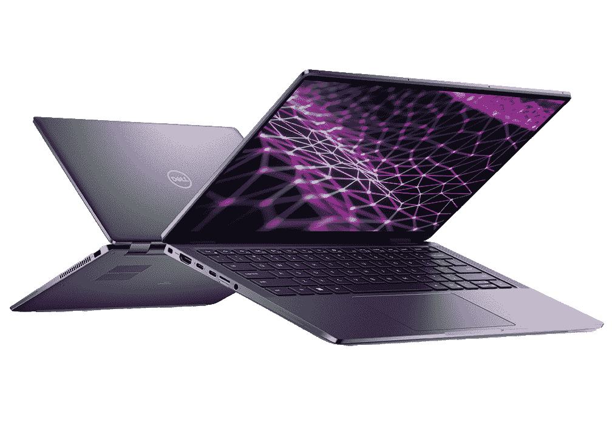

# 惠普蜻蜓 G4 与戴尔 Latitude 9430

> 原文：<https://www.xda-developers.com/hp-dragonfly-g4-vs-dell-latitude-9430/>

[惠普的蜻蜓 G4](https://www.xda-developers.com/hp-dragonfly-g4) 和戴尔的 Latitude 9430 都是高端商务笔记本电脑。它们都装载了使协作变得容易的高端功能，它们有高分辨率显示选项，并且由于现代性能硬件，它们可以跟上相当繁重的工作负载。蜻蜓 G4 尚未正式发布，预计将于 2023 年春季发布，但我们已经知道大量细节，可以有效地将其与现有的戴尔 Latitude 9430 进行比较。这两款都被认为是各自公司提供的[最佳商务笔记本电脑](https://www.xda-developers.com/best-business-laptops/)，但是你只想要一台。我们强调差异和相似之处，以帮助您尽可能轻松地做出决定。

*   ##### 惠普蜻蜓 G4

    惠普蜻蜓 G4 预计将于 2023 年春季推出，配备最新的第 13 代英特尔 CPU、强大的协作工具、出色的音频和一系列不同的显示选项。如果您喜欢轻装旅行，并且想要英特尔最新的高性能硬件，这是正确的选择。

*   <picture></picture>

    戴尔 Latitude 9430

    ##### 戴尔 Latitude 9430

    戴尔的 Latitude 9430 有翻盖式和可换式设计，后者支持上墨。它的性能硬件不像蜻蜓 G4 那么新，但它现在已经上市，应该是任何需要长电池寿命和耐用结构的专业人士的理想笔记本电脑。

## 价格、可用性和规格

惠普蜻蜓 G4 预计将于 2023 年春季推出。我们还没有一个确定的起价，但我们可以看看它的前身 [Elite 蜻蜓 G3](https://www.xda-developers.com/hp-elite-dragonfly-g3-review/) 就知道这个家族的笔记本电脑价格不菲。蜻蜓 G3 的价格目前在任何销售或折扣前约为 1，839 美元，预计蜻蜓 G4 发布时也是如此。首先，惠普的官方网站将是最好的购物场所。

戴尔的 Latitude 9430 有翻盖式和可转换式两种外形规格，设计会根据您选择的显示器而变化。配备 FHD+非触摸显示屏的不可转换选项在戴尔官网的起价约为 1939 美元。如果你改用 QHD+触摸显示屏和 2 合 1 设计，起价将高达约 2139 美元。你也可以在亚马逊等第三方零售商那里找到这款笔记本电脑，尽管配置选项远没有你在戴尔商店购买的那么广泛。

以下是每台笔记本电脑的规格。

|  | 

惠普蜻蜓 G4

 | 

戴尔 Latitude 9430

 |
| --- | --- | --- |
| 

操作系统（Operating System）

 |  | 

*   Windows 11 主页
*   Windows 11 专业版
*   Windows 10 专业版

 |
| 

中央处理器

 |  | 

*   第 12 代英特尔
*   酷睿 i5-1245U 博锐处理器
*   酷睿 i7-1265U 博锐处理器

 |
| 

制图法

 |  | 

*   英特尔 Iris Xe(集成)

 |
| 

显示

 | 

*   13.5 英寸，3:2 宽高比
*   1920x1280 (FHD+)，400 尼特，触控(可选)，防眩光(可选)
*   1920x1280 (FHD+)，1000 尼特，触摸(可选)，确定视图反射
*   3000x2000 (3K2K)，有机发光二极管，400 尼特，触摸

 | 

*   14 英寸，16:10 宽高比
*   1920x1200 (FHD+)，非触摸，防眩光，ComfortView+，低蓝光，500 尼特，100% sRGB，低功耗，智能隐私
*   2560x1600 (QHD+)，触摸，防反光，ComfortView+，低蓝光，500 尼特，100% sRGB，低功耗，智能隐私

 |
| 

储存；储备

 | 

*   高达 2TB M.2 PCIe 4.0 NVMe 固态硬盘
*   标准或加密

 | 

*   高达 1TB M.2 PCIe 4.0 NVMe 固态硬盘
*   高达 256GB M.2 PCIe 4.0 NVMe SED 固态硬盘

 |
| 

记忆

 | 

*   最高 32GB LPDDR5
*   焊接

 | 

*   16GB，32GB LPDDR5-6400MHz
*   焊接

 |
| 

电池

 |  |  |
| 

港口

 | 

*   两个霹雳 4
*   USB-A (5Gbps)
*   HDMI 2.0
*   Nano SIM(可选)
*   3.5 毫米音频

 | 

*   两个霹雳 4
*   USB-A 3.2(第一代)
*   HDMI 2.0
*   microSD 读卡器
*   uSIM 托盘(可选)
*   3.5 毫米音频

 |
| 

声音的

 | 

*   四 B&O 扬声器
*   分立音频放大器
*   双顶边麦克风

 | 

*   四声道扬声器
*   Waves MaxxAudio Pro 智能放大器
*   四个降噪麦克风

 |
| 

照相机

 | 

*   5MP，88 度 FOV
*   当然快门

 |  |
| 

Windows Hello

 | 

*   红外照相机
*   指纹读取器

 | 

*   红外照相机
*   指纹读取器

 |
| 

无线的

 | 

*   Wi-Fi 6E
*   蓝牙 5.3
*   4G LTE / 5G(可选)

 | 

*   Wi-Fi 6E
*   蓝牙 5.2
*   4G LTE / 5G(可选)

 |
| 

颜色

 | 

*   石板蓝
*   天然银

 |  |
| 

规模

 | 

*   11.7 x 8.67 x 0.65 英寸(297.4 毫米 x 220.4mm 毫米 x 16.4mm 毫米)

 | 

*   12.22 x 8.47 x 0.33-0.54 英寸(310.5 毫米 x 215.2mm 毫米 x 8.46-13.94 毫米)

 |
| 

重量

 |  | 

*   2.84 磅(1.29 千克)起(蛤壳式)
*   从 3.17 磅(1.44 千克)(2 合 1)起

 |
| 

赛马或赛狗开始时生效的投注赔率

 |  |  |

## 设计和功能

戴尔的 Latitude 9430 有翻盖或 2 合 1 设计，具体取决于您选择的显示器。后一种设计提供了额外的多功能性——360 度铰链允许你旋转屏幕，以实现帐篷、支架和平板电脑模式——并且它能够墨迹。如果你宁愿坚持只能作为笔记本使用的翻盖设计，你会省钱。这两种设计都采用了经过耐久性认证的耐用铝制机箱，并且都有铜灰色。二合一版本相对较重，为 3.17 磅(1.44 千克)，但你可以通过坚持翻盖设计来减轻一些重量。

惠普的蜻蜓 G4 完全是一款翻盖式笔记本电脑，重量仅为 2.2 磅(0.99 千克)。由于其较小的 13.5 英寸显示屏，它的整体尺寸也较小。如果你想尽可能轻装出行，惠普笔记本电脑是不二之选。它由镁和铝混合制成，有石板蓝或自然银两种颜色。

这两个品牌的端口大致相同，不过戴尔的笔记本电脑增加了一个 microSD 读卡器。惠普和戴尔笔记本电脑另外有两个 Thunderbolt 4、USB-A、HDMI 2.0、一个可选的 SIM 卡插槽和一个 3.5 毫米音频插孔。您应该能够处理大多数工作，而不需要额外的加密狗或适配器，但您可以随时连接一个[最佳坞站](https://www.xda-developers.com/best-thunderbolt-docks/)进行更永久和方便的设置。

这些电脑都有一个舒适的键盘，但在使用这些键盘输入数千个单词后(尽管在略有不同的笔记本电脑上)，我会给惠普一点优势。我喜欢蜻蜓上的超大键帽，尽管有些人可能更喜欢 Latitude 上的 chiclet 风格的按键。这可能取决于个人喜好，但至少你知道，无论你选择哪种笔记本电脑，你都会得到一个高质量的键盘。同样，这两款笔记本电脑都有超大触摸板，方便准确地指向。

两款笔记本电脑都有四个扬声器，两个位于键盘周围，另外两个位于底部面板。Latitude 9430 将顶部发射扬声器分离到键盘两侧，而蜻蜓 G4 将它们一起放在键盘和显示器之间的格栅下面。这两款笔记本电脑都有放大器来增强声音，如果音频是优先选择，您可能不会失望。不用耳机，您就能清楚地听到同事的声音，并且在工作时也能舒服地听音乐。

随着员工转向远程生活方式，协作工具变得越来越重要。Latitude 9430 有一个带隐私快门的 1080p 前置摄像头，还有一个用于 Windows Hello 的红外摄像头。戴尔的 ExpressSign-In 允许您在接近或离开时自动登录和注销笔记本电脑，并且它还可以在您看向别处时将屏幕调暗以节省电池电量。蜻蜓 G4 配备了一个 88 度 FOV 的前置 500 万像素摄像头，以及大量在幕后工作的协作工具，以修复照明、肤色、取景、背景等。它将成为合作的最佳笔记本电脑之一。

即使你不在 Wi-Fi 覆盖范围内，商业世界也经常需要你的关注。戴尔和惠普都提供了可选的 4G LTE 和 5G 连接来解决这一问题。你还可以获得标准的 Wi-Fi 6E 和现代蓝牙，但额外的移动连接应该是那些经常旅行或在野外工作的人的福音。

## 显示

当我[比较惠普蜻蜓 G4 和精英蜻蜓 G3](https://www.xda-developers.com/hp-dragonfly-g4-vs-elite-dragonfly-g3/) 时，我注意到显示器在两代人之间并没有真正改变。蜻蜓 G4 有一个 13.5 英寸的屏幕，长宽比为 3:2，你可以在几个不同的型号之间进行选择。最实惠的是 1920x1280 (FHD+)分辨率、400 尼特亮度、可选触摸功能和可选防眩光涂层。接下来是触摸和非触摸版本的 FHD+ Sure View 显示器，亮度为 1000 尼特。如果您经常在公共场所工作，这个屏幕可以防止其他人从您的肩膀上看过去时看到您屏幕上的内容。

惠普还提供了一款 3000x2000 (3K2K)有机发光二极管触摸显示屏，亮度为 400 尼特。如果需要最好的颜色和对比度，这就是你想要的屏幕，但它的价格最高。

戴尔在 9430 系列中提供了两个 14 英寸显示器，但它们与笔记本电脑的整体外形规格有关。如果你想要一个翻盖设计，你必须有 1920x1200 的分辨率，防眩光涂层和非触摸面板。如果你采用可转换设计，屏幕分辨率将提高到 2560x1600，具有触摸、防反射涂层和墨水功能。

这两款显示器都有戴尔的 ComfortView+,可提供低蓝光和更轻松的观看，500 尼特亮度，100% sRGB 颜色，以及戴尔智能隐私附加组件。与惠普的 Sure View 功能非常相似，智能隐私可以检测到有人在你身后观看，并对屏幕进行必要的调整以阻止他们的视线。

## 性能和电池

我们还没有机会直接测试蜻蜓 G4 的性能，但我们知道它配备了英特尔第 13 代 Raptor Lake 移动处理器，集成显卡，高达 2TB 的 M.2 PCIe 4.0 NVMe SSD 存储，以及高达 32GB 的 LPDDR5 RAM。与第 12 代芯片相比，最新的第 13 代硬件预计将提升性能，但与第 11 代和第 12 代相比，这并不是一个巨大的飞跃。

戴尔的 Latitude 9430 仍然使用第 12 代芯片，但它们仍然可以处理繁重的工作负载。Core i5-1245U 和 Core i7-1265U 芯片可供选择，您可以将它们与高达 1TB M.2 PCIe 4.0 NVMe SSD 和 32GB lpddr 5 RAM 相结合。像蜻蜓 G4，没有专用的图形选项；它是处理显示器的集成英特尔 Iris Xe。

我们在我们的[戴尔 Latitude 9430 评测](https://www.xda-developers.com/dell-latitude-9430-2-in-1-review/)中测试了性能，注意到酷睿 i7 U 系列 CPU 可以赶上一些酷睿 i7 P 系列芯片(比如[联想 ThinkPad X1 Yoga Gen 7](https://www.xda-developers.com/lenovo-thinkpad-x1-yoga-gen-7-review/) 中的那款)。笔记本电脑可以粉碎生产力工作，甚至可以轻松处理一些照片编辑和电子表格。这得益于所有型号的最低 16GB 内存。

续航也挺好的。实际使用中，Latitude 9430 充电后仍可运行约 8 小时，这在商业领域尤为重要。我们还没有对蜻蜓 G4 进行电池测试，但我们知道它采用了惠普新的智能感知和智能休眠节能功能，以帮助笔记本电脑在充电后尽可能长时间地运行。

## 哪款商务笔记本电脑适合您？

这两款商务笔记本电脑将轻松处理许多相同的任务，并且它们的设计都能够承受长时间工作和频繁出差的艰苦生活。戴尔的笔记本电脑提供了可转换设计的选项，而蜻蜓 G4 严格来说是一款笔记本电脑。惠普的笔记本电脑更薄、更轻、整体更紧凑，是旅行的绝佳选择。这扩展到可选的 5G 连接，尽管您也可以通过戴尔的笔记本电脑获得移动连接。

我们还无法测试蜻蜓的性能，但与 Latitude 中的第 12 代硬件相比，其更新的第 13 代英特尔硬件预计将提供更高的性能。戴尔确实凭借自身优势提供了强劲的电池续航时间和稳定的性能，但如果您想要最新的产品，就必须选择惠普。至于协作工具，惠普的蜻蜓 G4 凭借其 500 万像素的摄像头和支持软件走在了前列。

惠普的笔记本电脑预计要到 2023 年春天才会推出，如果你现在需要一台笔记本电脑，戴尔 Latitude 9430 随时可用。如果你喜欢惠普，你也可以看看惠普精英蜻蜓 G3 的前身。我们收集的[最佳戴尔笔记本电脑](https://www.xda-developers.com/best-dell-laptops/)和[最佳惠普笔记本电脑](https://www.xda-developers.com/best-hp-laptops/)也有一大堆其他优秀的硬件可供选择。

##### 惠普蜻蜓 G4

对于喜欢轻装上阵的人来说，惠普蜻蜓 G4 是更好的选择。它还拥有更新的性能硬件、一系列不同的显示器选项，以及面向远程工作人员的高端协作工具。预计将于 2023 年春季推出。

 <picture></picture> 

Dell Latitude 9430

##### 戴尔 Latitude 9430

戴尔的 Latitude 9430 现在有翻盖式和折叠式两种设计。它不如蜻蜓 G4 轻巧便携，但仍能为专业人士带来强劲的性能和高端功能。