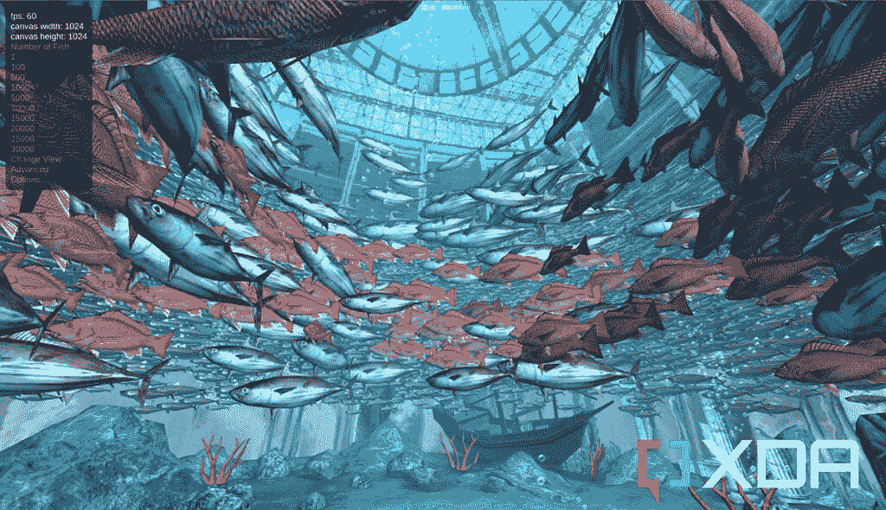

# 惠普精英蜻蜓 Chromebook 评论:谷歌驱动的笔记本电脑的新海报

> 原文：<https://www.xda-developers.com/hp-elite-dragonfly-chromebook-review/>

对许多人来说，高端 Chromebook 的概念仍然令人难以置信。不难看出为什么，制造这些设备的公司如此关注预算设备。但是惠普精英版蜻蜓 Chromebook 已经是最好的了。没有偷工减料，没有符合预算的项目。这是一台高端笔记本电脑。

在这方面，它模仿了蜻蜓的[Windows 版本。惠普的最佳设计融合了英特尔的顶级硬件。毫无疑问，这也是一款昂贵的 Chromebook。由于谷歌没有推出新的 Pixelbook，新的 hero 产品出现了空缺。惠普很乐意尝试并填补这一空白。](https://www.xda-developers.com/hp-elite-dragonfly-g3/)

惠普精英版蜻蜓 Chromebook 于 2022 年初发布，自那以来，人们一直在热切等待。它的主要目标市场很可能是企业，但这仍然是当今最好的 Chromebooks 中最受欢迎的。那么，有我们希望的那么好吗？值那么高的要价吗？你应该买一个吗？

是的。

 <picture></picture> 

HP Elite Dragonfly Chromebook

##### 惠普精英蜻蜓 Chromebook

一款高端、时尚、功能强大的超极本，只是碰巧运行 ChromeOS 而不是 Windows。

## 定价和可用性

惠普精英版蜻蜓 Chromebook 现在可以从惠普网站订购，默认配置的起价为 1559 美元。有广泛的选项可以应用，几乎涵盖了硬件的所有方面。

默认选项配有第 12 代酷睿 i3、全高清防眩光显示屏、8GB 内存和 256GB 固态硬盘。可以通过将显示器更改为不带防眩光的 QHD+选项，移除附带的笔，并将 SSD 降至 128GB 来降低要价。这使得最便宜的惠普精英版蜻蜓 Chromebook 售价为 1412 美元。

同样值得注意的是，惠普将把附带的电源适配器从 45W 升级到 65W，只需 3 美元，这绝对值得。

*此次审查使用了惠普借给 XDA 的生产前样品，历时三周。惠普对此次审查的内容没有任何意见。*

## 惠普精英蜻蜓 Chromebook:盒子里是什么？

当您订购惠普精英版蜻蜓 Chromebook 并打开包装盒时，您会在里面发现以下内容:

*   惠普精英蜻蜓 Chromebook
*   数码笔。
*   45W USB-C 电源适配器。

如前所述，如果您不想要笔，可以在程序点将其移除，并且电源适配器可以升级到 65W 单元。

## 惠普精英蜻蜓 Chromebook 规格

| 

规格

 | 

惠普精英蜻蜓 Chromebook

 |
| --- | --- |
| **显示** | 

*   13.5 英寸防眩光 WLED (1920 x 1280)，400 尼特
*   13.5 英寸 BrightView LED (2256x1504)，400 尼特
*   13.5 英寸 BrightView WLED (1920x1280)，1000 尼特
*   大猩猩玻璃 5

 |
| **处理器** | 

*   英特尔酷睿 i3-1215U
*   英特尔酷睿 i5-1235U
*   英特尔酷睿 i5-1245U
*   英特尔酷睿 i7-1265U

 |
| **闸板** |  |
| **存储** | 

*   128 GB PCIe NVMe 固态硬盘
*   256GB PCIe NVMe 固态硬盘
*   512 GB PCIe NVMe 固态硬盘

 |
| **电池** | 

*   4 芯 50 瓦时电池
*   快速充电(90 分钟内充满 90%的电量)
*   45W 电源适配器(可选升级到 65W)

 |
| **安全** |  |
| **网络摄像头** | 

*   500 万
*   集成网络摄像头隐私保护盖

 |
| **端口** | 

*   2 个 Thunderbolt 4 w/ USB 4.0
*   1 个 USB 类型 A
*   1 个 HDMI 接口
*   1 个 3.5 毫米组合耳机和麦克风

 |
| **连通性** | 

*   英特尔 Wi-Fi 6E AX211 和蓝牙 5.3 组合
*   可选博锐
*   可选英特尔 XMM 7360 LTE Advanced Cat 9 WWAN 宽带无线
*   美国电话电报公司和威瑞森的支持

 |
| **音频** | 

*   双立体声扬声器
*   由 Bang & Olufsen 调谐的音频

 |
| **尺寸和重量** | 

*   11.59 x 8.73 x 0.65 英寸
*   起始重量 2.8 磅

 |
| **其他特性** | 

*   触觉触控板
*   含数码笔
*   带有 Chrome 企业升级的可选 ChromeOS

 |

## 设计和功能:首款配备触觉触控板的 Chromebook

*   长宽比为 3:2 的敞篷设计
*   数字笔支持(包括笔)
*   雷电 4 端口
*   Chromebook 上的首款触觉触控板

无论是 Chromebook 还是 Windows，惠普正在制造一些目前世界上最精美的笔记本电脑。精英版蜻蜓 Chromebook 是这方面的又一个亮点。它符合所有的条件。首先，惠普采用了卓越的 3:2 宽高比，具有双重优势。首先，它提供了更多的垂直屏幕空间，所以这是一个胜利。其次，高度增加的结果是，你最终有更多的空间来放置更大的触控板。又一次胜利。

惠普精英版蜻蜓是你现在能买到的最好看的 Chromebook。

其结果是一款 13.3 英寸的超极本，配有一个大触控板和一个比其尺寸更大的感觉显示器。折叠起来，笔记本电脑仍然非常便携，尽管在形式上比传统的 16:9 机器略方。正如你所料，它非常薄，合上时只有 0.6 英寸。重量也只有 2.6 磅，所以它真的是一款“扔在包里”的笔记本电脑。考虑到它的企业目标，这就更重要了。不过，机箱的轻薄本质并不意味着排除传统端口。仍然有一个全尺寸的 HDMI 输出和一个 USB-A 连接器。聪明。

设计的视觉方面也很引人注目。首先，它不像许多其他产品那样在盖子上有令人尖叫的 Chromebook 标志。它还在，但是很细微，很小。它只有一种颜色，蓝色，这很好，因为它很华丽。惠普消除了购买哪种颜色的猜测，只让蜻蜓成为最好的颜色。任务完成。这可以说是目前最好看的 Chromebook。

它也是最通用的。显示屏上的边框很薄，但也不是太薄，因为是可转换的，当你把蜻蜓当作平板电脑使用时，你需要一些东西来抓握。ChromeOS 在其触摸优化模式下仍不完美，但它可能比 Windows 11 更令人沮丧。将显示屏向四周弹出，硬件键盘关闭，你就有了一个大平板电脑。指纹扫描仪仍然工作，这是一个很好的接触，所以你仍然有安全，容易登录。

这种模式也是利用附带的数码笔的最佳方式。这支笔扣在笔记本电脑的侧面充电，嗯，就可以工作了。没有配对过程需要担心，只需打开它几分钟，让它充满电，然后开始你的数码涂鸦。或者你可以像手写笔一样使用它。这是一支很棒的笔，尽管我不是最大的粉丝，但我发现自己真的很喜欢使用它。ChromeOS 提供了除书写和绘图之外的其他功能，但即使只是作为一种点击屏幕和滚动网页的方式，我也很满意。

显示器由大猩猩玻璃 5 覆盖，因此很坚固，我这里的版本具有 QHD+分辨率和 400 尼特亮度。室内足够明亮，但由于这款没有防眩光涂层，室外和只有明亮灯光的房间可能是个问题。你会得到很多**反射，所以如果防眩光不吸引你，1000 尼特选项上的额外亮度可能会是你需要的。**

惠普仍在与 Bang & Olufsen 合作开发音频，虽然这算不上是你办公室里的一场音乐会，但扬声器非常出色。双立体声系统位于笔记本电脑的前边缘。因此，无论你在何种模式下使用它，声音都不会被桌子甚至是它自己的机箱所掩盖。就笔记本电脑扬声器而言，这些扬声器非常好，声音也很大。

### 企业友好的特性

惠普精英版蜻蜓 Chromebook 专为 Chrome OS 企业版打造，因此硬件拥有某些重要且令人向往的特性。最令人印象深刻的是[英特尔博锐](https://www.intel.co.uk/content/www/uk/en/architecture-and-technology/vpro/what-is-vpro.html)支持，这是第一款支持该功能的 Chromebook。这提供了重要的硬件功能，如增强的安全性、Wi-Fi 6 和 Thunderbolt 4，当然，所有这些蜻蜓都有。

蜻蜓是首款采用英特尔博锐技术的 Chromebook

网络摄像头具有集成的隐私滑块，蜻蜓也受益于惠普出色的指纹扫描仪。为了增加安全性，你有时需要恢复密码或 PIN 码，但大多数时候你只需轻轻一点就能登录。

企业群体(也许还有一些消费者)感兴趣的还有蜂窝支持。在美国，威瑞森和美国电话电报公司都被列为受支持的国家，未来还有 5G 版本的计划。或者，将 Android 手机与 ChromeOS 配对仍然支持即时共享。

惠普也有自己的应用程序，可以在蜻蜓和智能手机之间实现无缝拖放功能。这包括那些拥有 iPhone 的用户，这是 ChromeOS 不具备的类似功能。

### 从现在开始，每台笔记本电脑都需要配备触觉触控板

让我们来谈谈惠普精英版蜻蜓 Chromebook 上的触觉触控板。太壮观了。从现在开始，每台笔记本电脑都需要安装它。很难用语言来描述它比传统的触控板好多少。

从技术角度来看，惠普已经与谷歌合作，确保蜻蜓的用户能够通过 ChromeOS 升级固件。与 Windows 或 macOS 相比，这是 Chrome OS 传统上仍然严重缺乏的一个领域，但这种情况正在开始改变。

按下时，触控板的反应和传统触控板一样灵敏。你会得到同样令人满意的咔哒声，只是没有移动。我可以把它比作 iPhone SE 上的触觉 home 键。这是同样的感觉。它**感觉**像是你在按它，但事实上，你没有。真的很聪明。它也不像传统的触控板那样需要在某个位置被“点击”。它的整个表面都有相同的反应。

触觉触控板也在 ChromeOS 的其他地方发挥作用。例如，当拖移窗口以吸附到位时，当它吸附到位时，您会通过触控板获得反馈。没有触觉，这种特征是不可能的。希望我们能看到更多这样的事情发生。

## 性能和电池寿命:第 12 代英特尔 CPU 带来强大动力

*   第 12 代英特尔处理器系列
*   快速 NVMe 存储
*   体面但不突出的电池寿命

惠普精英版蜻蜓 Chromebook 不再是唯一一款采用第 12 代英特尔 CPU 的 Chromebook，但人群中几乎没有人。因此，当我说我们以前没有见过具有这种性能的 Chromebook 时，这是真的。我们的评测单元配备了[英特尔酷睿 i5-1245U](https://www.intel.co.uk/content/www/uk/en/products/sku/226260/intel-core-i51245u-processor-12m-cache-up-to-4-40-ghz/specifications.html) 。这是一款 10 核 CPU，由两个性能内核和八个效率内核组成。它的基本 TDP 为 15W，但会加速，惠普为它提供的冷却系统在铰链区域将空气排出笔记本电脑。大多数时候，它运行得非常冷静和安静，充分利用了这些效率核心。但是，如果你开始做一些强度更大的运动，你会听到球迷的呼声。

在 Chromebook 中测量性能与 Windows PC 或 Mac 略有不同。但是事情是这样的。这东西绝对是破的。我自己目前的 Chromebook 也来自惠普，运行锐龙 5 和 8GB 内存，蜻蜓快得多。Linux 运行得更好，Chrome 运行得更好，Android 应用运行得更好，整个体验更好。我自己的 Chromebook 仍然可能出错的任务，包括 XDA CMS 的一些区域，几乎不会影响蜻蜓。我在 Chromebook 上使用最多的应用程序之一是 GIMP 的 Linux 版本，与我使用过的其他 Chromebook 相比，它更像是一种原生体验而不是在容器中运行的东西。

不过，还是有基准的。但我无法让 Android 版本的 Geekbench 正常工作，也无法让 3DMark 的其他版本正常工作。所以我们仅限于那些可以使用浏览器的人。

| 

基准

 | 

得分

 |
| --- | --- |
| 北海巨妖 JavaScript(越低越好) | 524 |
| Jetstream 2(越高越好) | 201 |
| 辛烷值 2.0(越高越好) | 79,782 |
| WebGL 水族馆(10，000 条鱼) | 60 FPS |
| WebGL 水族馆(15，000 条鱼) | 60 FPS |
| WebGL 水族馆(20，000 条鱼) | 34 FPS |

现在没有太多东西可以直接与 Chromebook 进行比较，但它的性能很容易名列前茅。虽然这不是苹果之间的比较，但蜻蜓在图表中的前三项基准测试中的得分都高于我的装有传说中的 M1 芯片的 Mac Mini。Chromebook 在 Chrome 上运行，就像在蜻蜓上运行一样，在每一项测试中都是赢家。不管怎样。不过，它至少给人的印象是，这不应该被忽视，因为“这只是一部 Chromebook。”这是一场笔记本电脑打包表演。

简单地谈一下游戏也是值得的。在这篇评论的时候，惠普精英版蜻蜓 Chromebook 还没有被列入 chrome book 上的 Steam 测试的白名单。基于谷歌的要求，里面的硬件很容易做到，所以在某个时候，它应该能够加入进来。这不是一台游戏笔记本电脑，但正如 [Steam Deck](https://www.xda-developers.com/valve-steam-deck-unboxing/) 已经证明的那样，你不一定需要疯狂的力量才能玩得开心。

 <picture></picture> 

The WebGL Aquarium benchmark

事情发生转折的地方不一定是变得更糟，但不那么令人印象深刻的是电池寿命。伴随着所有这些性能而来的是对实际供电的需求。再加上更高分辨率的显示屏(或者更高的亮度，如果你选择这个选项的话)，你会看到 6-8 小时的实际使用时间。在审查期间的大部分时间里，我将蜻蜓作为我的主要工作机器，从来没有在我需要充电器之前尝试过一整天。这并不坏，但很容易变得更好，特别是考虑到惠普正在推动的企业重点。

我确实发现，当笔记本电脑合上时，它比我习惯使用的其他 Chromebooks 耗电更多。这可能是一个错误，它可能只是如何在这台特定的机器上，但它肯定没有帮助延长电池寿命。不过，它确实充电很快，如果你升级到 65W 充电器，你会处于一个更好的位置。这个充电器不是特别大，所以至少非常便携。

## 谁应该购买惠普精英版蜻蜓 Chromebook

*   企业用户的完美 Chromebook。
*   价格可能会让消费者感到不快。
*   你现在能买到的最好的 Chromebook。

到底谁应该购买惠普精英版蜻蜓 Chromebook 并不是一个容易回答的问题。一方面，**每个人**都应该买一台，因为这是钱能买到的性能最好的 Chromebook。也是最好看的。它的用途非常广泛。但是对于消费者来说，价格是个大问题。这是一台昂贵的笔记本电脑。忽略 ChromeOS 和 Windows 哪个更好的争论，这个东西是昂贵的。因此，它并不适合所有人。

惠普精英蜻蜓是 Chromebooks 的典型代表。

真正针对的是企业人群。惠普和谷歌提供了一个坚实的软件包，并且有一个令人信服的案例(改天讨论)表明，ChromeOS 在 2022 年对许多企业来说比 Windows 更有意义。它更容易管理，谷歌工作空间套件涵盖了大多数主要的基础，并且总是有 [Parallels for ChromeOS](https://www.xda-developers.com/google-parallels-windows-app-support-chromebooks/) 供你在少数时候真正需要访问 Windows。

没有谷歌的新 Pixelbook，这是新的衡量标准。这是 2022 年 Chromebooks 的海报儿童。即使 ChromeOS 今天不能真正利用所有这些性能，总有一天它会做到的。有时与审查单位分离是特别困难的，因为所讨论的设备是如此特别。这是其中的一次。惠普精英版蜻蜓 Chromebook 就是这么好。

现在，如果你不介意的话，我不得不哀悼我生命中触觉触控板的损失。

 <picture></picture> 

HP Elite Dragonfly Chromebook

##### 惠普精英蜻蜓 Chromebook

在 2022 年，你不会找到很多像这样的 Chromebooks，如果你有预算，惠普最新的旗舰机型设置了一个相当高的标准。