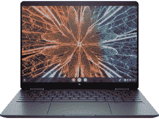

# 惠普精英版蜻蜓 Chromebook 的包装盒内有什么？

> 原文：<https://www.xda-developers.com/hp-elite-dragonfly-chromebook-unboxing/>

如果 2022 年有一款好的 Chromebook 真正令人兴奋的话，那就是这款[惠普精英蜻蜓 Chromebook](https://www.xda-developers.com/hp-elite-dragonfly-chromebook/) 。通常情况下，你会认为这种级别的笔记本电脑预装了 Windows 11。它确实以[精英蜻蜓 G3](https://www.xda-developers.com/hp-elite-dragonfly-g3/) 的形式出现。但它也配有 Chrome 操作系统，这让它以一种全新的方式变得有趣。

通常情况下，Chromebooks 被视为预算和中端笔记本电脑，这没有什么错。但是除了谷歌的 Pixelbook 系列之外，还没有多少 Chromebooks 在上层有真正令人惊叹的因素。所以精英版蜻蜓 Chromebook 有点另类。但在没有新 Pixelbook 的一年里，这可能是你关注的一款 Chromebook。从本质上来说，这是与 Windows 版本相同的高端笔记本电脑，这是一件非常好的事情。它甚至还配有一支笔。

## 惠普精英版蜻蜓 Chromebook 包装盒内有什么？

惠普为精英版蜻蜓 Chromebook 提供了相当广泛的配置列表。我们的电脑处于中间位置，配有英特尔酷睿 i5-1245U、8GB 内存和 256GB NVMe 固态硬盘。这是盒子里的所有东西。

*   惠普精英蜻蜓 Chromebook
*   惠普数字笔
*   电源适配器
*   45W USB-C 充电器

包括笔是一个很好的接触，特别是考虑到要价，但也有点企业的精英蜻蜓的重点。没有内置的笔库；相反，它通过扣在笔记本电脑的侧面来充电。你知道，就像苹果铅笔在 iPad 上充电一样。标准充电器只有 45W，但只需 3 美元，你就可以升级到 65W 的版本(你应该这么做)。有趣的是，惠普的标准配置实际上可以通过改变显示屏、降低存储或移除笔来变得更便宜。很高兴看到这是双向的。

这可能是目前你能得到的最令人满意的 Chromebook，融合了惠普标志性的高级可转换设计和最新的英特尔 CPU，一系列优秀的显示器，快速存储和人们真正想要的笔记本电脑功能。指纹扫描仪？检查。网络摄像头外壳？你猜对了。它甚至符合安装蒸汽的标准。但是房间里的大象，至少对消费者来说，是价格。这是一款昂贵的 Chromebook。然而，这可能是我们今年看到的最好的 Chromebook。

 <picture></picture> 

HP Elite Dragonfly Chromebook

##### 惠普精英蜻蜓 Chromebook

在 2022 年，你不会找到很多像这样的 Chromebooks，如果你有预算，惠普最新的旗舰机型设置了一个相当高的标准。