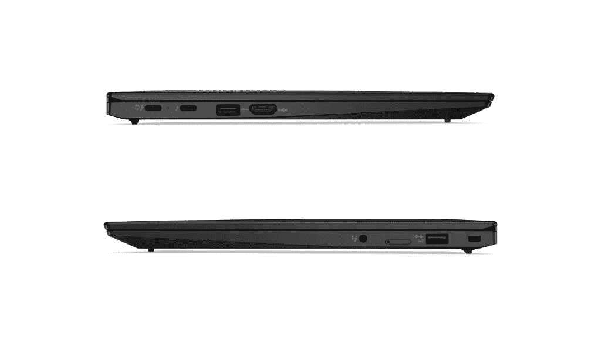
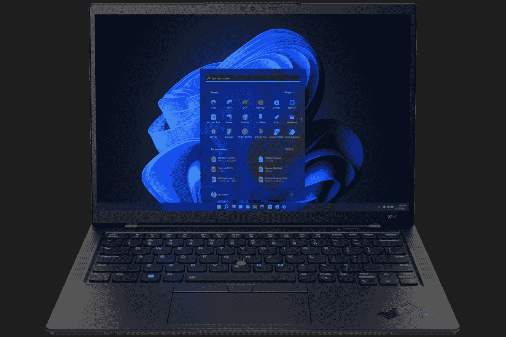
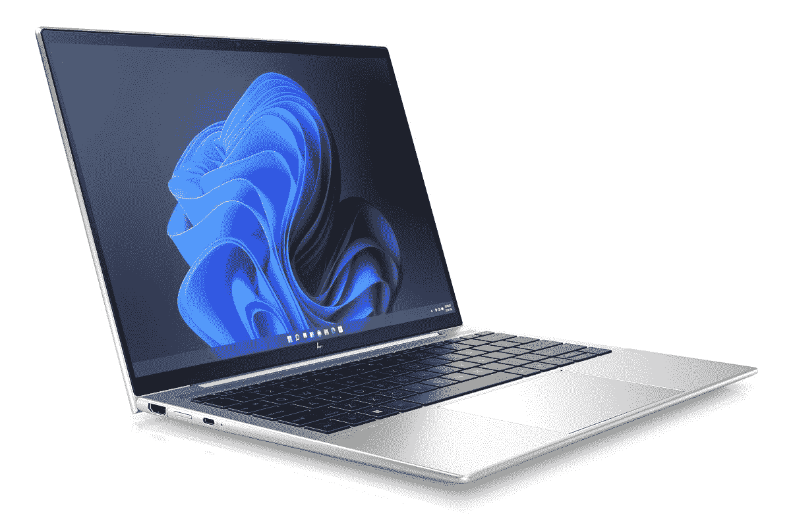

# 惠普精英蜻蜓 G3 vs ThinkPad X1 Carbon Gen 10

> 原文：<https://www.xda-developers.com/hp-elite-dragonfly-g3-lenovo-thinkpad-x1-carbon-gen-10/>

在 CES 2022 上，许多公司宣布了新的笔记本电脑、升级或笔记本电脑的更新版本。许多升级的笔记本电脑已经是你今天能买到的最好的笔记本电脑了，但是随着新的英特尔处理器和其他升级，它们变得更好了。在推出新设备的公司中，惠普和联想推出了一些伟大的新设备，包括惠普精英蜻蜓 G3 和联想 ThinkPad X1 Carbon Gen 10。

这两个是非常直接的竞争对手，因为它们都是具有翻盖外形的商务笔记本电脑。那么，如果你想在两者之间做出选择，你会怎么做呢？我们将为您提供帮助，在本文中，我们将对惠普精英版蜻蜓 G3 和 ThinkPad X1 Carbon Gen 10 进行比较，以帮助您找出为什么您会更喜欢其中一款。事不宜迟，让我们开始吧。

## 惠普精英蜻蜓 G3 与 ThinkPad X1 Carbon Gen 10:规格

|  | 

惠普精英蜻蜓 G3

 | 

联想 ThinkPad X1 碳第 10 代

 |
| --- | --- | --- |
| **操作系统** |  |  |
| **CPU** | 

*   第 12 代英特尔酷睿 i5-1235U (10 个内核，12 个线程，最高 4.4GHz，12MB 高速缓存)
*   第 12 代英特尔酷睿 i5-1245U 博锐处理器(10 个内核，12 个线程，最高 4.4GHz，12MB 高速缓存)
*   第 12 代英特尔酷睿 i7-1255U (10 个内核，12 个线程，最高 4.7GHz，12MB 高速缓存)
*   第 12 代英特尔酷睿 i7-1265U 博锐处理器(10 个内核，12 个线程，最高 4.8GHz，12MB 高速缓存)

 | 

*   英特尔 P 系列:
    *   第 12 代英特尔酷睿 i5-1240P (12 个内核，16 个线程，最高 4.4GHz，12MB 高速缓存)
    *   第 12 代英特尔酷睿 i5-1250P (12 个内核，16 个线程，最高 4.4GHz，12MB 高速缓存)
    *   第 12 代英特尔酷睿 i7-1260P (12 个内核，16 个线程，最高 4.7GHz，18MB 高速缓存)
    *   第 12 代英特尔酷睿 i7-1270P (12 个内核，16 个线程，最高 4.8GHz，18MB 高速缓存)
    *   第 12 代英特尔酷睿 i7-1280P (14 个内核，20 个线程，最高 4.8GHz，24MB 高速缓存)
*   英特尔 U15 系列
    *   第 12 代英特尔酷睿 i5-1235U (10 个内核，12 个线程，最高 4.4GHz，12MB 高速缓存)
    *   第 12 代英特尔酷睿 i5-1245U (10 个内核，12 个线程，最高 4.4GHz，12MB 高速缓存)
    *   第 12 代英特尔酷睿 i7-1255U (10 个内核，12 个线程，最高 4.7GHz，12MB 高速缓存)
    *   第 12 代英特尔酷睿 i7-1265U (10 个内核，12 个线程，最高 4.8GHz，12MB 高速缓存)

 |
| **图形** |  |  |
| **显示** | 

*   13.5 英寸 FHD+ (1920 x 1280) 400 尼特
*   13.5 英寸 FHD+(1920 x 1280)HP Sure View Reflect，1000 尼特
*   13.5 英寸 3K2K (3000 x 2000)有机发光二极管，触摸，400 尼特，防反光

 | 

*   14 英寸 WUXGA 16:10 (1920×1200) IPS 低功耗、防眩光、400 尼特、100%sRGB
*   14 英寸 WUXGA 16:10 (1920×1200) IPS 低功耗、防眩光、触控、400 尼特、100%sRGB
*   14 英寸 WUXGA 16:10 (1920×1200) IPS 低功耗、防眩光、触摸、隐私保护、500 尼特、100%sRGB
*   14 英寸 2.2K 16:10 (2240×1400) IPS 防眩光，300 尼特，100% sRGB
*   14 英寸 2.8K 16:10 (2880×1800)有机发光二极管，防眩光、防反射、防污迹，400 尼特，100% DCI-P3
*   14 英寸 WQUXGA 16:10 (3840×2400) IPS 低功耗、防眩光、500 尼特、100% DCI-P3、HDR400、杜比视界
*   14 英寸 WQUXGA 16:10 (3840×2400) IPS 低功耗、触控、防眩光、防反射、防污迹、500 尼特、100% DCI-P3、HDR400、杜比视界

 |
| **存储** | 

*   256 GB PCIe NVMe 固态硬盘
*   512 GB PCIe NVMe 固态硬盘
    *   可选自加密驱动器(OPAL2)
*   1TB PCIe NVMe TLC 固态硬盘

 | 

*   256GB PCIe 4.0 NVMe 固态硬盘
*   512GB PCIe 4.0 NVMe 固态硬盘
*   1TB PCIe 4.0 NVMe 固态硬盘
*   2TB PCIe 4.0 NVMe 固态硬盘

 |
| **公羊** |  | 

*   8GB LPDDR5 5200MHz
*   16GB LPDDR5 5200MHz
*   32GB LPDDR5 5200MHz

 |
| **电池** | 

*   4 芯 45 瓦时电池
*   6 芯 68 瓦时电池
    *   65W USB-C 充电或 100 w USB Type-A 惠普快充

 | 

*   57 瓦时电池
    *   高达 65W 的 USB Type-C 电源适配器

 |
| **端口** | 

*   2 个 Thunderbolt 4(USB C 类)端口
*   1 个 USB 类端口(也用于充电)
*   HDMI 2.0
*   3.5 毫米组合音频插孔
*   Nano SIM 卡插槽(可选)

 | 

*   2 个 Thunderbolt 4(USB C 型)
*   2 个 USB 3.2 第 1 代 A 型
*   1 个 HDMI 2.0b 接口
*   3.5 毫米耳机插孔
*   Nano SIM 卡插槽(可选)

 |
| **音频** | 

*   高级扬声器(高达 78 分贝)，分立放大器

 | 

*   杜比 Atmos 扬声器系统

 |
| **摄像机** | 

*   500 万像素网络摄像头，带惠普 Presence +红外摄像头

 | 

*   720p 高清 RGB 网络摄像头
*   1080p 全高清 RGB 网络摄像头
*   1080p 全高清 RGB +红外网络摄像头
*   具有计算机视觉功能的 1080p 全高清 MIPI RGB +红外网络摄像头

 |
| **Windows Hello** | 

*   红外网络摄像头
*   指纹传感器

 | 

*   红外网络摄像头(可选)
*   指纹传感器

 |
| **连通性** | 

*   英特尔 Wi-Fi 6E AX211 (2x2)
*   蓝牙 5.2
*   可选:NFC
*   可选:4G LTE 或 5G 蜂窝

 | 

*   英特尔无线 6E
*   蓝牙 5.2
*   蜂窝选项:
    *   5G sub-6 Cat2o
    *   4G LTE Cat16

 |
| **颜色** | 

*   天然银
*   石板蓝

 | 

*   深黑色
    *   可选碳纤维编织罩

 |
| **尺寸(WxDxH)** | 

*   297.4×220.4×16.4 毫米(11.71 × 8.68 × 0.65 英寸)

 | 

*   高清网络摄像头:315.6 x 222.50 x 14.95 毫米(12.42 x 8.76 x 0.59 英寸)
*   全高清网络摄像头:315.6 x 222.50 x 15.36 毫米(12.42 x 8.76 x 0.60 英寸)

 |
| **重量** | 起始重量为 0.99 千克(2.2 磅) | 起始重量为 1.12 千克(2.48 磅) |
| **价格** | 起价 2659 美元 | 起价 1639 美元 |

乍一看，这些笔记本电脑有很多共同点，但也有一些值得注意的差异。让我们仔细看看。

## 性能:ThinkPad X1 Carbon 配备了 P 系列处理器

乍一看，这两款笔记本电脑在性能方面可能看起来很相似，但这里有一些很大的差异。虽然联想选择将 P 系列处理器添加到 ThinkPadX1 Carbon Gen 10 中(同时仍在某些 SKU 中保留 U15 处理器)，但惠普精英蜻蜓 G3 仅适用于 U15 系列处理器。这两个系列处理器之间的核心区别是 TDP，U15 系列的额定功率为 15W，P 系列的额定功率为 28W。

这对性能有很大的影响，与 U15 系列相比，P 系列处理器实际上有更多的内核，准确地说，多达 14 个内核和 20 个线程，而 U15 系列只有 10 个内核和 12 个线程。拥有更大的功率也意味着处理器可以更快更长时间地运行，只要它们得到适当的冷却。通过查看 Geekbench 5 中的基准测试分数，您可以了解 U15 和 P 系列处理器之间的性能差异。

|  | 

英特尔酷睿 i5-1235U( [参见测试](https://browser.geekbench.com/v5/cpu/14628325))

 | 

英特尔酷睿 i5-1240P( [参见测试](https://browser.geekbench.com/v5/cpu/14638360))

 | 

英特尔酷睿 i7-1255U( [参见测试](https://browser.geekbench.com/v5/cpu/14475536))

 | 

英特尔酷睿 i7-1280 处理器([参见测试](https://browser.geekbench.com/v5/cpu/14658087))

 |
| --- | --- | --- | --- | --- |
| Geekbench 5(单核/多核) | 1,586 / 6,432 | 1,552 / 7,494 | 1,679 / 6,942 | 1,710 / 8,430 |

值得注意的是，Geekbench 只是一个 CPU 基准，因此它不一定是整体性能的最佳指标，但它可以让您了解预期的情况。这些也是单独的测试结果，因为这些处理器还没有平均分。

虽然 P 系列处理器确实在性能方面提供了更多，但这也有不利的一面。p 系列处理器耗电更多，这意味着它们消耗笔记本电脑内部电池的速度比 U15 系列处理器快得多。与 ThinkPad X1 Carbon 的 57 瓦时电池相比，您也可以购买配备更大 68 瓦时电池的惠普 Elite 蜻蜓 G3，因此通过这种方式，您肯定可以获得最佳的电池续航时间。

ThinkPad X1 Carbon 可能会更快，但精英版蜻蜓 G3 会给你更好的电池续航时间。

除了处理器，这两款笔记本电脑有很多相同的规格。两者都配备了高达 32GB 的新 LPDDR5 RAM，并且都包括高达 2TB 的 SSD 存储。惠普对详细的规格有点保密，所以我们不能确定包含的 SSD 是否使用 PCIe Gen 4，但可以肯定的是，它认为这是一款高端笔记本电脑。总的来说，我们预计这两款笔记本电脑的性能都非常好，虽然其中一款可能会领先，但无论哪一款都会让你受益匪浅。

## 显示屏:ThinkPad X1 Carbon Gen 10 有更多选择

先说显示器，两者明显不同。惠普 Elite 蜻蜓 G3 配备了 13.5 英寸显示屏，并首次拥有 3:2 的宽高比。这比之前的 16:9 显示屏高了很多，但也比 ThinkPad 的 16:10 宽高比高。基本配置具有全高清+ (1920 x 1280)分辨率和 400 尼特亮度，但您可以添加 1000 尼特亮度的 HP Sure View 隐私屏幕，或升级到 3K2K (3000 x 2000)有机发光二极管选项。这种模式非常清晰，它具有有机发光二极管通常的优点，如真正的黑色和高对比度。另外，它支持触摸，而其他型号不支持。

与此同时，ThinkPad X1 Carbon Gen 10 拥有略大的 14 英寸显示屏，正如我们提到的那样，它的长宽比为 16:10。您仍然可以获得高屏幕的常见好处，为文本和其他 UI 元素提供额外的垂直空间。基本型号是全高清+ (1920 x 1200)面板，不支持触摸，但联想提供了广泛的升级选项。你可以添加触摸和隐私屏幕，但你也可以升级到更清晰的 2.2K (2240 x 1400)面板，选择令人惊叹的 2.8K (2880 x 1800) OLED 面板，或者一直到超高清+ (3840 x 2400)显示屏，其中一些型号还支持触摸输入。

ThinkPad X1 Carbon 确实提供了更多选择，但惠普精英版蜻蜓 G3 也提供了出色的显示体验，这两者你都不会错。有些人可能更喜欢为精英版蜻蜓 G3 选择显示器的简单性，但 ThinkPad 为您提供了更多选项，让您可以根据自己的预算和需求定制笔记本电脑。

至于网络摄像头，惠普和联想都已经意识到在这个时代一个好的摄像头的重要性。惠普一路走来，包括一个由惠普的存在增强的 5MP/1080p 摄像头，它可以做智能自动取景之类的事情，所以即使你移动了一点点，你也可以留在帧中。它还支持 Windows Hello 面部识别，带有独立的红外摄像头。

惠普精英版蜻蜓 G3 拥有一个 500 万像素/1080 像素的网络摄像头。

联想在基本型号中仍然包括 720p 摄像头，但你可以升级到 1080p 版本，添加红外摄像头，甚至计算机视觉。例如，这可以确定当有人靠近笔记本电脑时，它的屏幕是否应该打开，而不是有人在屏幕前短暂经过。这两款笔记本电脑都提供了很棒的相机，但惠普全面包含了它，所以你不必考虑买哪个型号，这给了它一个优势。

## 设计和连接性:惠普精英蜻蜓 G3 更轻更小

说到设计，这是两款笔记本电脑的另一个不同之处。惠普 Elite 蜻蜓 G3 的宽度和深度更小，但厚度略高于 ThinkPad X1 Carbon，为 16.4 毫米。然而，它的重量仅为 2.2 磅，不到一千克，因此在这方面更便于携带。在外观方面，精英蜻蜓 G3 有两种颜色，自然银和石板蓝，后者几乎是黑色。

正如我们提到的那样，联想 ThinkPad Xx1 Carbon 略大，但更薄——配备 720p 网络摄像头的型号仅厚 14.95 毫米，而添加 1080p 网络摄像头的型号厚 15.36 毫米。其重量为 2.48 磅，因此比蜻蜓 G3 略重，但两款笔记本电脑都易于携带。至于外观，ThinkPad X1 Carbon 有着标志性的深黑色底盘和红色点缀，有些人可能喜欢，有些人可能不喜欢。它还包括某些标志性的功能，如触摸板上的跟踪点和鼠标按钮，而精英蜻蜓则利用其可用空间包括一个非常大的触摸板。这是一个非常主观的话题，尽管在这种情况下我个人会选择惠普笔记本电脑。

ThinkPad X1 Carbon 拥有键盘上的 TrackPoint 等标志性功能。

至于端口，两款笔记本电脑非常相似。两者都有两个 Thunderbolt 4 端口、HDMI、一个耳机插孔和一个可选的 nano SIM 卡插槽(如果您添加了蜂窝连接)。唯一的区别是，ThinkPad X1 Carbon 有两个 USB Type-A 端口，而惠普 Elite 蜻蜓 G3 只有一个。

 <picture></picture> 

ThinkPad X1 Carbon

无线连接也是如此，两款笔记本电脑都支持 Wi-Fi 6、蓝牙 5.2 和可选的蜂窝支持。两者都有 4G LTE 和 5G 两种版本，尽管惠普还没有说明精英版蜻蜓 G3 使用的是哪种调制解调器，所以我们不知道最大理论速度如何相互比较。

## 底线和定价

这两款笔记本电脑在很多方面都很棒，你不会对它们中的任何一款感到失望，但有一些值得注意的差异需要指出。首先，ThinkPad X1 Carbon 配备 P 系列处理器的事实意味着你可能会获得更好的性能，但这是以电池寿命为代价的。联想也提供 U15 系列处理器的配置，但它们更稀缺，所以如果你想要更高效的 CPU，你可能必须选择精英蜻蜓 G3。

如果您喜欢更高的 3:2 显示屏，为您提供更多的垂直空间，您可能会更喜欢 HP Elite 蜻蜓 G3。它也有一个更好的网络摄像头，默认情况下它包括 Windows Hello 面部识别功能。它还具有整体更轻、更紧凑的优点，因此更容易随身携带。当然，它有两种不同的颜色，所以你可能会喜欢这种选择。

另一方面，联想 ThinkPad X1 Carbon 的显示屏整体略大，它为您提供了大量的配置选项，因此您可以真正找到适合您特定需求的产品。就外观而言，如果你喜欢 ThinkPad 的标志性外观和 TrackPoint 等功能，你可以在这里找到它们。如果这对你有很大影响的话，你还可以得到一个额外的 USB 型端口。

在你做决定之前还有一件事要谈，那就是价格。这两款笔记本电脑在很多方面都很棒，通常，我们会说这只是个人喜好的问题。但是，你得看起步价。目前，惠普精英版蜻蜓 G3 的基本配置比 ThinkPad X1 Carbon Gen 10 大约贵 1000 美元。你真的没有从这惊人的价格差异中获得足够的好处，因此很难推荐它超过 ThinkPad X1 Carbon。

不管你的选择是什么，你都可以通过下面的链接购买这两款笔记本电脑。如果你还不相信其中任何一个，可以考虑看看我们列出的[最好的惠普笔记本电脑](https://www.xda-developers.com/best-hp-laptops/)，以及[最好的 ThinkPad](https://www.xda-developers.com/best-thinkpads/)。

 <picture></picture> 

Lenovo ThinkPad X1 Carbon Gen 10

##### 联想 ThinkPad X1 碳第 10 代

联想 ThinkPad X1 Carbon 配备了高达 28W 的第 12 代英特尔酷睿处理器，同时保留了 ThinkPad 的所有优点。

 <picture></picture> 

HP Elite Dragonfly

##### 惠普精英蜻蜓 Chromebook

惠普精英蜻蜓 G3 是一款超高端商务笔记本电脑，采用 3:2 显示屏和最新的英特尔处理器。