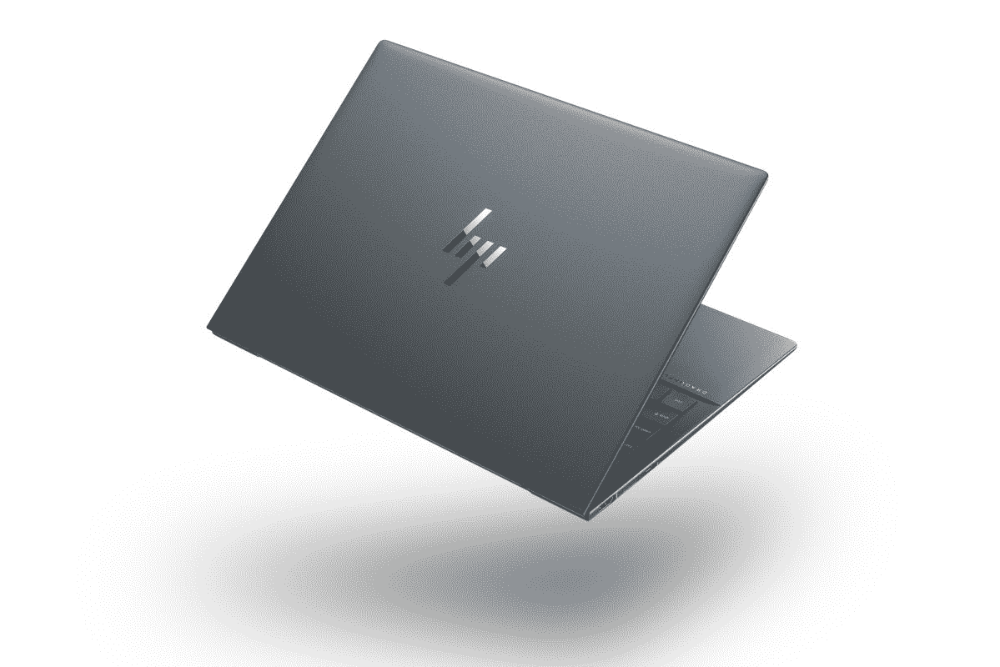

# 惠普精英蜻蜓 G3 vs MacBook Pro 14:你该买哪个？

> 原文：<https://www.xda-developers.com/hp-elite-dragonfly-g3-macbook-pro-14/>

决定下一步买哪台电脑可能会令人困惑，特别是当你在你的设备上投资一大笔钱时。市面上有很多像样的苹果电脑和笔记本电脑，包括一些 T4 的惠普和 T5 笔记本，选择哪一款适合你可能会令人困惑。为了简化您的选择过程，我们将对惠普和苹果生产的两款功能强大的笔记本电脑进行细分。这是惠普精英蜻蜓 G3 vs MacBook Pro 14:专业笔记本电脑之战。

## 惠普精英蜻蜓 G3 与苹果 MacBook Pro 14:规格

|  | 惠普精英蜻蜓 G3 | 苹果 MacBook Pro 14 |
| --- | --- | --- |
| **CPU** | 

*   支持博锐和英特尔 Evo 的第 12 代英特尔酷睿处理器

 | 

*   苹果 M1 专业版(8 核 CPU)
*   苹果 M1 专业版(10 核 CPU)
*   苹果 M1 Max (10 核 CPU)

 |
| **图形** |  | 

*   苹果 M1 专业版(14 核 GPU)
*   苹果 M1 专业版(16 核 GPU)
*   苹果 M1 Max (24 核 GPU)
*   苹果 M1 Max (32 核 GPU)

 |
| **正文** | 

*   16.4 x 297.4 x 220.4mm 毫米
*   起始重量为 0.99 千克

 | 

*   15.5 x 312.6 x 221.2mm 毫米
*   1.6 千克

 |
| **显示** | 

*   13.5 英寸 FHD+ (1920 x 1280)，400 尼特
*   13.5 英寸 FHD+(1920 x 1280)HP Sure View Reflect，1000 尼特
*   13.5 英寸 3K2K (3000 x 2000)有机发光二极管，触摸，400 尼特，防反光

 | 

*   14.2 英寸 Liquid Retina XDR 显示屏(3024 x 1964)，峰值亮度高达 1600 尼特，True Tone 技术，自适应刷新率高达 120Hz 的提升技术

 |
| **端口** | 

*   2 个 USB-C
*   1 个 USB-A 端口(也用于供电)
*   HDMI 2.0
*   3.5 毫米耳机插孔
*   Nano SIM 卡插槽(可选)

 | 

*   3 个 USB-C，带电源和显示端口
*   高清晰度多媒体接口
*   3.5 毫米耳机插孔
*   MagSafe 3
*   SD 卡插槽

 |
| **存储** |  |  |
| **闸板** |  |  |
| **电池** | 

*   4 芯 45 瓦时电池
*   6 芯 68 瓦时电池
*   65W USB-C 充电或 100 w USB Type-A 惠普快充

 |  |
| **音频** | 

*   高级扬声器(高达 78 分贝)，分立放大器

 | 

*   播放 Dolby Atmos 内容时，高保真六扬声器音响系统具有力抵消低音扬声器和空间音频支持

 |
| **摄像机** | 

*   带隐私快门的 500 万像素摄像头

 |  |
| **连通性** | 

*   英特尔 Wi-Fi 6E AX211 (2×2)
*   蓝牙 5.2
*   NFC(可选)
*   4G LTE 或 5G 蜂窝(可选)

 |  |
| **颜色** | 

*   天然银
*   石板蓝

 |  |
| **价格** |  |  |

## 设计

设计是一件主观的事情，但是我们仍然可以做出客观的观察和判断。惠普 Elite 蜻蜓 G3 的设计与 MacBook Pro 的设计相对相似。后者的特点是一个完整的重新设计(相比其前身)，并包括一个缺口显示。与近年来发布的笔记本电脑相比，这两款笔记本电脑的边框都很薄。然而，Elite 蜻蜓 G3 比 MacBook Pro 14 具有更大的灵活性——显示屏可以安全地移动 180°。虽然大多数人可能不需要它，但它仍然让惠普笔记本电脑赢得了额外的设计分。

谈到端口，这两款笔记本电脑都有很多种。不过，值得注意的是，精英版蜻蜓 G3 有一个可选的 SIM 卡插槽，允许您利用 4G 或 5G 网络。此外，它还有一个 USB-A 端口，这是 Mac 上所没有的。许多人已经改用 USB-C，但直到今天，一些小工具仍然附带 USB-A 电缆。不过，与惠普笔记本电脑不同的是，MacBook Pro 有一个 SD 卡插槽，如果你是一名专业摄影师，这尤其有用。

两款设备都有两种颜色可供选择。此外，如果你不喜欢现在的装饰，你可以买一个皮肤或者一个盒子。最终，笔记本电脑的颜色可能不是你在购买时应该关注的。如果你经常去露营，考虑到它支持移动数据，惠普可能更有意义。如果你在日常生活中仍然依赖 USB-A 配件，得到它将是一个不错的主意。然而，如果你是一名摄影师或摄像师，MacBook Pro 配有一个 SD 卡插槽，这可能是在这一领域工作时的必需品。

## 显示

说到显示器，这些设备各有优缺点。14 英寸的 MacBook Pro 配备了令人惊叹的 3024 x 1964 屏幕，边角干净圆润。相反，惠普精英版蜻蜓 G3 的基本型号尺寸为 1920 x 1280。如果你愿意花更多的钱，你可以把惠普笔记本电脑的价格提高到 3000 乘以 2000。

还值得指出的是，你可以买到配有触摸屏的精英版蜻蜓 G3。MacBooks 不支持触摸控制，所以如果这对你来说是一个障碍，你只能选择惠普。同样值得一提的是，Mac 电脑的亮度可以达到 1600 尼特，而精英版蜻蜓 G3 的亮度在部分型号上不会超过 1000 尼特。因此，如果你在户外环境中工作，并且想要一个真正明亮的屏幕，那么你可能需要考虑 MacBook Pro 14。

## 表演

根据您选择的配置，性能会有所不同。这两款笔记本电脑的基本型号都有强大的功能，但 MacBook Pro 在*耗尽*时拥有 M1 Max 芯片的优势。惠普 Elite 蜻蜓 G3 尚未上市，因此日常任务中的基准测试结果和准确性能比较仍然有限。

谈到存储，MacBook Pro 的存储容量可以扩展到 8TB，而惠普的存储容量则限制在 2TB。同样，精英版蜻蜓 G3 的内存不能超过 32GB，这被 MacBook 的 64GB 限制超越了。因此，根据你在本地存储的文件数量和你需要的内存，你可能会被迫选择 Mac。如果你不需要最大容量的 MacBook Pro 14，那么惠普笔记本电脑就可以了。

MacBook Pro 运行的是 macOS Monterey，而精英版蜻蜓 G3 运行的是 T2 的 Windows 11。我们不会比较这两个操作系统，因为它们都提供了桌面操作系统所能提供的主要功能。哪一个更好取决于您的工作流、用例以及您所处的生态系统(假设您是)。macOS Monterey 和 Windows 11 分别是苹果和微软的最新产品。因此，无论购买哪种设备，你都可以利用每家公司提供的最新功能和安全补丁。不过，值得一提的是，macOS 和 Mac 都是由苹果公司开发和生产的，这导致了近乎完美的优化和兼容性。

## 结果

惠普 Elite 蜻蜓 G3 和 MacBook Pro 14 是两款功能强大的笔记本电脑，各有优缺点。在选择要购买的设备时，你必须做出妥协——这取决于你想要什么。不过，请记住，惠普笔记本电脑的价格明显高于苹果笔记本电脑。因此，如果你的预算有限，你可能会考虑后一种选择。

 <picture></picture> 

HP Elite Dragonfly G3

##### 惠普精英蜻蜓 G3

惠普 Elite 蜻蜓 G3 提供了全高清屏幕、轻巧的外形和现代的设计。它运行 Windows 系统，价格很高。

 <picture></picture> 

MacBook Pro 14-inch (2021)

##### 苹果 MacBook Pro 14 (2021)

14 英寸的 MacBook Pro 是由苹果 M1 Pro 或 M1 Max 芯片驱动的强大怪兽。它运行的是 macOS Monterey，功能一流。

*您会购买哪种专业笔记本电脑，为什么？请在下面的评论区告诉我们。*