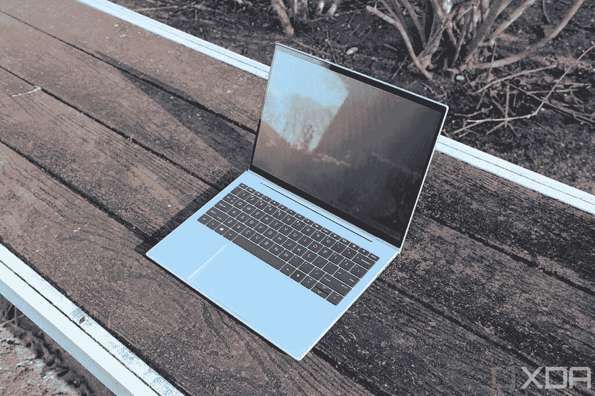
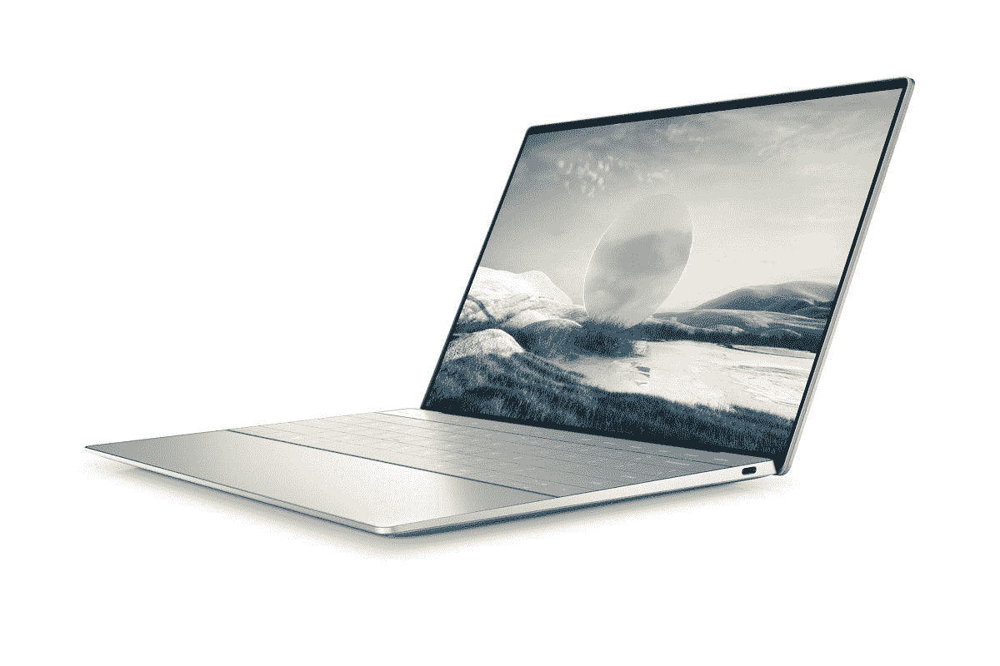

# 惠普精英蜻蜓 G3 与戴尔 XPS 13 Plus:哪个更好？

> 原文：<https://www.xda-developers.com/hp-elite-dragonfly-g3-vs-dell-xps-13-plus/>

我们今年仍然有点早，但 2022 年已经看起来像是笔记本电脑非常有前途的一年。到目前为止，我们已经看到了一些主要的新产品推出，其中包括惠普精英蜻蜓 G3 和戴尔 XPS 13 Plus。这是你今天能买到的两款最好的笔记本电脑的新版本，它们都带来了很多新的东西。

如果你难以在两者之间做出选择，我们会帮助你。我们将在几个关键方面对惠普精英版蜻蜓 G3 和戴尔 XPS 13 Plus 进行比较，以帮助您确定最适合您的产品。这是两款非常棒的现代笔记本电脑，但是有一些关键的区别可能会让你更喜欢其中的一款。让我们仔细看看。

## 惠普精英蜻蜓 G3 与戴尔 XPS 13 Plus

|  | 

惠普精英蜻蜓 G3

 | 

戴尔 XPS 13 Plus

 |
| --- | --- | --- |
| **操作系统** |  |  |
| **CPU** | 

*   英特尔酷睿 i5-1235U(最高 4.4GHz，10 个内核，12 个线程，12MB 高速缓存)
*   英特尔酷睿 i5-1245U 博锐处理器(最高 4.4GHz，10 个内核，12 个线程，12MB 高速缓存)
*   英特尔酷睿 i7-1255U(最高 4.7GHz，10 个内核，12 个线程，12MB 高速缓存)
*   英特尔酷睿 i7-1265U 博锐处理器(最高 4.8GHz，10 个内核，12 个线程，12MB 高速缓存)

 | 

*   第 12 代英特尔酷睿 i5-1240P (12 核，16 线程，最高 4.4 GHz，12MB 高速缓存)
*   第 12 代英特尔酷睿 i7-1260 处理器(12 核、16 线程、最高 4.7 GHz、18MB 高速缓存)
*   第 12 代英特尔酷睿 i7-1270P (12 核，16 线程，最高 4.8 GHz，18MB 高速缓存)
*   第 12 代英特尔酷睿 i7-1280 处理器(14 核、20 线程、最高 4.8 GHz、24MB 高速缓存)

 |
| **图形** |  |  |
| **显示** | 

*   13.5 英寸 FHD+ (1920 x 1280) 400 尼特
*   13.5 英寸 FHD+(1920 x 1280)HP Sure View Reflect，1000 尼特
*   13.5 英寸 3K2K (3000 x 2000)有机发光二极管，触摸，400 尼特，防反光

 | 

*   13.4 英寸 FHD+ (1920 x 1200) InfinityEdge 非触摸，500 尼特，防反光
*   13.4 英寸 FHD+(1920 x 1200)infinity edge touch，500 尼特，防反光
*   13.4 英寸 UHD+(3840 x 2400)infinity edge touch，500 尼特，防反光
*   13.4 英寸 3.5K (3456 x 2160) InfinityEdge 有机发光二极管触摸屏，DisplayHDR 500，400 尼特，100% DCI-P3 色域，防反射，康宁大猩猩玻璃 Victus

 |
| **存储** | 

*   256GB PCIe 固态硬盘
*   256GB PCIe TLC 固态硬盘
*   512GB PCIe 固态硬盘
*   512GB PCIe TLC 固态硬盘
*   512GB 自加密 PCIe TLC 固态硬盘
*   1TB PCIe 固态硬盘
*   2TB PCIe 固态硬盘

 | 

*   256GB PCIe 4 固态硬盘
*   512GB PCIe 4 固态硬盘
*   1TB PCIe 4 固态硬盘
*   2TB PCIe 4 固态硬盘

 |
| **闸板** |  | 

*   8GB 双通道 DDR5 5200MHz
*   16GB 双通道 DDR5 5200MHz
*   32GB 双通道 DDR5 5200MHz

 |
| **电池** | 

*   4 芯 45 瓦时电池
*   6 芯 68 瓦时电池
    *   65W USB-C 充电或 100 w USB Type-A 惠普快充

 |  |
| **端口** | 

*   2 个 Thunderbolt 4(USB C 类)端口
*   1 个 USB 类端口(也用于充电)
*   HDMI 2.0
*   3.5 毫米组合音频插孔
*   Nano SIM 卡插槽(可选)

 | 

*   2 个 Thunderbolt 4(USB C 类)端口
    *   含 USB 型至 A 型适配器

 |
| **音频** | 

*   高级扬声器(高达 78 分贝)，分立放大器

 | 

*   四声道立体声扬声器(8W 总输出)
*   双阵列麦克风

 |
| **摄像机** | 

*   500 万像素网络摄像头，带惠普显示和隐私快门

 |  |
| **视窗你好** | 

*   红外网络摄像头
*   指纹传感器

 | 

*   红外网络摄像头
*   指纹传感器

 |
| **连通性** | 

*   英特尔 Wi-Fi 6E AX211 (2x2)
*   蓝牙 5.2
*   可选:NFC
*   可选:4G LTE 或 5G 蜂窝

 | 

*   英特尔 Wi-Fi 6E AX211 (2×2)
*   蓝牙 5.2

 |
| **颜色** | 

*   天然银
*   石板蓝

 |  |
| **尺寸(WxDxH)** | 297.4×220.4×16.4 毫米(11.71 × 8.68 × 0.65 英寸) | 295.3×199.04×15.28 毫米(11.63 × 7.84 × 0.6 英寸) |
| **重量** | 起始重量为 0.99 千克(2.2 磅) | 起始重量为 1.24 千克(2.73 磅) |
| **价格** | 起价 2659 美元 | 起价 1199 美元 |

## 展示:他们都很棒

这两款笔记本电脑的第一大区别在于它们的显示屏。这两款都是顶级笔记本电脑屏幕，但每款笔记本电脑都有不同的选项。惠普 Elite 蜻蜓 G3 的宽高比为 3:2，基本型号的分辨率为全高清+ (1920 x 1280)。你可以升级它，使其包括惠普的隐私屏幕 HP Sure View Reflect，或者 3K2K (3000 x 2000)有机发光二极管触摸模型的 spring。

 <picture></picture> 

HP Elite Dragonfly G3 with Sure View Reflect

隐私屏选项是处理敏感信息的商业用户的理想选择。如果你在公共场所，不想让任何人看到你在做什么，这是一个很好的选择。另一方面，如果你想要最清晰、最有活力的显示器，3K2K 有机发光二极管型号非常好。

另一方面，戴尔 XPS 13 Plus 具有 16:10 的宽高比-仍然高于典型的 16:9 显示器，但没有 3:2 高。它更适合消费者和创意专业人士，所以你没有隐私屏幕选项。基本型号是全高清+ (1920 x 1200)面板，你可以升级它以添加触摸支持，或者一直到超高清+ (38440 x 2400)面板。但这些只是 IPS 选项。如果你愿意，你可以得到一个 3.5K (3456 x 2160)有机发光二极管显示屏，比惠普的笔记本电脑还要清晰。

该有机发光二极管显示器还支持 100%的 DCI-P3 和 DisplayHDR 500，此外，它还受到 Gorilla Glass Victus 的保护，具有额外的耐用性。所有高级配置也支持触摸。如果您想要最佳的媒体消费或创作体验，戴尔 XPS 13 Plus 可能是更好的选择。

然而，在显示器上方，戴尔 XPS 13 Plus 配备了一个普通的 720p 网络摄像头，这并不令人印象深刻。戴尔的 XPS 笔记本电脑的网络摄像头一直很差，戴尔表示已经做出了一些改进，但仍然不是很清晰。

惠普 ELite 蜻蜓 G3 配有一个带隐私快门的 500 万像素网络摄像头。

另一方面，惠普 Elite 蜻蜓 G3 具有非常清晰的 500 万像素惠普网络摄像头，因此您可以获得自动取景和其他增强功能。此外，它还有一个隐私快门，这是商用笔记本电脑的常见功能。至少这两款笔记本电脑都支持 Windows Hello 面部识别，并且都有指纹识别器，所以你可以使用最方便的方法解锁笔记本电脑。

## 设计:戴尔 XPS 13 Plus 具有未来主义的外观

虽然这两款笔记本电脑看起来和感觉上都很棒，但在整体外观方面，我们必须让 Dell XPS 13 Plus 更胜一筹。它有两种相当基本的颜色——铂金色和石墨色——但出于几个原因，它看起来非常干净和前卫。首先，没有触摸板，至少你看不到。它完全无缝，融入底盘。

另一个因素是零点阵键盘，这意味着按键之间几乎没有空间，键盘延伸到机箱的边缘。最后，键盘上的功能行现在是基于触摸的，而不是使用物理键。所有这些加起来就是一台看起来比现在市场上任何东西都更现代的笔记本电脑。

另一方面，惠普精英蜻蜓看起来更像一个标准的笔记本电脑。它有自然银或石板蓝(更接近黑色)，但它的设计没有任何不同。你有一个普通的键盘，功能键和触摸板。虽然它看起来不那么有趣，但对可用性来说可能更好，因为没有太多的学习曲线。

戴尔 XPS 13 Plus 更小，但 Elite 蜻蜓 G3 更轻。

戴尔 XPS 13 Plus 也比精英版蜻蜓 G3 更紧凑，几乎在每个维度上都更小。然而，Elite 蜻蜓 G3 明显更轻，与 2.73 磅的 XPS 13 Plus 相比，仅重 2.2 磅。这是一个明显的区别，当谈到便携性时，重量可能比尺寸更重要。

## 端口和连接性:精英版蜻蜓 G3 有更多功能

Dell XPS 13 如此紧凑的一个后果是它的端口非常少。你得到的只是两个 Thunderbolt 4 端口，仅此而已。连耳机插孔和 microSD 读卡器都没有。盒子里有一个 USB Type-C 转 Type-A 的适配器，但仅此而已。如果你带着这台笔记本电脑，你将会非常依赖于迅雷坞站或无线外设。

同时，惠普 Elite 蜻蜓 G3 是一款商务笔记本电脑，像大多数同类笔记本电脑一样，它有稳定的端口供应。两个 Thunderbolt 4 端口，一个 USB Type-A 端口，HDMI 和一个耳机插孔。它不像一些更大的笔记本电脑那样端口丰富，但对于这个尺寸来说，这是一个不错的选择。

精英版蜻蜓 G3 的另一个特性是蜂窝连接选项，您可以选择 4G LTE 或 5G。这在商用笔记本电脑中也很常见，但戴尔 XPS 13 Plus 不是这样，所以它没有这种功能。正如你所料，这两款笔记本电脑都支持 Wi-Fi 6E 和蓝牙 5.2。

## 操作系统:戴尔 XPS 13 Plus 有 Linux 版本

这两款笔记本电脑中值得一提的是操作系统。这两款笔记本电脑都配有 Windows 11，但由于 Elite 蜻蜓 G3 是一款商务笔记本电脑，它可能会配有 Windows 11 Pro。与此同时，戴尔通常只出售装有 Windows 11 Home 的 XPS 13 Plus。Windows 11 专业版有一些对企业很重要的额外功能，包括访问组策略编辑器、Hyper-V、远程桌面和 BitLocker 加密。你可以查看我们对 Windows 11 家庭版和专业版的完整比较，以了解更多关于这些差异的信息。

虽然 Windows 11 可能是最受欢迎的选择，但戴尔也将销售装有 Ubuntu Linux 20.04 的 XPS 13 Plus。您需要寻找开发者版本，但是如果您更喜欢 Linux，戴尔会为您提供现成的选项。

## 性能:两款笔记本电脑都配备了英特尔 Alder Lake 处理器

最后，谈到性能，这些笔记本电脑有一些共同点，但它们也非常不同。它们都采用了英特尔的第 12 代 Alder Lake 处理器，但戴尔 XPS 13 Plus 采用了 28W P 系列处理器，而惠普在 Elite 蜻蜓 G3 中选择了更典型的 U15 系列 15W 处理器。这意味着 Dell XPS 13 Plus 将通过多达 14 个内核和 20 个线程为您提供显著更好的性能。

虽然性能指标评测并不是衡量性能的最终标准，但我们可以看看下面的数字，看看基于这两款笔记本电脑所采用的处理器，我们对它们的性能有什么期望。差异是显著的，尽管我们应该注意到，对于大多数日常工作负载来说，这两者都已经足够快了。

|  | 

英特尔酷睿 i5-1235U( [参见测试](https://browser.geekbench.com/v5/cpu/14628325))

 | 

英特尔酷睿 i5-1240P( [参见测试](https://browser.geekbench.com/v5/cpu/14638360))

 | 

英特尔酷睿 i7-1255U( [参见测试](https://browser.geekbench.com/v5/cpu/14475536))

 | 

英特尔酷睿 i7-1280 处理器([参见测试](https://browser.geekbench.com/v5/cpu/14658087))

 |
| --- | --- | --- | --- | --- |
| Geekbench 5(单核/多核) | 1,586 / 6,432 | 1,552 / 7,494 | 1,679 / 6,942 | 1,710 / 8,430 |

同样，虽然这些数字并没有描绘出全貌，但它们确实说明了你可以预期的差异。惠普 Elite 蜻蜓 G3 中的英特尔酷睿处理器最多只有 10 个内核和 12 个线程，因此在多核性能方面落后。然而，就集成 GPU 而言，这两款笔记本电脑应该不会有太大差异。它们都有英特尔 iris Xe 显卡，并且它们在 P 系列处理器中的时钟速度仅略快。

性能差异的另一面是电池寿命，你可以期待惠普精英蜻蜓 G3 在这方面做得更好。因为处理器的 TDP 更低，所以它们啃电池的速度更慢，这意味着这是便携性的更好选择。

这两款笔记本电脑还配备了高达 32GB 的 LPDDR5 RAM，在两种情况下都焊接在主板上。此外，两者都配备了高达 2TB 的存储空间。

## 最后的想法

像往常一样，您应该购买戴尔 XPS 13 Plus 还是惠普 Elite 蜻蜓 G3 取决于您的个人需求。这两款笔记本电脑都很棒，但它们面向不同的受众。戴尔 XPS 13 Plus 更适合现代消费者。它有一个未来主义的设计，一个伟大的显示器，有一些精彩的媒体消费和创作选项，它非常紧凑。它没有很多端口，但它也面向习惯于大多数无线设备的受众。

另一方面，精英版蜻蜓 G3 是面向商业用户的。您可以选择 HP Sure View Reflect 来保护敏感信息的安全，还有一个更好的网络摄像头用于会议和视频通话，它拥有长期业务用户会喜欢的所有端口。你可以插入旧的闪存驱动器，使用有线鼠标，通过 HDMI 连接到外部显示器，所有这些都不需要一堆适配器。对于喜欢熟悉笔记本电脑感觉的用户来说，更经典的设计也没有太多的学习曲线。此外，Elite 蜻蜓 G3 非常轻便，因此您可以带着它去上班或回家，不会有任何问题。

不管你适合什么样的受众，这两款产品都很棒，无论你最终选择了什么，你都不会后悔购买。如果你对其中一个感兴趣，你可以通过下面的链接购买这两个。否则，你可以查看一下你现在能买到的[最佳戴尔笔记本电脑](https://www.xda-developers.com/best-dell-laptops/)或[最佳惠普笔记本电脑](https://www.xda-developers.com/best-hp-laptops/)。

 <picture></picture> 

HP Elite Dragonfly G3

##### 惠普精英蜻蜓 G3

惠普 Elite 蜻蜓 G3 是惠普最高端的商用笔记本电脑，采用第 12 代英特尔处理器、3:2 显示屏和轻量级设计。

 <picture></picture> 

Dell XPS 13 Plus

##### 戴尔 XPS 13 Plus

Dell XPS 13 Plus 是一款功能强大的现代笔记本电脑，配备 28W 英特尔处理器。