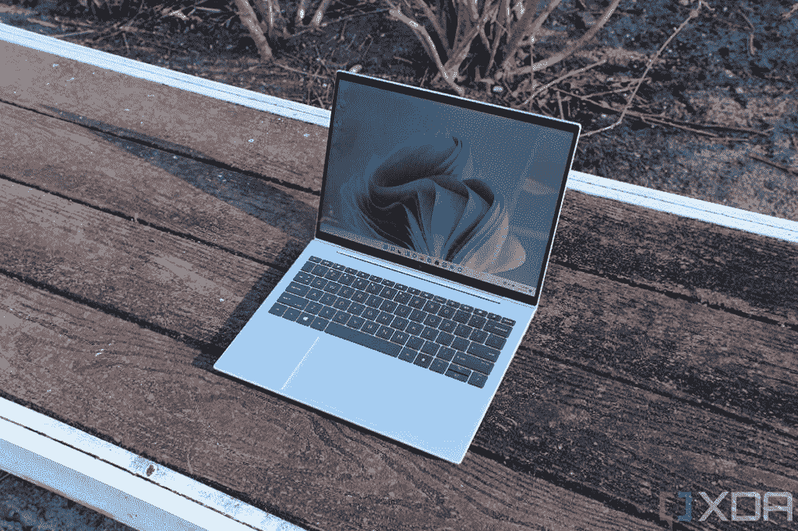
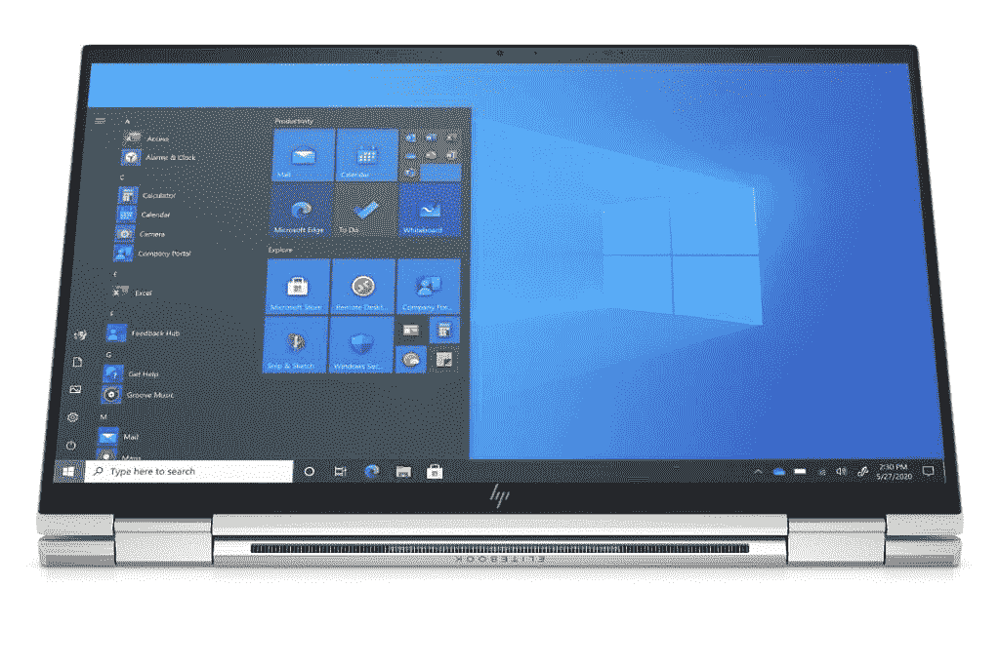
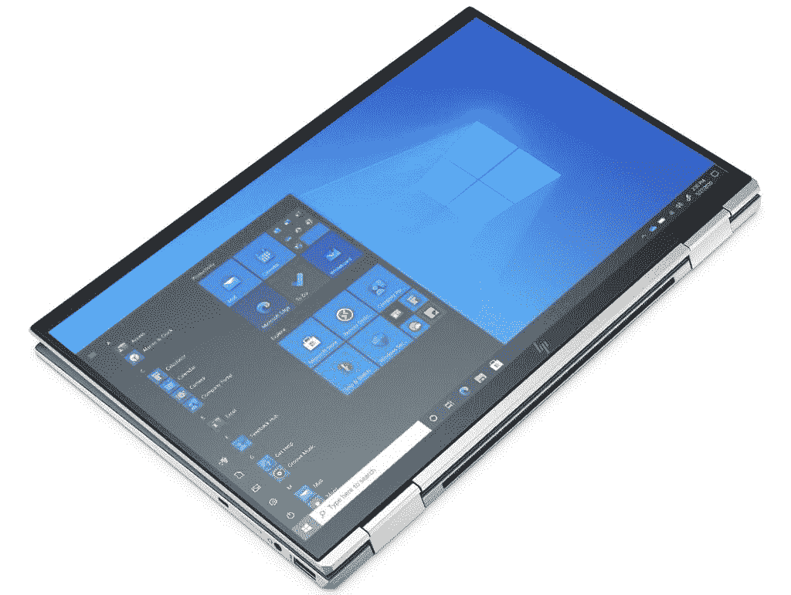
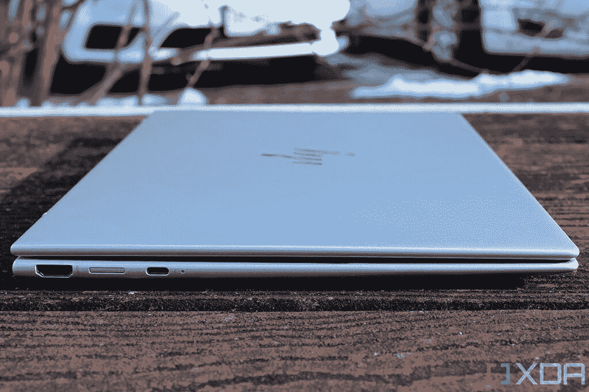
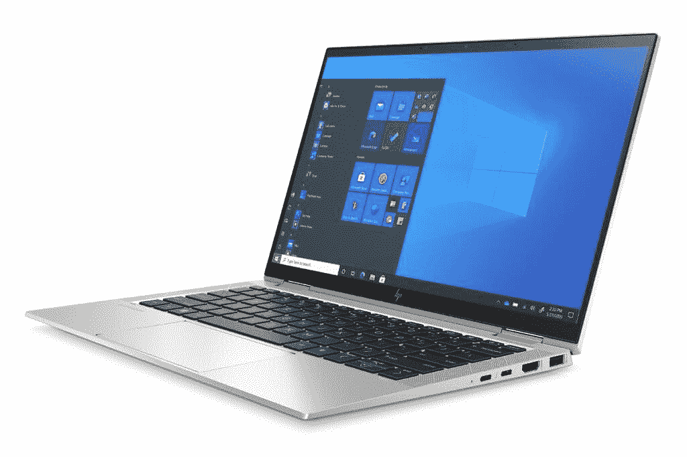
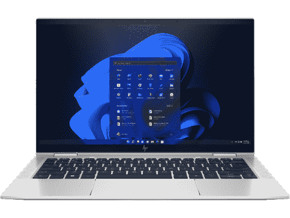

# 惠普精英蜻蜓 G3 与 EliteBook x360 1030:哪个更好？

> 原文：<https://www.xda-developers.com/hp-elite-dragonfly-g3-vs-hp-elitebook-x360-1030/>

惠普制造了一些很棒的商用笔记本电脑，即将推出的精英蜻蜓 G3 有望成为迄今为止最好的笔记本电脑之一。它采用英特尔最新的处理器，拥有新的 3:2 显示屏，非常轻便。然而，它抛弃了一些人可能喜欢的可转换外形。不过，惠普还有许多其他高端商务笔记本电脑，包括 EliteBook x360 130，它确实有一个可转换的外形。那么，惠普 Elite 蜻蜓 G3 与 EliteBook x360 1030 相比如何呢？

嗯，它们都是很棒的笔记本电脑，但是马上，值得指出的是，HP EliteBook x360 1030 尚未更新为第 12 代英特尔处理器，因此 Elite 蜻蜓 G3 具有性能优势。否则，这是两个坚实的商务笔记本电脑，让我们仔细看看你应该选择哪一个。

## 惠普精英蜻蜓 G3 与 EliteBook x360 1030:规格

|  | 

惠普精英蜻蜓 G3

 | 

惠普 EliteBook x360 1030

 |
| --- | --- | --- |
| **CPU** | 

*   英特尔酷睿 i5-1235U(最高 4.4GHz，10 个内核，12 个线程，12MB 高速缓存)
*   英特尔酷睿 i5-1245U 博锐处理器(最高 4.4GHz，10 个内核，12 个线程，12MB 高速缓存)
*   英特尔酷睿 i7-1255U(最高 4.7GHz，10 个内核，12 个线程，12MB 高速缓存)
*   英特尔酷睿 i7-1265U 博锐处理器(最高 4.8GHz，10 个内核，12 个线程，12MB 高速缓存)

 | 

*   第 11 代英特尔酷睿 i5-1135G7 (4 核、8 线程、最高 4.2 GHz、8MB 高速缓存)
*   第 11 代英特尔酷睿 i5-1145G7(博锐，4 核，8 线程，最高 4.4 GHz，8MB 高速缓存)
*   第 11 代英特尔酷睿 i7-1165G7 (4 核、8 线程、最高 4.7 GHz、12MB 高速缓存)
*   第 11 代英特尔酷睿 i7-1185G7 (4 核、8 线程、最高 4.8 GHz、12MB 高速缓存)

 |
| **图形** |  |  |
| **显示** | 

*   13.5 英寸 FHD+ (1920 x 1280) 400 尼特
*   13.5 英寸 FHD+(1920 x 1280)HP Sure View Reflect，1000 尼特
*   13.5 英寸 3K2K (3000 x 2000)有机发光二极管，触摸，400 尼特，防反光

 | 

*   13.3 英寸 FHD (1920 x 1080) IPS，400 尼特，触摸，明亮视图或防眩光
*   13.3 英寸 FHD (1920 x 1080) IPS，1000 尼特，触控，HP Sure View 反射，BrightView 或防眩光
*   13.3 英寸 UHD (3840 x 2160) AMOLED，400 尼特，触控，BrightView

 |
| **存储** | 

*   256GB PCIe 固态硬盘
*   256GB PCIe TLC 固态硬盘
*   512GB PCIe 固态硬盘
*   512GB PCIe TLC 固态硬盘
*   512GB 自加密 PCIe TLC 固态硬盘
*   1TB PCIe 固态硬盘
*   2TB PCIe 固态硬盘

 | 

*   256GB PCIe 固态硬盘
*   512GB PCIe 固态硬盘
*   512GB PCIe 固态硬盘+ 32GB 英特尔 Optane

 |
| **闸板** |  | 

*   8GB LPDDR4x 4266MHz
*   16GB LPDDR4x 4266MHz
*   32GB LPDDR4x 4266MHz

 |
| **电池** | 

*   4 芯 45 瓦时电池
*   6 芯 68 瓦时电池
    *   65W USB-C 充电或 100 w USB Type-A 惠普快充

 |  |
| **端口** | 

*   2 个 Thunderbolt 4(USB C 类)端口
*   1 个 USB 类端口(也用于充电)
*   HDMI 2.0
*   3.5 毫米组合音频插孔
*   Nano SIM 卡插槽(可选)

 | 

*   2 个 Thunderbolt 4(USB C 类)端口
*   2 个 USB 类端口
*   HDMI 2.o
*   3.5 毫米组合音频插孔
*   Nano SIM 卡插槽(可选)

 |
| **音频** | 

*   高级扬声器(高达 78 分贝)，分立放大器

 | 

*   四声道顶级立体声扬声器
*   双阵列麦克风

 |
| **摄像机** | 

*   500 万像素网络摄像头，带惠普显示和隐私快门

 |  |
| **视窗你好** | 

*   红外网络摄像头
*   指纹传感器

 | 

*   红外网络摄像头
*   指纹传感器

 |
| **连通性** | 

*   英特尔 Wi-Fi 6E AX211 (2x2)
*   蓝牙 5.2
*   可选:NFC
*   可选:4G LTE 或 5G 蜂窝

 | 

*   英特尔 Wi-Fi 6 AX201 (2×2)
*   蓝牙 5
*   可选:NFC
*   可选:4G LTE(第 9 类)或 5G 蜂窝

 |
| **颜色** | 

*   天然银
*   石板蓝

 |  |
| **尺寸(WxDxH)** | 297.4×220.4×16.4 毫米(11.71 × 8.68 × 0.65 英寸) | 303.78×193.8×16 毫米(11.96×7.63×0.63 英寸) |
| **重量** | 起始重量为 0.99 千克(2.2 磅) | 起始重量为 1.22 千克(2.68 磅) |
| **价格** | 起价 2659 美元 | 起价 2，669 美元(各不相同) |

## 性能:英特尔第 12 代处理器大有作为

正如我们上面提到的，这两款笔记本电脑之间的第一个大区别是，惠普 Elite 蜻蜓 G3 配备了英特尔的第 12 代酷睿处理器，而 EliteBook x360 1030 尚未更新。英特尔的第 12 代 U 系列处理器配备了 10 个内核和 12 个线程，这要归功于一种新的混合架构，该架构混合了高性能和高效内核，以提高性能和能效。

 <picture></picture> 

HP Elite Dragonfly G3

这与 HP EliteBook x360 1030 中的最大四核八线程相比是一个巨大的飞跃。第 12 代英特尔酷睿处理器的基准测试分数并不多，但早期结果表明在性能方面有一些非常显著的提升。以下是这些笔记本电脑中的处理器在 Geekbench 5 中的得分:

|  | 

英特尔酷睿 i5-1145G7(平均)

 | 

英特尔酷睿 i5-1235U( [参见测试](https://browser.geekbench.com/v5/cpu/14628325))

 | 

英特尔酷睿 i7-1185G7(平均)

 | 

英特尔酷睿 i7-1255U( [参见测试](https://browser.geekbench.com/v5/cpu/14475536))

 |
| --- | --- | --- | --- | --- |
| Geekbench(单核/多核) | 1,310 / 4,439 | 1,586 / 6,432 | 1,402 / 4,861 | 1,679 / 6,942 |

基准测试并不能说明全部——事实上，它们通常只能说明很小的一部分——所以你不应该期待改变生活的性能。尽管如此，你还是知道会发生什么，新处理器无疑更快，尤其是在多核工作负载方面。

变化不大的是集成显卡。第 11 代和第 12 代英特尔处理器之间的英特尔 Iris Xe 几乎没有变化，因此在做出决定时，这一点不应该有太大影响。

惠普 Elite 蜻蜓 G3 拥有更快的 LPDDR5 内存和 PCIe Gen 4 固态硬盘。

惠普 Elite 蜻蜓 G3 还配备了新的更快的 LPDDR5 内存，以及 PCIe 第四代固态硬盘存储。这也应该有助于日常使用中的整体性能和快速性。

## 显示屏:惠普精英版蜻蜓 G3 的屏幕宽高比为 3:2

惠普 Elite 蜻蜓的另一大新功能是显示屏，其长宽比为 3:2。这种更高的格式为屏幕上的内容提供了更多的空间，从而导致整体表面积更大。无论是阅读页面还是在 Adobe Photoshop 或 Premiere 等应用程序中工作，更高的显示屏都可以大大提高工作效率。基本型号有一个全高清(1920 x 1280)面板，您可以配备一个隐私屏幕(HP Sure View Reflect)，但您也可以升级到 3K2K (3000 x 2000)有机发光二极管型号，支持触摸。由于这是一台翻盖式笔记本电脑，并不是每个配置都支持触控，当然你也不能把这台笔记本电脑当平板电脑用。

 <picture></picture> 

HP Elite Dragonfly G3 with Sure View Reflect enabled

另一方面，HP EliteBook x360 1030 的显示屏仍然具有典型的 16:9 宽高比，因此您会错过更高显示屏的优势。基本型号有一个全高清(1920 x 1080)面板，如果你需要，它还支持 HP Sure View Reflect。顶层配置是 4K AMOLED 面板，这是这两款笔记本电脑中最清晰的选择。由于这是一个可转换的，它在每个配置中都支持触摸，加上屏幕可以 360 度旋转，所以你可以将它用作平板电脑和其他模式。在展示中，你更关心什么取决于你自己。

 <picture></picture> 

HP EliteBook x360 1030 in stand mode

惠普精英版蜻蜓 G3 拥有一个 500 万像素的网络摄像头。

惠普 Elite 蜻蜓 G3 击败 EliteBook x360 1030 的一个毋庸置疑的地方是网络摄像头。它配备了一个 500 万像素的摄像头，支持 1080p 视频和 HP Presence，这是一组智能功能，包括自动取景和光线校正，因此您在视频通话和会议期间总是看起来很棒。惠普 EliteBook x360 1030 拥有一个 720p 网络摄像头，就像去年之前的许多笔记本电脑一样，没有任何花哨的功能。

在声音方面，两款笔记本电脑都声称拥有“顶级”扬声器，EliteBook x360 1030 特别配备了四扬声器。这可能是一个很大的优势，但惠普只是没有说明惠普精英蜻蜓 G3 有多少扬声器，所以它们可能是相似的。如果是的话，你应该从其中任何一个中获得可靠的音频体验。

## 设计和端口:HP EliteBook x360 1030 功能更多，但更重

虽然惠普 Elite 蜻蜓 G3 在许多方面都比前代产品有所提升，但这款产品也失去了一些东西。正如我们提到的，这款新机型是一款翻盖式笔记本电脑，因此您不能再将它用作平板电脑或敞篷车通常支持的其他模式。另一方面，顾名思义，HP EliteBook x360 1030 在很大程度上是一款敞篷车。这意味着你可以旋转屏幕，像使用平板电脑一样使用它，或者在帐篷模式下使用它来观看电影。

 <picture></picture> 

HP EliteBook x360 1030 in tablet mode

这种多功能性确实是以牺牲一些便携性为代价的，尽管这并不是一个很大的区别。HP EliteBook x360 1030 的起始重量为 2.68 磅，而 Elite 蜻蜓 G3 的起始重量为 2.18 磅。如果您打算将笔记本电脑随身携带几个小时，那么 Elite 蜻蜓 G3 会让您感到更加舒适。不过，这两款笔记本电脑的厚度几乎相同。

至于外观，这两款笔记本电脑没有太大的不同。惠普 Elite 蜻蜓 G3 确实提供了两种颜色选择，自然银和石板蓝，尽管这种蓝色更接近黑色。同时，EliteBook x360 1030 只有银色。这两款笔记本电脑看起来都很低调，一些商业用户可能会喜欢这一点。不过，如果你想要更突出一点的东西，这两个都不是特别令人兴奋。

 <picture></picture> 

HP Elite Dragonfly G3

加上端口，这两款笔记本电脑也非常相似。惠普 Elite 蜻蜓 G3 有两个 Thunderbolt 4 端口，一个 USB Type-A 端口，HDMI 和一个耳机插孔，而 EliteBook x360 1030 只是在此基础上增加了另一个 USB Type-A 端口。如果你想在没有 Wi-Fi 的情况下保持互联网连接，这两款笔记本电脑还可以选择 4G LTE 或 5G 蜂窝连接。当然，它们也支持蓝牙和 Wi-Fi，尽管精英版蜻蜓 G3 支持更新的 Wi-Fi 6E 标准。

## 最后的想法

如果性能对您来说是一个重要的优先事项，并且您不想等待很长时间来购买笔记本电脑，那么惠普精英蜻蜓 G3 显然是这两款笔记本电脑中更好的选择。不过，EliteBook x360 1030 采用第 12 代处理器可能只是时间问题，因此值得看看其他差异。

惠普 Elite 蜻蜓 G3 具有一些优势，如更高的显示屏，这有助于提高工作效率，更好的视频通话和会议网络摄像头，以及更轻便的设计。从某种程度上来说，它是更好的商务笔记本电脑——它能帮助你提高工作效率，让你在任何地方都能更轻松地工作。

 <picture></picture> 

HP EliteBook x360 1030

另一方面，HP EliteBook x360 1030 凭借其可转换的外形更具多功能性。如果你用手记笔记，或者你喜欢用你的电脑作为平板电脑，这给了你这个选择。如果您对媒体消费感兴趣，您可能还会喜欢 4K AMOLED 显示屏选项，因为这将是您可以在任何一种型号上获得的最清晰的显示屏。如果你打算等待更新，它可能还会有一个改进的网络摄像头或精英蜻蜓 G3 拥有的其他功能。

最后，关键在于你是看重敞篷车的多功能性，还是看重惠普对 Elite 蜻蜓 G3 的所有改进。根据你对这些事情的立场，你的选择应该很容易。如果你已经做出了选择，你可以在下面购买 HP EliteBook x360 1030，一旦可以购买，我们还会提供 HP Elite 蜻蜓 G3 的链接。与此同时，你也可以看看今天能买到的[最好的惠普笔记本电脑](https://www.xda-developers.com/best-hp-laptops/)。

 <picture></picture> 

HP Elite Dragonfly G3

##### 惠普精英蜻蜓 G3

惠普 Elite 蜻蜓 G3 是惠普最高端的商用笔记本电脑，采用第 12 代英特尔处理器、3:2 显示屏和轻量级设计。

 <picture></picture> 

HP EliteBook x360 1030 G8

##### 惠普 EliteBook x360 1030 G8

HP EliteBook x360 1030 是一款高端商务变形本，采用第 11 代英特尔处理器、多种端口和相对轻便的设计。