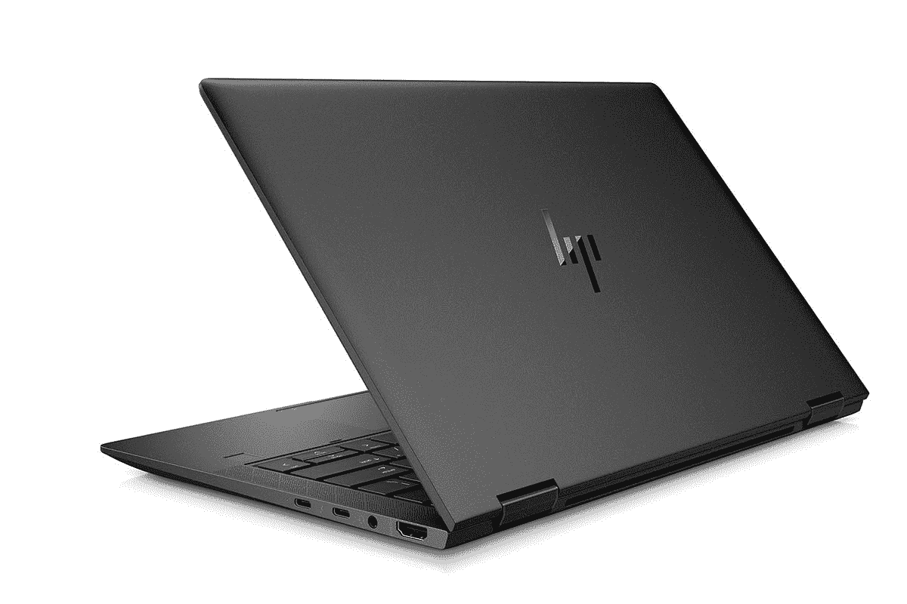

# 惠普精英蜻蜓马克斯审查:一个非凡的商业兑换

> 原文：<https://www.xda-developers.com/hp-elite-dragonfly-max-review/>

我最喜欢的之一

[convertible laptops](https://www.xda-developers.com/best-convertible-laptops/)

是惠普精英蜻蜓。很自然地，当公司提出要把蜻蜓 Max 送出去审查时，我欣然接受了。其实惠普的 EliteBooks 都是真的好；即使是主流的 EliteBook 800 系列也是鹤立鸡群。

精英蜻蜓系列(我猜它现在被称为系列)就像 EliteBook 1,000 系列，除了它是超轻的。它也没有银色和铝制外壳。不，这是镁做的，重量不到两磅半。精英版蜻蜓 Max 与普通版的不同之处在于它具有新的协作功能，如高分辨率网络摄像头。它还有闪亮的黑色，而不是蜻蜓蓝。

**浏览此评论:**

## 规范

| 

中央处理器

 | 英特尔酷睿 i7-1185G7(采用英特尔睿频加速技术，最高 4.8 GHz，12 MB 三级高速缓存，4 个内核)，支持英特尔博锐技术 |
| 

制图法

 | 英特尔 Iris Xe |
| 

身体

 | 11.98 x 7.78 x 0.63 英寸(30.43 x 19.75 x 1.61 厘米)，2.49 磅(1.13 千克) |
| 

显示

 | 13.3 英寸对角线，FHD (1920 x 1080)，触摸，防眩光，1000 尼特，100% sRGB，惠普 Sure View 集成隐私屏幕 |
| 

港口

 | (2)Thunderbolt 4(1)USB 3.1 Gen 1 Type-A(1)3.5 毫米音频(1) HDMI 2.0 |
| 

随机存取存储

 | 16GB LPDDR4X-4266 SDRAM |
| 

储存；储备

 | 512GB Gen3x4 NVMe M.2 固态硬盘 TLC |
| 

声音的

 | Bang & Olufsen 音频、4 个顶级立体声扬声器、2 个面向用户的多阵列麦克风和 2 个面向世界的麦克风 |
| 

投入

 | 惠普高级键盘–防泼溅、全尺寸背光键盘点击板，支持多点触控手势 |
| 

连通性

 | 英特尔 Wi-Fi 6 AX201 (2x2)和蓝牙 5 组合，vpro 高通骁龙 X55 5G LTE Cat 20 |
| 

网络摄像头

 | 红外摄像机；500 万像素摄像头(后置) |
| 

电池

 | 4 芯 56 瓦时长寿命电池(内置，不可由客户更换。保修服务。) |
| 

颜色

 | 闪亮的黑色 |
| 

材料

 | 数控加工镁 |
| 

价格

 | $2,793.46 |

请注意，就像商务电脑的情况一样，价格会有所变化，你会从零售商那里得到不同的优惠。另外，这是配置的价格。只使用 Wi-Fi 可以节省 440 美元，使用 4G LTE 甚至可以节省几百美元。

## 设计:惠普精英版蜻蜓 Max 采用闪亮的黑色

精英版蜻蜓 Max 或整个惠普精英版蜻蜓系列的最大亮点之一就是设计。它由镁制成，这使得它比 EliteBook 1,000 系列中较重的铝材料轻得多。

不过，最酷的是。它不只是普通的模制镁，就像我们在其他超轻[笔记本电脑](https://www.xda-developers.com/best-laptops/)中看到的那样。事实上，镁作为笔记本电脑中的一种材料，感觉起来更像塑料，这也意味着它们感觉很便宜。这是一种坚固的材料，而且这些肯定是顶级机器；他们就是没有那种感觉。惠普实际上使用数控加工镁在其精英蜻蜓阵容。这感觉一点都不便宜。

也让黑色好看。最初的精英蜻蜓是一种叫做蜻蜓蓝的颜色，而这款是闪亮的黑色。只是听起来像而已。它是黑色的，但如果你仔细看，它会发光。这是一种非常微妙的接触，让它看起来恰到好处。很漂亮，但不俗气。

惠普精英版蜻蜓 Max 的起价为 2.49 磅。它比精英版蜻蜓重约三分之一磅，与联想 ThinkPad X1 Carbon 一模一样。比 [ThinkPad X1 Nano](https://www.xda-developers.com/lenovo-thinkpad-x1-nano-review/) 重半磅；然而，它确实配备了一个更强大的处理器。

它也不吝啬端口。在右侧，有两个 Thunderbolt 4 端口，以及 HDMI 2.0 和 3.5 毫米音频插孔。这意味着您可以在一个端口上连接两个 4K 显示器或一个 8K 显示器。这也意味着如果集成的 Iris Xe 显卡对你来说还不够，你可以连接一个外部 GPU。

在左侧，您仍然可以获得 USB 3.2 Gen 1 Type-A 端口，因此您仍然可以连接您的传统外围设备。在那一侧还有一个电源按钮，它有点突出，所以你可以很容易地用手指找到它。

我希望看到的一件事是倒角的前部，这是我目前正在审查的 ZBook Firefly 14 上看到的东西。它只是让产品更容易打开，这是我在各种惠普产品中见过的巧妙设计。

## 惠普精英版蜻蜓 Max 拥有 13.3 英寸的 Sure View 显示屏

惠普精英蜻蜓配备了 13.3 英寸的 FHD 显示屏，该显示屏采用了该公司的 Sure View Reflect 隐私技术。挺牛逼的。该公司曾举办过这些研讨会，并表示有两种人:需要确定观点的人和不知道自己需要确定观点的人。

这个想法是为了阻止惠普所谓的视觉黑客，也就是有人越过你的肩膀看你在做什么。它可能是公司机密、您的银行账户信息等等。启用“确定视图”后，用户只能看到一个铜色屏幕。挺酷的。

您可以使用 F2 键打开它。开着的时候确实用了更长的电池寿命。当它打开时，观看屏幕也有点困难。尽管几代人以来，这种情况越来越好。虽然惠普、戴尔和联想都开发了这些类型的隐私显示器，但惠普显然投入了最多的工作，并且拥有最好的显示器。

就屏幕质量而言，它支持 100% sRGB、74% NTSC、80% Adobe RGB 和 79% P3，这相当不错。虽然视角不是 178 度，但这是因为它是一个确定的视图显示。即使当该功能关闭时，您也可以看出区别。不过，这完全值得。

## 惠普精英版蜻蜓 Max 优先考虑网络摄像头、音频和协作

如果你关注我的评论，那么你就会知道这些天我总是指出的一件事就是网络摄像头，以及为什么这么多笔记本电脑仍然有 720p 摄像头。这太可怕了。但你不会有这个问题与惠普精英蜻蜓最大。这款笔记本电脑有一个 500 万像素的网络摄像头，这在微软 Surface 系列的许多设备上都很少见。

不仅如此，这款相机还支持 1440p 30fps 的录制，因此视频像素是标准 720p 相机的四倍。这是一个巨大的进步。我会说这对一台商用笔记本电脑很重要，但坦率地说，这对 2021 年购买笔记本电脑的任何人都很重要。

如果这是所有的协作特性，我会非常高兴。你的变焦和团队会议将在精英蜻蜓最大期待精彩。他们听起来也会更好，对你和其他与会者都是如此。B&O 扬声器位于键盘的两侧，笔记本电脑底部有两个扬声器。

至于麦克风，惠普精英蜻蜓最大有内置的噪音消除。它可以阻挡持续的环境噪音，也可以阻挡你的狗在背景中吠叫。在最坏的情况下，它听起来含糊不清。这是在家工作的必需品。

但是这个精彩的网络摄像头还有更多。惠普将红外摄像头和网络摄像头的摄像头分开，因此您可以获得更好的色彩准确度。还有一个隐私保护装置可以保护它。

## 它配有 5G，但你必须付费

当我对惠普发给我的型号进行定价时，获得 5G 需要额外支付 440 美元，获得 4G LTE 需要额外支付 155 美元。就个人而言，我会选择 4G LTE。

对我来说，笔记本电脑的蜂窝连接非常有价值。我喜欢能够从任何地方连接，而不必担心同意某些条款和条件，被添加到邮件列表中，或者只是公共 Wi-Fi 的不安全性。我不必向我的朋友询问他的 Wi-Fi 密码，也不必向公司的人询问我如何连接。它只是工作。

而在 2021 年，难道不是吗？我真的不明白在 2021 年，蜂窝连接如何不是笔记本电脑的标准。当我打开我的电脑，它应该只是连接。

我们来分解一下 5G 和 4G LTE 的区别，除了 285 美元。没多少。像所有基于英特尔技术的 5G 电脑一样，它只支持低于 6GHz 的频率。目前，低于 6GHz 的 5G 真的不比 4G LTE 快。其实很多情况下，4G LTE 更快。这种情况应该会在某个时候改变，但我在美国没有看到这种情况。

另一种 5G 被称为毫米波，或毫米波。速度快得多，但频率很高，很容易被一张纸之类的东西挡住。它需要用天线直接瞄准。这也意味着支持毫米波的 PC 中的天线设计很复杂，所以我们看不到它，也不会从中受益。

## 惠普精英蜻蜓最大有最好的键盘

惠普的高端商用电脑拥有一些最好的键盘。事实上，几年前，惠普终于开始尝试与以键盘著称的联想 ThinkPads 竞争。它已经实现了。惠普的 EliteBooks 提供了舒适和准确的打字体验，因为这是我们与计算机交互的主要方式，所以这是一件大事。事实上，我认为一个好的键盘是笔记本电脑最重要的特征。

就像没有倒角一样，键盘也没有我们在过去一两年里从惠普笔记本电脑上看到的趋势。在其他设备上，它把所有的按钮都移到了键盘上。这包括电源按钮、指纹传感器，甚至相机隐私保护。这里不是这样的。指纹传感器在甲板的右下方，电源按钮在机箱的侧面。

微软的 Prevision touchpad 利用了可用的空间，这总是好的。当 OEM 留下浪费的空间时，这是我最讨厌的。当然，另一种输入方法是笔，它通过磁性附着在盖子上。

唯一的问题是 16:9 的显示屏。对于敞篷车，我更愿意看到 16:10 甚至 3:2。当折叠显示屏并与笔一起使用时，更大的宽高比有助于获得更好的体验。事实上，考虑到我是多么迷恋这台笔记本电脑，长宽比可能是我最大的抱怨。

## 它有老虎湖 U 性能

惠普发给我的 Elite 蜻蜓 Max 包括一个英特尔酷睿 i7-1185G7 和 16GB 内存。对于 OEM 来说，这是一种非常常见的配置，可以与 512GB 固态硬盘一起发送给审核人员。这是我感觉要一遍又一遍地写这一部分的事情之一。这些不是罕见的或定制的零件。坦率地说，您应该购买这款笔记本电脑，因为它提供了非常棒的功能，如超轻设计、Sure View 显示屏和协作功能。

惠普精英版蜻蜓的“最大”版本的酷之处在于，它可以防止你做出错误的选择。没有太多的配置选项。唯一的 CPU 选项是 Core i7-1165G7 和 Core i7-1185G7，并且您只能获得 16GB 或 32GB RAM。这里没有 Core i5 和 8GB RAM 组合。我个人推荐任何人至少 16GB RAM。它只是让你更加经得起未来的考验，能够处理出现的更大的任务。

处理器来自英特尔的 Tiger Lake U 系列家族，具体来说就是 Tiger Lake UP3。这是超极本和变形本中常见的典型芯片系列。也是一次大规模的升级。要了解这是多么大的一次升级，你必须打破英特尔的第十代产品阵容是多么令人困惑和愚蠢。

英特尔第十代由两个产品家族组成，10 纳米“冰湖”和 14 纳米“彗星湖”。英特尔在 14nm 上卡了很久，其 10nm 工艺也拖了好几年。当它最终交付 10 纳米冰湖时，它无法生产足够的冰湖，所以它将 14 纳米彗星湖与其一起运送。然而，Comet Lake 是唯一一款采用博锐技术的产品，因此所有采用第十代处理器的商用笔记本电脑都使用 Comet Lake 芯片。这意味着他们没有得到大光圈加图形增强。

与第 11 代，一切都是老虎湖。这意味着他们直接跳过 Ice Lake 的显卡提升，直接使用第 11 代处理器中的 Iris Xe 显卡。我们现在讨论的是，如果没有专用显卡，你以前不会想做的事情，比如 FHD 游戏、视频编辑等等。

对于基准测试，我使用了 PCMark 8、PCMark 10、Geekbench 和 Cinebench。

|  | 

精英蜻蜓 MaxCore i7-1185G7

 | 

[联想 ThinkPad X1 碳素](https://www.xda-developers.com/lenovo-thinkpad-x1-carbon-review/)酷睿 i7-1185G7

 | 

[联想 ThinkPad X1 Nano](https://www.xda-developers.com/lenovo-thinkpad-x1-nano-review/) 酷睿 i7-1160G7

 | 

惠普精英龙芯 i7-8665U

 | 

惠普 elite book x360 1040 G7 core i7-10810 u

 |
| --- | --- | --- | --- | --- | --- |
| 

PCMark 8:主页

 | 3,916 | 4,532 | 3,919 | 3,396 | 3,721 |
| 

PCMark 8:创意

 | 4,337 | 4,910 | 4,419 | 3,402 | 3,944 |
| 

PCMark 8:工作

 | 3,873 | 4,144 | 3,864 | 3,539 | 3,654 |
| 

PCMark 10

 | 4,431 | 5,168 | 4,586 | 3,785 | 4,080 |
| 

极客工作台

 | 1,117 / 3,663 | 1,489 / 5,280 | 1,346 / 4,891 | 772 / 2,509 | 1,197 / 5,085 |
| 

电影院长凳

 | 1,191 / 3,251 | 1,303 / 4,224 | 1,296 / 4,052 | 760 / 2,273 |  |

就电池寿命而言，我正常工作的时间是 7 个半小时。这是因为电源滑块比节电模式高一档，屏幕亮度也越低越好。是的，这个屏幕足够亮，我可以把它调到最暗，在室内舒适地工作。

此外，我通常不这样做，但我运行了一个流视频测试。通常，我只是引用一个趣闻来说明我在工作时花了多长时间来耗尽电池，因为这是我们实际使用电脑的方式。没有人是 100%到 0%的视频流。我使用上述设置流式传输视频，然后在打开 Sure View 隐私显示的情况下再次这样做。没有确定的视野，我有 9 小时 49 分钟，有了确定的视野，我有 9 小时 14 分钟。这显然不是一个巨大的差异，但值得注意。

## 结论:你应该购买惠普精英蜻蜓最大？

惠普的 EliteBook 总是很棒，尤其是像 Elite 蜻蜓和 EliteBook 1,000 系列这样的高端产品。他们似乎真的专注于重要的事情，比如提供市场上最好的键盘。

惠普精英蜻蜓 Max 将一切提升到另一个水平。它的重量不到两磅半，但仍然很漂亮。它不像许多镁笔记本电脑那样便宜。相反，惠普对镁进行了加工处理，使其看起来更高档，并增加了闪亮的黑色。

我最大的抱怨是屏幕仍然是 16:9。考虑到这是一款敞篷车，有时会被用作平板电脑，更大的长宽比会更好。否则，惠普本可以通过把它做成翻盖手机来减轻重量。我的另一个抱怨是这台机器的蜂窝连接很贵。蜂窝是真正的特点，使这台机器超过顶部给我。如果酷睿 i7 是标准配置，Sure View 显示屏是标准配置，16GB RAM 是标准配置，那么至少 4G LTE 应该是标准配置。

除了镁建造和优质键盘，其他一切都很好。网络摄像头是一种享受，当来自另一台拥有 720p 网络摄像头的电脑时，这是一种真正的享受。麦克风和扬声器组合也很棒。就是一台牛逼的全能 PC。它检查屏幕、键盘、构建和特性之间的正确框，以获得出色的计算体验。

 <picture></picture> 

HP Elite Dragonfly Max

##### 惠普精英蜻蜓 Max

惠普的精英版蜻蜓 Max 有闪亮的黑色，并在精英版蜻蜓的基础上增加了一些很酷的协作功能。