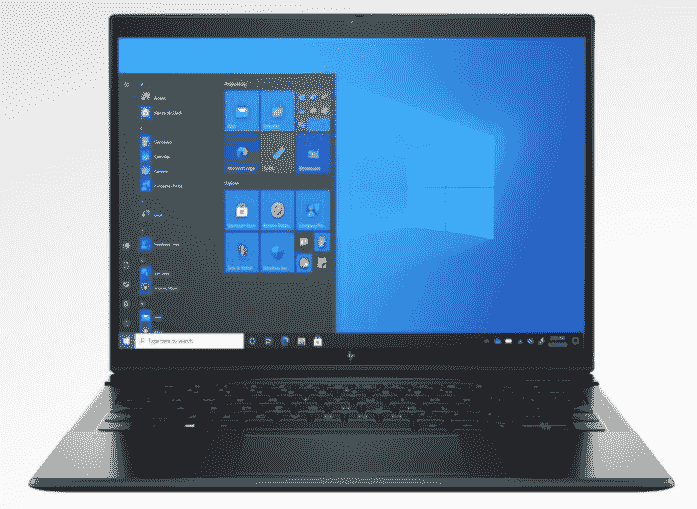

# 惠普 Elite Folio 第一印象:回归 ARM 上的 Windows

> 原文：<https://www.xda-developers.com/hp-elite-folio-first-impressions/>

距离惠普在 ARM PC 上发布 Windows 已经有一段时间了。它是第一批用 Envy x2 做到这一点的公司之一，但它没有在接下来的两代产品中出现。现在惠普带着 Elite Folio 回来了；没错，这次是商务 PC。事实上，惠普 Elite Folio 是一款高端商务电脑，这意味着它的目标是成为惠普最好的笔记本电脑之一。现在，我们的复习小组到了。

惠普 Elite Folio 的有趣之处不仅仅在于它在 ARM 上运行 Windows。它也是由皮革制成的。素食皮革。你可能会想起几年前惠普公司的 Spectre Folio，这是该公司首次尝试皮质笔记本电脑。

注意，Spectre 是消费品牌，Elite 是商务品牌。这可能就是为什么惠普选择了比 Spectre Folio 上使用的棕色更微妙的黑色。不过，这并不是惠普 Elite Folio 唯一的设计变化。

如你所见，相当多的是不同的。虽然 Spectre Folio 完全是皮革包裹的，但 Elite Folio 的内部是金属的。还可以看到 Elite Folio 的屏幕更大。事实上，它已经从 16:9 变成了 3:2，和微软 Surface 的长宽比一样。

更高的屏幕适合类似大小的机箱，当你在平板模式下使用设备时更好。如果你在纵向使用它，它看起来不会太长。

还有一种全新的储笔方法。这支笔放在键盘内置的车库里。它有三个插脚，所以它一直在充电。

笔库右侧还隐藏着一个 nano-SIM 插槽。惠普发给我的是 4G 版的 Elite Folio，不过它也有 5G 版本，配有骁龙 X55 调制解调器。奇怪的是，还有一个只有 Wi-Fi 的变体，这对于 ARM 上的 Windows 10 来说是罕见的。

虽然它由皮革制成很酷，而且我很高兴测试新的骁龙 8cx 芯片组，但外形是惠普 Elite Folio 的关键部分。从上图可以看出，你可以轻松支撑显示器。这有利于观看电影或只是以一定角度在屏幕上画画。

该显示器可以完全折叠，因此可以用作平板电脑。它比 Spectre Folio 的 0.63 英寸(而不是 0.6 英寸)厚一些，但它的重量更轻，只有 2.92 磅(而不是 3.24 磅)。

关于设计，我想注意的另一件事是，惠普将 USB Type-C 端口放在两侧。这在 Windows 10 笔记本电脑中很少见，但我希望它变得更普遍。如果你能从两边冲锋，生活会变得更简单。否则，电缆肯定会碍手碍脚，成为一个棘手的问题。不过，产品两侧都有充电端口实际上是 Chromebooks 的标准配置。

HP Elite Folio 的两个 USB 端口都是 USB 3.2 Gen 1 Type-C，这意味着它们可以获得 5Gbps 的数据传输速度。我没想到会有《幽灵对开本》中的霹雳。毕竟，Thunderbolt 通常是为基于英特尔技术的电脑保留的。不过，10Gbps USB 3.2 Gen 2 会更好。

如上所述，惠普 Elite Folio 在引擎盖下有一个[高通骁龙 8cx Gen 2](https://www.xda-developers.com/qualcomm-snapdragon-8cx-gen-2/) 。遗憾的是，这个名字的第二代部分并不像它看起来那样。它实际上只不过是普通的老骁龙 8cx 稍微改装了一下。如果你期待苹果 M1 的竞争对手来自高通，[，你将不得不等待那个](https://www.xda-developers.com/qualcomm-nuvia-acquisition-details/)。

Geekbench 是少数几个在 ARM 上的 Windows 上原生运行的基准测试解决方案之一。下面，你可以看到这款产品的分数，以及之前 ARM 驱动的电脑的分数。

|  | 

惠普 Elite FolioSnapdragon 8cx Gen 2

 | 

微软 Surface Pro XSQ2

 | 

微软 Surface Pro XSQ1

 | 

三星 Galaxy Book SSnapdragon 8cx

 | 

华为 MateBook ESnapdragon 850

 | 

联想 Miix 骁龙 835

 |
| --- | --- | --- | --- | --- | --- | --- |
| 

单核的

 | 801 | 794 | 766 | 726 | 494 | 378 |
| 

多核

 | 3,150 | 3,036 | 2,946 | 2,909 | 2,045 | 1,553 |

看到骁龙 8cx Gen 2 击败了微软 SQ2，我其实有点惊讶。Surface Pro X 搭载了微软的 ARM 芯片，这是我们[最喜欢的 4G LTE 笔记本电脑](https://www.xda-developers.com/best-4g-lte-laptops/)之一，也是骁龙 8cx 的改进版本。CPU 和 GPU 有点超频，就像骁龙 8cx Gen 2 一样。

自然，应用程序兼容性将成为一个问题。我在这上面安装了我的 Adobe CC 应用程序，但只能安装 Photoshop 和 Lightroom。与苹果硅产品相比，在 ARM 上的 Windows 上选择原生创意云应用是可悲的。

目前，ARM 上的 Windows 仅支持原生 32 位和 64 位 ARM 应用，以及模拟的 x86 应用。x64 应用程序支持即将推出，但[仍在预览版](https://www.xda-developers.com/microsoft-x64-app-emulation-in-preview-for-windows-10/)，所以我不会在这次评测中测试它。

迄今为止，惠普 Elite Folio 给人的感觉是一台全能的优秀电脑。在我使用各种 EliteBooks 的过程中，我爱上了它的恒星键盘。如您所见，惠普将继续与 Bang & Olufsen 在音频领域的合作。

然而，它没有惠普 EliteBooks 所熟知的许多功能，如 Sure Click。Elite Folio 确实有 Sure View，这是惠普的隐私显示器，尽管它不在公司发给我的模型上。“确定视图”可以防止人们从您的肩膀上看过去时看到您的屏幕。它有 HP QuickDrop，可以让你在手机和电脑之间发送文件。

惠普 Elite Folio 从 HP.com 起价 1786.88 美元。

 <picture></picture> 

HP Elite Folio

##### 惠普精英版

惠普 Elite Folio 拥有骁龙 8cx Gen 2、13.5 英寸 3:2 屏幕和纯素食皮革材质