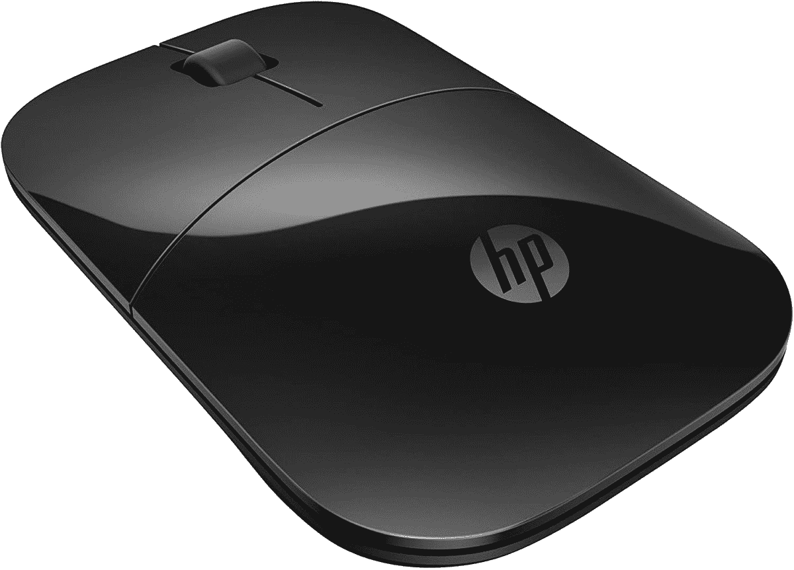
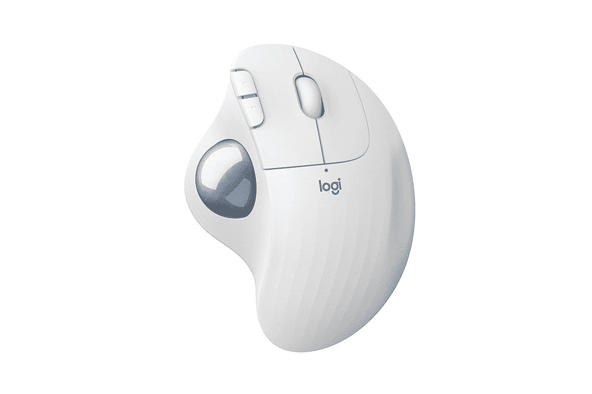

# 2023 年惠普精英版最佳鼠标

> 原文：<https://www.xda-developers.com/hp-elite-folio-mice/>

# 2023 年惠普精英版最佳鼠标

计划购买新的惠普 Elite Folio？请务必查看我们推荐的适合笔记本电脑的最佳鼠标。

惠普 Elite Folio 是该公司新的混合 Windows 笔记本电脑，采用 ARM 处理器，特别是骁龙 8cx Gen 2。Windows 在 ARM 上没有取得太大成功，但在我们的测试中，我们得出结论，如果你将它与 Surface Pro X 或 Galaxy Book S 进行比较，它是 ARM PC 上最好的 Windows。它采用纯素食皮革包装，这让我想起了该公司几年前推出的 Spectre Folio。它还配有一个带实心金属面板的大键盘，并腾出空间来存放捆绑的手写笔。

有各种各样的鼠标可以与 Elite Folio 很好地配对-事实上，惠普自己也有一些很好的选择。然而，你需要考虑到机器上只有两个 USB-C 端口，这意味着蓝牙鼠标是一个更好的选择，除非你愿意牺牲其中一个端口。让我们来看看惠普 Elite Folio 的一些最佳鼠标。

 <picture></picture> 

HP Z5000

##### 惠普 Z5000

HP Z5000 是一款时尚现代的鼠标，应该可以与 HP Elite Folio 完美搭配。它只支持蓝牙无线连接，因此在多设备支持方面受到限制。

 <picture></picture> 

HP Z3700 wireless

##### 惠普 Z3700

惠普的一款外观简洁的鼠标，外形小巧。它还具有一个蓝色 LED 传感器，允许您在几乎任何表面上使用鼠标。

 <picture></picture> 

Satechi M1

##### 萨特奇 M1

Satechi M1 是你能在预算内买到的最好看的无线鼠标之一。最棒的是，它配有内置电池，可以通过 USB-C 充电。它还有四种颜色可供选择——银色、太空灰、玫瑰金和金色。

 <picture></picture> 

Logitech MX Master 3 for Mac

##### 罗技 MX Master 3

MX Master 3 是一款功能丰富的高端生产力鼠标。除了各种可编程按钮之外，它还具有高级设计、钢制双滚轮和出色的握持能力，这对大多数用户来说应该很棒。

 <picture></picture> 

Razer Pro Click

##### Razer Pro 点击

Razer 以其游戏外设而闻名，因为 Pro Click 是该公司第一款与 Humanscale 合作生产的适当生产力鼠标。它采用高级白色涂层，最多有 8 个可编程按钮，电池续航时间出色，并配有快速的 16，000 dpi 传感器。

 <picture></picture> 

Logitech Pebble M350

##### 罗技 Pebble M350

Pebble M350 是 HP Elite Folio 的另一个不错的预算选择，它采用了轻巧紧凑的设计和静音运行。这是一款外观简洁的平板鼠标，共有五种颜色可供选择。

 <picture></picture> 

Microsoft Arc Mouse

##### 微软 Arc 鼠标

微软的 Arc 鼠标是一款高级鼠标，它采用创新的全滚动平面进行垂直和水平滚动，而不是传统的滚轮。使用这款鼠标需要一个学习过程，特别是因为它的形状，但我们喜欢它可以平放，便于存放。

 <picture></picture> 

Logitech MX Anywhere 3

##### 罗技 MX Anywhere 3

Logitech MX Anywhere 3 是 MX Master 3 的缩小版，提供卓越的性能和高级设计，包括钢制滚轮和可编程按钮，可提供定制体验

 <picture></picture> 

Logitech Ergo M575 Wireless

##### 罗技 Ergo M575 无线

拥有轨迹球可以完全改变你使用鼠标的方式，特别是因为符合人体工程学的设计有助于减少手腕和手的整体压力。

这些是惠普 Elite Folio 的最佳鼠标。除此之外，我们个人推荐的是 HP z 5000 T1，因为它带有蓝牙功能，所以你不必牺牲笔记本电脑上有限的端口。如果你正在寻找一个紧凑设计的高生产力鼠标，你也可以看看罗技 MX Anywhere 3。

查看我们的 2021 年[最佳笔记本电脑列表](https://www.xda-developers.com/best-laptops/)以及[最佳惠普笔记本电脑专用列表](https://www.xda-developers.com/best-hp-laptops/)。考虑到现在大多数新笔记本电脑都配备了 Thunderbolt 和高速 USB-C 端口，投资购买 Thunderbolt 坞站似乎是一个明智的选择。

 <picture></picture> 

HP Elite Folio

##### 惠普精英版

新的惠普 Elite Folio 是该公司的一款高端混合笔记本电脑，也是由 ARM 芯片组驱动的最好的 Windows 机器之一。